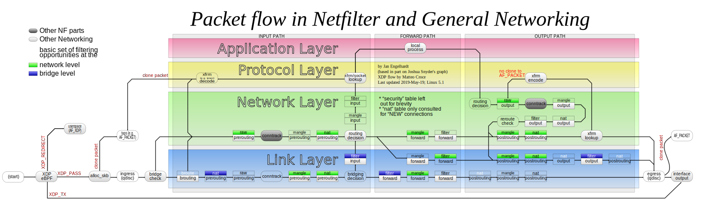

## 前言
Netfilter 框架是一个非常经典的框架，内核几乎所有的网络相关的代码都是围绕它的，今天想看的 conntrack 的代码也是一样。前端时间把 netlink 的代码梳理了一遍，conntrack 的代码之前没有详细看过，这几天也想把 conntrack 的代码梳理一下。

不过就像上面说的，conntrack 的代码也是在 Netfilter 框架之下的，所以还是先看一下 Netfilter 的基本框架，我们再梳理分析 conntrack 的代码。

## Netfilter 
先来看看 Netfilter 的框架是什么样子的。

图片来源：https://upload.wikimedia.org/wikipedia/commons/3/37/Netfilter-packet-flow.svg

这个图按作者的说法是根据5.1版本画的。这里面的信息非常丰富，可以看出除了 Netfilter 本身的关键节点外还多了几个 conntrack 的点。所以说 conntrack 也是在这个框架之内的。

在 Netfilter 框架之中可以看出:
1. PRE_ROUTING 和 LOCAL_OUT 点可以看作是整个 Netfilter 的入口。 
2. POST_ROUTING 和 LOCAL_IN 可以看作是其出口。

相关关系可以描述为如下关系：
1. 报文到本地：PRE_ROUTING ---> LOCAL_IN ---> 本地进程
2. 需要本机转发的数据包：PRE_ROUTING ---> FORWARD --->POST_ROUTING ---> 外出
3. 从本机发出的数据包：LOCAL_OUT ---> POST_ROUTING ---> 外出

从这里也可以看出内核中的 conntrack 点就在入口点上。

## ConnTrack
什么是 conntrack 呢？顾名思义，就是做链接跟踪的。Linux 为每一个经过网络堆栈的数据包，生成一个新的连接记录项 （Connection entry）。此后，所有属于此连接的数据包都被唯一地分配给这个连接，并标识连接的状态。连接跟踪是防火墙模块的状态检测的基础，同时也是地址转换中实现 SNAT 和 DNAT 的前提。

那么 Netfilter 又是如何生成连接记录项的呢？每一个数据，都有`来源`与`目的`主机，发起连接的主机称为`来源`，响应`来源`的请求的主机即为`目的`，所谓生成记录项，就是对每一个这样的连接的产生、传输及终止进行跟踪记录。由所有记录项产生的表，即称为连接跟踪表。

因为在实际使用中，发现 ip_conntrack 模块，对转发的效率影响比较大，而我们的系统确实也不需要conn track特性，可目前的情况是，无法解决 DNAT 等问题，FORWARD链不加载 ip_conntrack 是完全没有问题的