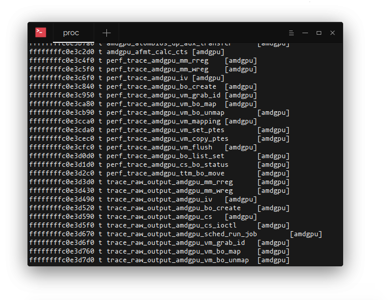

最近发布的 Linux 内核带了一个针对内核的能力强大的 Linux 监控框架。它起源于历史上人们所说的的 [BPF](https://en.wikipedia.org/wiki/Berkeley_Packet_Filter)。

## BPF 是什么?
BPF (Berkeley Packet Filter) 是一个非常高效的网络包过滤机制，它的目标是避免不必要的用户空间申请。它直接在内核空间处理网络数据包。 BPF 支持的最常见的应用就是 **tcpdump** 工具中使用的过滤器表达式。在 tcpdump 中，表达式被编译转换为 BPF 的字节码。内核加载这些字节码并且用在原始网络包流中，以此来高效的把符合过滤条件的数据包发送到用户空间。

## eBPF 又是什么?
eBPF 是对 Linux 观测系统 BPF 的扩展和加强版本。可以把它看作是 BPF 的同类。有了 eBPF 就可以自定义沙盒中的字节码，这个沙盒是 eBPF 在内核中提供的，可以在内核中安全的执行几乎所有内核符号表抛出的函数，而不用担心搞坏内核。实际上，eBPF 也是加强了在和用户空间交互的安全性。在内核中的检测器会拒绝加载引用了无效指针的字节码或者是以达到最大栈大小限制。循环也是不允许的（除非在编译时就知道是有常数上线的循环），字节码只能够调用一小部分指定的 eBPF 帮助函数。eBPF 程序保证能及时终止，避免耗尽系统资源，而这种情况出现在内核模块执行中，内核模块会造成内核的不稳定和可怕的内核奔溃。相反的，你可能会发现和内核模块提供的自由度来比，eBPF有太多限制了，但是综合考虑下来还是更倾向于 eBPF，而不是面向模块的代码，主要是基于授权后的 eBPF 不会对内核造成损害。然而这还不是它唯一的优势。

## 为什么用 eBPF 来做 Linux 监控？
作为 Linux 内核核心的一部分，eBPF 不依赖于任何第三方模块或者扩展依赖。它包含了稳定的 **ABI**（应用程序二进制接口），可以让在老内核上编译的程序在新内核上运行。由 eBPF 带来的性能开销通常可以忽略不计，这让它非常适合做[应用监控](https://sematext.com/application-monitoring/)和跟踪很重的系统执行。窗口用户没有 eBPF，但是他们可以使用[窗口事件跟踪](https://sematext.com/blog/fibratus-windows-kernel-logging/)。

eBPF 是非常灵活而且可以跟踪几乎所有的主要内核子系统：涵盖了 CPU 调度，内存管理，网络，系统调用，块设备请求等等。而且仍然在扩展中。

可以在终端里运行下面的命令看到所有能用 eBPF 跟踪的内核符号列表：
```sh
$ cat /proc/kallsyms
```

可以跟踪的符号

The above command will produce a huge output. If we were only interested in instrumenting syscall interface, a bit of grep magic will help filter out unwanted symbol names:

```sh
$ cat /proc/kallsyms | grep -w -E “sys.*”
ffffffffb502dd20 T sys_arch_prctl
ffffffffb502e660 T sys_rt_sigreturn
ffffffffb5031100 T sys_ioperm
ffffffffb50313b0 T sys_iopl
ffffffffb50329b0 T sys_modify_ldt
ffffffffb5033850 T sys_mmap
ffffffffb503d6e0 T sys_set_thread_area
ffffffffb503d7a0 T sys_get_thread_area
ffffffffb5080670 T sys_set_tid_address
ffffffffb5080b70 T sys_fork
ffffffffb5080ba0 T sys_vfork
ffffffffb5080bd0 T sys_clone
```
不同类型的钩子点负责对不同内核模块触发的事件作出响应。内核程序运行在指定的内存地址上，网络数据包的流入或者用户空间代码的调用执行都是可以通过 eBPF 程序跟踪的，通过给 **kprobes**，**XDP** 下发 eBPF 可以跟踪进入的网络包，给 **uprobes** 下发 eBPF 可以跟踪用户空间程序调用。

在 Sematext（是一家公司，本文就是这家公司博客上的一篇文章），他们对 eBPF 非常痴迷，想尽办法挖掘 eBPF 的能力，用于服务监控和容器可视化。他们也在招这方面的人才。如果有兴趣可以试试。

下面深入介绍一下eBPF 程序如何构建并加载到内核中的。

## Linux eBPF程序剖析
在进一步分析 eBPF 程序的结构之前，有必要说一下 [BCC](https://github.com/iovisor/bcc)（BPF 编译器），这是一个工具集，用于编译 eBPF 需要的字节码，并且提供了 Python 和 Lua 的绑定支持，可以把代码加载到内核并，和底层的 eBPF 设施交互执行。它还包含了许多有用的工具，让你可以了解来用 eBPF 可以做那些事情。

在过去，BPF 程序是通过手工组合原始 BPF 指令集的方式生成的。幸运的是，[clang](https://clang.llvm.org/) （是 LLVM 前端的一部分）可以把 C 语言转换成为 eBPF 字节码，这就省去了我们自己处理 BPF 指令的麻烦了。如今，它也是唯一能够生成 eBPF 字节码的编译器，虽然也可以通过 [Rust 生成 eBPF 字节码](https://unhandledexpression.com/general/rust/2018/02/02/poc-compiling-to-ebpf-from-rust.html)。

一旦成功编译了 eBPF 程序，并且生成了目标文件，我们就可以准备注入到内核中了。为了实现注入，内核引入了一个新的 bpf 系统调用。除了加载 eBPF 字节码，这个看起来简单的系统调用还做了很多其它的事情。它创建和操控内核中的 maps（后面会详细介绍，一个非常重要的数据结构），map 是 eBPF 指令中非常高级的特性。你可以从 bpf 的帮助手册上了解更多相关说明（man 2 bpf）。

当用户空间进程要通过 bpf 系统调用下发 eBPF 字节码的时候，内核会检测这些字节码，并且之后会把这些字节码进行 JIT（转换为机器可执行代码），也就是把这些字节码指令转换为当前 CPU 的指令集。转换后的代码执行会非常快。如果由于任何原因导致 JIT 编译器不可用，内核将会退回使用没有上面提到高性能执行的一个解释器来执行。

## Linux eBPF 例子
现在来看一个 Linux eBPF 程序的例子。目标是捕获对 `setns` 系统调用的调用者。进程可以通过调用这个系统调用来加入一个独立的命名空间，而这个命名空间是子进程的描述符被创建之后才建立的（子进程可以控制这个命名空间，通过给 clone 系统调用参数的一个标示指定一个位掩码让这个命名空间脱离父进程）。这个系统调用常常用于给进程提供一个独立的自动资源描述，比如 TCP 栈，挂载点，PID 号空间等等。

```sh
#include <linux/kconfig.h>
#include <linux/sched.h>
#include <linux/version.h>
#include <linux/bpf.h>
#ifndef SEC
#define SEC(NAME)                  
  __attribute__((section(NAME), used))
#endif
SEC("kprobe/sys_setns")
int kprobe__sys_setns(struct pt_regs *ctx) {
   return 0;
}
char _license[] SEC("license") = "GPL";
__u32 _version SEC("version") = 0xFFFFFFFE;
```

上面是一个**非常简单的 eBPF 程序**。它包含了几段程序，第一段是包含了各种内核头文件，包含了多种数据类型的定义。后面是申明了 SEC 宏，这个是用于在目标文件中生成程序段，后面 ELF BPF 加载会解释这个段。如果没有发现许可证和版本段信息加载器会报错，所以需要定义许可证和版本信息。

接下来看看 eBPF 程序中最有意思的部分 - `setns` 系统调用的实际挂载点。以 `kprobe__` 为前缀的函数和绑定相应的 SEC 宏，可以指示内置在内核中的虚拟机附加对 `sys_setns` 符号的回调指令，该符号会触发 eBPF 程序并且每次发送系统调用时在函数体内执行代码。每个 eBPF 程序都有一个上下文。在内核探测的例子中，这个上下文是处理器的寄存器（pt_regs structure）当前状态，其中存有libc在从用户空间转换到内核空间时放置的函数参数。为了编译程序（llvm 和 clang 应该和配置好）可以使用下面的命令（要注意你要通过 LINUX_HEADERS 环境变量来指定内核头文件的路径），这里 clang 会生成程序的 LLVM 中间码，LLVM 再编译生成最终的 eBPF 字节码：

```sh
$ clang -D__KERNEL__ -D__ASM_SYSREG_H
         -Wunused
         -Wall
         -Wno-compare-distinct-pointer-types
         -Wno-pointer-sign
         -O2 -S -emit-llvm ns.c
         -I $LINUX_HEADERS/source/include
         -I $LINUX_HEADERS/source/include/generated/uapi
         -I $LINUX_HEADERS/source/arch/x86/include
         -I $LINUX_HEADERS/build/include
         -I $LINUX_HEADERS/build/arch/x86/include
         -I $LINUX_HEADERS/build/include/uapi
         -I $LINUX_HEADERS/build/include/generated/uapi
         -I $LINUX_HEADERS/build/arch/x86/include/generated
         -o - | llc -march=bpf -filetype=obj -o ns.o
```

可以使用 `readelf` 工具来查看目标文件中的 ELF 的段信息和符号表：
```sh
$ readelf -a -S ns.o
…
 2: 0000000000000000         0 NOTYPE  GLOBAL DEFAULT        4 _license
 3: 0000000000000000         0 NOTYPE  GLOBAL DEFAULT        5 _version
 4: 0000000000000000         0 NOTYPE  GLOBAL DEFAULT        3 kprobe__sys_setns
```

上面的输出证实符号表是编译到了目标文件中的。我们有了一个有效的目标文件，那现在就可以加载到内核中看会发生什么了。

## 使用 Go 语言给内核下发 eBPF 程序
上面已经说到过 **BCC** 并且提到它如何通过给 eBPF 系统提供有效的接口来撬动内核。为了编译和运行 eBPF 程序，BCC 需要安装 LLVM 和内核头文件，但是有时候这种条件是不具备的没有编译环境和编译机。在这样的场景中，如果我们可以将生成的ELF对象放入二进制文件的数据段中，并最大限度地提高跨机器的可移植性，那将是比较理想。

除了为 `libbcc` 提供绑定，[gobpf](https://github.com/iovisor/gobpf) 包能够从与编译的字节码加载 eBPF 程序。如果我们把它和 [packr](https://github.com/gobuffalo/packr) 这样的工具结合起来，packr 可以把 blob 嵌入到 Go 应用程序中，这样我们就有了分发二进制文件所需的所有工具，并且没有运行时依赖项。

我们稍微修改一下 eBPF 程序，它就可以在触发 kprobe 的时候打印信息到内核追踪管道中。为了简洁起见，不会包含打印宏函数和其它 eBPF 帮助函数一，但是你可以在这个[头文件](https://github.com/cilium/cilium/blob/master/bpf/include/bpf/api.h)中找到相关定义。

```sh
SEC("kprobe/sys_setns")
int kprobe__sys_setns(struct pt_regs *ctx) {
  int fd = (int)PT_REGS_PARM1(ctx);
  int pid = bpf_get_current_pid_tgid() >> 32;
  printt("process with pid %d joined ns through fd %d", pid, fd);
  return 0;
}
```

现在我们可以开始写 Go 代码，来处理 eBPF 字节码加载。我们将在 gobpf 上实现一个小型抽象（KprobeTracer）：

```sh
import (
  "bytes"
  "errors"
  "fmt"

  bpflib "github.com/iovisor/gobpf/elf"
)

type KprobeTracer struct {
  // bytecode is the byte stream with embedded eBPF program
  bytecode []byte

  // eBPF module associated with this tracer. The module is a  collection of maps, probes, etc.
  mod *bpflib.Module
}

func NewKprobeTracer(bytecode []byte) (*KprobeTracer, error) {
   mod := bpflib.NewModuleFromReader(bytes.NewReader(bytecode))
   if mod == nil {
      return nil, errors.New("ebpf is not supported")
   }
   return KprobeTracer{mod: mod, bytecode: bytecode}, nil
}

// EnableAllKprobes enables all kprobes/kretprobes in the module. The argument
// determines the maximum number of instances of the probed functions the can
// be handled simultaneously.
func (t *KprobeTracer) EnableAllKprobes(maxActive int) error {

  params := make(map[string]*bpflib.PerfMap)

  err := t.mod.Load(params)
  if err != nil {
     return fmt.Errorf("unable to load module: %v", err)
  }

  err = t.mod.EnableKprobes(maxActive)
  if err != nil {
     return fmt.Errorf("cannot initialize kprobes: %v", err)
  }
  return nil
}
```
准备开始做内核探针跟踪：
```sh
package main

import (
  "log"
  "github.com/gobuffalo/packr"
)

func main() {
  box := packr.NewBox("/directory/to/your/object/files")
  bytecode, err := box.Find("ns.o")
  if err != nil {
      log.Fatal(err)
  }

  ktracer, err := NewKprobeTracer(bytecode)

  if err != nil {
     log.Fatal(err)
  }

  if err := ktracer.EnableAllKprobes(10); err != nil {
     log.Fatal(err)
  }
}
```
使用 `sudo cat /sys/kernel/debug/tracing/trace_pipe` 来读取发到管道中的调试信息。测试 eBPF 程序最简单的方式就是通过把它追加到正在运行的 Docker 容器上：
```sh
$ docker exec -it nginx /bin/bash
```
这个场景的背后是容器运行时会重新关联 bash 进程到 nginx 容器的命名空间。通过 `PT_REGS_PARM1` 宏获取的第一个参数是命名空间的第一个文件描述符，这个命名的描述是在 `/proc/<pid>/ns` 这个符号链接目录中。所以我们可以监控到是否有进程加入这个命名空间。这个功能或许不是很有用，但是这是一个如何跟踪系统调用执行和获取其参数的示例。

## 使用 eBPF Maps
把结果写到跟踪管道对调试来说好的，但是在生产环境中，我们肯定需要一个更高级的机制来在用户空间和内核空间共享状态数据。这就需要 eBPF maps 来解决这个问题了。这是一种为数据聚合而设计的高效的内核健/值存储结构，他可以从用户空间异步访问。eBPF maps 有很多中类型，但是对上面这个特定的例子我们将会使用 `BPF_MAP_TYPE_PERF_EVENT_ARRAY` map。它可以存储自定义的数据结构并且通过 perf 事件环缓冲区发送和广播到用户空间进程。

Go-bpf 可以让创建 perf map 并且将时间流来提供 Go 管道。我们可以增加下面的代码来发送 C 结构体到我们的程序。

```sh
rxChan := make(chan []byte)
lostChan := make(chan uint64)
pmap, err := bpflib.InitPerfMap(
  t.mod,
  mapName,
  rxChan,
  lostChan,
)

if err != nil {
  return quit, err
}

if _, found := t.maps[mapName]; !found {
  t.maps[mapName] = pmap
}

go func() {
  for {
     select {

     case pe := <-rxChan:
        nsJoin := (*C.struct_ns_evt_t)(unsafe.Pointer(&(*pe)[0]))
        log.Info(nsJoin)

     case l := <-lostChan:
        if lost != nil {
           lost(l)
        }
     }
  }
}()

pmap.PollStart()
```

我们初始化了接受者和丢弃事件管道，并且把它们传给 `InitPerfMap` 函数，同时把我们要消费事件的模块引用和 perf map 的名称都传过去。每次有新的事件发送到接受者管道，我们可以通过原始指针转换出上面 eBPF程序中定义的 C 的结构体（ns_evt_t）。我们也需要申明一个 perf map 并且通过 `bpf_perf_event_output` 帮助函数发送数据结构：

```sh
struct bpf_map_def SEC("maps/ns") ns_map = {
  .type = BPF_MAP_TYPE_HASH,
  .key_size = sizeof(u32),
  .value_size = sizeof(struct ns_evt_t),
  .max_entries = 1024,
  .pinning = 0,
  .namespace = "",
};

struct ns_evt_t evt = {};

/* Initialize structure fields.*/
u32 cpu = bpf_get_smp_processor_id();
bpf_perf_event_output(ctx, &ns_map,
                     cpu,
                     &evt, sizeof(evt));
```
## 结论
eBPF 还在持续的发展并且在持续获得更广泛的应用。随着内核的发展，每个内核版本中都有新的 eBPF 特性和改进。低开销和本地化编程特性让它对各种使用场景都非常有吸引力。比如，[Suricata](https://suricata-ids.org/) 入侵检测系统用它来实现在 Linux 网络栈的早期阶段进行高级套接字负载平衡策略和包过滤。 [Cilium](https://github.com/cilium/cilium) 重度依赖 eBPF 来容器提供复杂的安全策略。[Sematext Agent](https://sematext.com/blog/streamlined-kubernetes-cluster-agent/)使用 eBPF 来精确定位需要关注的事件，比如 kill 信号广播或者 [Docker 和 Kubernetes 监控](https://sematext.com/docker)中的 OOM 通知，以及通用的[服务监控](https://sematext.com/spm)。它也通过使用 eBPF 来捕获 TCP/UDP 流量统计，为[网络监控](https://sematext.com/network-monitoring)提供了一种高效的网络跟踪。eBPF 的目标似乎是通过 Linux 内核监控成为一个事实上的 Linux 监控标准。

--------------------------------------------------------------------------------


原文：[Linux Observability with eBPF](https://sematext.com/blog/linux-kernel-observability-ebpf/)

作者：[Nedim Šabić](https://sematext.com/blog/author/nedims/)

原文发表时间：2019 年 3 月 4 号

译者：[helight](https://github.com/helight)

<center>
看完本文有收获？请分享给更多人

关注「黑光技术」，关注大数据+微服务


</center>