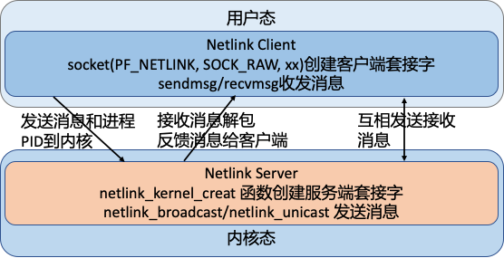
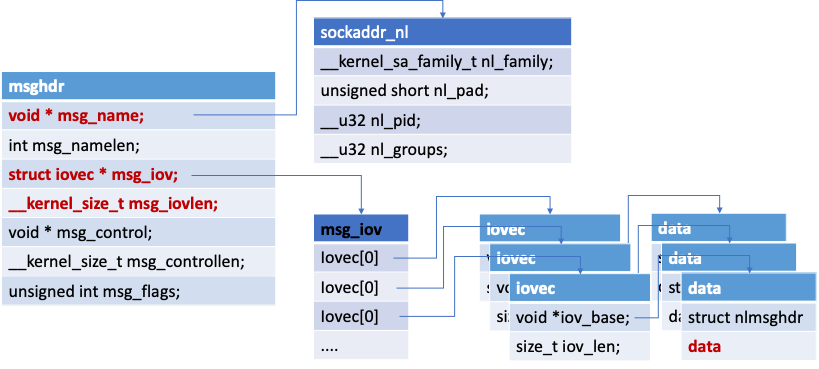

## 前言
这几天在看 ipvs 相关代码的时候又遇到了 netlink 的事情，所以这两天花了点时间重新把 netlink 的事情梳理了一下。

## 什么是 netlink
linux 内核一直存在的一个严重问题就是内核态和用户态的交互的问题，对于这个问题内核大佬们一直在研究各种方法，想让内核和用户态交互能够安全高效的进行。如系统调用，proc，sysfs等内存文件系统，但是这些方式一般都比较简单，只能在用户空间轮询访问内核的变化，内核的变化无法主动的推送出来。

而 netlink 的出现比较好的解决了这个问题，而且 netlink 还有以下一些优势：
1. 可以直接使用 socket 套接字的 API 进行内核和用户态的通信，开发使用上相对简单了很多。
2. 利用内核协议栈有了缓冲队列，是一种异步通信机制。
3. 可以是内核和用户态的双向通信，内核可以主动向用户态进程发送消息。这个是以往通信方式不具备的。
4. 针对同一个协议类型的所有用户进程，内核可以广播消息给所有的进程，也可以指定进程 pid 进行消息发送。

目前 netlink 的这种机制被广泛使用在各种场景中，在 Linux 内核中使用 netlink 进行应用与内核通信的应用很多; 包括：路由 daemon（NETLINK_ROUTE），用户态 socket 协议（NETLINK_USERSOCK），防火墙（NETLINK_FIREWALL），netfilter 子系统（NETLINK_NETFILTER），内核事件向用户态通知（NETLINK_KOBJECT_UEVENT）等。具体支持的类型可以查看这个文件 `include/uapi/linux/netlink.h`。

## netlink 内核代码走读
### netlink 内核相关文件介绍
netlink 的内核代码在内核代码的 `net/netlink/` 目录下，我目前看的是 `5.7.10` 的内核版本，netlink 内核相关的文件不多，还是比较清晰的：
``` console
 helightxu@  ~/open_code/linux-5.7.10  ls net/netlink                                                                        
Kconfig      Makefile     af_netlink.c af_netlink.h diag.c       genetlink.c
 helightxu@  ~/open_code/linux-5.7.10 
```

| 文件|  描述  |
|  ----  |  ----  |
| af_netlink.c 和 af_netlink.h： | 是 netlink 的核心文件，这个也是下面详细走读的内容。|
| diag.c | 对 netlink sock 进行监控，可以插入到内核或者从内核中卸载|
| genetlink.c | 这个可以看作是 netlink 的升级版本，或者说是一种高层封装。  |

注：

    genetlink.c 额外说明：netlink 默认支持了 30 多种的场景，但是对于其它场景并没有具体定义，这个时候这种通用封装就有了很大的好处，可以在不改动内核的前提下进行应用场景扩展，这部分内容可以看这个 wiki：https://wiki.linuxfoundation.org/networking/generic_netlink_howto


还有一个头文件是在 include 目录，如下所示，这个头文件是一些辅助函数、宏定义和相关数据结构，大家学习的同学一定要看这个文件，它里面的注释非常详细。这些注释对理解 netlink 的消息结构非常有用，建议可以详细看看。
``` console
 helightxu@  ~/open_code/linux-5.7.10  ls include/net/netlink.h
 ```

### af_netlink.c 代码走读
在 af_netlink.c 这个文件的最下面有一行代码：
``` c
core_initcall(netlink_proto_init);
```
这段代码的意思是什么呢？通过看这个代码最终的实现可以看出，就是告诉编译器把 `netlink_proto_init` 这个函数放入到最终编译出来二进制文件的 `.init` 段中，内核在启动的时候会从这个端里面的函数挨个的执行。这里也就是说 netlink 是内核默认就直接支持的，是原生内核的一部分（这里其实想和内核的动态插拔模块区别）。

在 `netlink_proto_init` 函数中最关键的一行代码就是下面最后一行，把 netlink 的协议族注册到网络协议栈中去。
``` c
static const struct net_proto_family netlink_family_ops = {
    .family = PF_NETLINK,
    .create = netlink_create,
    .owner  = THIS_MODULE,  /* for consistency 8) */
};
...
sock_register(&netlink_family_ops);
```
`PF_NETLINK` 是表示 netlink 的协议族，在后面我们在客户端创建 netlink socket 的时候就要用到这个东东。如下面的代码，代码来自我的测试代码 [https://github.com/helight/kernel_modules/tree/master/netlink_test](https://github.com/helight/kernel_modules/tree/master/netlink_test) 中的客户端代码，可以看出：PF_NETLINK 表示我们所用的就是 netlink 的协议，SOCK_RAW 表示我们使用的是原始协议包，NETLINK_USER 这个我们自己定义的一个协议字段。netlink 我们前面说了有 30 多种应用场景，这些都已经在内核代码中固定了，所以在客户端使用的时候会指定这个字段来表示和内核中的那个应用场景的函数模块进行交互。
```c
//int socket(int domain, int type, int protocol);
    sock_fd = socket(PF_NETLINK, SOCK_RAW, NETLINK_USER);
```

`sock_register` 这个函数的作用主要就是注册 `PF_NETLINK` 这个协议类型到内核中，让内核认识这个协议，在内核网络协议中建立 socket 的时候知道该使用那个协议为它提供操作支持。

注册了之后内核就支持了 netlink 协议了，接下来就是内核中创建监听 socket，用户态创建链接 socket 了。

### netlink 用户态和内核交互过程
这里我简单画一个图来表示一下，socket 通信主要有 2 个操作对象：server 端和 client 端。netlink 的操作原理是这样的：

| 对象 | 所处位置| - |
| - | - | - |
| server 端 | 内核中 | - |
| client 端 | 用户态进程 | - |




## netlink 关键数据结构和函数

### sockaddr_nl 协议套接字
netlink 的地址表示由 sockaddr_nl 负责
``` c
struct sockaddr_nl {
    __kernel_sa_family_t    nl_family;    /* AF_NETLINK    */
    unsigned short          nl_pad;        /* zero        */
    __u32                   nl_pid;        /* port ID 这个一般是进程id */
    __u32                   nl_groups;    /* multicast groups mask */
};
```
nl_family 制定了协议族，netlink 有自己独立的值：AF_NETLINK，nl_pid 一般取为进程 pid。nl_groups 用以多播，当不需要多播时，该字段为 0。

### nlmsghdr 消息体
netlink 消息是作为套接字缓冲区 sk_buff 的数据部分传递的，其消息本身又分为头部和数据。头部为：
``` c
struct nlmsghdr {
    __u32        nlmsg_len;    /* Length of message including header */
    __u16        nlmsg_type;    /* Message content */
    __u16        nlmsg_flags;    /* Additional flags */
    __u32        nlmsg_seq;    /* Sequence number */
    __u32        nlmsg_pid;    /* Sending process port ID */
};
```
nlmsg_len 为消息的长度，包含该头部在内。nlmsg_pid 为发送进程的端口 ID，这个用户可以自定义，一般也是使用进程 pid。

### msghdr 用户态系发送消息体
使用 sendmsg 和 recvmsg 函数进行发送和接收消息，使用的消息体是这个样子的。
``` c
struct iovec {                    /* Scatter/gather array items */
    void  *iov_base;              /* Starting address */
    size_t iov_len;               /* Number of bytes to transfer */
};
/*
iov_base: iov_base 指向数据包缓冲区，即参数 buff，iov_len 是 buff 的长度。
msghdr 中允许一次传递多个 buff，以数组的形式组织在 msg_iov 中，msg_iovlen 就记录数组的长度 （即有多少个buff）
*/
struct msghdr {
    void    *    msg_name;    /* Socket name            */
    int          msg_namelen;    /* Length of name        */
    struct iovec *    msg_iov;    /* Data blocks            */
    __kernel_size_t   msg_iovlen;    /* Number of blocks        */
    void     *         msg_control;    /* Per protocol magic (eg BSD file descriptor passing) */
    __kernel_size_t    msg_controllen;    /* Length of cmsg list */
    unsigned int      msg_flags;
};
/*
   msg_name： 数据的目的地址，网络包指向 sockaddr_in, netlink 则指向 sockaddr_nl;
   msg_namelen: msg_name 所代表的地址长度
   msg_iov: 指向的是缓冲区数组
   msg_iovlen: 缓冲区数组长度
   msg_control: 辅助数据，控制信息(发送任何的控制信息)
   msg_controllen: 辅助信息长度
   msg_flags: 消息标识
*/
```
逻辑结构如下：



socket 也是一种特殊的文件，通过VFS的接口同样可以对其进行使用管理。socket 本身就需要实现文件系统的相应接口，有自己的操作方法集。

### netlink 常用宏
``` c
#define NLMSG_ALIGNTO   4U
/* 宏 NLMSG_ALIGN(len) 用于得到不小于len且字节对齐的最小数值 */
#define NLMSG_ALIGN(len) ( ((len)+NLMSG_ALIGNTO-1) & ~(NLMSG_ALIGNTO-1) )

/* Netlink 头部长度 */
#define NLMSG_HDRLEN     ((int) NLMSG_ALIGN(sizeof(struct nlmsghdr)))

/* 计算消息数据 len 的真实消息长度（消息体 +　消息头）*/
#define NLMSG_LENGTH(len) ((len) + NLMSG_HDRLEN)

/* 宏 NLMSG_SPACE(len) 返回不小于 NLMSG_LENGTH(len) 且字节对齐的最小数值 */
#define NLMSG_SPACE(len) NLMSG_ALIGN(NLMSG_LENGTH(len))

/* 宏 NLMSG_DATA(nlh) 用于取得消息的数据部分的首地址，设置和读取消息数据部分时需要使用该宏 */
#define NLMSG_DATA(nlh)  ((void*)(((char*)nlh) + NLMSG_LENGTH(0)))

/* 宏 NLMSG_NEXT(nlh,len) 用于得到下一个消息的首地址, 同时 len 变为剩余消息的长度 */
#define NLMSG_NEXT(nlh,len)  ((len) -= NLMSG_ALIGN((nlh)->nlmsg_len), \
                  (struct nlmsghdr*)(((char*)(nlh)) + NLMSG_ALIGN((nlh)->nlmsg_len)))

/* 判断消息是否 >len */
#define NLMSG_OK(nlh,len) ((len) >= (int)sizeof(struct nlmsghdr) && \
               (nlh)->nlmsg_len >= sizeof(struct nlmsghdr) && \
               (nlh)->nlmsg_len <= (len))

/* NLMSG_PAYLOAD(nlh,len) 用于返回 payload 的长度*/
#define NLMSG_PAYLOAD(nlh,len) ((nlh)->nlmsg_len - NLMSG_SPACE((len)))
```

### netlink 内核常用函数
#### netlink_kernel_create
这个内核函数用于创建内核 socket，以提供和用户态通信 
```c
static inline struct sock *
netlink_kernel_create(struct net *net, int unit, struct netlink_kernel_cfg *cfg)
/* 
    net: 指向所在的网络命名空间, 默认传入的是 &init_net (不需要定义);  定义在 net_namespace.c(extern struct net init_net);
    unit: netlink 协议类型
    cfg:  cfg 存放的是 netlink 内核配置参数（如下）
*/

/* optional Netlink kernel configuration parameters */
struct netlink_kernel_cfg {
    unsigned int    groups;  
    unsigned int    flags;  
    void        (*input)(struct sk_buff *skb); /* input 回调函数 */
    struct mutex    *cb_mutex; 
    void        (*bind)(int group); 
    bool        (*compare)(struct net *net, struct sock *sk);
};
```

#### 单播函数 netlink_unicast() 和多播函数 netlink_broadcast()
```c
/* 来发送单播消息 */
extern int netlink_unicast(struct sock *ssk, struct sk_buff *skb, __u32 portid, int nonblock);
/* ssk: netlink socket 
   skb: skb buff 指针
   portid： 通信的端口号
   nonblock：表示该函数是否为非阻塞，如果为1，该函数将在没有接收缓存可利用时立即返回，而如果为 0，该函数在没有接收缓存可利用 定时睡眠
*/

/* 用来发送多播消息 */
extern int netlink_broadcast(struct sock *ssk, struct sk_buff *skb, __u32 portid,
                 __u32 group, gfp_t allocation);
/* ssk: 同上（对应 netlink_kernel_create 返回值）、
   skb: 内核 skb buff
   portid： 端口id
   group: 是所有目标多播组对应掩码的"OR"操作的合值。
   allocation: 指定内核内存分配方式，通常 GFP_ATOMIC 用于中断上下文，而 GFP_KERNEL 用于其他场合。
                这个参数的存在是因为该 API 可能需要分配一个或多个缓冲区来对多播消息进行 clone。
*/
```
## 测试例子代码
### netlink 内核建立 socket 过程
内核的代码非常简单，这里给出了核心代码，就这么多，接收函数中直接打印了接收到的消息。
```c
#include <linux/module.h>
#include <linux/kernel.h>
#include <linux/init.h>
#include <net/sock.h>
#include <asm/types.h>
#include <linux/netlink.h>
#include <linux/skbuff.h>

#define NETLINK_XUX           31       /* testing */  

static struct sock *xux_sock = NULL;

// 接收消息的回调函数，接收参数是 sk_buff
static void recv_netlink(struct sk_buff *skb)
{
    struct nlmsghdr *nlh;
    nlh = nlmsg_hdr(skb); // 取得消息体
    printk("receive data from user process: %s", (char *)NLMSG_DATA(nlh)); // 打印接收的数据内容

    ...
}

int __init init_link(void)
{
    struct netlink_kernel_cfg cfg = {
		.input = recv_netlink,
	};
    xux_sock = netlink_kernel_create(&init_net, NETLINK_XUX, &cfg); // 创建内核 socket
    if (!xux_sock){
        printk("cannot initialize netlink socket");
        return -1;
    } 
    
    printk("Init OK!\n");
    return 0;
}
```

### netlink 用户态建立链接和收发信息
```c
... // 上面的就省了
#define NETLINK_USER 31  //self defined
#define MAX_PAYLOAD 1024 /* maximum payload size*/

struct sockaddr_nl src_addr, dest_addr;
struct nlmsghdr *nlh = NULL;
struct msghdr msg;  
struct iovec iov;
int sock_fd;

int main(int args, char *argv[])
{
    sock_fd = socket(PF_NETLINK, SOCK_RAW, NETLINK_USER); // 建立 socket

    if(sock_fd < 0)
        return -1;

    memset(&src_addr, 0, sizeof(src_addr));
    src_addr.nl_family = AF_NETLINK;
    src_addr.nl_pid = getpid(); /* 当前进程的 pid */

    if(bind(sock_fd, (struct sockaddr*)&src_addr, sizeof(src_addr))){ // 和指定协议进行 socket 绑定
        perror("bind() error\n");
        close(skfd);
        return -1;
    }

    memset(&dest_addr, 0, sizeof(dest_addr));
    dest_addr.nl_family = AF_NETLINK;
    dest_addr.nl_pid = 0;       /* For Linux Kernel */
    dest_addr.nl_groups = 0;    /* unicast */

    nlh = (struct nlmsghdr *)malloc(NLMSG_SPACE(MAX_PAYLOAD));
    memset(nlh, 0, NLMSG_SPACE(MAX_PAYLOAD));
    nlh->nlmsg_len = NLMSG_SPACE(MAX_PAYLOAD);
    nlh->nlmsg_pid = getpid();  //self pid
    nlh->nlmsg_flags = 0; 
    // 拷贝信息到发送缓冲中
    strcpy(NLMSG_DATA(nlh), "Hello this is a msg from userspace"); 
    // 构造发送消息体
    iov.iov_base = (void *)nlh;         //iov -> nlh
    iov.iov_len = nlh->nlmsg_len;
    msg.msg_name = (void *)&dest_addr;  
    msg.msg_namelen = sizeof(dest_addr);
    msg.msg_iov = &iov;  // iov 中存放 netlink 消息头和消息数据  
    msg.msg_iovlen = 1;

    printf("Sending message to kernel\n");

    int ret = sendmsg(sock_fd, &msg, 0);  // 发送消息到内核 
    printf("send ret: %d\n", ret); 

    printf("Waiting for message from kernel\n");

    /* 从内核接收消息 */
    recvmsg(sock_fd, &msg, 0);  
    printf("Received message payload: %s\n", NLMSG_DATA(nlh));  // 打印接收到的消息

    close(sock_fd);
    return 0;
}
```
以上代码在我的个人仓库中都有，如果有兴趣可以 clone 下来自己测试玩耍一遍。
代码仓库：[https://github.com/helight/kernel_modules/tree/master/netlink_test](https://github.com/helight/kernel_modules/tree/master/netlink_test) 。

## 总结
netlink 目前感觉还是一个比较好用的内核和用户空间的交互方式，但是也是有他的使用场景，适合用户空间和内核空间主动交互的场景。

但是在单机场景下，大多数的主动权在用户进程，用户进程写数据到内核，用户进程主动读取内核数据。这两种场景覆盖了内核的绝大多数场景。

在内核要主动的场景下，netlink 就比较适合。我能想到的就是内核数据审计，安全触发等，这类场景下内核可以实时的告知用户进程内核发生的情况。

我是在看 ipvs 的代码时候看到了里面有 netlink 的使用，发现早期 iptables 就是使用 netlink 来下发配置指令的，内核中 netfilter 和 iptables 中还有这部分的代码，今天也顺便下载大致走读了一遍，大家可以搜索 `NETLINK` 这个关键字来看。但是 iptables 后来的代码中没有使用这样的方式，而是采用了一个叫做 `iptc` 的库，其核心是使用 setsockops 的方式，最终还是 `copy_from_user`。不过这种方式对于 iptables 这种配置下发的场景来说还是非常实用的。

从设计的角度看使用 setsockops 方式并不是很优雅，通过几个参数把用户的数据拷贝进去，还要在协议栈上开发做 netfilter 的规则配置，很怪异。反而 netlink 的设计相对清晰，扩张性也比较好。但是现实就是 netlink 虽然在 iptables 中有用，但是目前主要使用的还是 iptc。

最后大家如果对这方面有兴趣的可以找我一起再研究研究，我也想继续在深入看看，但是目前没有太好的场景​。

明天开始走读 kubernetes 的代码，大家有兴趣的也可以一起来交流​。​

## 参考

1. [https://www.cnblogs.com/x_wukong/p/5920437.html](https://www.cnblogs.com/x_wukong/p/5920437.html)