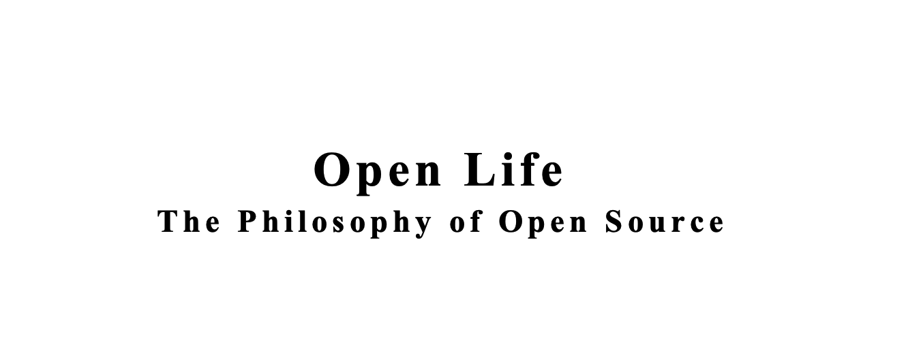

## 引言
从年前到现在断断续续读这本书，两个多月终于把这本书读完了。本来可以很快看完，不过中间又看2本 cloud native 和 istio 相关的书，所以拖到现在才看完。非常感谢[建盛大哥](http://opensourceway.community/)的推荐，很不错的书，值得一看。这本书成书于2005年，然后那个时候我正在上大学，就是那个年代来说，这本书的一些思路和思想非常靠谱，书中提到的不少场景在之几年到现在都很得到了很大的发展。

## 书中的主要内容
这本书从作者身边的生活琐事开始来思考开源这件事，到开源软件发展对社会影响思考，再到开源软件的商业之路，最后到生活中其它方面开源的思考。逐一到来非常有序，让我们对开源的认识从原来只是软件的层面会逐步上升到对生活方式的思考。

### 第一部分：现实生活
整个这本书分为4部分，写的还是蛮紧凑的，首先第一部分是这个就是有一些这个生活哲学引出来这个open close的关系和他讲了几个例子。从葡萄酒的种植中寻求供求关系的问题；他岳父的酒杯音乐思考分享和独享的个人感受；这本书第1部分应该算是个引子，就是从现实世界中一些生活问题出发来思考开源的价值和意义。讲到他由于这些问题而和工作当中看到的软件开源联系起来。

### 第二部分：开源软件的原则
然后由此引出来第2部分，这一部分重点讲述的是开源软件的一些特点，当然这些特点都是早期开源软件出现和发展的一些特点。主要是以 linux 内核为例来说。比如内核的发布节奏，linus 早期说每个版本应该到它该发布的时候就会发布了，没有计划，就是靠兴趣来支撑等等。其实这是早期的开源软件的一些发展方式包括 GNU 中的很多软件。但是 2006 年之后这么多年发展中，开源软件的发展方式也有了很大的不同，以商业公司独立或者合作支持的开源软件大行其道，比如 android，tensorflow，eclipse，golang，如今的鸿蒙等等。虽然和商业公司的方式不一样，但书中这些毕竟是开源早期的历史，在个人开源软件的发展上还是有很重要的指导意义的，尤其对现在的学生来说，这个很重要。去年 12 月初参加[《OpenIO2019开发者大会》](https://www.openi.org.cn/)时我以《开源的世界开源的大学》为题做了演讲。其实对于学生来说，开源是他们的一扇大门，而且是为他们免费敞开的大门。他们只要投入他们的精力就可以得到非常大的成长，直接和业界顶级的技术大牛对话不是梦。之前看到一篇文章说寒门再难出贵子，但是现在开源这扇门对所有人都公平的打开了，只要你努力就可以了。

### 第三部分：开源软件的商业模式
书的第3部分是讲开源的商业模式，这部分讲述了以开源软件为核心产品的几个商业公司发展的曲折道路，我想这部分也是很多人非常感兴趣的。早先以开源软件为产品的商业公司发展真的很有意思，比如早期在中国的我并不能理解为什么redhat，ubuntu等一些版本发行商非要发cd，而且是以卖的方式。感觉这很奇怪，为什么还要买 CD。实际上在国外早期版权意识的培养就很到位，大家很容易想到是要购买。但是那个年代redhat，ubuntu等都是提 free software 的说法。书的这部分对 4 大 linux 的发行版逐一做了介绍，从诞生，商业运作，其中的起起伏伏。写的还是比较详细的，现在读来再回首那段时间很有意思。反观国内的开源发展史，我感觉挺闹心的。

这部分中讲到发行版，实际上这 4 大发行版我都用过，我最喜欢还是 Debian。最早的时候用用过 redhat6，红旗5，suse什么的，其它的也都安装过，但是没怎么用，用了 debian 之后就彻底喜欢上了，我用的也是 testing 源。就是工作之后如果要用到这个 Linux 的话，也会安装它。我认为它还是比较干净比较纯粹的。所以书中这块读起来感觉非常流畅，很多背景知道。另外提到 star office 和 open office的历史，也是非常有意思，最后为什么 open office胜出，当然没有讲现在的 libreoffice 的发展，那个时候 libreoffice 还没有出现。还有 eclipse 的历史也是非常有意思的。开源软件的生存，发展变化其实就是一个商业产品在市场上进行残酷竞争，优胜劣汰的过程。无论是开源还是闭源主要的目标是在成本合理的情况下提供能解决问题的更优秀的产品。

### 第四部分：生活中的开源
第4部分主要是跟真实生活相关的。开源的思想和商业产品的运作上是否可以落地应用，一个商业公司是否可以以开源的方式来运作。它提到美国一个金矿的例子，公司开放其数据，设置比赛，让人们以参赛的方式使用他们的数据预测优质金矿的地点获得了极大的成功。这是一个非计算机公司的例子。还有简单wiki的发展史，本身对我们现在在公司内外的产品研发和运作都是有很大的指导作用。还有一些例子，比如大学共同开发教科书，哈利波特的社区翻译，衣服的设计，音乐，电影等开发。从里面可以看出开源的影子几乎在你生活的处处可见。

从整体来说这本书还是非常有意思的，这本书成书于 2005 年，作者写的主要就是 2005 年之前的计算机软件研发的开源发展史，以及当时社会中以开源思想在建设的一些东西。实际上 2005 年之后到现在 2020 年，整个 10 多年的发展里面。可以看出作者提出的这种开源生活的思想真的在社会的各个领域不断的发展已经成为一种全球化的态势。

## 在我看来开源有这样一些特点
1. 所谓的开源应该是自古就有的，开源的思想也是从古就有。因为这是一种辩证的思考，有闭源自然就有开源的，无魔哪来佛。所以这种生活思维是伴随人类社会的。
2. 从本质上看开源，开源是在降低信息获取的成本，开源是在寻求更大范围的协作。从而可以从某种意义上说降低研究发现和发展的成本，进而产生更大的力量解决更复杂庞大的问题。
3. 开源和闭源是一种力量的对抗，如果一项技术和能力处于绝对领导地位的时候，这个时候这些头部地位的组织或者个人开源的意愿是不足的，内在的动力不足。但是有另外的更为广泛的力量可以驱动投入，尤其是小组织和个人的力量可以通过一种信仰可以聚集联合的时候，开源才会出现。而且这种力量的组合可以强过最强的闭源组织的时候，其合作性和意义就成了社会这个方向的主导。从目前看世界 top 的公司在逐步拥抱开源，因为闭源的力量已经在开源组织力的冲击下逐步逐步在落后了。这是因为现在人们找到了以开源的方式组织起更为强大的力量了。
   
古人说一根筷子易拆断，十根筷子折不断。任何时候对抗的还是力量的组织能力，能有效组织 1 个人的力量还是能有效组织 10 个人的力量，还是 1000，1 万，1 亿。。。。

## 开源的现实思考：
1. 开源发展一定是未来的大趋势，大家一定是要拥抱开源，乐于分享，乐于从中获取自己想要的东西。但是未来的发展也一定是百花齐放的形式，不是说一定要开源，不能闭源。辩证的看待，合理的利用开源和闭源的方式，目标是组织更为强大的力量，产生更大的能力解决更多的问题。
2. 国内的开源还是比较落后的，一方面还是社会经济发展的问题，导致大家在集中力量发展经济的惯性之下，较少的思考其它问题。当然国内也有比较好的开源例子，但是运作较好的目前还是以个人为主，国外早期也是个人较多。但是现在的模式有点不一样了，以公司这种有较强组织力的组织来组织开源是未来一段时间的主流，比如google，facebook等，国内公司在这方面可以说是才起步。
3. 个人来说有两方面的发展：
   1. 从开源学习，国内无论是学生还是公司研发工程师，都应该积极学习开源软件，向已有的优秀软件，优秀工程师学习。开源为大家获取信息降低了成本，只有利用好了这种渠道，才会有个人更大的成长。现在这块的自由超乎了我们很多人的想象，那么多代码，那么多大公司，世界级优秀程序员写的代码我们触手可及。无论你是名门望族子弟还是家贫如洗的寒衣书生，这扇大门自由的为你打开，让你自由的进出。抓住我们应该抓住的机会，开源让我们这块得到了应有的公平公正：自由接触，只需要你的努力优秀的公司会向你招手。我现在面试都会问学习开源软件的内容，学习那个开源软件，在哪里，对其认识有多深，是否参与贡献，是否有自己的开源项目。。。
   2. 参与和贡献，拿来主义是很好的，但是我们一定是要成长的，在不断学习和实践的过程中一定要发现问题，解决问题，参与已有的开源项目，测试，使用，提问题，修代码。贡献自己的优秀代码给别人更为有成就感。
4. 开源的生活，人类的发展一直在解决一个问题，就是信息的流通，我们在不断加快信息的流通，降低信息的获取成本。在广泛的社会生活中，这才是核心。和同事、同学、以及家庭成员间的沟通交流，是不是够流畅，是不是你说的你想的他们都明白。。。。。。
5. 开源软件和开源生产是为了获取更大规模的力量组织，以得到更大解决问题的能力。但是开源的生活方式，是更为广泛的，是解决生活当中诸多事情的方式。以开源开放的方式交流，你会得到更多的理解，你的想法可以更流畅的形式在不同的人那里得到流淌。
6. 开源的生活或许能让你内心得到更大的释放。

## 最后
2020 年，我们开始更为开源的生活方式。。。。。。

写在最后： 这本书也是以开源的方式发布，大家可以在这里下载或者在线阅读：[www.openlife.cc](http://www.openlife.cc).

看完本文有收获？请分享给更多人

关注「黑光技术」，关注大数据+微服务

