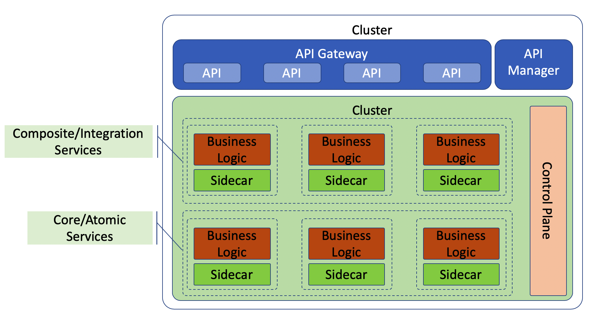

+++
title = "API 网关和服务网格功能定位比较"
date = "2020-02-08T13:47:08+02:00"
tags = ["istio", "microservices"]
categories = ["sevicemesh", "microservices"]
banner = "img/banners/istio2.png"
draft = false
author = "helight"
authorlink = "http://helight.cn"
summary = "上一篇文章介绍了服务网格和 API 网关的使用场景和如何配合使用，这篇文章继续介绍，再把服务网格和 API 网关的区别和应用场景进行挖掘。"
keywords = ["istio","microservices", "sevicemesh"]
+++

上一篇文章介绍了服务网格和 API 网关的使用场景和如何配合使用，这篇文章继续介绍，再把服务网格和 API 网关的区别和应用场景进行挖掘。

为了进一步区分 API 网关和服务网格，需要在功能定义上看这两个组件的关键功能特点。

## API 网关：目标是通过管理 API 来把你内部服务的能力以 API 的方式暴露给集群外的使用者
这是 API 网关最关键的能力，就是通过管理方式（一般会有相应的管理平台或者系统）把集群的的服务或是微服务的能力代理给外部使用者使用。所以在这一层我们开发或者封装的一般是产品级别的 API，是内部想对外部提供的服务能力的 API。在这一层我们开发或者封装的 API 或者是边缘服务，以这种方式对外提供服务。

* API/边缘服务调用下游（复合和原子）服务或者微服务的API，一次来对下游多个服务的业务功能进行组合或者封装。
* API/边缘服务还需要以弹性的方式调用下游服务，并且要用多种策略，比如熔断使用，超时控制，均衡负载和故障保护等。所以大多数的 API 网关都内置了这些功能了。
* API 网关也内置了服务发现，安全防护和一些基本的分析功能（比如：度量，监控，分布式日志，分布式追踪等）。
* API 网关还有一个能力是和 API 管理生态系统中的组件进行紧密合作，比如 API 测试，API 市场，API Doc，API 门户等。

以上这些也是我们在构建内部微服务体系过程中的一些积累，在以平台化的方式提供服务能力的时候，API 的管理能力尤为重要。

## 服务网格
再来看看服务网格的特点和定位。

* 服务网格是一个基础设施，目标是解决服务之间的可靠可信的网络通信，使得应用程序不在考虑这方面的功能，而专注在业务逻辑的开发上。
* 在处理服务和服务之间的网络通信的时候，就不需要再实现这些逻辑（比如：熔断，超时控制等）。服务网格也提供一些其它能力比如服务发现，服务追踪，度量，监控等等。
* 服务网格剥离了网络通信能力和业务逻辑，所以在业务逻辑部分的开发可以真正实现多语言，多框架支持。

## API 网关和服务网格实践
从上面可以看出来，API 网关和服务网格之间最关键的区别就是：API 网关的主要功能是暴露内部服务能力给外部，而服务网格主要解决的是内部服务之间的基础网络通信问题，服务网格这里不涉及业务逻辑。

下图是一个服务体系同时都有 API 网关和服务网格。就如我们上篇文章讨论过的，它们还是有一定功能重复（比如熔断，超时等），但是理解这两个解决方式解决的问题是从根本上不一样的，也就是它们存在的意义和目标是不一样的。

如上图所示，服务网格主要是一个 sidecar 的方式存在，它和业务逻辑服务是独立的模块或者说进程。从另一方面说，API 网关把关着所有对外的 API 功能（这些功能都是定义在每个业务逻辑模块中的），并且 API 网关是业务解决方案的一部分。API 网关可能内置了内部服务通信能力，但是也不能妨碍 API 网关继续使用服务网格的能力去调用下游服务，基本过程是：API 网关->服务网格的sidecar->业务服务。

在 API 调用过程实现上，你可以使用 API 网关的内置内部通信能力，或者 API 网关通过服务网格再调用下游服务。

看完本文有收获？请分享给更多人

关注「黑光技术」，关注大数据+微服务

