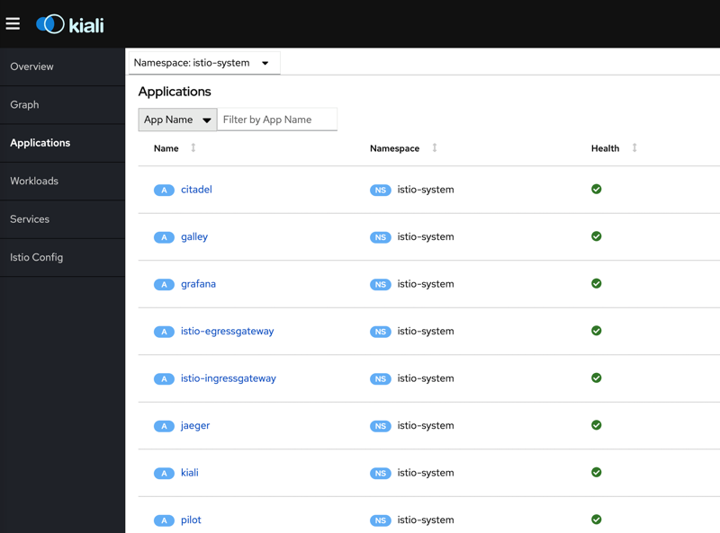
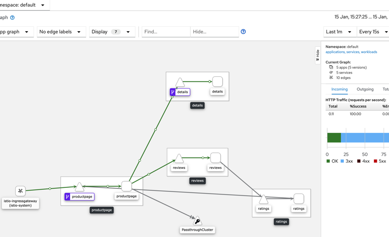
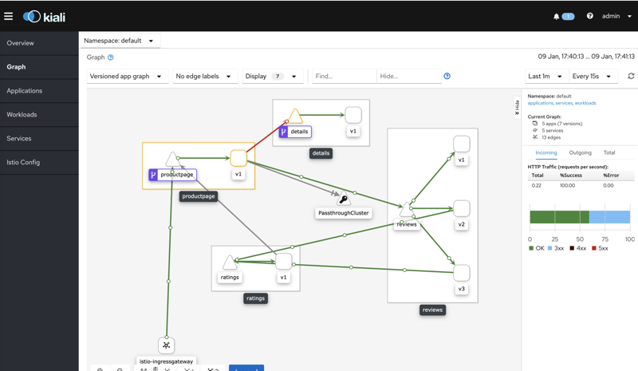

+++
title = "在minikube上安装istio并测试使用"
date = "2020-01-18T13:47:08+02:00"
tags = ["istio", "k8s"]
categories = ["sevicemesh", "microservices"]
banner = "img/banners/istio.png"
draft = false
author = "helight"
authorlink = "http://helight.cn"
summary = "只有一台机器，又想玩一下 istio 怎么办呢？本文将介绍如何使用 minikube 来安装 istio。"
keywords = ["istio","minikube", "kiali"]
+++

# 在minukube上安装istio并测试使用

## 前言

只有一台机器，又想玩一下 istio 怎么办呢？本文将介绍如何使用 minikube 来安装 istio。

## minikube 介绍

minikube的介绍如下：
https://github.com/kubernetes/minikube

Minikube 是一个 Kubernetes 发行版，在本地工作站上的虚拟机中运行。 要在本地计算机上安装 Docker 引擎。

## 在 linux 上安装 minikube
在linux上怎么安装minikube看这里：
[https://minikube.sigs.k8s.io/docs/start/linux/](https://minikube.sigs.k8s.io/docs/start/linux/).
很简单，下载安装即可
``` sh
 curl -LO https://storage.googleapis.com/minikube/releases/latest/minikube-linux-amd64 \
   && sudo install minikube-linux-amd64 /usr/local/bin/minikube
```
安装之后就可以直接运行了。直接运行会展示 minikube 的帮助信息。
```sh
root@VM_74_51_centos ~]# minikube 
Minikube is a CLI tool that provisions and manages single-node Kubernetes clusters optimized for development workflows.

Basic Commands:
  start          Starts a local kubernetes cluster
  status         Gets the status of a local kubernetes cluster
  stop           Stops a running local kubernetes cluster
  delete         Deletes a local kubernetes cluster
  dashboard      Access the kubernetes dashboard running within the minikube cluster

Images Commands:
  docker-env     Sets up docker env variables; similar to '$(docker-machine env)'
  cache          Add or delete an image from the local cache.

Configuration and Management Commands:
  addons         Modify minikube's kubernetes addons
  config         Modify minikube config
  profile        Profile gets or sets the current minikube profile
  update-context Verify the IP address of the running cluster in kubeconfig.
....
```
启动的时候可以挂在虚拟机，所以可以检测以下 cpu 是否支持虚拟化。
``` sh
egrep -q 'vmx|svm' /proc/cpuinfo && echo yes || echo no
```

上面这个命令是检测 cpu 是否支持虚拟化的。如果你是 docker 主机，cpu 是不支持虚拟化的。
``` sh
Hypervisor Setup
Verify that your system has virtualization support enabled:
If the above command outputs “no”:
* If you are running within a VM, your hypervisor does not allow nested virtualization. You will need to use the None (bare-metal) driver
* If you are running on a physical machine, ensure that your BIOS has hardware virtualization enabled
```
不支持虚拟化，在启动minikube的时候就不需要指定虚拟机驱动程序了。
``` sh
[root@VM_74_51_centos /data/istio]# minikube start
* [helight] minikube v1.6.2 on Centos 7.2
  - KUBECONFIG=/root/admin.conf
* Automatically selected the 'kvm2' driver (alternates: [none])
* The "kvm2" driver should not be used with root privileges.
* If you are running minikube within a VM, consider using --vm-driver=none:
*   https://minikube.sigs.k8s.io/docs/reference/drivers/none/
```
## 启动 minikube
``` sh
[root@VM_74_51_centos /data/istio]# minikube start --vm-driver=none
。。。
```
启动minikube成功。
检测minikube启动状态。
``` sh
[root@VM_74_51_centos /data]# minikube status
host: Running
kubelet: Running
apiserver: Running
kubeconfig: Configured
```

## 安装 kubectl
kubectl 是和 kubeneters 交互的一个客户端，方便的和 k8s 进行交互，提交作业，查询状态等等。
```sh 
curl -LO https://storage.googleapis.com/kubernetes-release/release/`curl -s https://storage.googleapis.com/kubernetes-release/release/stable.txt`/bin/linux/amd64/kubectl
install kubectl /usr/local/bin/kubectl
```

如果配置了https_proxy和http_proxy，就要再配置一下no_proxy，把本地ip加入到no_proxy中。
``` sh
export no_proxy=$no_proxy,xxx
```
## Istio 安装

### istioctl 介绍
使用 istioctl 进行istio的安装，istio提供了istioctl进行istio的安装，感觉非常方便，它提供了集中配置：
``` sh
[root@VM_74_51_centos ~]# istioctl profile list
Istio configuration profiles:
    remote
    sds
    default
    demo
    minimal
```
这里使用一般demo规则来来安装。
### 使用 istioctl 进行 Istio 安装
``` sh
[root@VM_74_51_centos /data]#
istioctl manifest apply --set profile=demo
- Applying manifest for component Base...
✔ Finished applying manifest for component Base.
- Applying manifest for component Tracing...
- Applying manifest for component Galley...
- Applying manifest for component IngressGateway...
- Applying manifest for component EgressGateway...
- Applying manifest for component Citadel...
- Applying manifest for component Policy...
- Applying manifest for component Kiali...
- Applying manifest for component Prometheus...
- Applying manifest for component Pilot...
- Applying manifest for component Injector...
- Applying manifest for component Telemetry...
- Applying manifest for component Grafana...
✔ Finished applying manifest for component Citadel.
✔ Finished applying manifest for component IngressGateway.
✔ Finished applying manifest for component Galley.
✔ Finished applying manifest for component Prometheus.
✔ Finished applying manifest for component Policy.
✔ Finished applying manifest for component Injector.
✔ Finished applying manifest for component Pilot.
✔ Finished applying manifest for component EgressGateway.
✔ Finished applying manifest for component Kiali.
✔ Finished applying manifest for component Tracing.
✔ Finished applying manifest for component Telemetry.
✔ Finished applying manifest for component Grafana.

✔ Installation complete
```

### Istio 安装后检查
安装好之后可以直接这里看安装部署结果：
``` sh
[root@VM_74_51_centos /data/istio-1.4.2]# kubectl get pod -n istio-system
NAME                                      READY   STATUS    RESTARTS   AGE
grafana-6b65874977-dmgxj                  1/1     Running   0          91m
istio-citadel-86dcf4c6b-l5lp7             1/1     Running   0          91m
istio-egressgateway-68f754ccdd-r6dsl      1/1     Running   0          91m
istio-galley-57db75d6d7-lbzzn             2/2     Running   0          91m
istio-ingressgateway-6df68ccfc9-2xkmj     1/1     Running   0          91m
istio-pilot-d4fd9c9f-q9qs2                2/2     Running   0          91m
istio-policy-595b47ccd5-b9vp5             2/2     Running   3          91m
istio-sidecar-injector-746f7c7bbb-zlv8h   1/1     Running   0          91m
istio-telemetry-bcf4df94d-tdj66           2/2     Running   2          91m
istio-tracing-c66d67cd9-wcfq2             1/1     Running   0          111m
kiali-8559969566-kz89j                    1/1     Running   0          111m
prometheus-66c5887c86-fpgzl               1/1     Running   0          91m
[root@VM_74_51_centos /data/istio-1.4.2]#
```
### kiali 配置修改
这里要修改一下 kiali 的 ip 方式
``` sh
[root@VM_74_51_centos /data]# kubectl edit svc kiali -n istio-system
spec:
  clusterIP: 10.96.255.174
  externalTrafficPolicy: Cluster
  ports:
  - name: http-kiali
    nodePort: 31952
    port: 20001
    protocol: TCP
    targetPort: 20001
  selector:
    app: kiali
  sessionAffinity: None
  type: NodePort
```
上面的type设置为 NodePort，主要是为了测试简单
kaili还有一个设置用户名密码的过程。
``` sh
$ KIALI_USERNAME=$(read -p 'Kiali Username: ' uval && echo -n $uval | base64)
$ KIALI_PASSPHRASE=$(read -sp 'Kiali Passphrase: ' pval && echo -n $pval | base64)
cat <<EOF | kubectl apply -f -
apiVersion: v1
kind: Secret
metadata:
  name: kiali
  namespace: $NAMESPACE
  labels:
    app: kiali
type: Opaque
data:
  username: $KIALI_USERNAME
  passphrase: $KIALI_PASSPHRASE
EOF
```
查看 kiali 页面：
http://x.x.x.x:31952/ 这里的 31952 就是上面 kiali 的配置信息中的 nodePort 字段的值。



## bookinfo 配置
这里以 istio 的 bookinfo 例子来测试。
配置业务namespace，这里直接使用了default：
``` sh
$ kubectl label namespace default istio-injection=enabled
```
使用demo代码来测试：
``` sh
kubectl apply -f samples/bookinfo/platform/kube/bookinfo.yaml
```
部署之后可以直接看部署结果：
``` sh
[root@VM_74_51_centos /data/istio-1.4.2]# kubectl get pod 
NAME                              READY   STATUS    RESTARTS   AGE
details-v1-78d78fbddf-vf6tc       2/2     Running   0          28m
productpage-v1-596598f447-qqdnc   2/2     Running   0          28m
ratings-v1-6c9dbf6b45-z872s       2/2     Running   0          28m
reviews-v1-7bb8ffd9b6-hp75k       2/2     Running   0          28m
reviews-v2-d7d75fff8-6mqmw        2/2     Running   0          28m
reviews-v3-68964bc4c8-mfbhb       2/2     Running   0          28m
```
进行网关配置：
``` sh
[root@VM_74_51_centos /data/istio-1.4.2]# kubectl apply -f samples/bookinfo/networking/bookinfo-gateway.yaml
```
查看配置结果
``` sh
[root@VM_74_51_centos /data/istio-1.4.2]# kubectl get gateway
NAME               AGE
bookinfo-gateway   15d
[root@VM_74_51_centos /data/istio-1.4.2]#  
```

查看网关关系：
```sh
[root@VM_74_51_centos /data/istio-1.4.2]# kubectl get svc istio-ingressgateway -n istio-system
NAME                   TYPE           CLUSTER-IP      EXTERNAL-IP   PORT(S)                                                                                                                      AGE
istio-ingressgateway   LoadBalancer   10.96.198.160   <pending>     15020:32242/TCP,80:31664/TCP,443:32342/TCP,15029:32264/TCP,15030:30110/TCP,15031:31085/TCP,15032:30265/TCP,15443:31177/TCP   15d
[root@VM_74_51_centos /data/istio-1.4.2]# 
```
这里就可以使用http://xx.xx.xx.xx:31664/productpage 访问例子中的页面了


在 kiali 中的可以看到调用关系：


## 故障注入测试
这里在介绍一个故障注入的测试，编辑这个文件：
``` yaml
vim samples/bookinfo/networking/fault-injection-details-v1.yaml
apiVersion: networking.istio.io/v1alpha3
kind: VirtualService
metadata:
  name: details
spec:
  hosts:
  - details
  http:
  - fault:
      abort:
        httpStatus: 555
        percent: 50. // 主要修改这里
    route:
    - destination:
        host: details
        subset: v1
  - route:
    - destination:
        host: details
        subset: v1
---
apiVersion: networking.istio.io/v1alpha3
kind: DestinationRule
metadata:
  name: details
spec:
  host: details
  subsets:
  - name: v1
    labels:
      version: v1
```
修改上面 http 的 fault 中 abort 的 percent 值，让它可以有 50% 的不可访问。
测试结果也可以在 kiali 的拓扑图中看出来：



<center>
看完本文有收获？请分享给更多人

关注「黑光技术」，关注大数据+微服务


</center>