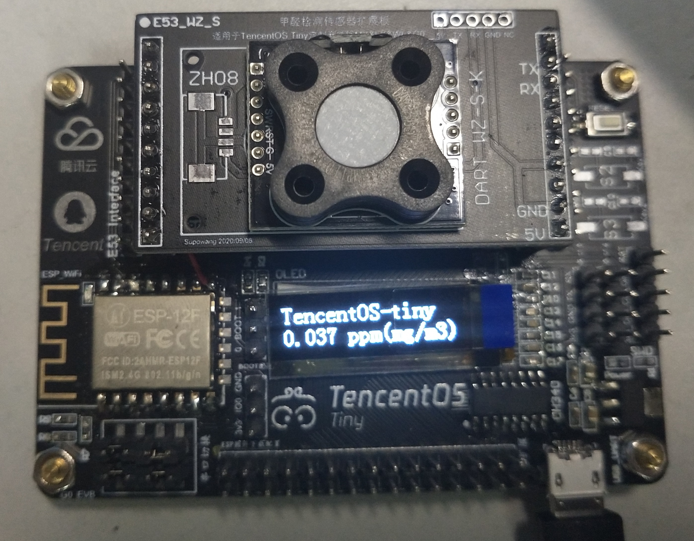
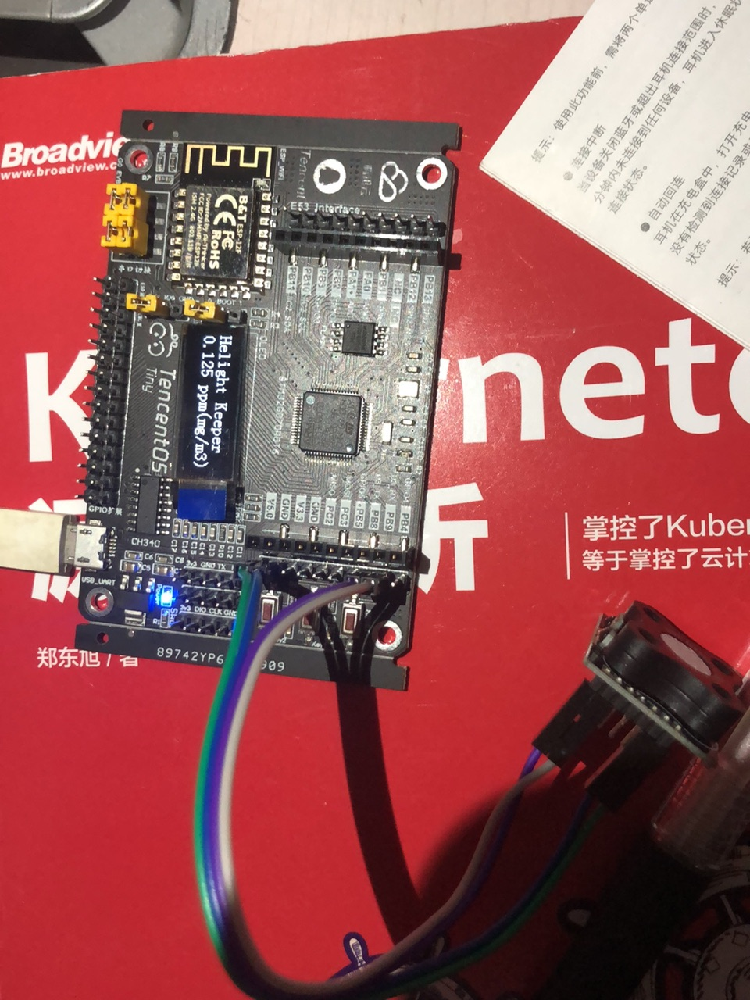
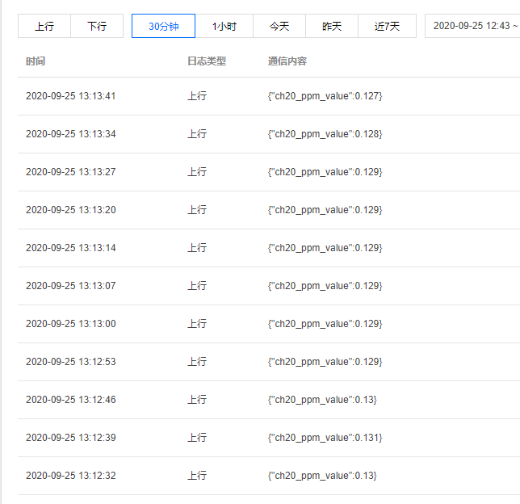
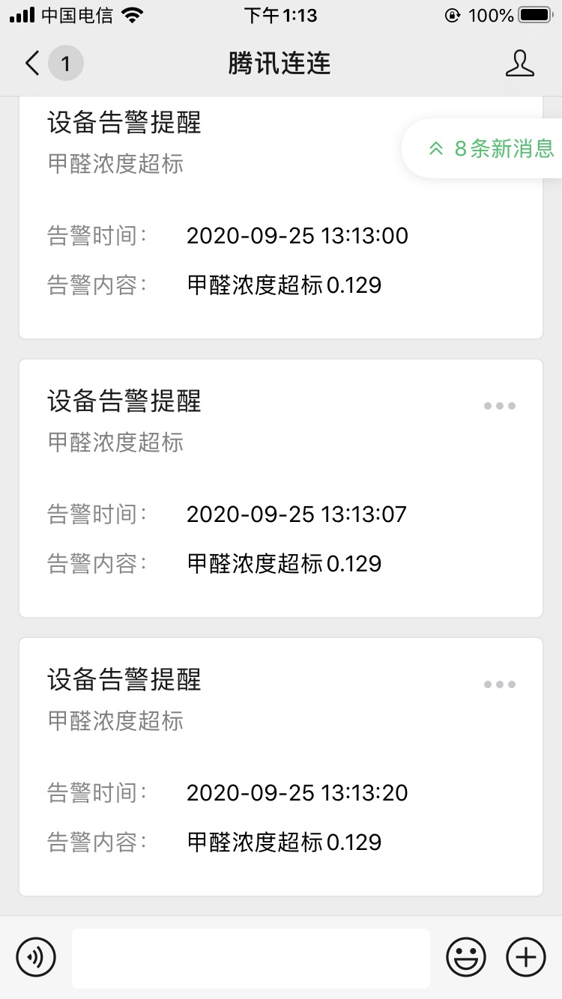

## 前言
公司前段时间发起了一个活动，免费给大家提供开发板，让大家基于 TencentOS tiny 采集数据，通过wifi、以太网、LoRaWAN、NB-IoT、2G、4G、BLE、或者网关设备、调用腾讯云SDK组件、实现数据快速上传到 IoT explorer 开放平台，然后基于腾讯云 IoT 微信小程序框架搭建小程序应用或者其他web应用，从而实现端到端的IoT解决方案。

我也报名参加了，拿到板子后这几天尝试玩了一下，还挺好玩的。从开发板数据上报、到腾讯云上设备创建、到上报数据处理，到通知手机微信。一站式服务流程，开发体验还是不错的的。这里把整体开发流程给大家介绍一下。

## TencentOS tiny 介绍
https://github.com/Tencent/TencentOS-tiny
TencentOS tiny 是腾讯面向物联网领域开发的实时操作系统，具有低功耗，低资源占用，模块化，安全可靠等特点，可有效提升物联网终端产品开发效率。TencentOS tiny 提供精简的 RTOS 内核，内核组件可裁剪可配置，可快速移植到多种主流 MCU (如 STM32 全系列)及模组芯片上。而且，基于 RTOS 内核提供了丰富的物联网组件，内部集成主流物联网协议栈（如 CoAP/MQTT/TLS/DTLS/LoRaWAN/NB-IoT 等），可助力物联网终端设备及业务快速接入腾讯云物联网平台。

## 主要硬件模块
定制IoT开发板EVB_G0，支持WIFi，可烧写腾讯云定制IoT固件，同时支持E53传感器扩展，可应用于多场景IoT方案验证，标准demo搭载高灵敏度的英国原装甲醛传感器WZ-S-K。 主板参数如下：
```
CPU：STM32G070RBT6, 64MHz，128K Flash，36KB SRAM
显示屏 ：OLED，128*32分辨率
电源特性 ：Micro USB接口，5V供电，内部有5V转3.3V的DCDC，MCU供电电压为3.3V，系统IO电压也为3.3V
按键：一个复位按键，两个功能按键
外部扩展存储 ：SPI FLASH
LED指示灯 ：上电指示 LED，红色；一个用户定义LED，蓝色
调试接口 ：SWD外接ST-Link，UART1串口连接PC、扩展串口4
XTAL ：8MHz，32.768KHz
```
板子长这样子，做工还算不错的。下面是主板，上面有一个液晶显示器，再上面是甲醛传感器。


## 开发流程
1. 首先是能把这个板子下载 tencentos tiny 能跑起来。
2. 链接传感器，能从传感器读取数据
3. 配置 wifi 链接，并且能上报数据到腾讯云的物联网平台
4. 在物联网配置和手机微信的腾讯连连联通
5. 配置上报数据处理流，并且根据数据阈值发送通知信息到手机

以上是主要的测试流程，今天中午跑通了所有流程，不过我在工位上测试的甲醛值貌似有点高，在0.12左右，好担心哦。

## tencentos tiny 和项目工程
tencentos tiny 目前是开源的，源码地址在这里：[https://github.com/Tencent/TencentOS-tiny](https://github.com/Tencent/TencentOS-tiny)。包括这个实验的项目工程也在里面。

整个操作系统都是 C 语言开发的，从项目工程中看，也是比较简单的，主要针对低端配置使用，整个操作系统安装其网站介绍编译之后只有几 k，内核还不到 1k 大小。

针对这个板子在这里面也提供了 wifi 固件，直接下载进去就可以使用 wifi 了，目前我是用还没有发现什么问题。固件下载之后，再把项目工程编译之后下载进板子就可以使用了。
项目中包含了操作系统，驱动和应用程序，目前已经集成了这个板子上要的液晶驱动，可以直接使用。

## 具体效果
我今天中午用跳线链接了传感器和板子，跑通了整个流程，效果是这样的。
1. 板子上的效果。


2. 板子链接wifi后上报信息到腾讯云上的物联网平台。


3. 云上数据告警发送微信。


## 总结
目前这个板子和系统开发测试中我基本上都是一遍搞定，相对来说开发门槛不高，而且嵌入式发展这么多年这些底层应该都是比较稳定的，包括驱动什么的，难度应该都还好。比我在 12 年前搞的时候要好多了，那个时候很多时候要拿示波器来看发送信号是否正确，真正的底层开发。目前看这个系统在易用性和完整性上还算不错，但是也只是正对低端设备，我不知道公司是基于什么样的考虑要做一块，方正我使用起来还挺流畅。

让我感觉真正强大的是后端系统的联合程度，我把数据上报到腾讯云物联网平台也是一次搞定，过程非常流程。而且让我惊讶的是可通过对数据流实时的处理并且把信息在推送到我的手机微信上。这个过程我感觉才是最实用的，真正可以做到微型设备和云端互联和一个手机掌控一片的微型设备。

接下来就是发挥我的想象，能够靠这个做点事什么了，有了传感器，网络和云上计算能力，貌似可以做很多有意思的东西。