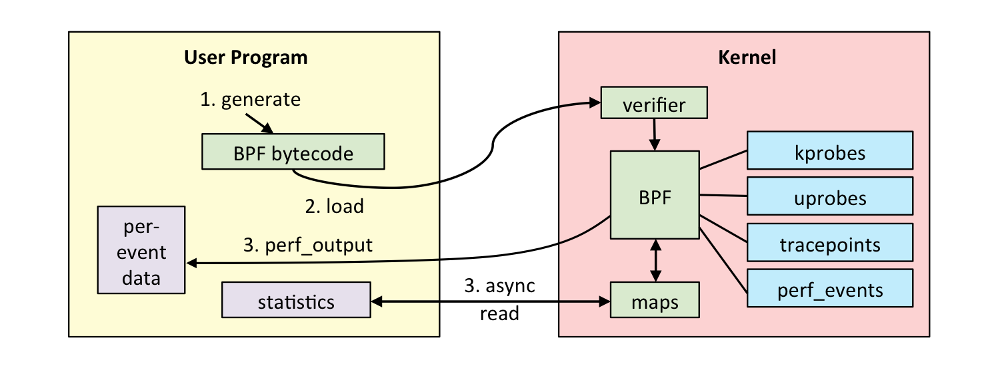
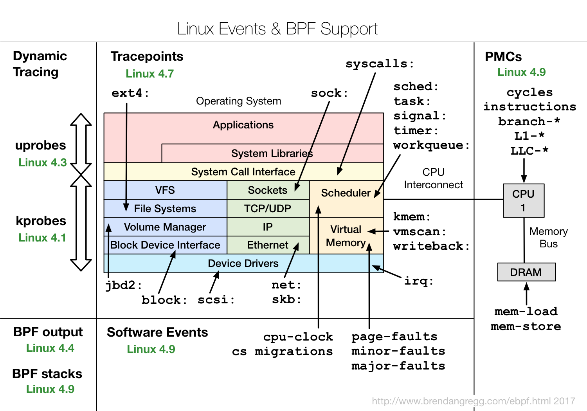
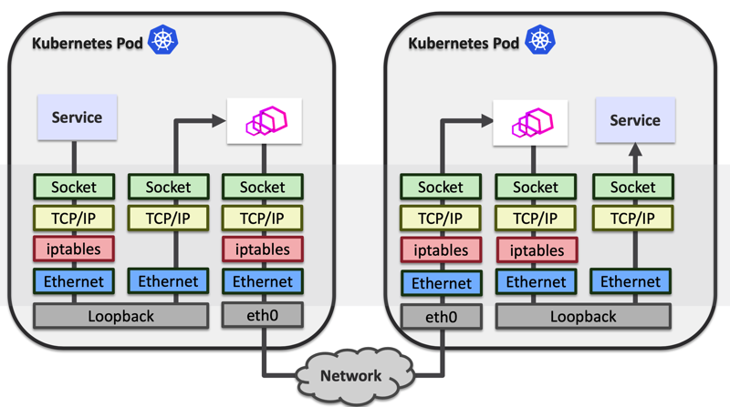
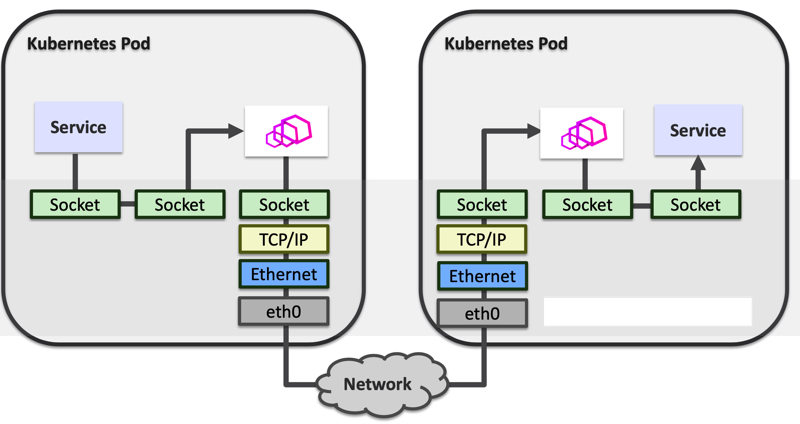

+++
title = "ebpf 学习梳理和测试使用"
subtitle = "在 ubuntu 系统中测试 ebpf 程序"
description = "在 ubuntu 系统中测试 ebpf 程序。"
date = "2020-03-21T23:47:08+02:00"
tags = ["kernel", "ebpf"]
categories = ["kernel"]
banner = "img/banners/linux_ebpf_support.png"
draft = false
author = "helight"
authorlink = "http://helight.cn"
summary = "周五下午在公司的服务网格月度讨论会上，一位同事为大家分享了在服务网格中使用 ebpf 来优化提升 istio 中 sidecar 和 RS 间的通信效率。听过之后手痒难，想测试一把 ebpf。"
keywords = ["kernel","ebpf", "go", "trace"]
+++

## 前言
周五下午在公司的服务网格月度讨论会上，一位同事为大家分享了在服务网格中使用 ebpf 来优化提升 istio 中 sidecar 和 RS 间的通信效率。听过之后手痒难，想测试一把 ebpf。当这位同事在这方面做的还是比较深入的，而且给内核和 istio 中提交了pr。有兴趣的同学可以看看他的 github:[https://github.com/ChenLingPeng](https://github.com/ChenLingPeng) 还有他的 [blog](http://chenlingpeng.github.io/)。

我前几天也在测试这块，本来是想在公司的 dev 机器上测试一把，但是因为内核还是 3.xx 的版本，无奈放弃了。如果大家想体验功能较为完善的 ebpf，那么至少是 4.xx 以上的版本，随着内核版本的发展支持的功能也越来越丰富，相关函数支持大家可以在这里看：[https://github.com/iovisor/bcc/blob/master/docs/kernel-versions.md](https://github.com/iovisor/bcc/blob/master/docs/kernel-versions.md)。

下午事情不多，所以又想测试搞起一把。也刚好是年前买了一个台腾讯云的主机，一直没有怎么使用，今天看了，可以升级操作系统到 ubuntu 18.04，18.04 的内核模式就是 4.15 了，基本可以玩 ebpf，不过安装好之后发现可以直接升级内核到 5.3，到 5.3 就有很多函数功能了。一下面先做了一些操作流水帐，记录整个过程。

## ebpf 简单介绍
这里介绍也主要是从昨天分享得到，虽然之前也看过，但是毕竟没有使用过这玩意，所以认知还是不够深入。另外从今天下午[建盛大哥](http://opensourceway.community/)组织的技术写作分享课上学到的 learning by doing。所以这东西不做，理解始终是不够深入的。今天就实际操刀做了一遍。理论学习千百遍，不如实操来一遍。所以搞起。

### ebpf 是什么
1. eBPF: extended Berkeley Packet Filter， BPF 提供了强大的网络包过滤规则，可以确定应该检查哪些流量、忽略哪些流量等，而内核近几年发展的 Extended BPF, eBPF 实际上将应用范围，处理效率进行了更新。通过一个内核内置的字节码虚拟机，完成数据包过滤、调用栈跟踪、耗时统计、热点分析等等高级功能。
2. ‘内核虚拟机’，内核内置JIT，这个虚拟机除了借助于 llvm 的技术实现了 jit 之外，最主要要的就是实现了规定指令的检测了安全执行。不会因为应用层下发的指令而导致内核效率异常低下或者奔溃。
3. C语言编写，llvm+clang编译，这个其实是和上面一条是一致的，这个 jit 的实际上就是 llvm 提供的，多年前我们在大数据多维计算引擎的实时就用过这种技术，非常灵活高效
4. Map types： 多种类型的存储，程序间共享，用户态内核态共享
5. Program Types：不同类型的 bpf 程序完成不同的事，不同的类型具有不同的功能，有点像模版的概念。
6. helper functions: 与内核数据交互，这里可以看到目前的：http://man7.org/linux/man-pages/man7/bpf-helpers.7.html。


这里面编程更重要的是后面的 3 点：Map types ，Program Types，helper functions。下面先学习一下基本理论，虽然上面那么说，但是毕竟不经过理论的实操，那就成瞎操作了。所以还是理论上先看看。

#### Map types
Map types 是 ebpf 中主要的数据存储类型，目前随着内核的发展已经有 20 多种的类型，通用型的，针对 CPU，socket，cgroup 等。很多 map 类型都有一些特殊的使用方式。BPF 程序可以通过 helper function 读写 map，用户态程序也可以通过 bpf(...)系统调用读写 map，因此可以通过 map 来达到 BPF 程序之间，BPF 程序与用户态程序之间的数据交互与控制。具体的类型定义可以看这个文件中定义：
[include/uapi/linux/bpf.h](https://git.kernel.org/pub/scm/linux/kernel/git/torvalds/linux.git/tree/include/uapi/linux/bpf.h)
``` c
enum bpf_map_type {
	BPF_MAP_TYPE_UNSPEC,
	BPF_MAP_TYPE_HASH,
	BPF_MAP_TYPE_ARRAY,
	BPF_MAP_TYPE_PROG_ARRAY,
	BPF_MAP_TYPE_PERF_EVENT_ARRAY,
	BPF_MAP_TYPE_PERCPU_HASH,
	BPF_MAP_TYPE_PERCPU_ARRAY,
	BPF_MAP_TYPE_STACK_TRACE,
	BPF_MAP_TYPE_CGROUP_ARRAY,
	BPF_MAP_TYPE_LRU_HASH,
	BPF_MAP_TYPE_LRU_PERCPU_HASH,
	BPF_MAP_TYPE_LPM_TRIE,
	BPF_MAP_TYPE_ARRAY_OF_MAPS,
	BPF_MAP_TYPE_HASH_OF_MAPS,
	BPF_MAP_TYPE_DEVMAP,
	BPF_MAP_TYPE_SOCKMAP,
	BPF_MAP_TYPE_CPUMAP,
	BPF_MAP_TYPE_XSKMAP,
	BPF_MAP_TYPE_SOCKHASH,
	BPF_MAP_TYPE_CGROUP_STORAGE,
	BPF_MAP_TYPE_REUSEPORT_SOCKARRAY,
	BPF_MAP_TYPE_PERCPU_CGROUP_STORAGE,
	BPF_MAP_TYPE_QUEUE,
	BPF_MAP_TYPE_STACK,
	BPF_MAP_TYPE_SK_STORAGE,
	BPF_MAP_TYPE_DEVMAP_HASH,
	BPF_MAP_TYPE_STRUCT_OPS,
};
```
#### Program Types
每个BPF程序都属于某个特定的程序类型，目前内核支持20+不同类型的BPF程序类型，可以大致分为网络，跟踪，安全等几大类，BPF程序的输入参数也根据类型有所不同。
具体的定义可以看这个文件中定义：
[include/uapi/linux/bpf.h](https://git.kernel.org/pub/scm/linux/kernel/git/torvalds/linux.git/tree/include/uapi/linux/bpf.h)
```c
enum bpf_prog_type {
	BPF_PROG_TYPE_UNSPEC,
	BPF_PROG_TYPE_SOCKET_FILTER,
	BPF_PROG_TYPE_KPROBE,
	BPF_PROG_TYPE_SCHED_CLS,
	BPF_PROG_TYPE_SCHED_ACT,
	BPF_PROG_TYPE_TRACEPOINT,
	BPF_PROG_TYPE_XDP,
	BPF_PROG_TYPE_PERF_EVENT,
	BPF_PROG_TYPE_CGROUP_SKB,
	BPF_PROG_TYPE_CGROUP_SOCK,
	BPF_PROG_TYPE_LWT_IN,
	BPF_PROG_TYPE_LWT_OUT,
	BPF_PROG_TYPE_LWT_XMIT,
	BPF_PROG_TYPE_SOCK_OPS,
	BPF_PROG_TYPE_SK_SKB,
	BPF_PROG_TYPE_CGROUP_DEVICE,
	BPF_PROG_TYPE_SK_MSG,
	BPF_PROG_TYPE_RAW_TRACEPOINT,
	BPF_PROG_TYPE_CGROUP_SOCK_ADDR,
	BPF_PROG_TYPE_LWT_SEG6LOCAL,
	BPF_PROG_TYPE_LIRC_MODE2,
	BPF_PROG_TYPE_SK_REUSEPORT,
	BPF_PROG_TYPE_FLOW_DISSECTOR,
	BPF_PROG_TYPE_CGROUP_SYSCTL,
	BPF_PROG_TYPE_RAW_TRACEPOINT_WRITABLE,
	BPF_PROG_TYPE_CGROUP_SOCKOPT,
	BPF_PROG_TYPE_TRACING,
	BPF_PROG_TYPE_STRUCT_OPS,
	BPF_PROG_TYPE_EXT,
};
```
#### helper functions
具体的定义可以看这个文件中定义：
[include/uapi/linux/bpf.h](https://git.kernel.org/pub/scm/linux/kernel/git/torvalds/linux.git/tree/include/uapi/linux/bpf.h)，在文件的几乎最下面，可以检索 `FN(` 这个关键字来搜索。不同的内核版本支持的也是不一样的。从函数看出来主要是就是协助处理用户空间和内核空间的交互。比如从内核获取数据（PID，GID，时间，处理器ID等），操作内核的对象。
```c
#define __BPF_FUNC_MAPPER(FN)		\
	FN(unspec),			\
	FN(map_lookup_elem),		\
	FN(map_update_elem),		\
	FN(map_delete_elem),		\
	FN(probe_read),			\
	FN(ktime_get_ns),		\
	FN(trace_printk),		\
	FN(get_prandom_u32),		\
	FN(get_smp_processor_id),	\
	FN(skb_store_bytes),		\
	FN(l3_csum_replace),		\
	FN(l4_csum_replace),		\
	FN(tail_call),			\
	FN(clone_redirect),		\
	FN(get_current_pid_tgid),	\
	FN(get_current_uid_gid),	\
	FN(get_current_comm),		\
	FN(get_cgroup_classid),		\
	FN(skb_vlan_push),		\
	FN(skb_vlan_pop),		\
	FN(skb_get_tunnel_key),		\
	FN(skb_set_tunnel_key),		\
	FN(perf_event_read),		\
  ......
```

### ebpf 主要有哪些功能
1. Tracing: kprobe/uprobe/tracepoint
2. Security: seccomp
3. Net: bpfilter, tc, sockmap, XDP

可以从这张图上看看不同版本的内核和其支持的功能。


## ubuntu 升级内核版本到 5.3

在腾讯云可以自助重新安装操作系统，这个具体怎么操作就不说了哈，如果真不会可以发邮件或者微信问我。我根据内核版本和自己的熟悉程度，选择了 ubuntu 18.04 的镜像。重新安装非常快。

18.04 默认安装的内核镜像是 4.15，但是我们还可以根据自己的需要自己升级内核版本，我根据当前的的信息升级到了 5.3 的内核。下面这个命令可以看目前还可以支持安装的内核版本。
``` sh
apt-cache search linux-image
....
linux-image-5.0.0-1010-oem-osp1 - Signed kernel image oem-osp1
linux-image-5.0.0-1012-oem-osp1 - Signed kernel image oem-osp1
linux-image-5.0.0-1013-gke - Signed kernel image GKE
linux-image-5.0.0-1015-oem-osp1 - Signed kernel image oem-osp1
linux-image-5.0.0-1033-oem-osp1 - Signed kernel image oem-osp1
linux-image-5.3.0-1011-gke - Signed kernel image GKE
linux-image-unsigned-5.0.0-1010-oem-osp1 - Linux kernel image for version 5.0.0 on 64 bit x86 SMP
linux-image-unsigned-5.0.0-1012-oem-osp1 - Linux kernel image for version 5.0.0 on 64 bit x86 SMP
linux-image-unsigned-5.0.0-1013-gke - Linux kernel image for version 5.0.0 on 64 bit x86 SMP
linux-image-unsigned-5.0.0-1015-oem-osp1 - Linux kernel image for version 5.0.0 on 64 bit x86 SMP
linux-image-unsigned-5.0.0-1033-oem-osp1 - Linux kernel image for version 5.0.0 on 64 bit x86 SMP
linux-image-unsigned-5.3.0-1011-gke - Linux kernel image for version 5.3.0 on 64 bit x86 SMP
linux-modules-nvidia-390-5.0.0-1033-oem-osp1 - Linux kernel nvidia modules for version 5.0.0-1033
linux-modules-nvidia-418-5.0.0-1033-oem-osp1 - Linux kernel nvidia modules for version 5.0.0-1033
```
目前腾讯的源中的内核版本还是比较多的，最高的是 5.3.0， 所以我就选了这个最高版本：linux-image-5.3.0-42-generic。这个是个通用版本，其中看还有 gke，aws 等等内核。

安装过程就非常简单了，直接执行下面的命令。
```sh
apt-get install linux-image-5.3.0-42-generic
```
安装完成之后直接重启就可以了。重启之后可以使用 uname 命令看目前使用的内核版本。
```sh
reboot
uname -a
Linux VM-0-13-ubuntu 5.3.0-42-generic #34~18.04.1-Ubuntu SMP Fri Feb 28 13:42:26 UTC 2020 x86_64 x86_64 x86_64 GNU/Linux
```

## 安装 ebpf 的相关库和工具

接下来就可以进行 ebpf 的相关库和工具安装了，这部分安装也比较简单，我直接使用了二进制安装方式，没有使用源码安装，因为目前根据版本不一样，所需要的相关库和工具的代码也有所不一样，这块 ebpf 做的还是不够好的。安装过程参考这里 [https://github.com/iovisor/bcc/blob/master/INSTALL.md#ubuntu---binary](https://github.com/iovisor/bcc/blob/master/INSTALL.md#ubuntu---binary)。

### build tools install
``` sh
# For Bionic (18.04 LTS)
apt-get -y install bison build-essential cmake flex git libedit-dev \
  libllvm6.0 llvm-6.0-dev libclang-6.0-dev python zlib1g-dev libelf-dev
```

### Install  BCC
Upstream Stable and Signed Packages
``` sh
apt-key adv --keyserver keyserver.ubuntu.com --recv-keys 4052245BD4284CDD
echo "deb https://repo.iovisor.org/apt/$(lsb_release -cs) $(lsb_release -cs) main" | sudo tee /etc/apt/sources.list.d/iovisor.list
apt-get update
apt-get install bcc-tools libbcc-examples linux-headers-$(uname -r)
apt-get install bpfcc-tools python-bpfcc libbpfcc
```

## 开始测试使用了哈
激动不激动，兴喜不兴喜，一起安装顺利，接下来就要测试验证了。程序员学习的老规矩，首先来一波 hello world 测试，再来高级的。如果 hello world 都过不了，说明有问题，更别说其它的高级测试了。

### hello world 测试
这个例子来自：https://github.com/iovisor/bcc，python 写的例子，git clone bcc 的代码后，就可以直接使用下面这个例子。
```sh
root@VM-0-13-ubuntu:/data/ebpf/bcc# ./examples/hello_world.py
     barad_agent-1567  [000] ....  2487.213681: 0: Hello, World!
     barad_agent-10789 [000] ....  2487.214536: 0: Hello, World!
              sh-10790 [000] ....  2487.216496: 0: Hello, World!
              sh-10790 [000] ....  2487.216720: 0: Hello, World!
              sh-10790 [000] ....  2487.216849: 0: Hello, World!
     barad_agent-1549  [000] ....  2487.221836: 0: Hello, World!
              sh-10794 [000] ....  2487.224820: 0: Hello, World!
              sh-10794 [000] ....  2487.225282: 0: Hello, World!
              sh-10794 [000] ....  2487.225745: 0: Hello, World!
        nslookup-10795 [000] ....  2487.233478: 0: Hello, World!
        nslookup-10795 [000] ....  2487.233754: 0: Hello, World!
        nslookup-10795 [000] ....  2487.233921: 0: Hello, World!
     barad_agent-1567  [000] ....  2488.213850: 0: Hello, World!
            sshd-1332  [000] ....  2489.585280: 0: Hello, World!
            sshd-10802 [000] ....  2489.590194: 0: Hello, World!
     barad_agent-1567  [000] ....  2490.213807: 0: Hello, World!
     barad_agent-10804 [000] ....  2490.214692: 0: Hello, World!
              sh-10805 [000] ....  2490.216457: 0: Hello, World!
              sh-10805 [000] ....  2490.216655: 0: Hello, World!
            sshd-1332  [000] ....  2491.263759: 0: Hello, World!
            sshd-1332  [000] ....  2491.432832: 0: Hello, World!
            sshd-10808 [000] ....  2491.495384: 0: Hello, World!
            sshd-10809 [000] ....  2491.728332: 0: Hello, World!
```
执行顺利，看到结果，那再来看看这个例子的源代码。非常简单，实际代码只有一行，目的是对 clone 系统调用进行跟踪，如果有 clone 系统调用就打印 “Hello, World!”。
``` python
#!/usr/bin/python
# Copyright (c) PLUMgrid, Inc.
# Licensed under the Apache License, Version 2.0 (the "License")

# run in project examples directory with:
# sudo ./hello_world.py"
# see trace_fields.py for a longer example

from bcc import BPF

# This may not work for 4.17 on x64, you need replace kprobe__sys_clone with kprobe____x64_sys_clone
BPF(text='int kprobe__sys_clone(void *ctx) { bpf_trace_printk("Hello, World!\\n"); return 0; }').trace_print()

```

## gobpf 中的例子编译&使用
接下来测试一个稍微高级一点的，我目前主要使用 go 语言，所以偏向于使用 go 的库来做这方面的事情，使用的是 gobpf 这个库，也是先 git clone 下来。
``` sh
git clone https://github.com/iovisor/gobpf
```

这里使用的例子是其 examples 中的一个例子 bash_readline，直接拷贝出来，作为独立项目编译执行。

```sh
root@VM-0-13-ubuntu:/data/ebpf# cp -rf gobpf/examples/bcc/bash_readline ./
root@VM-0-13-ubuntu:/data/ebpf# cd bash_readline/
root@VM-0-13-ubuntu:/data/ebpf/bash_readline# ls
bash_readline.go
```
因为墙的原因，这里要设置一下 GOPROXY，在腾讯云的机器上也是一样的，具体设置和编译如下。
```sh
root@VM-0-13-ubuntu:/data/ebpf/bash_readline# export GOPROXY=https://goproxy.io
root@VM-0-13-ubuntu:/data/ebpf/bash_readline# go mod init bash_readline
go: creating new go.mod: module bash_readline
root@VM-0-13-ubuntu:/data/ebpf/bash_readline# go build bash_readline.go
go: finding module for package github.com/iovisor/gobpf/bcc
go: found github.com/iovisor/gobpf/bcc in github.com/iovisor/gobpf v0.0.0-20200311173154-8078b203833d
root@VM-0-13-ubuntu:/data/ebpf/bash_readline# ls
bash_readline  bash_readline.go  go.mod  go.sum
```

接下来是执行程序，这个程序主要做的就获取 bash 命令行的输入命令。在一个终端执行这个程序，在另外一个终端中随便输入命令，就会获取执行命令的 PID 和命令。
```sh
root@VM-0-13-ubuntu:/data/ebpf/bash_readline# ./bash_readline
       PID	COMMAND
as

      5264	sudo
      5264	ls
      5264	asfasdf
```

## 总结
目前来说 ebpf 的开发门槛是越来越低了，现在有 go 的库，python 的库，很快的就可以开发测试。在开发体验上是有非常大的进步。所以这里关键就是要找合适你的应用场景了，目前最合适的仍然是内核调试，安全，网络数据转发等。

我从本文开始的时候提出的解决 istio 中 sidecar 和 RS 之间的传输效率提升也是可以的，基本的解决思路这里也简单说一下：
	在 sidcar 和 RS 之间的通信是经过了本地网络协议栈的，这部分可以利用 ebpf 来进行优化。
原本的通行方式是这样的


我们可以利用 ebpf 的能力进行 socket 映射，使用 socketmap 和 sockethash 进行发送和接受端口映射。形成如下的数据通信方式。


这个方案在实际操作上是没有问题的，**但是我们同事得出的最终结论是**：
1. 从整体上来说效率提升并不明显，在有些情况下来要低一些，因为这块并不是服务网格的最大瓶颈，使用量不多，所以优化效果提升有限。
2. 但是在高并发请求的场景下还是有不少的提升的。
   
所以 ebpf 最大的用途目前应该还是在上面提到的几个方面：内核调试，安全，网络数据转发。比如目前 facebook 发布的 l4LB 和 DDoS 防护，Google 的用于追踪分析的 BPFd。

## 参考

1. [http://www.brendangregg.com/ebpf.html](http://www.brendangregg.com/ebpf.html)
2. [http://chenlingpeng.github.io/2020/01/07/ebpf-intro/](http://chenlingpeng.github.io/2020/01/07/ebpf-intro/)
3. [https://github.com/zoidbergwill/awesome-ebpf](https://github.com/zoidbergwill/awesome-ebpf)


<center>
看完本文有收获？请分享给更多人

关注「黑光技术」，关注大数据+微服务


</center>