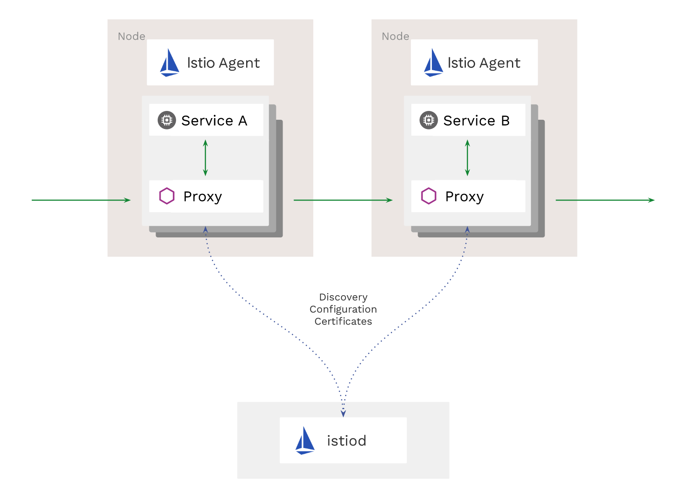

+++
title = "【译】2020 年的 Istio - 顺风而行"
subtitle = "在 Istio 2020 年的路线图中，将会继续变的更快，更易用"
description = "Istio 2020 年的愿景申明和路线图计划。"
date = "2020-03-06T13:47:08+02:00"
tags = ["istio", "k8s"]
categories = ["sevicemesh", "microservices"]
banner = "img/banners/istio.png"
draft = false
author = "helight"
authorlink = "http://helight.cn"
summary = "在 2020 年 Istio 有更雄伟的目标，并且很多重大工作已经在进行了，但是同时我们也坚信好的基础设施应该是“无知”的。在生产中使用 Istio 应该是一种无缝的体验。"
keywords = ["istio","roadmap", "security", "performance", "operator"]
+++

翻译 Istio 官网 blog 文章，原文：[https://istio.io/blog/2020/tradewinds-2020/](https://istio.io/blog/2020/tradewinds-2020/)。

Istio 解决了人们在运行微服务时遇到的实际问题。甚至[非常早期的预发布版本](https://kubernetespodcast.com/seeption/016-descartes-labs/)也帮助用户调试其系统结构中的延迟问题，帮助提高服务的可靠性，并且透明地保护了火墙后的通信。

去年，Istio 项目经历了非常大的成长。经过了 9 个月酝酿才在第一季度发布了 1.1 的版本，之后我们设定了一个按季度为节奏发布的目标。我们知道始终如一并且可预见地交付实现是很重要的。我们计划后面三个季度发布三个版本，并且成功的做到了，为此我们非常自豪。

在去年后期的 3 个版本中，我们改进了构建和测试基础设，从而有了更高的质量和更快捷的发布周期。我们通过增加许多命令让操作和调试服务网格更容易，一次加倍提升用户体验。我们同样看到参与贡献 Istio 项目的人员和公司大幅度增加，这也让我们最终[在 GitHub 增长最快的十大项目中排名第四](https://octoverse.github.com/#fastest-growing-oss-projects-by-contributors)！

在 2020 年 Istio 有更雄伟的目标，并且很多重大工作已经在进行了，但是同时我们也坚信好的基础设施应该是“无知”的。在生产中使用 Istio 应该是一种无缝的体验；性能不应该是问题，升级不应该是个什么大事，并且复杂的任务应该自动化。随着我们对一个更强大的可扩展性的迭代投入，我们认为随着 Istio 专注用户体验提升的同时会加快服务网格空间的创新步伐。
下面是更多 2020 主要工作的详情。

## 更流畅，更平滑，更快 {#sleeker-smoother-and-faster}

Istio 从其建设之初就提供了可扩展性，是通过叫做 Mixer 的一个组件来实现的。Mixer 是一个平台，在 Mixer 上允许自定义[适配器](https://istio.io/zh/docs/reference/config/policy-and-telemetry/mixer-overview/#adapters)来充当数据平面和用于策略或遥测后端之间的中介。不过因为 Mixer 要求扩展是在进程外，因此增加了不必要的请求开销。 所以我们正在向一种模式发展：直接在代理内部启用扩展。

大多数 Mixer 用于执行策略的用例已经通过 Istio 的[认证](https://istio.io/zh/docs/concepts/security/#authentication-policies)和[授权](https://istio.io/zh/docs/concepts/security/#authorization))策略实现了， 这些策略允许直接在代理中控制 workload 到 workload，终端用户到 workload 的认证。公共监控用例也已经迁移到了代理中，我们为发送遥测信息到 Prometheus 和 Stackdriver 而[引入代理内支持](https://istio.io/zh/docs/ops/configuration/telemetry/in-proxy-service-telemetry/)。

我们的基准测试显示新的遥测模型显著降低了延迟，并有业界领先的性能，延迟和 CPU 消耗都减少了 50%。

## 新的 Istio 扩展模型 {#a-new-model-for-Istio-extensibility}

在这个模型中用在 Envoy 中引入扩展，替换掉了 Mixer 的方式，这样可以提供更多的能力。Istio 社区正在带领在 Envoy 中实现 [WebAssembly](https://webassembly.org/) (Wasm) 运行时，这种方式可以以模块化，沙箱的方式实现扩展，并且可以支持使用[超过 20 种语言](https://github.com/appcypher/awesome-wasm-langs)。代理可以在持续服务的情况下动态加载和重载扩展。Wasm 扩展同样也将能够以 Mixer 无法做到的方式扩展平台。它们可以充当自定义协议处理程序，并在通过 Envoy 时转换有效负载 — 简而言之，它们可以执行与构建到 Envoy 中的模块相同的事情。

我们正在与 Envoy 社区合作，寻找发现和分发这些扩展的方法。我们想让 WebAssembly 扩展像容器一样易于安装和运行。许多合作伙伴已经编写了 Mixer 适配器，并且和我们一起把他们移植到了 Wasm 上。我们也在开发教如何编写自定义集成扩展的指引和代码教程。

通过改变扩展模式，我们也能扔掉大量 CRD。不再需要为与 Istio 集成的每一个软件都提供唯一的 CRD 了。

使用 `preview` 配置文件安装 Istio 1.5 不会安装 Mixer。如果你从前一个版本进行升级，或者使用 `default` 配置文件安装，为了安全起见仍然会保留 Mixer。当使用 Prometheus 或者 Stackdriver 来收集度量指标，建议尝试新模式来看看性能提升了多少。

如果有需要你可以保留安装 Mixer 并启用它。最终，Mixer 会成为 Istio 的一个独立组件发布，这也是 [istio 生态](https://github.com/istio-ecosystem/)的一部分。

## 更少组件 {#fewer-moving-parts}

我们也会简化控制平面其它部分的部署。为此，我们把控制平面的几个组件合成了一个组件：Istiod。这个二进制程序包含了 Pilot，Citadel，Galley，和 sidecar 注入器的所有功能。这个实现改进了 Istio 管理和安装的许多问题 -- 减少安装和配置复杂性，减少维护工作，提升问题诊断响应的时间。关于 Istiod 的更多信息请阅读 [Christian Posta 的这篇博文](https://blog.christianposta.com/microservices/istio-as-an-example-of-when-not-to-do-microservices/)。（这里顺便说一下，这篇博文我也已经翻译了[点击这里查看](http://www.helight.cn/blog/2020/when-not-to-do-microservices/)）

我们将 istiod 作为 1.5 中所有配置文件的默认配置。

为了减少每个节点的空间占用，我们干掉了用于分发证书的 node-agent，并且把它的功能迁移到了 istio-agent， istio-agent 已经是在每个 Pod 中了，我们正从这个图中所示的架构

向这个架构发展。

在 2020 年，我们将持续建设以实现我们的“零配置”默认目标，无需更改任何应用程序配置即可享用大多数 Istio 的功能。

## 生命周期管理优化 {#improved-lifecycle-management}

为了改进 Istio 的生命周期管理，我们迁移到了一个基于 [operator](https://kubernetes.io/docs/concepts/extend-kubernetes/operator/) 的安装。引入了 **[IstioOperator CRD 和 2 钟安装模式](https://istio.io/zh/docs/setup/install/istioctl/)** ：

- 人工触发：使用 istioctl 来应用配置到集群上。
- 机器触发：用一个控制器监听 CRD 的变动，并且实时应用配置。

在 2020 年更新升级将会更容易。我们会增加支持金丝雀方式发布 Istio 控制平面的新版，这样可以让新版本和现存版本同时运行，再逐渐的切换数据平面到新的版本上。

## 默认安全策略 {#secure-by-default}

Istio 已经为强壮的服务安全提供了基础能力：可靠的 workload 身份，强健的访问策略和综合审计日志。我们正在为这些特性稳固 API；很多 Alpha 版本的 API 在 1.5 中已经是 Beta 版本了，我们希望它们在 2020 年底的时候都以成为 v1 稳定版。更多关于 API 状态的信息，请看[特性页面](https://istio.io/zh/about/feature-stages/#istio-features)。

默认网络流量也会变的更安全。经过之前很多用户的使用，[自动启用双向 TLS](/docs/tasks/security/authentication/authn-policy/#auto-mutual-tls) 已经成为 Istio 1.5 中的推荐实践。

此外，我们会让 Istio 需要更少的权限，并且简化它的依赖，从而使它成为一个更强大的系统。以前，你必须使用 Kubernetes Secrets 挂载证书给 Envoy，作为文件一样挂载到每个代理上。现在通过 [Secret Discovery Service](https://www.envoyproxy.io/docs/envoy/latest/configuration/security/secret) 我们可以安全地分发这些证书，而不必担心它们被机器上的其它 workloads 截获。这种模式也将会变成 1.5 中的默认做法。

放弃 node-agent 不仅简化了部署，而且也消除了集群内对 `PodSecurityPolicy` 的要求，从而进一步改善了集群的安全性。

## 其它功能 {#other-features}

Here's a snapshot of some more exciting things you can expect from Istio in
2020:
在 2020 年，Istio 会让人期待兴奋的一些事情的简要说明：

- 和更多托管的 Kubernetes 环境集成 - 由 Istio 支持的服务网格供应商有 15 家，包括了 Google，IBM，Red Hat， VMware，Alibaba 和 华为。
- 在 `istioctl` 上会投入更多，以及它帮助诊断问题的能力
- 可以更好的集成基于 VM 的 workloads 到网格中
- 持续努力，可以更容易配置、管理、运行多集群和多网络环境
- 和更多服务发现系统集成，包括 Functions-as-a-Service
- 实现新的 [Kubernetes service API](https://kubernetes-sigs.github.io/service-apis/)，目前正在开发。
- 可以追踪功能开发的[增强仓库](https://github.com/istio/enhancements/)。
- 让 Istio 脱离 Kubernetes 也可以方便的运行！

从大海到[天空](https://www.youtube.com/watch?v=YjZ4AZ7hRM0)，我们会很高兴看到你将 Istio 带向何处。

看完本文有收获？请分享给更多人

关注「黑光技术」，关注大数据+微服务

