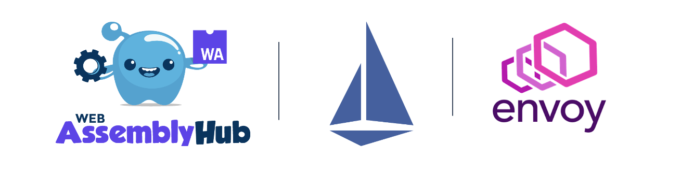

+++
title = "【译】发布可扩展和改进的 webassembly hub，帮助 envoy 和 Istio 使用 webassembly 的能力"
subtitle = "发布可扩展和改进的 webassembly hub，帮助 envoy 和 Istio 使用 webassembly 的能力"
description = "发布可扩展和改进的 webassembly hub，帮助 envoy 和 Istio 使用 webassembly 的能力"
date = "2020-03-13T13:47:08+02:00"
tags = ["istio", "k8s"]
categories = ["sevicemesh", "microservices"]
banner = "img/banners/wasm-hub.png"
draft = false
author = "helight"
authorlink = "http://helight.cn"
summary = "就像用户们都想采用基于 Envoy 的基础设施来解决微服务通信带来的挑战，他们都不可避免的呃发现他们必须开发一些定制的技术功能来适配解决内部的限制性问题。"
keywords = ["istio","WebAssembly", "security", "wasm", "operator"]
+++

翻译 solo 官网 blog 文章，原文：[https://www.solo.io/blog/an-extended-and-improved-webassembly-hub-to-helps-bring-the-power-of-webassembly-to-envoy-and-istio/](https://www.solo.io/blog/an-extended-and-improved-webassembly-hub-to-helps-bring-the-power-of-webassembly-to-envoy-and-istio/)。

这篇文章算是一篇介绍 WebAssembly Hub 的软文，翻译起来也不算费劲。就目前看这个东西还是非常有意思的，至少真实的解决了使用 envoy 中遇到的痛点。

就像用户们都想采用基于 Envoy 的基础设施来解决微服务通信带来的挑战，他们都不可避免的呃发现他们必须开发一些定制的技术功能来适配解决内部的限制性问题。[WebAssembly](https://webassembly.org/) (Wasm) 作为一种平台扩展的安全和动态的环境出现了。

如今，Istio 项目[发布了 1.5]https://istio.io/blog/2020/wasm-announce/)，在这个版本中把 WebAssembly 引入了非常流行的 Envoy 代理。在 Solo 公司，我们和 Google， Istio 社区一起合作来简化在 Envoy 和 Istio 中创建，共享和部署 WebAssembly 扩展的总体体验。我们还记得不久以前 Google 和其他人如何为容器铺筑基础，而且 Docker 也构建了非常好的用户体验，让它成为可消费品。类似的，我们通过在 Envoy 上为 WebAssembly 的构建提供很好的用户体验，让 Wasm 也变成可消费品。

    根据 Istio 和 Anthos 服务网格的技术总监 Sean Suchter 所说的：“没有很好的用户体验，再强大的工具也是无意义的。这也是为什么 Google 和 Istio 社区如此高兴的和 Solo 的团队合作创建 WebAssembly Hub 的原因之一，这个重要的项目可以加强 Istio 的可扩展性，并且提供和好的用户体验。”

早在 2019 年 12 月的时候，我们[发布了 WebAssembly Hub](https://www.solo.io/blog/introducing-the-webassembly-hub-a-service-for-building-deploying-sharing-and-discovering-wasm/)，我们就开始努力的为 Envoy 上的 WebAssembly 开发提供了很好的开发体验。我们创建了一个工作流，可以让开发者们非常快的用 C++ 开发 WebAssembly 项目（我们现在扩充了开发语言，见下文），在 Docker 中用 Bazel 构建，并且上传到一个符合 OCI 规范的仓库。在那里，运维人员需要拉取模块，并且配置 Envoy 代理从本地磁盘加载这些模块。在 Gloo（是 Solo 公司[基于 Envoy 开发的一个 API 网关](https://docs.solo.io/gloo/latest/)）中加入了这个支持的 bate 版本，可以以声明式的方式和动态的加载模块，但是我们也希望为其它基于 Envoy 的框架带来同样轻松和安全的题样。

我们对在这个领域的创新非常有兴趣，我们一致在努力提升 WebAssembly Hub 的能力和它支持的工作流。现在我们很高兴的发布了 WebAssembly Hub 的增强特性，它改进提升了在生产中使用 WebAssembly+Envoy 的可行性，提升了开发者体验，并简化了在 Istio 中使用 Wasm 的过程。

## 向生产环境使用而发展 {#evolving-toward-production}
Envoy 社区在努力将 Wasm 支持引入上游项目（目前它在一个开发分支上），Istio 申明其 Wasm 支持已经处于 Alpha 版本。在早起[我们发布的Gloo 1.0](https://www.solo.io/blog/announcing-gloo-1-0-a-production-ready-envoy-based-api-gateway/)中，也没有提供 Wasm 的生产支持。

虽然在每个单独的项目中还不够成熟，我们现在仍然可以做一些事情来提升生产环境的支持。

我们的首要目标就是标准化 Envoy 的 WebAssembly 的扩展。与 Google 和 Istio 社区一起，像 OCI 镜像一样，我们为构建和分发 WebAssembly 模块定义了一个开放的规范。这份规范为分发任何类型的 WASM 模块提供了强大的模型（也包括 Envoy 扩展）。你也可以加入一起来建设：[https://github.com/solo-io/wasm-image-spec](https://github.com/solo-io/wasm-image-spec).

我们也为运行在生产环境的基于 Envoy 的框架提升了部署 Wasm 扩展的体验，它可以被认为是在生产中使用基于 CRD 申明式配置管理集群配置的最佳实践。新的 [WebAssembly Hub Operator](https://docs.solo.io/web-assembly-hub/latest/tutorial_code/wasme_operator/)  增加了一个单独的，声明式的 CRD，用于自动化的部署和配置在 Kubernetes 集群内运行的 Envoy 代理上的 Wasm 过滤器。这个 operator 可以让 GitOps 工作流和集群自动化来管理 Wasm 过滤器，而不需要人工干预或者强制工作流。

最后，Wasm 扩展开发和和部署团队之间的交互需要一种基于角色的访问、组织管理和共享、发现和使用这些扩展的设施。WebAssembly Hub 就添加团队管理的特性，比如权限、组织、用户管理，共享等等。

## 提升开发者体验 {#improve-developer-experience}

作为开发者想要更多的语言支持和运行时，我们希望为他们提供尽可能简单和高效的体验。多语言支持和运行时 ABI（应用程序二进制接口）应该在工具中自动化处理。

Wasm 的其中一个好处就是可以用很多种语言来写模块。我们 Google 组队来为用 C++, Rust 和 AssemblyScript 写 Envoy 过滤器提供一个开箱即用的支持。我们将在不远的未来继续添加跟多的语言支持。

Wasm 扩展在部署的 Envoy 代理中使用使用应用程序二进制接口（ABI）。WebAssembly Hub 为 Envoy/Istio/Gloo 提供了强大的 ABI 版本管理，以此来防止不可预知的行为和错误。你需要关心的仅仅是写扩展代码。

最后，像 Docker 一样，WebAssembly Hub 像 OCI 镜像一样存储和分发 Wasm 扩展。这样让上传，拉取，运行扩展就像 Docker 容器一样方便。Wasm 镜像经过版本控制和加密保护，让它可以像在生产环境中一样，安全的在本地运行。这让用户拉取和部署镜像的时候信任这个源，就像他可以让用户方便的构建和上传镜像。

## Istio 中使用 WebAssembly Hub

现在 WebAssembly Hub 完全自动化了部署 Wasm 扩展到 Isito 的过程，其它基于 Envoy 的框架也是可以的，比如 Gloo API 网关。有了这个部署特性，WebAssembly Hub 减轻了 运维者或者用户的工作，让他们从为 Isito 服务网格中人工配置 Envoy 代理来使用 WebAssembly 模块的工作中得到解放。

看看下面的视屏，就知道在 Istio 中使用 WebAssembly 是多简单了。

Video 1: [https://youtu.be/-XPTGXEpUp8](https://youtu.be/-XPTGXEpUp8)

Video 2: [https://youtu.be/-XPTGXEpUp8](https://youtu.be/vuJKRnjh1b8)

## 从今天开始扩展 Envoy {#start-extending-Envoy-today}

我们希望 WebAssembly Hub 可以成为一个社区，可以共享，发现和分发 Wasm 扩展。通过提供非常好的用户体验，我们希望让开发，安装和运行 Wasm 更容易和更有价值。我们同时邀请大家加入 [WebAssembly Hub](https://webassemblyhub.io/)，来分享你的扩展和想法，也邀请大家[加入我们即将举办的网络研讨会](https://solo.zoom.us/webinar/register/WN_i8MiDTIpRxqX-BjnXbj9Xw?__hstc=228074946.8844ea368b7fd089e8ced824d2018e0f.1581728706405.1581728706405.1583585122566.2&__hssc=228074946.4.1583585122566&__hsfp=697009169)。

看完本文有收获？请分享给更多人

关注「黑光技术」，关注大数据+微服务

