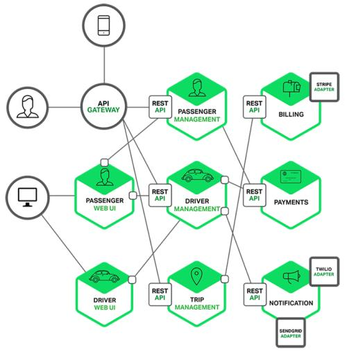

## 前言
上一篇中梳理介绍了微服务架构的特点和优势，也明确说微服务架构是现代软件开发中解决生产力的一种模式。微服务可以大家加速现代企业中软件开发效率、软件稳定性，扩展性。

但是，但是，但是，微服务就只有优势没有缺陷吗？这明显是不可能的，任何事情都两面性，就看我们怎么去利用优势和避免缺陷，或者是减少缺陷带来的负面影响。微服务带来的生产关系的变革是在一定发展的基础之上的，没有这些基础，微服务就是空中楼阁。

所以在这篇文章中我想梳理一下，在应用微服务架构的时候我们会遇到什么样的问题，如何避免这些问题，或者减少其带来的负面影响。

所以本文首先会梳理出采用微服务架构时会遇到的问题，再梳理介绍如何解决这些问题。

## 应用微服务架构时会有哪些问题呢？
1. 首先遇到的问题就是现在的我们所有的微服务系统都是一个分布式是系统：
   
   所以在分布式系统中会遇到的一些问题在现在的微服务系统中也必然会遇到。比如说服务的可靠性，服务之间访问的不可达，网络延时，带宽等等一系列的问题。在单体架构时代，模块之间的访问是本地函数调用，上面说到的这些问题几乎都不会存在。模块之间的访问都可以算是在服务内部，就没有网络延迟问题，也没有服务之间的带宽问题。

2. 第二个问题是服务迁移问题：
   
   把一个单体架构的服务拆分成一个微服务架构的设计就需要你确定服务的拆分粒度，服务之间的边界问题，这个过程是非常复杂的，这需要你去深入理解你的代码中的依赖关系，数据访问关系。所以现在很多所谓的微服务咨询公司就出现了一个职业，专门来帮助企业分析拆分服务，把你的单体服务以合理的方式拆分为微服务的架构。

3. 第三个问题是版本管理问题：
   
   微服务的版本管理本身就是一个非常复杂庞大的管理问题，非常有挑战难度。因为一般微服务架构中会有很多微服务，每个微服务又有很多版本，服务之间的版本应该如何管理？如何对应升级？都是非常头疼的问题。

4. 组织架构问题：
   
   微服务架构和人员组织架构是密切相关的，很多人对这个比较疑惑，这里我少做阐述：大家认识到的把一个服务拆分成多个小的服务，这种一般我认为不能叫做微服务架构。为什么呢？因为要采用微服务架构必然是软件项目盘大到一定程度，或者说是软件的细分发展到一定程度才会出现的结果，这种情况下相应出现就是人员组织的庞大，人员太多导致开发的功能会非常多，我们要提升软件开发效率，这种情况下才要拆分服务，把大的服务拆分成小的服务，放到小的团队来做，以此来提升开发效率。

   所以组织架构的问题是：
   1. 如何针对业务特点建立一个高效的团队组织，以此来划分服务，提升开发效率，有效解决实际的业务问题
   2. 团队的构建是否遵从了 DevOps 的思想，为什么这么说呢？DevOps 在一定程度上来说也是一种组织架构形式，把开发和运维一体化，你开发你负责而且在一定程度上是负责到底的方式。这种方式减少了开发和运维之间的沟通门槛，沟通更流畅，效率也就会更高。
   
   以我的看法，超过 1 个人的团队，这中间最大的就是沟通效率问题，如果沟通效率提升了，团队战斗力绝对不会怎么低（这里不用抬杠哈，各人有各人的看法）。

所以从上面的分析来看，微服务的复杂性要比单体服务更大，而且这种复杂性是体现在架构的复杂上。所以下面我们就来分析一下复杂性带来的具体问题有哪些。

## 微服务架构复杂性及其带来的问题

在单体架构中这种复杂性主要体现在其内部代码级别，而微服务的复杂性就主要体现在了独立的服务和服务之间的交互通信问题。这就会带来诸如：异步通信问题，前后依赖的级联故障，数据一致性问题，服务注册发现，服务认证等等等等。

随着在一个系统中的微服务越来越多，将会出现越来越多的问题，下面我列一下我认为会遇到的一些问题：

1. 首先如何提可以有效的提供服务资源的扩展能力，而且可以让资源利用率更高？
2. 如何在不增加人力和工作成本的前提之下运营成百上千的微服务？
3. 如何避免在多个团队之间进行重复的建设？
4. 如何能管理好微服务代码流水线和他们代码的依赖？
5. 如何来监控表示整个系统的监控程度？如何提前识别出会出现的问题？
6. 在整个系统中如何做跟踪调试？尤其是多个服务间交互的情况下。
7. 如何分析分布在各个地方服务所产生的大量日志？服务的数量在不断增加，日志的量也在不断增加，这些都是非常大的挑战。
8. 微服务有可能是多种技术来开发的，在标准不统一的情况下如何处理部署，运行环境等方面的问题？
9. 如何处理多种技术带来的服务、技术的维护管理，升级等问题？
10. 如何处理服务版本的问题？
11. 如何保证在服务版本，服务方式不一致的情况下还能提供正常的服务？
12. 如何确定服务之间的拆分和它们间的通信方式？

在实际的使用中我估计还有比上面多的多的问题存在，我目前也只能先想到这么多，后期如果再碰到，我再逐步加上去。其实这么都已经是非常让人头疼的问题了，那么如何来应对这些问题呢？我还不能用`解决`这两个字，在很多场景下无法`解决`，只能`避免`。

## 微服务架构带来问题的解决之道

我认为就是两个字而已：上云。

这并不是吹牛或者胡说，这就是解决之道，如果你的微服务没有上云，那么累死的一定是你和你的团队。所以我下面还要`吹`一下云上的哪些能力可以来应对微服务的这些挑战。这里也是简单说一说，因为云还在不断发展中，云的能力也在不断成熟和完善中。但是云一定是趋势，这个不用质疑。

1. 按需分配的资源：云在发展的过程中已经可以做到很好的资源动态分配和回收，所以这块的能力我们可以坚决使用。尤其现在的 ServerLess 技术的发展。
2. 低成本、低风险的实验能力：无论是资源还是服务能力，按需来购买使用，在测试验证上提供非常低成本的能力。
3. 编程能力，目前云的可编程体现在云上的所有服务都有 API 接口，我们可以使用胶水层代码快速构建适合自己的开发流水线和环境。
4. 基础设施即代码，这口号其实也是叫喊了很多年，但是之前我认为至少在国内是不成形的。但是现在这个趋势已经非常明显了，在硬件已经非常成熟的现在，要把上层的服务继续下沉为基础设施就是必然的趋势，硬件上面就是软件，基础软件会继续下沉，都变成基础设施。技术都是要服务业务的，所以最终的目的就是在新的基础设施的之上更加高效的支持业务的开发。
5. 持续交付，持续交付其实在非云环境下也可以，但是这里说的持续交付是云原生中提到的不可变基础设施的持续交付。利用用上的技术，把CICDCDCTCO统统的打通。而非单一环境的实现。实现不可变基础设施持续交付。
6. 服务管理，我认为现在软件管理有2个主要的管理形式，1）服务实例的管理，这是基于不可变基础设施能够实现服务实例的动态安装、配置、伸缩等管理。2）是服务能力的管理，说的通俗一点就是服务流量的管理，很多人把这个叫做服务治理，其实这个只是对服务流量的治理。在云上这两部分的能力得到了很好的打通，因为所有这些能力的建设都不是说一个软件或者说一个系统能搞定的，是多个系统，甚至是软硬件结合的方式来实现，并且一旦实现是可以多处使用，大批量的提供服务能力。所以这也是在云上能够投入精力去做的一件事情。
7. 面向服务的能力，微服务化的一个目标就是让你所有的服务都是可以面向服务的，都是规划为小的服务能力，对外提供。从而有所谓的服务市场，提供服务能力的输出、竞争和优化。
8. 多语言支持：这个也是微服务的特点之一，在云上亦是如此，这里就不多说了，云是非常适合微服务的。所以要想把微服务跑的好就上云。

## 总结
未来的基础设施一定是云，这个是毋庸置疑的。在这几年的微服务平台建设的过程中，我是实实在在认识到：非云不可微服务化。所以在内部一些小打小闹的微服务平台，如果不上云，还要死意自己搞，那么未来一定是空费力气，除非公司需要的是另外一种输出（这种形式不属于这里讨论的范围）。

在云大行其道的时候，我们的企业软件开发之道是什么呢？我想无非是基于云上的新基建，采用胶水方式的开发，开发沉淀能够支持行业领域的新新基建，以这种方式来开发搭建业务平台（其实就是很多人说的中台），然后支持多变的业务场景。

## 参考
1. 《微服务在亚马逊云上的实践》

看完本文有收获？请分享给更多人

关注「黑光技术」，关注大数据+微服务

