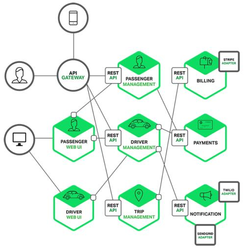

## 前言
在过去的这几年内，微服务已经成为一种非常重要的软件架构趋势。微服务架构并不是一种全新的软件实现形式，它是多种在以前比较成功的软件设计思想的集大成者。比如它里面其实包含了敏捷软件开发的思想，面向服务的架构思想，API 优先的设计思想以及持续集成持续测试持续交付等软件设计和交付的思想。

所以我在这里也想梳理一下对微服务的一些思考，部分内容来自一些外文书籍，我感觉这部分内容还是要直接读外文数据会得到更真实可靠的思路和解读。

所以微服务到底是个什么呢？

在我看来这肯定不是一两句话能说清楚的，如果只有一两句话来表述微服务，那么这个表述肯定是片面的，并不是微服务的真正面目。但是所有的微服务架构都应该有一些共同的特征。

## 微服务架构有什么特点呢？

1. 微服务的架构设计应该是去中心化的，微服务架构是去中心化的一种设计，是一种分布式的系统。微服的架构并没有统一的数据模型或中心数据库。一个微服务有它自己的数据模型，微服务也通过很多种方式来做到去中心化，比如说它可以独立的去部署，它可以去独立的开发管理和运维，这些方面都可以做到这个去中心化。微服务不再是一个大集体统一做的事情。
   
2. 微服务架构中的不同组件应该是相互独立的，微服务架构当中不同的组件可以被修改、更新或者替换，而不影响整体的服务。所以说这里这里面一个重要的特点就是微服务之间是相互独立的，它可以独立的进行服务的升级发布，更新替换。

3. 微服务架构中每个微服务组件应该被设计为处理特定范围内的事情，这也是 Unix 设计哲学中所指的：Do one thing and do it well。就是每个微服务组件它都是只做它能做的这部分服务，聚焦于在它的一个特殊领域的一些事情去做，而它只需要把它这一块的事情能够做好就可以了。如果一个组件被加入了很多的功能，那么就应该进行拆分。另外也有一些情况是不应该拆分的，如果功能非常小而且功能间的影响相对较小，那么多个功能应该合并在一个模块中而不需要拆分。但这个功能大到一定程度的时候，这个服务就应该被拆分成多个更小的服务。

4. 多语言特征，所有的微服务架构它在设计之处就没有说在语言或者框架上统一，它应该是可以允许每一个团队可以选择他自己擅长的语言或者开发框架去开发服务，这样可以高效的利用每一个语言或者框架的特点，把服务的功能或者性能做到一个较高的水平。所以这里我想说的是在很多场景中说开发一个微服务框架来统一开发的思路是有问题的，是违背微服务设计原则的。

5. 微服务的另外一个特点就是黑盒，我们叫 black box，每一个独立的微服务组件被设计成了一个黑盒子，它把它的一些细节封装到里面，它的它的一些细节和复杂性啊，它复杂的细节都弄到这个里面，所有的服务之间的交互都是通过而定义API，然后去交互。
使用API的方式去避免这银行的或者是隐藏的一些这个依赖关系。

6. 最后一个也是最重要的特点：你构建它，你来运营它。这就是 devops 原则，服务的开发团队对他们自己开发的服务是最熟悉的，所以他们应该负责整个服务的构建、开发、构建、运营和维护管理。它可以帮助开发者，更接近于它的真实用户，缩短整个服务链路，更快更敏捷的响应客户需求，迭代更新。

实际上这是微服务特点中最重要的一点，如果没有这一点，微服务就不能叫微服务了。系统设计很大程度上会受到这个组织架构的影响。实际上我们的公司管理和团队管理也是这样的，让每个团队独立完整的负责某项工作，要负责到底。

所以微服务的基本特征，总结起来主要就是以下几个：
1. 去中心化的。
2. 微服务之间是相互独立的。
3. 每一个维护只做一件事情，把这一件事情做好。
4. 支持多语言、多框架。
5. 微服务是黑盒子的，只为服务之间的交互都是通过API区域交互的最后一点微服务，
6. 微服务要有完整生命周期管理：你开发、构建，你来运营，最后一点也是非常重要的一点。

## 采用微服务之后的优势在那里体现
如果我们采用了微服务，那么微服务可以给我们带来哪些优势呢？这里我也根据目前微服务的发展进行了梳理总结。

1. 可以带来更好的敏捷性。就是有了微服务之后，它可以让不同团队之间有很好的边界性，每一个团队负责不同的服务，可以进行独立开发。让每个团队聚焦在自己擅长的领域或者自己专业的领域里面去做，把这一块的事情和服务能力建设的可以更快，可以以更灵活，更快捷的开发周期去做服务的开发运营。从而大大的提升了输出效率。所以这里面说的为微服务能够去解决的问题，其实是可以更大规模的组织人员去产生，并且相互协作，开发更为复杂的系统，解决更加复杂的问题。

2. 可以带来更强的创新能力。微服务架构的实施，让每个团队得到了很大的自由，服务和服务之间是有服务边界的，通过API进行交互。那在服务内部就可以自由的去选择合适的技术，合适的框架，合适的工具，合适的语言去做开发，并且在某些领域上还低成本的可以做一些新的尝试和设计。
这样其实在培养一种 owner 意识，主人翁意识，让每一个团队在对自己的服务负责，能够让他更专注于服务的研发，专注于服务的思考。这个带来的一个好处是显而易见的，原来大家都在同一个项目去做事，这个项目中会有很多的纠纷问题，比如：你写的代码覆盖了我的代码，你的功能和我的功能会不会有重合的地方？会不会有更好的实现方式等等。
现在有了微服务，彻底打破边界，你做你的我做我的，我们之间交互都是通过API交互，那就少了很多这种纠缠在一起说不清的问题。每个团队负责自己的模块，模块的研发周期就可以大大缩短，我不再考虑其它模块的测试成功还是失败，我只考虑我的模块测试成功和失败，我都模块提供的功能是不是达到了我的预期就OK了？在这种情况下，因为我的这个模块相对独立的，我可以采用更好的技术、更好的方法或者更好的一种架构，而且可以独立快速的测试验证。从而大大降低了整个系统的试错成本和创新成本，提升了整个组织的创新能力。

3. 可以带来代码质量或者软件质量的提升。每一个模块在独立开发的时候，代码量和系统复杂度会更小，设计的架构也更简单。因为它的体量的小，我们可以对这个模块进行更好的设计和优化，还有就是一些代码的管理单位更小，一些小的组件做好之后，是可以重复使用的。

4. 服务的伸缩伸缩性会更好。因为对构建大型的服务系统来说，把这个服务拆分成为微服务之后，每个服务相对独立，那我们就可以对每个服务中心单独的垂直和水平的扩所容。我这里说到的只是微服拆分之后，每个微服务都可以进行非常好的水平伸缩。这种对小服务独立伸缩的能力，让系统的灵活性和服务能力会更强。水平伸缩相对于垂直扩所容，水平工作人会有很大的优势，就直接加机器，或者说是直接加服务实例即可。这种扩展可以而自动化的去做，相对的实现难度更小。
   
5. 带来更好的服务扩展性。服务的拆分，让服务能够独立。那么服务的可替代性和服务的能力扩展就可以更好的实施落地。不用在单体架构中做整体扩展，而只需要在某些服务上进行独立扩展能力就可以了。

6. 更好的服务可用性。由于采用了微服务架构，服务是相互独立的，这样对每个服务做服务容错，服务隔离都相对比较容易，在单体架构的时候，你要隔离就要把整个服务都做隔离，而在微服务架构之下，只需要对出问题的服务或者你想隔离的服务进行隔离就可以了。相关的技术有服务健康技术，缓冲技术，仓壁技术，熔断技术。这些也是在微服务架构体系来梳理出来的比较完整的服务控制技术。

## 总结
1. 微服务架构的目标一定是解放生产力，是在现在软件开发发展需求下的一种新的生产关系，它可以有效的提升现代软件开发效率。微服务架构是现在企业进行复杂软件开发的一种模型，在这种模型下可以组织起更为庞大的生产力，应对更为复杂的软件系统研发，解决更为复杂的问题。
2. 微服务的落地是需要一些基础设施来帮助的，如果没有这些基础设施就急着拆分服务，那么不但不会提升效率，反而会降低生产效率。
3. 现代企业软件开发在不断的把一些原本需要特性开发的能力下沉，下沉为基础设施能力，我们可以称之为`新基建`。
4. 读国内微服务相关书籍和原文的相关书籍，给我一个非常大的认识：我们的整体理论创新还在起步阶段。之前我认为国内的技术在一定程度上追赶上了美国等一些国家，但是读过整个领域内的相关书籍之后，我发现：国内的同仁们在体现吃苦耐劳的精神非常出色，而且在工程落地能力上也是世界一流的，但是，但是在系统设计理论的梳理，创新上还是刚刚起步。

## 参考
1. 《微服务在亚马逊云上的实践》

看完本文有收获？请分享给更多人

关注「黑光技术」，关注大数据+微服务

