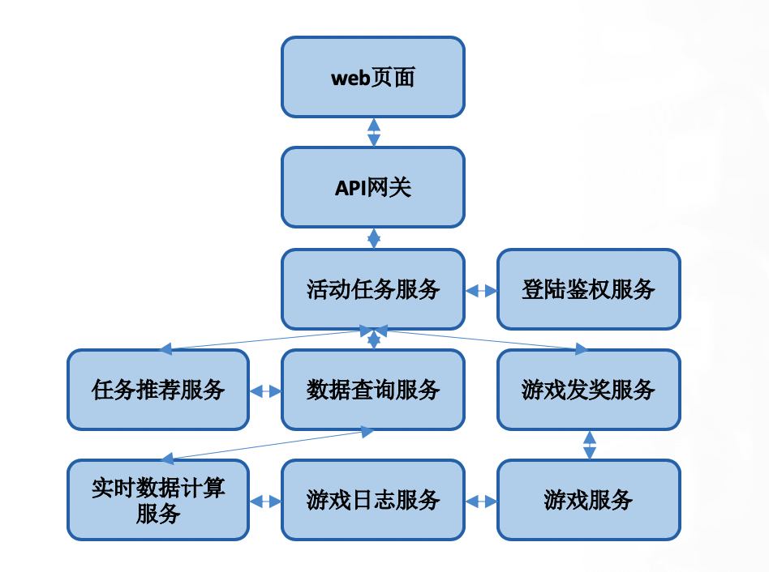

+++
title = "微服务的架构适合你吗？微服务为何而来？"
date = "2020-03-28T18:47:08+02:00"
tags = ["microservices","DevOps"]
categories = ["sevicemesh", "microservices"]
banner = "img/banners/ms.jpg"
draft = false
author = "helight"
authorlink = "http://helight.cn"
summary = "最近拾起了基本英文的讲微服务的书，一方面是学习英文，一方面也是想原汁原味的了解一下外国人口中的微服务是怎么样的。所以这篇文章是想聊聊微服务，聊聊我眼中的微服务，和实践微服务中的一些经历。也是这么多年实践微服务的一些思考。"
keywords = ["microservices","微服务", "架构", "单体", "DevOps"]
+++

## 前言
最近拾起了基本英文的讲微服务的书，一方面是学习英文，一方面也是想原汁原味的了解一下外国人口中的微服务是怎么样的。所以这篇文章是想聊聊微服务，聊聊我眼中的微服务，和实践微服务中的一些经历。也是这么多年实践微服务的一些思考。

## 大家认为的微服务
先来聊聊我在面试中遇到的微服务。

1. 在公司做通道评委的一个好处就是可以看到不同部门同事形形色色的工作内容，这是一个非常好的机会，能了解公司其它部门业务详细情况的机会，在这个评审工作中，你可以详细的问这些同事的工作，甚至让他给你看看代码。评委通常会从几个问题点来问问题：
   1. 你项目的系统架构是什么样的
   2. 你的项目有什么技术难点的
   3. 你的项目和公司内同类项目，或者业界项目有哪些优势

这种情况下面试者准备的东西也很多，于是很多时候就会出现直接套用当前比较火的技术名词，百度，google 看看，只要有点意思就会：哦，我原来做的和这个技术很像啊，原来我们在搞这么高深的技术。微服务就是其中一个。我在多次的评审工作就遇到一个做业务活动的同学指着自己ppt上的一个网站架构说这就是微服务。我把一个大服务，分成了几个服务独立发布，再在前端统一整合起来，采用了微服务架构。这说的好像也没问题。。。

2. 在面试的时候我也经常会问面试者这样的问题：
   1. 你的系统数据流图画一下，你的系统模块架构图画一下
   2. 你认为你项目的技术难点在哪里
   3. 和同类项目比，你的优势在哪里

这里也会听到各种各样的回答，有的说，我修改了 nginx，让它做服务网关；或者说我自己用 golang 开发了一个自己的服务网关，让整个服务采用了微服务架构；我把这个后台模块拆分成了 5 个小模块，采用了微服务架构。。。好像说的也是没什么问题。

到底一个qps流量只有几百的小网站把后台拆成多个模块叫不叫微服务架构呢？或者写了一个网关亦或架设了一个 nginx 来代理后端多个服务的流量叫不叫微服务？或者把后台模块拆成了几个小模块叫不叫微服务呢？

## 微服务是因为什么而出现的
一种技术不可能没有原因的就出现了，也不可能没有原因的就火起来。所以我认为我们首先要思考的是微服务是为什么而来的呢？为什么早期的软件设计中没有这个概念呢？我在上学的时候学习的软件设计方法都是 UML，面向对象的软件开发，学习设计模式。架构都是 MVC，Slave-Master， C/S。。。前几年在学习 golang 的时候我还用 [golang 把 23 中设计模式](https://github.com/helight/go-patterns)参考 java 的实现都重新实现了一遍。

从我的理解来尝试解答这个问题：微服务架构为何而来？

我认为主要有以下 3 个主要原因：
1. 软件系统变得越来越复杂。
2. 软件需求量大增，需要让更多的开发人员低门槛的进入开发。
3. 大型软件的交付周期加速，软件平台化交付的需求增加。

### 软件系统变得越来越复杂
首先，目前在企业级的应用中，软件系统是在越来越复杂，动不动千万级，亿级访问量的软件服务越来越多，尤其是 4G 移动时代的到来，让以往的软件开发模式有了较大的挑战，以我之前在做大搜索的例子来说，整个搜索引擎由100多个大大小小的模块组成，有些部署个几台机器，有些部署上千台机器，其中的调用关系更是错综复杂。

如果你说搜索引擎这个例子是太大了，在非 4G 时代已经就这么复杂了。那么我们来说说其它的软件服务，微信，QQ 也很大很复杂，我们也不论。就说说游戏的活动系统，比如说一个游戏的领奖活动。如下图：

这也是简单画了其中依赖的服务模块，而不是全部的服务，目前全部设计的服务模块加起来要有 30 个左右。大家不要惊讶，这其实已经很少了。而且这只是一个常见的游戏网页活动的涉及到的模块。主要因为还是现在企业级的软件不像以往的单机软件了。今天看到一个帖子说经典游戏《魂斗罗》的整个编译后的程序只有120kB，而且里面包含了那么多声音和关卡，想想现在随便一个手机软件都是几十兆起步呀。

现在企业软件的开发主要考虑的大并发，多地域的云上服务。就连微软的 office 也在走这个路子。而且软件服务模式也变了，以往大多数是以购买 key 的方式，而现在是云上持续的内容付费服务。通过在云山不断的发新内容，让用户不断的消费。客户端依然已经只是成为了一个渠道。所以企业软件的发展模式就走向了轻客户端重服务端。这也要求了服务端的服务能力和服务内容能够快速更新变化，很多内容是每天变，实时变。软件的功能升级节奏也是要求更短更快。

所以需要一种新的开发模式来支持这样的软件开发。

### 软件需求量大增，需要让更多的开发人员低门槛的进入开发
现在整个社会已经被软件吞噬，这一点都不夸张。如果说十几年前使用软件和接触计算机还是个稀罕事，那么现在如果你不会使用软件才会是一个稀罕事。我们的生活的各个角落都是软件，进小区大门，去饭馆点菜吃饭，支付，打车，坐公交。。。。离不开，真离不开。

由此而来的也是大量的软件人员的持续投入，大量培训后的程序员在走向软件开发行业。如果说早先会写代码的黑客们都是顶级大牛，那么现在很多的被培训后的程序员只能是蓝领劳动力提供者。而事实上也是如此，大牛们在不断的减低软件开发的门槛，从开发语言，开发的IDE，到开发的操作系统。都在一步步走向有更好的开发体验，更低的开发门槛。这使得软件开发可以更为普及，你只需要知道你要做什么即可，不用像以往的大牛们对底层系统，甚至是底层硬件都熟悉的不得了。而现在，呵呵。。。。当然现在高级程序员也是有的。

所以这种需求驱动之下，需要新的软件开发模式来可以让更多的程序员可以接入开发，像上面的图中，或许前端的 web 开发的人只需要知道 web 开发的知识就可以了，不需要知道推荐，实时计算和发奖支付的逻辑。分工在逐步的细化。

### 大型软件的交付周期，软件平台化交付的需求增加
这个是不言而喻的，企业级的大型软件为了使用用户和社会的快速变化的需求，就需要有一种能力：快速的内容和功能更新。这也是现在微服务架构中最引以自豪的就是这一点，单个功能的快速迭代。

## 微服务架构 VS 单体架构
微服务架构和单体架构是软件实现的不同方式，当然单体架构出现的要比微服务架构早。但是这并不是说微服务架构就一定比单体架构好，架构没有好坏之分。好坏之分在于架构是不是适应业务的需求。

所以下面我们先来看看微服务架构和单体架构各自的优势，其实在一定程度上微服务架构的优势都是针对单体架构提出来的。
### 微服务架构的优势
先来看看如果你采用微服务架构，会得到哪些好处。
1. 微服务架构可以让开发者使用多种语言开发，多个开发者同时参与一个项目的时候，他们可以使用微服务架构而采用各自非常熟悉的开发语言进行快速高效的开发，让开发进度更快。
2. 可以让不同的团队独立的去管理服务，基本上每个服务可以有自己独立的开发和发布节奏，每个开发团队负责自己的这个模块的开发和发布就可以了。在一定程度上减少了依赖。
3. 可以针对同一个服务的不同版本同时进行线上发布。其实这个在单体服务里面也可以做到，但是在这个不同团队去做的时候，他可以根据网关路由，针对不同的服务可以用不同的版本。就是同一个服务也可以有不同的版本，同时进行服务。
4. 可以让你对独立的服务和模块进行独立的扩容，就是比如说登录组件，那么容量不够的时候只要对登录模块进行单独扩容就可以了，而不用对整个服务进行整体扩容。
5. 可以独立的做安全管控，比如说这个服务只允许那些服务来访问，在独立的模块上设置独立的安全策略，让某些服务来访问就行了，而不是对所有的这个内部服务开通管理。

### 单体架构的优势
那接下来我们再来看一下单体服务的优势。
1. 首先就是它的安装和部署，相对来说没有微服务那么复杂，要关心多个模块之间的依赖关系。
2. 统一配置，服务整合在一起，那么很多相同的配置就只需要配置一份了，对服务的管控可以更统一。
3. 升级维护简单，只要升级这一个服务啊，并不需要对服务的各个组件都要逐个升级。
4. 扩容更方便，扩容的时候只需要扩容这一个模块就行了，不需要细分到扩容那个模块。
5. 调试更方便，所有的日志，可能就打在一台机器上，调试的时候只要看一个地方的日志就可以了。微服务的调测：看关系链，看日志是个很大的问题。
6. 启动时间总体上来说会更短，拆分的服务会有互相依赖，所以一套微服务架构的系统启动速度是个问题，要等待几乎所有的模块都准备好了才能对外服务。
7. 服务调用时间会更短，这个就不用说了，微服务间是以远程调用为主的，而单体架构是函数级调用，这个个想想就知道了。
8. 代码管理维护会相对简单。

## 你的哪些项目不适合微服务架构，如何选择架构

疯狂的石头，疯狂的微服务，在每个人都为微服而疯狂的时候，我们都要冷静下来去想一想，思考一下微服务到底适不适合我，适不适合我这种场景，从我上面的这个分析来看，微服务，非常适合于大团队，大项目，对于你一个人就可以搞定的项目来说，最好还是单体架构，比如说你个人负责整个服务的一个后台服务，那后台服务里面可能有 4，5 个功能，那你这 4，5 个功能其实没有必要拆成为微服务去做。因为服务的拆分必然会增加服务维护成本，所以大家一定要在收益和付出的成本之间进行平衡。这里也不是一定说不要拆，合理的拆分是有必要的，但是能合并的一定要尽量合并。千万不要为了微服务而微服务。

而对于多个团队共同来负责开发的项目，这个时候，就很有必要引入微服务，每个团队负责不同的模块。以此来构建整体的服务，再通过服务网关对外服务。

这种情况下的拆分是跟组织架构有关系的，一定是不同团队负责不同的模块，而每个团队只需要对自己的服务模块进行负责，进行功能开发的，更新发布，他有自己的开发节奏。

## 总结
在微服务的开发过程当中，大家容易出现这种一叶障目的情况，大家只看到微服务的好，但是没有看到微服务带来的这个成本。这个时间在 isito 的架构变迁中有很好的验证，在早期的版本里，它是微服务架构的的，但是在最[新的 1.5 版本里面，改成了单体架构](http://www.helight.cn/blog/2020/when-not-to-do-microservices/)。这是为什么呢？因为 istio 里面所有的组件都是在一个仓库里面，而且这些组件，都是由同一个 isito 团队的成员维护的，并没有形成多个团队。另外作为一个服务我们要讲求开发体验，如果你的部署维护成本太高，这就意味着你的使用成本和门槛很高。而采用这个单体架构之后，至少比之前大大简化了服务的部署和维护成本，使用体验和开发体验上就有很大的提升。

最后，我们的目标是采用合理的架构，解决你的问题，而不是为了引入微服务，另外大家在采用微服务的同时一定要看看我上面的微服务的优点，更要看看单体架构的优点。

看完本文有收获？请分享给更多人

关注「黑光技术」，关注大数据+微服务

