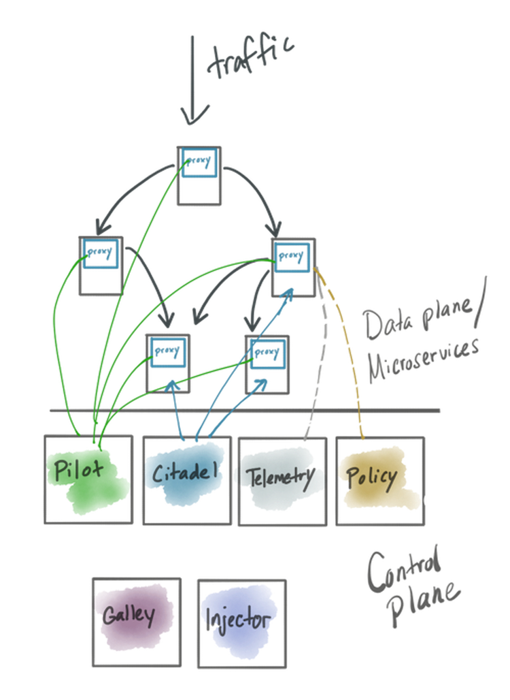
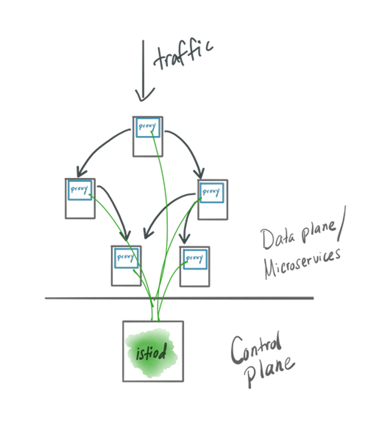

+++
title = "【译】以 Istio 为例来看什么时候不要拆分微服务"
date = "2020-02-04T13:47:08+02:00"
tags = ["istio", "microservices"]
categories = ["sevicemesh", "microservices"]
banner = "img/banners/istio2.png"
draft = false
author = "helight"
authorlink = "http://helight.cn"
keywords = ["istio","microservices", "sevicemesh"]
+++

作者过去5年来都在投入和帮助团队组织进行云原生开发。优化提升团队（甚至是公司）加速软件交付的技术是严重首人员，过程甚至是技术决策的影响。在应用程序架构成为软件交付瓶颈的时候（由于人员/流程/技术等因素影响），微服务算是一种合适的解决方案，它可以快速的做出修改。但是[这也不是唯一的途径](https://blog.christianposta.com/microservices/when-not-to-do-microservices/)。
<!--more-->
    微服务不是 “应用程序架构的乌托邦”。

作者在其博客上写过很多文章，有很多团队还没有准备好使用微服务，微服务使用中的难点，以及使用微服务应用中的一些技术点。甚至作者还写了一本关于关于微服务的书。

尽管很多公司都已经在使用微服务了，但是别碰微服务可能是做好的。

## 如果你已经上了微服务的船

如果已经上了微服务的船，要在微服务不适用的一些地方，一定要明确出来。纠正错误可能就是产品成功的正确方式。

## 正确对待微服务不适用的情况

尽管意图是好的，在你开始微服务的时候正确的做法就是返回单体架构，甚至或许有正确的理由使用微服务。如果你还在犹豫或者设计场景有变化，现在返回使用单体架构也是 ok 的。

`Istio` 社区构建了一个服务网格的方案来实现微服务通信，它的控制平面逐渐从一个微服务架构实现演变成了一个更为单体的架构实现。Google 的 API 基础设施首席工程师和架构师在 2019年的 KubeConNA 大会上做个了一个演讲，在一个设计文档中揭露了设计的详情和案例。从 `Istio` 1.5（预计在2020年2月中，目前看是到3月中了）开始，我们就会开始看到有一个模块 `Istiod` 的实现，这里面把之前所有的拆分的各种微服务的功能合并到一个单一模块中，并做单一部署。

`Istio` 被用于解决因为引入了微服务或者云架构带来的应用程序网络通信问题，那么为什么 `Istio` 本身却放弃了微服务架构呢？最直接答案就是：

    微服务实现的复杂性证实了它没有实现预期的价值或者目标。相反，它是在背离这些目标。

对于 `Istio` 项目来说，采用单体实现可以更好的实现这些目标。下面我们详细看看。

## 以微服务架构来实现 Istio

`Istio` 是一个开源的服务网格实现，它的架构设计和其它服务网格实现类似，都是有一个控制平面和数据平面，数据平面包括一组代理，代理和每个应用程序实力在一起，并且是访问应用程序的必经之路。控制平面是在请求路径之外，用于管理和控制数据平面的行为。

过往，`Istio` 的控制平面都由独立部署的服务组成的，如下所列：

* Pilot - 核心控制平面配置服务（xDS）
* Galley - 配置监视，验证和转发服务
* Injector - 负责自动注入数据平面和安装启动
* Citadel - 证书签发，密钥生成，集成了 CA 功能
* Telemetry - 一个 `mixer` 组件，负责对各种手段服务进行联合遥测和数据汇聚
* Policy - 请求路径 `mixer` 组件，负责执行加载策略

这些服务有一组操作定义来配置和协调驱动，以服务和指挥数据平面。

## Microservices benefits 微服务的好处

采用微服务可以让你的组织通过减少依赖而更快的对系统做出变更。在微服务架构之下，每个服务都可以被独立操作（每个服务都可以有一个团队负责），并且有它自己独立的发布节奏/生命周期。这可以是的开发人员和运维人员并行工作，不用为了变更而同步协调而互相等待甚至死锁，这样让服务的发布和功能开发都变慢了。

另外一个服务会被进一步分解的原因是它的使用模式和伸缩特性。例如，一个有较多读写操作的服务，把读写拆分开可能是有必要的，因为读通常需要更多的内存（可能需要跟多的缓存空间来让加速读），而写操作可能更多需要存储或者网络开销。比如，可以把服务中读的部分独立到一个机器或者机器配额，让它可以独立伸缩（多数情况下是内粗），然后把服务中写的部分独立到另外一个有 SSD 或者优化了 EBS/SAN 的机器上。

你为什么把一个应用拆分多个服务的其它原因：

* security concerns：安全角度考虑
* domain grouping：按域分组
* different language optimizations：不同语言优化
* criticality of service：服务边界

采用微服务架构首先要考虑的点就是其复杂性。当把一个大的单体拆分成一堆小服务，并且要让他们们相互通信（关注优化），你就直接增加架构的复杂性，同时也增加了支持其运行的基础设施的复杂性。

必须认真权衡这些优势。如果不是，你最好对你的设想进行评估并且修正。这也是现在 `Istio` 项目在做的事情。

## Correcting course 如何修正
首先要知道的是谁开发和操作服务架构？在 `Istio` 社区，项目中不同的组件是由不同的工作组负责的。而从另一方面，下载和操作 `Istio` 安装的都是同一波人。实时上，就目前来看单个团队（甚至是一个人）在操作 `Istio` 控制平面。从某些方面来说，如果作为一个大的 SaaS 来运行，把 `Istio` 控制平面拆为一组为微服务是比较好的，但是就目前的使用方式来看，并不是那么回事。

其次要知道的是如何做发布？服务可以独立发布吗？对于 `Istio` 来说，答案是*理论上可行*，但是实际上是不行的。当 `Istio` 的新版本发布的时候，你需要更新部署所有的控制平面组件。

最近，在 `Istio` 中，你可以问：对于不同的组件，它们的伸缩性控制变量和安全问题是不是统一的呢？真实的答案是它们并不统一。在 `Istio` 的设计文档中，在 `Istiod` 部分可以直接看出：

    `Istio` 的大多数组件都不是这样的，但是控制平面的消耗主要就是一个功能（服务 XDS）。通过比较其它每个控制平面功能都有一个边际成本，所以没有价值拆分开。

对于安全来说，所有的控制平面服务都有相同级别的权限：

    今天的情况并非如此，因为Mutating Webhook，Envoy Bootstrap 和 Pilot 所执行的控制力，在许多方面都和 Citadel 类似，所以对它们的开发几乎有相同的消耗。

根据 `Istiod` 的设计文档中的说法来看：复杂是万恶之根源，或者是如何学会停止忧虑而爱上单体架构。

`Istiod` 是单体架构的一个体现，它集成了之前版本的所有功能到一个模块中，以此减低了复杂性。注意组成之前控制平面的服务仍然是以子模块的方式存在在项目中（比如包括了边界定义和服务契约），但是操作体验改进了。操作人员现在要操心如何运行和更新一个二进制而不是一组服务了。

对于 `Istio` 采用单体架构的控制平面，一堆复杂的问题被减少了，而这些复杂问题没有什么太大的回报：
* 安装和更新一个服务的部署变得简单了
* 配置的复杂性减低了，再也不需要通过配置来编排服务
* 更容易 debug 问题了（在一个模块中看问题对比在多个模块中看问题）
* 提升效率，减少传输开销，比如共享缓存

更多详情可以看 `Istiod` 的[设计文档](https://docs.google.com/document/d/1v8BxI07u-mby5f5rCruwF7odSXgb9G8-C9W5hQtSIAg/edit#)。

还有一个ppt：[可以看看我做的这个 `Istiod` 实现的例子](https://www.youtube.com/watch?v=QD115XiBXwY)，在 `Istio 1.5` 中会发布。但请注意，这个例子还是 `Istio` 构建的早期版本，还没有开发打磨到真正线上可用的地步:)

## Conclusion 结论
非常高兴能看到 `Istio` 社区在不断的改进它的可用性和可操作性。把 `Istio` 的控制平面做成一个单体架构部署对这个项目来说很有意义。有什么东西对你的项目也有意义吗。如果有你会考虑去做吗？你是否在考虑你微服务架构（还有相应的基础设施）的复杂性和价值比呢？并且以此来确定修改实现的时间。

​英文原文：[https://blog.christianposta.com/microservices/istio-as-an-example-of-when-not-to-do-microservices/​](https://blog.christianposta.com/microservices/istio-as-an-example-of-when-not-to-do-microservices/​)

看完本文有收获？请分享给更多人

关注「黑光技术」，关注大数据+微服务

