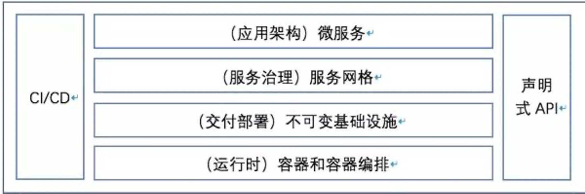
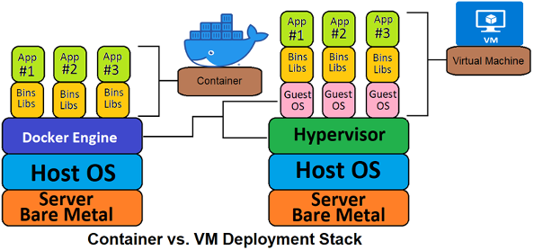
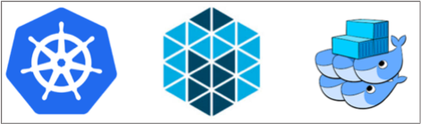
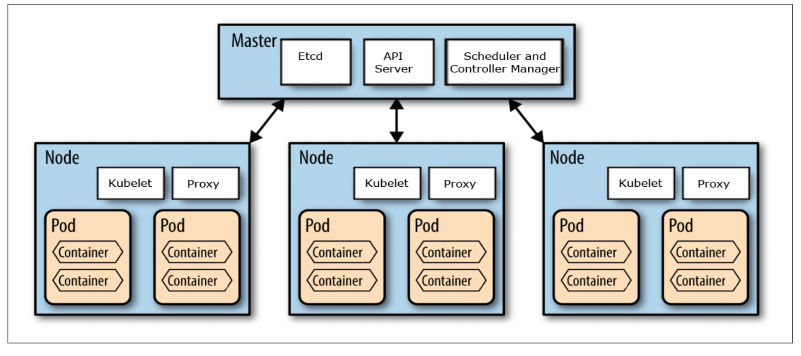

## 前言
9 月初给 BG 的新人开了一门课，专门来讲云原生技术，云原生技术从出现到现在按最早的时间出现来说也是有 10 多年了。尤其是这几年火热的不得了，但是 cloud native 这个外文词翻译成中文 “云原生” 就更加的不好理解，再加上本身这个词的定义在发展中又有多次的变化，导致很多学习这块技术的同学都感觉是云里雾里，不知所谓。

所以根据我对这门技术的认识，我开了这门课，一方面我认为我的认识还算比较到位，另一方面我认为目前的新人必须要学习和了解云原生技术，这是目前底层技术发展的大趋势。非常有必要学习和了解，而且我在内部也是致力于推动云原生技术的落地。在推动的过程中也很费劲，很多人看不到这场技术变革的意义和价值，这是非常让人感慨的。

## 云原生技术架构
所以我继续接着上篇解读什么是云原生。这里要接着上面篇文章中的图来继续解释，如下图

这张图较为清晰的展示了目前云原生架构的基本层次，从最下面的运行时到最上面的应用架构，再辅助于CI/CD的持续思想以及现代编程接口方式：声明式API。层次结构都非常清晰，容易让人理解。所以下面的介绍也是围绕这个图来进行的。

## 运行时技术：容器技术
容器技术从根本上来说是一种虚拟化技术，如果大家使用过容器就知道，在应用层面上，我们都会认为容器就是一台独立的机器，上篇文章中所说的申请 0.5 核 512M 的资源，让我们感觉就是我们获得了一个 0.5 核 512M 的独立服务器。

但是提到虚拟化技术，这个是由来已久的一个技术了，也是发展了很多年的一个技术，我接触过的就有 vmware，xen，quem，kvm，docker。从发展历史和实现思路上来说虚拟技术可以分为 2 类技术：
> 1. 全虚拟化技术
> 2. 半虚拟化技术

### 全虚拟化
全虚拟化(FullVirtualization)也称为原始虚拟化技术，该模型使用虚拟机协调Guest操作系统和原始硬件，VMM 在 Guest 操作系统和裸硬件之间用于工作协调，一些受保护指令必须由 Hypervisor（虚拟机管理程序）来捕获处理。全虚拟化的运行速度要快于硬件模拟，但是性能方面不如裸机，因为 Hypervisor 需要占用一些资源。

### 半虚拟化
半虚拟化(ParaVirtualization)是另一种类似于全虚拟化的技术，它使用 Hypervisor 分享存取底层的硬件，但是它的 Guest 操作系统集成了虚拟化方面的代码。该方法无需重新编译或引起陷阱，因为操作系统自身能够与虚拟进程进行很好的协作。半虚拟化需要 Guest 操作系统做一些修改，使 Guest 操作系统意识到自己是处于虚拟化环境的，但是半虚拟化提供了与原操作系统相近的性能。

### 容器虚拟化技术
容器技术是一种相对于虚拟机来说更加轻量的虚拟化技术，能为我们提供一种可移植、可重用的方式来打包、分发和运行应用程序。通过操作系统内核的能力，对每个进程的资源使用(包括 CPU、内存、硬盘 I/O、网络等)进行隔离，达到容器里运行的进程与其他进程进行一定程度的隔离，同时避免了虚拟机(Virtual Machine)过高的额外消耗。

下面这幅图可以看出一般 VM 和容器方式的区别。

**容器提供的方式是标准化的，可以将不同应用程序的不同组件组装在一起，又可以将它们彼此隔离。**

容器的基本思想就是将需要执行的所有软件打包到一个可执行程序包中，比如将一个Java虚拟机、Tomcat服务器以及应用程序本身打包进一个包中。目前的业界标准把这种包叫做：容器镜像。也是一种较为复杂的技术，但是非常好的解决应用程序和系统的依赖问题。一般我们可以直接使用这个镜像来启动一个容器，而在现实中我们也是这么做的，把我们要运行的应用程序和运行的环境打包成为一个镜像，直接部署到集群的机器上面。并且可以指定该运行容器使用的资源（CPU，内存等）。以这种方式运行的程序和其它程序是相对隔离的。

容器方式的开发部署是具非常高的可移植性，用户可以轻松地在开发测试、预发布或生产环境中运行相同的容器。如果应用程序被设计为支持水平扩缩容，就可以根据当前业务的负载情况启动或停止容器的多个实例。

Docker 项目是当前最受欢迎的容器实现，以至于很多人通常都将 Docker和容器互换使用，但 Docker 项目只是容器技术的一种实现，还有现在的 k8s 中已经在使用 containerd 替换 Docker。现在是说的容器的内核实现是基于 Cgroup 和内核的 namespace 等技术实现的，而且目前是有标准的容器运行接口： CRI。Docker 和 containerd 都是实现了容器运行接口来启动管理容器的。

**因为具备轻量级的隔离属性，容器技术已然成为云原生时代应用程序开发、部署和运维的标准基础设置。**目前全球的云厂商都是支持容器部署方式，而且是主流方式。总结来看使用容器技术开发和部署应用程序的如下好处。

>1. 容器的轻量带来了容器本身创建和启动速度非常快捷，而且管理成本和稳定性更好。以此带来了开发的效率提升。
>2. 因为标准化，所以可以很好的实现自动化，很容易做到 CICDCO。
>3. 目前部署都是使用镜像部署（下面会详细说），容器的创建和启动都是依赖于统一的源头，所以在较高的程度上保证了部署各个环境各个部署的一致性。
>4. 可移植性：标准化的容器镜像可以保证应用程序运行于 Ubuntu、CentOS 等各种操作系统，在不同厂商的云环境下也可以轻松的跑起来。
>5. 实现了资源隔离：容器应用程序和主机之间的隔离、容器应用程序之间的隔离可以为运行应用程序提供一定的安全保证。

每个运行的容器都是可重复的； 包含依赖环境在内的标准，意味着无论您在哪里运行它，您都会得到相同的行为。

容器将应用程序从底层的主机设施中解耦。 这使得在不同的云或 OS 环境中部署更加容易。

**容器技术大大简化了应用程序的分发和部署，可以说容器技术是云原生应用发展的基础。**

## 运行时技术：容器编排技术

**有了容器技术做应用程序的分发和部署就万事大吉了吗？还有没有其它的问题？**

答案是显而易见的，首先带来的问题就是容器的管理问题。上面我们说的 Docker 只能解决单个机器内多个容器的管理问题，而且还相对比较粗糙。**现实世界中我们是以集群为单位来管理的，一个集群上千台机器是非常常见的，而且还有上万台机器的。那么这种情况下我们怎么管理这么多机器上的容器呢？**

### 容器编排发展 
所以容器的编排技术应运而生，从容器诞生起就有在做这方面的工作了，主要的有 Mesos，Swarm，Kuberneters，另外还有其它小型的就更多了。而且现在有了 CRI 标准，实现一个简单的容器调度管理服务也不是太复杂，曾经面试过几个大学生，大学期间就参与过这类项目的开发工作。一般主要是针对一些特殊环境的定制开发。

Kubernetes 源自Google 15 年生产环境的运维经验，同时凝聚了社区的最佳创意和实践。从 Mesos，Swarm，Kuberneters 三个开始争夺天下，到最后 Kuberneters 一统天下也就不过 3 年时间。而且目前 Kuberneters 的开源社区非常活跃，我们本人也参与了 Kuberneters 社区的 2 个项目：
>1. 社区文档项目：我主要参与中文文档的翻译和review。
>1. Dashboard 项目：我主要参与了中文化的翻译和其中部分我们公司内使用中遇到的一些特性增加和 bug 修复。

目前云原生技术的基础底座技术就是容器技术和 Kuberneters。

**目前 Kuberneters 是事实上的主流容器编排引擎。Kuberneters 很多时候也直接简写为 K8S。**

## Kuberneters

Kuberneters 的架构非常简单清晰，但是功能也确实非常强调，这里可以看看它的基本架构。

下面我简要的说一下 K8S 架构中的各个模块。
### Master
Master 是 K8S 的核心，是整个系统的指挥中心。它不是一个模块，而是由多个模块组成的。主要有 Etcd，API Server， controller-manager 模块组成。

#### API Server

其中最为核心的就是 API Server。所有对外对内的操作接口都是对接 API Server，是整个 K8S 对外的入口。我们可以从这个模块的接口中获得整个集群几乎所有的信息，并且通过整个模块下发对集群的几乎所有的操作管理指令，也是从这模块开始对`声明式 API` 有了更深的理解，也是`声明式 API` 的一个典型实现。

#### etcd
etcd 很早我们也就在使用了，在15年的时候我们就在用，这里 etcd 的作用其实很简单作为一个内存数据库来管理 K8S 中的所有元信息、一些配置信息和中间过程信息。主要起到高可用一致性的高速存储，还有 etcd 的配置 `watch` 能力。API Server 中的大多数信息就直接存取于 etcd。

#### controller-manager
controller-manager 的主要作用是对 K8S 的扩展进行管理，K8S 设计非常好的一点就是这里，他把功能实现和元数据管理进行分离，通过 controller 的方式来实现对 K8S 能力的扩展，比如我们要扩展一些调度策略，监控等都可以采用这种方式。而且学习 K8S 必须学习 controller 的原理和 controller 的开发。

### Node
Node 节点是真正运行容器的机器或者 VM（目前大多数云厂商的做法是 VM 和容器结合使用，物理机器之上会虚拟出多个 VM，再在 VM 之上跑容器）。

在 Node 节点上也部署了几个重要的 K8S 组件：kubelet，kubeproxy，当然还有容器管理器，一般是 Docker 或者 containerd。

#### kubelet
kuberlet 是 node 节点上资源的管理（CPU，内存，存储，进程等），一般是对接 API Server，听 API Server 的话，主要进行本地容器的管理，启动容器，销毁容器等等。

#### kubeproxy
kubeproxy 的主要功能对节点上的网络进行管理，早期是作为节点网络代理，后面主要是网络策略下发管理了，关于这部分内容可以看我翻译的这篇文章：[比较 kube-proxy 模式: iptables 或者 IPVS?](/blog/2021/kube-proxy-modes-iptables-or-ipvs/)。

### K8S 的其它核心理念
K8S 对物理资源进行了很好的抽象，所以也形成了它特有的一些对象，这里我简单说几个
#### POD
Pod 是 kubernetes 中部署和调度的最小的单位（类似于 Linux 运行的进程）。

Pod的两种使用方式
> 1. 一个 Pod 中运行一个容器：该模式是最常见的用法。
> 2. 在一个 Pod 中同时运行多个容器：一个 Pod 中也可以同时运行几个需要紧密耦合互相协作的容器，它们之间共享资源。如 `sidecar` 模式，Pod 将这些容器的存储资源作为一个实体来管理。

Pod 是运行在 Node 上的，由 Node 管理，Pod 无容错性：宿主机故障pod不能自动迁移，需要通过控制器下发指令到 API Server，再选择 Node 来实现管理。

#### Workload
中文翻译为`工作负载`，可以理解为：**Workload 是 K8S 上的一个任务。** 这个任务最终可能发起一个或者多个 Pod，再在 Pod 中运行容器进行具体的执行。

K8S 对任务的类型也做了抽象，目前主要有以下集中，也可以自己扩展，扩展的方式就是上面提到的 controller。
> 1. Deployment 
> 1. StatefulSet 
> 1. DaemonSet 
> 1. Job 和 CronJob

更多关于这方面的信息可以看这里：https://kubernetes.io/zh/docs/concepts。

## 总结
对于运行时的内容就先梳理这么多，其实每一个话题都是非常大的一个话题，这里也是简单梳理了一下，让大家有一个初步的认识。

作为云原生技术的底座，容器和容器编排技术是必须要学习的。当然大家也看到了我对容器的介绍并不多，反而对容器编排技术 K8S 做了较多的介绍。这是因为目前我个人对这块研究一般，因为目前作为开发者较少直接使用容器作为开发，容器技术对于开发者来说较为成熟，所以我们了解其基本原理和使用就可以了。而且比如容器的高可用，容器本身是无法解决的，所以我们更多的是要做容器的编排研究使用，这块对不同的应用场景需要较多灵活的处理，才能解决现实的应用问题。

## 相关阅读：
[云原生技术解读1-如何理解云原生](/blog/2021/cloud-native/)

看完本文有收获？请分享给更多人

关注「黑光技术」，关注大数据+微服务

