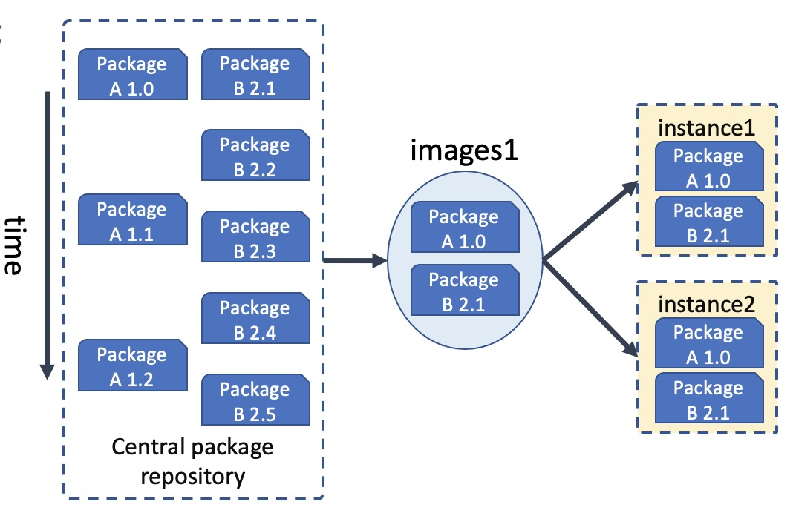

## 前言
9 月初给 BG 的新人开了一门课，专门来讲云原生技术，云原生技术从出现到现在按最早的时间出现来说也是有 10 多年了。尤其是这几年火热的不得了，但是 cloud native 这个外文词翻译成中文 “云原生” 就更加的不好理解，再加上本身这个词的定义在发展中又有多次的变化，导致很多学习这块技术的同学都感觉是云里雾里，不知所谓。

所以根据我对这门技术的认识，我开了这门课，一方面我认为我的认识还算比较到位，另一方面我认为目前的新人必须要学习和了解云原生技术，这是目前底层技术发展的大趋势。非常有必要学习和了解，而且我在内部也是致力于推动云原生技术的落地。在推动的过程中也很费劲，很多人看不到这场技术变革的意义和价值，这是非常让人感慨的。

## 云原生技术架构
所以我继续接着上篇解读什么是云原生。这里要接着上面篇文章中的图来继续解释，如下图

这张图较为清晰的展示了目前云原生架构的基本层次，从最下面的运行时到最上面的应用架构，再辅助于 CI/CD 的持续思想以及现编程成接口方式：声明式API。层次结构都非常清晰，容易让人理解。所以下面的介绍也是围绕这个图来进行的。

前面也梳理了容器和容器编排技术，这一篇，想简单再梳理一下上面一层：交付部署，不可变基础设施。

## 交付部署介质
这篇文章我们来聊一聊云原生的交付部署部分，在有了容器和容器编排之后，那下一步就是要做这块的打通，做交付，把我们的应用程序或者说我们开发的服务如何能部署到容器里面，如何能更加优雅的部署管理起来。大家也可以思考一下怎么做以及为什么。

我们交付了什么，拿什么去部署呢？这里一般有 2 种做法，我们下面来一一介绍。

## 可变基础设施
在应用开发测试到上线的过程中，应用通常需要被频繁部署到开发环境、测试环境和生产环境中。

传统运维做法：
1. 申请一台或一组服务器，运维人员通过SSH或是Agent的方式，
1. 将软件的二进制包的安装到服务器上并进行环境的配置。
1. 如果需要进行版本升级和参数变更等变更操作，就需要逐个服务器地调整配置文件，及将新代码直接部署到现有服务器上。
1. 这些服务器承载的应用和参数是可以改变的。

在传统的交付发布时代，通常需要系统管理员保证所有环境的一致性，而随着时间的推移，这种靠人工维护的环境一致性很难维持，环境的不一致又会导致应用越来越容易出错。这种由人工维护、经常被更改的环境就是我们常说的“可变基础设施”。

如下面这图所示，很多时候我们只是交付了运行的二进制包。

## 可变基础设施（Immutable Infrastructure）
与可变基础设施相对应的是不可变基础设施，是指一个基础设施环境被创建以后不接受任何方式的更新和修改。这个基础设施也可以作为模板来扩展更多的基础设施。

如果需要对基础设施做更新迭代，那么应该先修改这些基础设施的公共配置部分，构建新的基础设施，将旧的替换下线。简而言之，不可变基础设施架构是通过整体替换而不是部分修改来创建和变更的。

任何基础设施实例（服务器、容器等各种软硬件）一旦创建之后便成为一种只读状态，不可对其进行任何更改；
如果需要修改或升级实例，唯一方式是创建一批新实例以替换。

不可变基础设施的优势在于能保持多套基础设施的一致性和可靠性，而且基础设施的创建和部署过程也是可预测的。在云原生结构中，借助Kubernetes和容器技术，云原生不可变基础设施提供了一个全新的方式来实现应用交付。

云原生不可变基础设施具有以下优势：

1. **云原生的不可变基础设施以容器镜像为标准**，其中不但包含了二进制内容，还包含了程序运行需要的依赖环境，基础库，系统环境等。相对来说更加完整。

1. **能提升应用交付效率**：基于不可变基础设施的应用交付，可以由代码或编排模板来设定，这样就可以使用 Git 等控制工具来管理应用和维护环境。基础设施环境一致性能保证应用在开发测试环境、预发布环境和线上生产环境的运行表现一致，不会频繁出现开发测试时运行正常、发布后出现故障的情况。

1. **能快速、可靠地水平扩展**：基于不可变基础设施的配置模板，我们可以快速创建与已有基础设施环境一致的新基础设施环境。

1. **能保证基础设施的快速更新和回滚**：基于同一套基础设施模板，若某一环境被修改，则可以快速进行回滚和恢复，若需对所有环境进行更新升级，则只需更新基础设施模板并创建新环境，将旧环境一一替换。

## 云原生交付部署：不可变基础设施：镜像
这是镜像的宣传口号：Build, Ship, and Run Any App, Anywhere。

在这块镜像确实是做到了这一点，OCI 的成立，让容器镜像在只要符合 OCI 标准的环境下就可以使用，无论是 windows 还是 linux，包括不同版本的 linux。

## 容器镜像仓库
就如上图一样，镜像总是要保存在一个地方，这也就催生了另外一个技术专门做镜像的存储，我们叫这个技术为镜像仓库技术。解决镜像的基本存储，延伸的功能还有镜像的声明周期管理，安全扫描，镜像分发加速等等。目前提供这类服务的商业公司也有很多，同时也有免费的镜像仓库，比如 docker 公司的这个，大家可以浏览看看：[https://hub.docker.com/](https://hub.docker.com/)。

目前我们内部使用的腾讯云的 tcr，也是比较好用的，而且提供了安全扫描，镜像分发加速等能力。TCR提供安全独享、高性能的容器镜像托管分发服务。可同时在全球多个地域创建独享实例，以实现容器镜像的就近拉取，降低拉取时间，节约带宽成本。
[https://cloud.tencent.com/product/tcr](https://cloud.tencent.com/product/tcr)。

另外还有一个 [harbor](https://github.com/goharbor/harbor) 是一个开源的镜像仓库软件，你可以基于这个软件搭建自己的私有镜像仓库。

## 总结
目前来说，容器技术和容器镜像技术成为云上交付部署的标准。从应用层面来说，我们更多的是能理解这个交付思想和技术即可。目前这块的技术也是比较成熟的。所以一般应用场景中我们是直接使用现成的镜像仓库，再加上 CI 系统，打通代码和镜像仓库。像我们目前在使用 tcr，感觉还是比较好用的。

看完本文有收获？请分享给更多人

关注「黑光技术」，关注大数据+微服务

