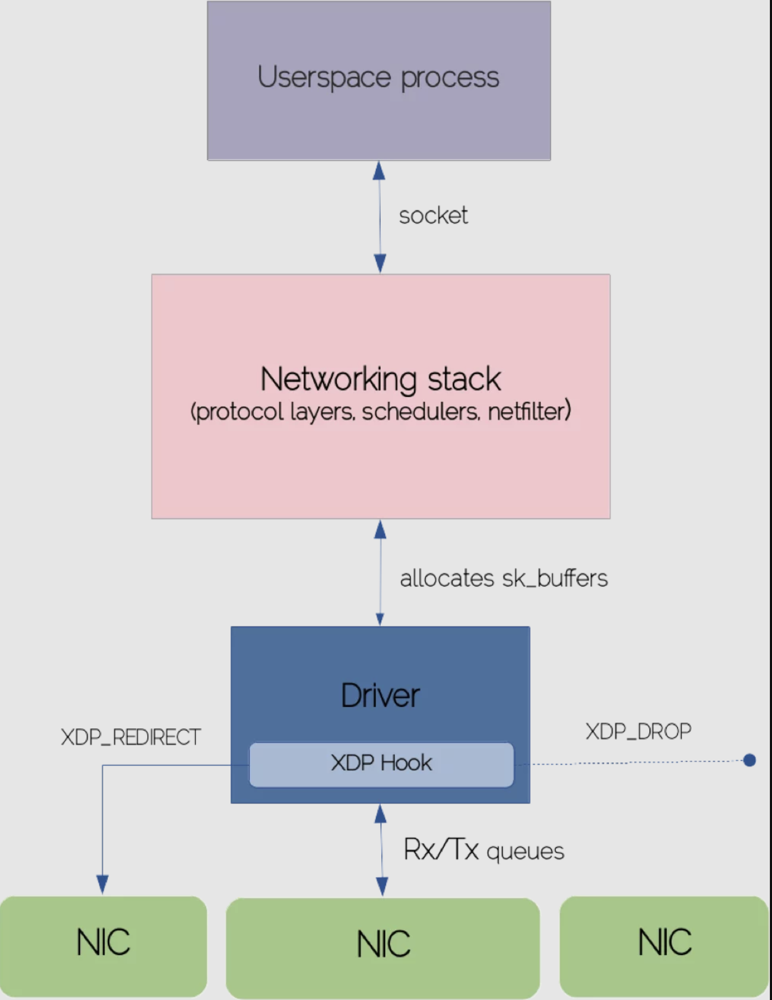

## 前言
本文是一篇学习翻译文章，[原文在这里](https://sematext.com/blog/ebpf-and-xdp-for-processing-packets-at-bare-metal-speed/)。

XDP 是一种特殊的 eBPF 程序，在数据包处理上因为在协议栈之前就可以处理数据，所以有非常高的性能。

这篇文章先在原理上对 XDP 进行了介绍，并由 2 个简单的例子来对使用场景进行说明。另外还介绍了作者所在公司的一个开源项目：https://github.com/sematext/oxdpus。里面有几个 XDP 的应用程序，有相关的应用空间程序和内核相关的代码。用户空间命令工具是 golang 写的，并且 eBPF 的操作是使用 gobpf ，对于学习了解 XDP 有帮助，命令基本可以直接使用。

## XDP 介绍
XDP 或 Express Data Path 的兴起是因为 Linux 内核需要一个高性能的包处理能力。很多绕过内核的技术（DPDK是最突出的一个）目标都是通过把包处理迁移到用户空间来加速网络操作。

这就意味着要消除内核-用户空间边界之间的上下文切换、系统调用转换或 IRQ 请求所引起的开销。操作系统将网络堆栈的控制权交给用户空间进程，这些进程通过自己的驱动程序直接与 NIC 交互。

虽然这种做法的带来了明显的高性能，但是它也带来了一系列的缺陷，包括在用户空间要重新实现 TCP/IP 协议栈以及其它网络功能，或者是放弃了内核中强大的资源抽象管理和安全管理。

XDP 的目的是在内核中也达到可编程的包处理，并且仍然保留基础的网络协议栈模块。实际上，XDP 代表了 eBPF 指令的自然扩展能力。它使用 maps，可管理的帮助函数，沙箱字节运行器来做到可编程，这些字节码会被检测安全之后才会加载到内核中运行。

XDP 高速处理路径的关键点在于这些编程字节码被夹在到网络协议栈最早期的可能处理点上，就在网络包接受队列（RX）之后。在网络协议栈的这一阶段中，还没有构建网络包的任何内核属性，所以非常有利于提升网络处理速度。

如果你没有看过我之前关于 eBPF 基础的博文，我建议你首先应该读一下，这篇我也翻译了：[基于 eBPF 的 Linux 可观测性](http://www.helight.cn/blog/2020/linux-kernel-observability-ebpf/)。为了强调 XDP 在网络协议栈中的位置，让我们来一起看看一个 TCP 包的生命过程，从它到达 NIC 知道它发送到用户空间的目的 socket。始终要记住这是一个高级别的视图。我们将只触及这个复杂的核心网络堆栈的表面层。

## 通过网络协议栈的入包

网卡在收到一帧（所有校验和正常检查）时，网卡就会使用 DMA 来转发数据包到对于的内存区域。这意味着数据包是由驱动做了映射后直接从网卡队列拷贝到主内存区。当环形接受队列有数据进入的时候，网卡会产生一个硬中断，并且 CPU 会把处理事件下发到中断向量表中，执行驱动代码。

因为驱动的执行路径必须非常短快，具体数据处理可以延迟到驱动中断上下文之外，使用软中断来触发处理（NET_RX_SOFTIRQ）。在中断处理的时候中断请求是被屏蔽的，内核更愿意把这种长时间处理的任务放在中断上下文之外，以避免在中断处理的时候丢失中断事件。设备驱动开始使用 NAPI 循环和一个 CPU 一个内核线程（ksoftirqd）来从环形缓冲区中消费数据包。NAPI 循环的责任主要就是触发软中断（NET_RX_SOFTIRQ），由软中断处理程序处理数据包并且发送数据到网络协议栈。

设备驱动申请一个新的 socket 缓冲区（sk_buff）来存放入流量包。socket 缓冲区是内核中对数据包缓冲/处理抽象出来的一个最基础的数据结构。在整个网络协议栈中的上层中都在使用。

socket 缓冲区的结构体由多个字段，来标识不同的网络层。从 CPU 队列上消费缓冲数据后，内核会填充这些元数据，复制 sk_buff 并且把它推到上游的网络层的自队列中做进一步处理。这是 IP 协议层在堆栈中注册的位置。IP 层执行一些基本的完整型检测，并且把包发送给 netfilter 的钩子函数。如果包没有被 netfilter 丢弃，IP 层会检测高级协议，并且为之前提取的协议把处理交给响应的处理函数。

数据最终被拷贝到 socket 关联的用户空间缓冲区。进程通过阻塞系统调用（recv、read）函数或通过某种轮询机制（epoll）主动接收数据。

在网卡把数据包拷贝到接受队列之后就触发了 XDP 的钩子函数，在这一点上我们可以高效的阻止申请各种各样的元数据结构，包括 sk_buffer。如果我们看一下非常简单的可能使用场景，比如在高流量网络中的包过滤或者阻止 DDos 攻击，传统的网络防火墙方案（iptables）由于网络堆栈中的每个阶段都会引入大量的工作负载，这将不可避免地给机器造成压力。

在裸机速度下的 eBPF 和 XDP 包处理流程

在网络协议栈中的 XDP 的钩子


具体上来看在软中断任务中调度顺序执行的 iptables 规则，会在 IP 协议层中去匹配指定的 IP 地址，以决定是否丢弃这个数据包。和 iptables 不一样的是 XDP 会直接操作一个从 DMA 后端环形缓冲区中拿的原始的以太帧包，所以丢弃逻辑可以很早的执行，这样就节省了内核时间，避免了会导致协议栈执行导致的延时。

## XDP 组成
正如你已经知道的，eBPF 的字节码可以挂载在各种策略执行点上，比如内核函数，socket，tracepoint，cgroup 层级或者用户空间符号。这样的话，每个 eBPF 程序操作特定的上下文- kprobes 场景下的 CPU 寄存器状态，socket 程序的 socket 缓冲区等等。用 XDP 的说法，生成的 eBPF 字节码的主干是围绕 XDP 元数据上下文建模的（xdp_md）。XDP 上下文包含了所有需要在原始形式下访问数据包的信息。

为了更好地理解 XDP 程序的关键模块，让我们剖析以下章节：
```c
#include <linux/bpf.h>

#define SEC(NAME) __attribute__((section(NAME), used))

SEC("prog")
int xdp_drop(struct xdp_md *ctx) {
   return XDP_DROP;
}

char __license[] SEC("license") = "GPL";
```
这个小 XDP 程序一旦加载到网卡上就会丢弃所有数据包。我们引入了 **bpf** 头文件，它里面包含了数据结构定义，包括 xdp_md 结构体。接下来，声明了 **SEC** 宏来存放 map，函数，许可证元信息和其它 ELF 段中的元素（可以被 eBPF 加载器解析）。

现在来看我们 XDP 程序中处理数据包逻辑最相关的部分。XDP 做了预定义的一组判定可以决定内核处理数据包流。例如，我们可以让数据包通过，从而发送到常规的网络协议栈中，或者丢弃它，或者重定向数据包到其它的网卡等。在我们的例子中，XDP_DROP 是说超快速的丢弃数据包。同时注意，我们声明了是在 prog 段中加载执行，eBPF 加载会检测加载（如果段名称没有找到会加载失败，但是我们可以根据 IP 来使用非标准段名称 ）。下面我们来编译试运行一下上面的代码。
```shell
$ clang -Wall -target bpf -c xdp-drop.c -o xdp-drop.o
```
我们可以使用不同的用户空间工具把二进制目标代码加载到内核中（iproute2 的部分工具就可以），tc 或者 ip 是是常用的。XDP支持虚拟网卡，所以要直接看出上面程序的作用，我们可以把代码加载到一个已经存在的容器网卡上。我们会启动一个 nginx 容器，并且在加载 XDP 程序之前和之后分别启动一组 curl 请求。之前的 curl 请求会返回一个成功的 HTTP 状态码：
```shell
$ curl --write-out '%{http_code}' -s --output /dev/null 172.17.0.4:80
200
```
加载 XDP 字节码可以使用下面的命令：
```shell
$ sudo ip link set dev veth74062a2 xdp obj xdp-drop.o
```
我们会看到虚拟网卡上有 xdp 被激活的标识：
```shell
veth74062a2@if16: <BROADCAST,MULTICAST,UP,LOWER_UP> mtu 1500 xdp/id:37 qdisc noqueue master docker0 state UP group default
link/ether 0a:5e:36:21:9e:63 brd ff:ff:ff:ff:ff:ff link-netnsid 2
inet6 fe80::85e:36ff:fe21:9e63/64 scope link
valid_lft forever preferred_lft forever
```
curl 请求将会被阻塞一段时间直到返回如下的错误信息，这就说明 XDP 代码生效了，也是我们预期的效果：
```shell
curl: (7) Failed to connect to 172.17.0.4 port 80: No route to host
```
我们在测试完整之后，可以使用下面的命令卸载 XDP 程序：
```shell
$ sudo ip link set dev veth74062a2 xdp off
```

## 使用 GO 编写 XDP 程序
上面的代码片段演示了一些基本的概念，但是为了充分利用 XDP 的强大功能，我们将使用 Go 语言来制作稍微复杂点的软件 - 围绕某种规范用例构建的小工具:针对一些指定的黑名单 IP 地址进行包丢弃。完整的代码以及如何构建这个工具的文档说明在[这里](https://github.com/sematext/oxdpus)。[如上一篇博文所介绍](http://www.helight.cn/blog/2020/linux-kernel-observability-ebpf/)，我们使用 gobpf 包，它提供了和 eBPF VM 交互的支持（加载程序到内核，访问/操作 eBPF map 以及其它功能）。大量的 eBPF 程序都可以直接由 C 编写，并且编译为 ELF 目标文件。但是可惜的是，基于 ELF 的 XDP 程序还不行。另外一种方法就是，通过 BCC 模块加载 XDP 程序仍然是可以的，但要是要依赖 libbcc。

不管怎么处理，BCC maps 有一个非常重要的限制：不能把他们挂到 bpffs 上面（事实上，你可以从用户空间挂 maps，但是启动 BCC 模块的是，它就很容易忽略任何的挂载对象）。我们的工具需要侵入黑名单的 map，同时需要在 XDP 程序加载到网卡上之后仍然可以有能力从 map 中添加或者删除元素。

我们就有足够的动力来考虑使用 ELF 目标文件支持 XDP 程序，所以我们给上游仓库提了这方面的 pr，并期望能合进去（目前这个 pr 已经被合并到 gobpf了）。我们认为这个功能对 XDP 程序的可移植性非常有价值，就像内核探测可以跨机器分布一样，即使它们不附带 clang、LLVM 和其他依赖项。

不用多说了，让我们从下面 XDP 代码开始浏览最重要的[代码片段](https://github.com/sematext/oxdpus/blob/master/pkg/xdp/prog/xdp.c)：
``` c
SEC("xdp/xdp_ip_filter")
int xdp_ip_filter(struct xdp_md *ctx) {
    void *end = (void *)(long)ctx->data_end;
    void *data = (void *)(long)ctx->data;
    u32 ip_src;
    u64 offset;
    u16 eth_type;

    struct ethhdr *eth = data;
    offset = sizeof(*eth);

    if (data + offset > end) {
    return XDP_ABORTED;
    }
    eth_type = eth->h_proto;

    /* handle VLAN tagged packet 处理 VLAN 标记的数据包*/
       if (eth_type == htons(ETH_P_8021Q) || eth_type == 
htons(ETH_P_8021AD)) {
             struct vlan_hdr *vlan_hdr;

          vlan_hdr = (void *)eth + offset;
          offset += sizeof(*vlan_hdr);
          if ((void *)eth + offset > end)
               return false;
          eth_type = vlan_hdr->h_vlan_encapsulated_proto;
    }

    /* let's only handle IPv4 addresses 只处理 IPv4 地址*/
    if (eth_type == ntohs(ETH_P_IPV6)) {
        return XDP_PASS;
    }

    struct iphdr *iph = data + offset;
    offset += sizeof(struct iphdr);
    /* make sure the bytes you want to read are within the packet's range before reading them 
    * 在读取之前，确保你要读取的子节在数据包的长度范围内
    */
    if (iph + 1 > end) {
        return XDP_ABORTED;
    }
    ip_src = iph->saddr;

    if (bpf_map_lookup_elem(&blacklist, &ip_src)) {
        return XDP_DROP;
    }

    return XDP_PASS;
}
```
代码看起来是稍微有点多，但是可以先忽略代码中负责处理 VLAN 标签的数据包的代码。我们先从 XDP 元信息中访问包数据开始，并且把这个指针转换成 ethddr 的内核结构。你同时会注意到检测包边界的几个条件。如果你忽略了他们，检查器会拒绝加载 XDP 子节代码。这个强制规则保证了 XDP 代码在内核中的的正常运行，避免有无效指针或者违反安全策略的代码被加载到内核。剩下的代码从 IP 协议头中提取了源 IP 地址，并且检测是否在黑名单 map 中。如果从 map 中查找到了，就会丢弃这个包。

[Hook](https://github.com/sematext/oxdpus/blob/master/pkg/xdp/hook.go) 结构体是负责在网络协议栈中加载或者卸载 XDP 程序。它实例化并且从对象文件中加载 XDP 模块，最终调用 **AttachXDP** 或者 **RemoveXDP** 方法。

IP 地址[黑名单](https://github.com/sematext/oxdpus/blob/master/pkg/blacklist/map.go)是通过标准的 eBPF maps 来管理的。我们调用 **UpdateElement** 和 **DeleteElement** 来分别注册或者删除 IP 信息。黑名单管理者也包含了获取 map 中可用的 IP 地址列表的方法。

其它的代码把所有的代码片段组合起来，以提供良好的 CLI 体验，用户可以利用这种体验执行 XDP 程序附加/删除和操作 IP 黑名单。要了解更多细节，[请看源码](https://github.com/sematext/oxdpus)。

## 结论
XDP 在 Linux 内核中慢慢以高速包处理标准出现。通过这篇博文，我介绍了组成数据包处理系统的基本构建模块。虽然网络协议栈是一个非常复杂的主题，由于 eBPF/XDP 的编程特性，创建 XDP 程序已经是相对比较轻松了。


<center>
看完本文有收获？请分享给更多人

关注「黑光技术」，关注大数据+微服务


</center>