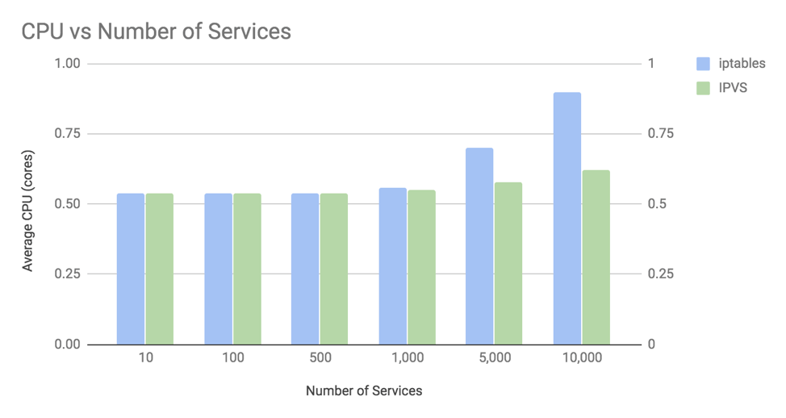

## 前言
本文是一篇学习翻译文章，[原文在这里](https://www.tigera.io/blog/comparing-kube-proxy-modes-iptables-or-ipvs/)。

对任何 Kubernetes 来说 kube-proxy 是一个很关键的组件。它的功能是把流量负载均衡代理（通过集群 IP 和节点端口）到正确的后端 pod上。Kube-proxy可以运行在以下 3 种模式之一：userspace、 iptables 或者 IPVS，每种模式都是由不同的数据面技术实现。

userspace 模式是非常老的一种模式，现在也是绝对不推荐的一种方式。但是你怎么衡量到底是使用 iptables 还是 IPVS 模式呢？在这篇文章中，我们会比较这两种模式，衡量他们在真实微服务环境下的性能表现，评价指导你在什么情况选择哪种模式。

首先，我们要先介绍一下这两种模式的一些背景知识，然后我们在深入测试和总结测试结果。

## iptables proxy 模式的背景知识
iptables 是一个内核中的特性，它是被设计用来作为高效防火墙的，同时可以灵活的处理各种各样通用数据包的修改操作和过滤处理。它可以在内核数据包处理的钩子点上灵活的挂载一系列的处理规则。在 iptalbes 模式下，kube-proxy 挂载规则到 “NAT pre-routing” 钩子电商来实现节点上 NAT 和负载均衡功能。它简单有效，使用了成熟的内核功能，并且它可以很好的和其它使用 iptables 来过滤的程序（比如 Calico）一起运行。

然而，kube-proxy 下发的 iptalbes 规则只是按照 O(n) 的算法复杂度来运行的，其中 n 的增值是和集群规模成正比的（或者更准确的说是它跟 service 数量和每个 service 后面的 pod 数量是成正比的）。

## IPVS proxy 模式的背景知识
IPVS 是内核中专门设计用于负载均衡的一个功能。在 IPVS 模式下，kube-proxy 下发 IPVS 规则来做负载均衡，而不是使用 iptables。它同样使用了一个成熟的内核功能，并且 IPVS 被设计成可以支持大量 service 的负载均衡；它有一个优化的 API 和优化过的查询方式，而不是顺序的规则列表。

带来的结果就是 kube-proxy 在 IPVS 模式下处理链接的算法复杂度是 O(1)。换句话说，在大多数的场景中，他的链接处理性能是保持恒定的，和你的集群规模无关。

此外，作为专用的负载均衡器，IPVS 支持多种不同的调度算法，例如：轮询，最短延时优先，最少链接优先和各种哈希实现。相反，kube-proxy 在 iptables 模式下使用的是随机等代价选择算法。

IPVS 中一个潜在缺陷是 IPVS 在通常情况下使用了和 iptables 过滤钩子点非常不一样的包处理路径。如果你计划和其它程序一起使用 IPVS，而这些程序是使用的 iptables 的话，你就需要研究看看他们的处理结果是否符合你的预期了。（但是不要担心，Calico是兼容 kube-proxy 的 IPVS 模式的）。

## 性能比较
OK，虽然说 kube-proxy 的链接处理在 iptables 模式下是 O(n) 的复杂度，在 IPVS 模式下是 O(1) 的复杂度。那么在真实的微服务场景下他们的表现如何呢？

在大多数的场景下，kube-proxy 在应用和微服务处理中的性能，有 2 个属性你可能是比较关注的：

1. 对往返响应时间的影响。当一个微服务发起一个 API 调用到另外的一个微服务，那么从第一个微服务发起请求到收到第二个微服务发回的请求响应的平均耗时是多少？

1. 对总 CPU 使用的影响。当运行一个微服务的时候你的主机的总 CPU 使用是多少？这包含了用户空间和内核/系统使用，也包括了支持你微服务运行所需要的所有进程，包括 kube-proxy。

为了说明，我们在专用的节点上运行一个“客户端”微服务的 pod，并且发出 1000 的请求 QPS 到一个 Kubernetes 的 service，这个 service 后面是 10 个运行在这集群上其它节点上的微服务 pod。这时候我们来测量客户端在在节点的性能，测试条件包含了在 iptalbes 和 IPVS 模式下各种数量的 Kubernetes services，每个 services 后面有 10 个 pod，直到 services 数量达到 10000 个（即有 10000 个后端 services）。对于微服务，我们使用一个用 golang 开发的简单测试工具作为客户端微服务，并且使用标准的 NGINX 作为后端 pod 的微服务。 

## 往返响应时间
在看往返响应时间时，了解连接和请求之间的差异是很重要的。通常大多数的微服务会使用持久或者 “keepalive” 链接，就是说每个链接都可以在多个请求上复用，而不是为每个请求请求一个新的链接。这一点非常重要，因为新链接的建立需要 TCP 的三次握手协议（这个就要耗费时间），在 Linux 网络栈上也有更多的处理（这也需要耗费一些时间和 CPU）。

为了说明这些区别，我们测试了有链接复用和没有链接复用的情况。在链接复用的情况下，我们使用 NGINX 的默认配置，默认配置设置了每个存活链接可以给最多100个请求复用。看下面的图，越低的响应延时越好。

这个图展示 2 个关键的东西：

1. 在 iptables 和 IPVS 模式下往返响应耗时在 1000 个 services（后端有 10000 个 pod） 之后才会比较明显。平均往返响应耗时在不使用链接复用的情况下才能看出区别，链接复用的时候变化非常微小。也就是说在对每个请求都创建新链接的时候才明显。
1. 对于 iptables 和 IPVS 模式，对 kube-proxy 的响应时间开销都和链接建立有关系，和包数量或者链接上的请求数不相关。这是因为 Linux 使用了链接跟踪(conntrack) ，它可以非常高效的把包匹配到已经存在的链接。如果一个包在 conntrack 中被匹配到了，那么它就不需要通过 kube-proxy 的 iptables 或者 IPVS 规则来处理。Linux conntrack 是你们的朋友。

我们这个例子中使用了 NGINX pod 返回了一个静态的响应体，所以这个微服务的用处并不是很大。很多微服务需要做比这更复杂的工作，响应的也就要产生更高的响应耗时，这意味着与此图表相比，kube-proxy 处理的增量占响应时间的百分比会更小。

这里有个一个比较奇怪的地方需要解释：如果 IPVS 在处理新链接的复杂度是 O(1)，那为什么在 10000 个 services 的时候响应耗时会更多一点呢？我们需要做更多的发掘才能发现真像，但其中一个因素是，由于主机上CPU使用率的增加，系统整体速度变慢。这也让我们可以更好的进入下一个话题了。

## 总 CPU
为了说明总 CPU 使用率，下图就聚焦于没有使用持久链接的最坏情况，这样对 kube-proxy 的链接处理开销的影响是最大的。

这图展示了 2 个关键事情：
1. 在 iptables 和 IPVS 模式下 CPU 使用率的区别是直到后端 service 超过 1000 个的时候才比较明显。（每个后端还是 10000 个 pod）。
1. 在 10000 个 service（每个后端有 100000 个 pod）的时候，iptables 模式下 CPU 使用率上升到单核 35% 左右，而 IPVS 的单核使用率在 8% 左右。
有 2 个主要的因素在影响 CPU 使用率。

第一个因素：默认情况下 kube-proxy 给内核下发所有 service 的规则是有 30 秒的间隔。这就解释了为什么在 IPVS 模式下即便是它处理链接的复杂度是 O(1)，仍然有小幅的 CPU 使用率增长。另外 iptables 在老版本内核的下发 API 要比现在的内核慢很多。所以如果你在老版本内核上使用 kube-prxoy 的 iptables 模式，你会发现 CPU 的使用率比这张图上的还要高。

第二个因素：kube-proxy 使用 iptables 或者 IPVS 处理新链接的开销。对于 iptables 来说，它名义上是 O(n) 的复杂度。在大量 service 的时候对 CPU 利用率的影响是比较明显的。例如，在 10000 个 service（后端有 100000 个 pod），iptalbes对每个新链接要执行差不多 20000 个规则。注意，虽然在这个图中我们展示了微服务中的最坏的场景：每个请求都创建新链接。如果我们使用了 NGINX 的默认配置：100 个请求使用一个链接，那么 kube-proxy 的 iptalbes 规则会少执行 100 倍，大大的降低了使用 iptables 带来的 CPU 影响，甚至接近单核 2%。

还有要说明的是，这个测试中我们使用的客户端微服务在收到服务端微服务的响应之后只是简单的丢弃了。一个真实的微服务是需要处理远比这个多的事情，这也有可能增加图上 CPU 的使用，但不会改变与服务数量相关的 CPU 的绝对增长。

## 结论
在规模上只要超过了 1000 service，kube-proxy 在 IPVS 模式下可以带来很好的性能提升。大家的目标可能有所不同，但是作为一个通用的指导，在微服务场景下使用链路复用，使用较新的内核，这些好处可能相对有限。**对于不使用链路复用的微服务，或者运行在较老内核上的，切换到 kube-proxy 的 IPVS 模式下会有一个较好的收益。**

独立于性能考虑，如果你有需要使用比 iptables 的随机负载均衡更复杂的负载均衡算法，那么你应该考虑使用 IPVS 模式。

>如果你不确定 IPVS 是否能更好，那么请使用 kube-proxy 的 iptables 模式。它在产品化上还是有一定积累的，虽然它有不完美的地方，可以说它作为默认配置还是有原因的。

## 后记: 对比 iptables 模式下的 kube-proxy 和 Calico
在这篇文章中，在大规模场景下，我们看到了 kube-proxy 在 iptables 模式中如何会影响性能开销。我有时也会问这样的问题，为什么 Calico 不会有这样的问题。答案是 Calico 使用 iptables 的方式和 kube-proxy 的方式有明显的区别。kube-proxy 使用了一个非常长的规则链，并且会随着集群规模按比例增长，而 Calico 使用了非常短的优化过的规则链，使用了 ipset 进行扩展，ipset 在查询上也是 O(1) 复杂度，和大小无关。

要正确的看这个事情，下面的图展示了 kube-proxy 和 Calico 对每个链接处理的平均 iptables 规则数量，假设集群中的每个节点上平均有 30 个 pod，每个 pid 平均有 3 个网关处理策略。

甚至当集群中全力运行有 10000 个 service 和 100000 个后端 pod，Calico 在每个连接上执行的 iptables 规则数量与kube-proxy 在 20 个服务和 200 个后端 pod 上执行的 iptables 规则数量大致相同。换句话说，Calico 使用 iptables 是非常高效的。

看完本文有收获？请分享给更多人

关注「黑光技术」，关注大数据+微服务

