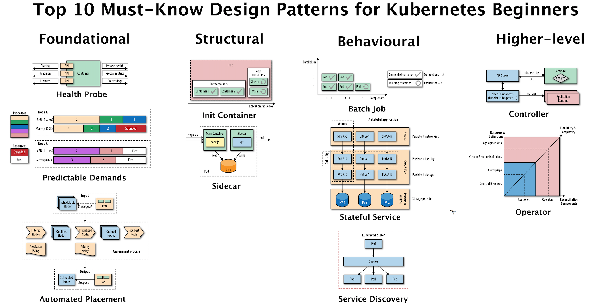

## 前言
本文是一篇翻译的文章，主要是学习，[原文地址在这里](https://developers.redhat.com/blog/2020/05/11/top-10-must-know-kubernetes-design-patterns).

这篇文章是对 redhat 写的一本书的概述，提炼了很多核心概念。

这篇文章中介绍了和传统《设计模式》类似的云原生时代的设计模式，《设计模式》在软件开发中意义重大，现在多少软件研发都受到它的影响，而且我之前也在公司内开了这门课程，自己学习的同时，也是想让我们的开发者开发软件更有软件设计思维。

而今这本书的出现是针对目前云原生时代的设计模式，之前的设计模式更多的是对单个模块或是简单系统的，但是云原生时代的开发方式和理念与之前的主机开发模式还是有大的不同的。所以现在开发者在学习了《设计模式》的基础上，还应该学习这些**云上设计模式**。

## 正文
这篇文章介绍了 Kubernetes 初学者必须知道的 Kubernetes 设计模式 Top 10，是从 [the Kubernetes Patterns book](https://developers.redhat.com/books/kubernetes-patterns) 这本书中梳理总结出来的（大家如果无法下载这本书，可以联系我，我发给大家）。通过学习这些设计模式可以帮助大家能更好的理解 Kubernetes 基础概念，这些概念的理解可以帮助大家更好的设计基于 Kubernetes 的应用程序。

在 Kubernetes 中有很多重要的概念，但是下面图中的这些是概念是大家使用 Kubernetes 时最重要的：

Top 10 Kubernetes Design Patterns

为了帮助大家更好的理解，我们对这些设计模式进行了分类，这也是受《设计模式》的启发的。

## Foundational patterns：基本模式
这些设计模式也是云原生容器化应用开发的最佳实践和原则。不管你的应用程序的性质如何，你都应遵循这些指导规则。遵循这些原则将有助于确保你的应用程序适用于 Kubernetes 上的自动化。

### Health Probe pattern：健康探测模式
**健康探测指定了每个容器都应用实现一个特定的 API，以帮助平台可以最可行健康的方式观测和管理应用程序。**为了完全自动化，一个云原生应用程序必须是可以高度可观测的，并且可以以此推断其状态，并且让 Kubernetes 可以检测出应用程序是否已经启动并且已经可以准备好对外服务了。这些检测行为会影响 Pod 的生命周期管理，并且会决定流量是否会被路由到应用程序。

### Predictable Demands pattern：可预测需求模式
**可预测的需求解决了为什么每个容器都应该声明其资源配置文件，并仅限于指定的资源需求。**在共享云环境中成功部署应用程序、管理和共存的基础依赖于识别和声明应用程序的资源需求和运行时依赖性。不管这些应用程序是有硬件运行依赖或者资源需求，这个模式描述了你应该如何声明应用程序的需求。声明应用程序的需求是让 Kubernetes 在集群中找到合适的地方部署的基础条件。

### Automated Placement patterns：自动布置模式
**自动布置解决的是在集群中多个节点中如何影响 workload 的分布。**布置能力是 Kubernetes 调度器的核心功能：在满足容器资源需求和遵循调度策略的前提下给 Pod 分配合适的节点。这个模式描述了 Kubernetes 的调度算法的原则和在外部影响布置决策的方法。

## Structural patterns：结构模式
有了好的云原生容器是第一步，但还不够。重用容器和组合容器到 Pod 中，并且达到我们期望的结果是下一步。这个分类中的模式会聚焦在结构和把容器组织安排到 Pod 中，并且满足不同的应用场景。在 Pod 中容器间的相互作用导致产生了这些模式。

### Init Container pattern：初始化容器模式
**Init Container 引入了一个独立生命周期的的初始化相关的任务相关和主应用程序容器。**Init Container 提供一个和主应用程序容器独立的初始化相关任务，这个任务的生命周期管理也是独立的，通过这种方式实现了不同阶段的事物分离。这种模式引入了一个基础的 Kubernetes 概念，这种概念也使用在很多其它需求初始化逻辑的设计模式中。

### Sidecar patterns：边车模式
**Sidecar 描述了在不改变已经存在容器的情况下，如何扩展和加强功能。**这个模式是基本模式之一，它可以让单一功能的容器放在一起配合起来提供服务。

## Behavioral patterns：行为模式
这些模式描述了由管理平台保障的 Pod 生命周期。根据不同类型的工作负载（workload），一个 Pod 会运行的他的任务完成，比如说一个批处理任务、或者是一个周期性调度执行的任务。或者它有可能是一个守护服务或者单例服务的形式运行。在最开始选择正确的 Pod 生命周期管理方式会有助于保证 Pod 按照你期望的方式运行并解决问题。

### Batch Job patterns：批处理任务模式
**批处理模式描述了如何去运行一个独立，原子的任务，直到这个任务结束。**这种模式适合管理在分布式环境下独立、原子的任务。

### Stateful Service patterns：有状态服务模式
**有状态服务模式描述了如何使用 Kubernetes 来创建和管理分布式的有状态应用。**这种应用需要一些状态服务的特性需求，比如持久化的标识，网络，存储等。`StatefulSet` 的出现为这些需求提供了强大的保证，是有状态应用程序管理的理想选择。

### Service Discovery pattern：服务发现模式
**服务发现模式描述了客户端如何能访问和发现哪那些提供应用服务的实例。**为了达成这个目的，Kubernetes 提供了多种机制，可以根据服务的消费者和提供者是在集群内还是在集群外而选择不同的机制。

## Higher-level patterns：高级模式
这个分类中的模式是更为复杂的，并且代表了高级应用管理模式。这里的一些模式（比如控制器模式）是通用的，甚至Kubernetes 本身就是构建在他们之上的。

### Controller pattern：控制器模式
**控制器模式是常活的监视器并在管理一组 Kubernetes 资源，让这些资源处在被期望的一个状态中。**Kubernetes 的核心就是由一系列的控制器组成，并且他们会例行的监控和调整当前应用的状态到申明的目标状态。这个模式描述的是我们如何使用这种理念来为我们自己的应用来扩展平台能力。

### Operator pattern：Operator 模式
**一个 Operator 就是一个控制器，并且这个控制器使用了用户自定义资源（CustomResourceDefinitions）将特定应用程序的操作知识封装在算法和自动化的方式中。**Operator 模式允许我们可以有更灵活和更强表示的能力来扩展控制器模式。目前 Kubernetes 的 Operator 越来越多，这种模式已经装变成操作复杂分布式系统的主要方式。

## 总结
如今，Kubernetes 是最流行的容器编排平台。它由所有主要的软件公司共同开发和支持，并由所有主要的云提供商作为服务提供。Kubernetes 支持 Linux 和 Windows 操作系统，还有所有的主流编程语言。这个平台可以编排和自动管理无状态和有状态服务，批处理任务，周期性任务和 serverless 工作负载。这里描述的模式是 Kubernetes 提供的一系列更广泛的模式中最常用的模式，如下所示。

划分到不同分类中的 Kubernetes 模式

**Kubernetes 是新的应用程序可移植性层，是对应用的一种高级抽象，也是云上所有应用的共同特征。**如果你是一个软件开发者或者架构师，Kubernetes 很有可能以这样或那样的方式成为你生活的一部分。学习这里讲述的这些 Kubernetes 模式会让你对这个平台的想法有所改变。我相信 Kubernetes 和这些从它上面发展出的这些概念会变成和面向对象编程概念一样的基本概念。

这里介绍的这些模式尝试组织成为容器和云时代的《设计模式》。阅读这篇文章只是一个开头，更多的由于 Kubernetes 出现而出现的新的云原生软件开发方式还在等着大家去学习。

## 后记
梳理翻译之后还是学到不少内容，至少对我之前知道的一些概念理解更加深刻了，国外一些软件论述更喜欢从理论和模式框架出发，我虽然是一个重实践的工程师，但是还是想从理论上能多了解一些，做到知行合一不容易的。

看完本文有收获？请分享给更多人

关注「黑光技术」，关注大数据+微服务

