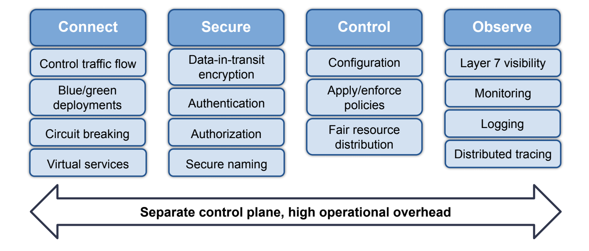

## 前言
本文是一篇翻译的文章，主要是学习，[原文地址在这里](https://developers.redhat.com/blog/2020/05/11/top-10-must-know-kubernetes-design-patterns).

这篇文章是对 redhat 写的一本书的概述，提炼了很多核心概念。

这篇文章中介绍了和传统《设计模式》类似的云原生时代的设计模式，《设计模式》在软件开发中意义重大，现在多少软件研发都受到它的影响，而且我之前也在公司内开了这门课程，自己学习的同时，也是想让我们的开发者开发软件更有软件设计思维。

而今这本书的出现是针对目前云原生时代的设计模式，之前的设计模式更多的是对单个模块或是简单系统的，但是云原生时代的开发方式和理念与之前的主机开发模式还是有大的不同的。所以现在开发者在学习了《设计模式》的基础上，还应该学习这些**云上设计模式**。

## 正文
Kubernetes is the de-facto platform for orchestrating containerized workloads and microservices, which are the building blocks of cloud-native applications. Kubernetes workloads are highly dynamic, ephemeral, and are deployed on a distributed and agile infrastructure. Although the benefits of cloud-native applications managed by Kubernetes are plenty, Kubernetes presents a new set of observability challenges in cloud-native applications.

Let’s consider some observability challenges:

1. Data silos – Traditional monitoring tools specialize in collecting metrics at the application and infrastructure level. Given the highly dynamic, distributed, and ephemeral nature of cloud-native applications, this style of metrics collection creates data in silos that need to be stitched together in the context of a service in order to enable DevOps and SREs to debug service issues (e.g. slow response time, downtime, etc.). Further, if DevOps or service owners add new metrics for observation, data silos can cause broken cross-references and data misinterpretation, leading to data misalignment, slower communication, and incorrect analysis.
1. Data volume and granular components – Kubernetes deployments have granular components such as pods, containers, and microservices that are running on top of distributed and ephemeral infrastructure. An incredibly high volume of granular data is generated at each layer as alerts, logs, and traces, and this data volume grows as the service scales. The more data there is, the more difficult it is to tease out patterns and debug issues. With this data growth, observability and troubleshooting become harder.
1. Kubernetes abstraction – Kubernetes abstraction makes it difficult to understand what’s happening with dynamic, ephemeral, and distributed infrastructure. Unpacking these abstractions is like peeling back the layers of an onion (at the container, node, network, and process levels, and at times even down to the socket and packet levels) to make sense of the underlying problem.
Given the complex nature of Kubernetes microservice deployments and the overwhelming amount of data generated, troubleshooting an application in a Kubernetes environment is challenging. A different approach is needed to address Kubernetes observability challenges.

## A different approach to Kubernetes observability
Kubernetes’s declarative nature makes it extremely simple to do observability right. DevOps, SREs, or service owners can declare a high-level language construct around how they want to secure and observe the system, and Kubernetes can take care of the implementation. Observability can be treated as code so that it gets wired in as an integral part of the application, and then travels with the application so that it can run on any cloud, infrastructure, network, or application. Observability can be refined even further, as the code can be integrated into the CI/CD chain and moved upstream. This allows developers and software engineers to build their applications with the right level of observability to ensure applications are working as expected.

To understand this further, let’s look at a simple example that shows how observability as code works for a cloud-native application in the Kubernetes environment.

Online Boutique (previously known as Hipster Shop) is an 11-tier microservice demo application from Google Cloud.



Online Boutique microservices architecture
One of the microservices is ProductCatalogService, whose purpose is to display the latest catalog (the catalog changes with respect to newer product availability and existing product inventory). After Online Boutique is deployed, the associated microservices, including ProductCatalogService, are monitored for breakdown, timeouts, and slow performance.

With the traditional way of monitoring and troubleshooting, developers, DevOps and SREs work in their own data silos, capture data separately for ProductCatalogService, and then correlate their respective data with each other by building in-house scripts or leveraging third-party software. Initially, with low data volumes, this may be possible, but this approach won’t scale over time as the business grows (due to a larger product catalog and/or business logic to capture more customer wallets). As the application is using Kubernetes for ephemeral, distributed, and dynamic infrastructure to run ProductCatalogService, Kubernetes abstraction will make the data context difficult at the node, container, network, process, and packet levels. All of these challenges together will lead to longer troubleshooting times, and guesstimates in the event of an application breakdown or slow performance.

A different approach can be taken by DevOps or SREs with observability as code, by leveraging Kubernetes-native abstraction and its declarative model to observe ProductCatalogService correctly.
```yaml
apiVersion: projectcalico.org/v3
kind: PacketCapture
metadata:
name: productcatalogservice-pcap
namespace: onlineboutique
    spec:
        selector: app == "productcatalogservice"
        destination:
            ports:
                - 80
            protocol: TCP
```
The above is an example of observability as code. A job “packetcapture-pcap” is created in the namespace “onlineboutique” that selects and filters the workloads running on Kubernetes labeled as “app == productcatalogservice,” and does the packet capture at port 80 and protocol TCP. Data silo and data granularity problems are eliminated as Packetcapture is part of ProductCatalogService in Online Boutique and is collecting all relevant metadata. This approach has the following benefits:

1. As the application and associated microservices are deployed by Kubernetes on ephemeral and distributed infrastructure, the label in code and the job ensure that all relevant context remains at the fingertips of all team members. This allows for easy filtering and subsequent analysis of traffic payload.
1. This example can be used by different team members for other services or packet capture at a different port, or for a different protocol.
1. In the same way that development teams maintain unit tests to ensure the quality of their code at build time, observability as code (like the one in this example) can be maintained to ensure that various stakeholders (DevOps, SREs, etc.) can easily troubleshoot an application at runtime.

As shown with this example, the observability challenges posed by data silos, data volume and granular components, and Kubernetes abstraction can be addressed by using an observability as code approach, which utilizes Kubernetes’ declarative nature. This leads to faster troubleshooting and shorter time to resolution if your application is experiencing performance, breakdown, or timeout issues.

<center>
看完本文有收获？请分享给更多人

关注「黑光技术」，关注大数据+微服务


</center>