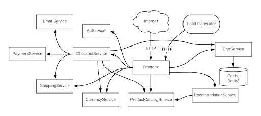

## 前言
本文是一篇翻译的文章，主要是学习，[原文地址在这里](https://www.tigera.io/blog/kubernetes-observability-challenges-in-cloud-native-architecture/).

这篇文章是 Calico 公司的员工写的，思路非常好。可观测性即代码，非常 k8s 范。在我们实际应用中，目前 k8s 的观测性确实是一个非常大的问题，就目前我在做的平台中，我就对这个问题很头大，虽然业界也有可观测性方案，但是 opentelemetry 目前较为成熟的只是 trace，log 还不够成熟，metrics 目前还是 Prometheus 比较成熟。所以目前大多数的业界平台都是混着用。虽然 opentelemetry 声称是要统一这三者，但是从实际技术角度和目前发展情况来看，还需要时日才能成熟。

所以这篇文章从目前 Kubernetes 中可观测性的挑战做了分析，在这方面提出了一个解决思路，并且做了落地实践。我认为目前这个思路是大方向，但是目前的实现情况还是比较初步，还需要 k8s 在这方面能力上持续发展。或许未来是可以直接和 opentelemetry 的方案直接对接。

## 正文
Kubernetes 已经是对工作负载和微服务进行容器编排的实时标准平台，目前 Kubernetes 已经在云原生应用广泛落地。 Kubernetes 的工作负载是高度动态变化的，并且部署在分布式和敏捷的基础架构上的。虽然 Kubernetes 管理云原生应用的好处非常多了，但是 Kubernetes 在云本地应用程序中遇到了一些新的可观测性问题挑战。这篇文章就是想讨论一下目前遇到的这些挑战。

## 可观测性挑战
先看看我们会遇到哪些挑战：
1. **数据孤立** - 传统的监控工具专门收集应用程序和基础架构级别的指标。考虑到云本机应用程序的高度动态、分布式和短暂性，这种度量收集方式会在仓库中创建数据，这些数据需要在服务上下文中缝合在一起，以便使 DevOps 和 SRE 能够调试服务问题（例如，响应时间慢、停机等）。此外，如果 DevOps 工程师或者服务所有者添加了新的观测指标，数据孤立仓库可能会导致交叉引用中断和数据误解，从而导致数据错位、通信速度减慢和分析错误。
2. **数据卷和细粒度组件** - Kubernetes 的部署有多个组件构成，比如 Pod，容器和微服务，他们都运行在分布式的基础设施上。由每个层面产生的海量的各种粒度的数据，如告警，日志和跟踪信息，这些数据随着服务扩展而增加。数据越多就越难梳理出模式和调试问题。随着数据增长，观察和故障排除会变得更加困难。
3. **Kubernetes 抽象** - Kubernetes 抽象让大家难以理解在动态，短时和分布式的基础设施底层发生的事情。要解开这些抽象的概念就像一层层剥开洋葱（在容器，node节点，网络，进程级别，有时甚至要深入到套接字和网络数据包级别），通过逐层分析才能理解这些底层的问题。
 
鉴于Kubernetes微服务部署的复杂性和生成的大量数据，在 Kubernetes 中定位处理一个应用程序的问题是比较困难的。需要一种不同的方法来解决 Kubernetes 可观测性挑战。

## Kubernetes 可观测性的另一种解决方式
Kubernetes 的声明性方式使得正确地进行可观察性非常简单。DevOps，SRE 或者服务拥有者可以声明一种高级语言来构建他们想要的安全和观察系统，并且 Kubernetes 能负责这些构建的实现。可观测性可以被当作一种代码，以便它作为应用程序的一个组成部分连接到应用程序中，然后随应用程序一起部署，以便它可以在任何云、基础设施、网络或应用程序上运行。可观察性可以进一步改进，因为代码可以集成到 CI/CD 链中。这允许开发人员和软件工程师以适当的可观察性级别构建他们的应用程序，以确保应用程序按预期工作。

为了进一步理解这一点，让我们看一个简单的示例，它展示了在 Kubernetes 环境中可观测性作为代码是怎么在的云原生应用程序中工作的。

Online Boutique（以前称为 Hipster Shop）是来自谷歌云的 11 个微服务组成的演示应用程序。



Online Boutique 的微服务架构

其中一个微服务是 ProductCatalogService，其目的是显示最新的分类（分类会随着可买新产品和现有产品库存的变化而变化）。在 Online Boutique 应用部署后，我们将监控相关的微服务（包括 ProductCatalogService）的故障、超时和性能缓慢。

使用传统的监控和故障排除方法，开发人员、DevOps 和 SRE 在各自的数据仓库中工作，分别为 ProductCatalogService 捕获数据，然后通过构建内部脚本或利用第三方软件将各自的数据相互关联。开始的时候，在数据量较低的情况下，这是可能的，但这种方法不会随着业务的增长而扩展（因为有更大的产品分类和/或业务逻辑来让更多的客户访问购买）。

由于应用程序使用 Kubernetes 作为分布式、动态和短时作业的基础设施来运行 ProductCatalogService，Kubernetes 的抽象将使节点、容器、网络、进程和网络数据包级别的数据上下文分析变得困难。所有这些挑战加在一起将导致更长的故障排除时间，并在应用程序崩溃或性能降低时让大家只能瞎猜。

DevOps 或 SRE 可以采用另一种方法：可观察性即代码，利用 Kubernetes 原生的抽象及其声明性模型来正确观察 ProductCatalogService。

```yaml
apiVersion: projectcalico.org/v3
kind: PacketCapture
metadata:
name: productcatalogservice-pcap
namespace: onlineboutique
    spec:
        selector: app == "productcatalogservice"
        destination:
            ports:
                - 80
            protocol: TCP
```
以上是可观察性即代码的示例。在名称空间 “onlineboutique” 中创建作业 “packetcapture-pcap”，在该名称空间空间中用 “app == productcatalogservice” 为标签选择并过滤 Kubernetes 上运行的工作负载，并在 80 端口上捕捉 TCP 协议数据包。由于 Packetcapture 是 Online Boutique 中 ProductCatalogService 的一部分，并且收集了所有相关元数据，因此消除了数据孤岛和数据粒度问题。这种方法有以下的好处：

1. 由于应用程序和相关的微服务由 Kubernetes 部署在分布式基础设施上，代码中的标签和作业确保所有相关上下文都在所有团队成员的手上。这使得对流量有效载荷的过滤和后续分析变得很容易。
2. 此示例可由不同的团队成员用于其他服务或在不同端口捕获数据包，或用于不同的协议。
3. 与开发团队维护单元测试以确保构建时代码质量的方式相同，可以维护的可观察性代码（如本例中的代码），以确保各种参与者（DevOps、SRE 等）可以轻松地在运行时对应用程序进行故障排除。

如本例所示，数据孤岛、数据量和粒度组件以及 Kubernetes 抽象所带来的可观测性挑战，可以通过使用可观测性即代码的方式来解决，该方法利用 Kubernetes 的声明性。如果你的应用程序遇到性能、故障或超时问题，这种方式可以更快的排除故障和缩短解决时间。

## 总结
以上是所有的译文，这个做法初步看是可以的，对服务监控的时候可以使用 k8s 的能力直接捕捉端口数据包信息，但是很多的业务信息，处理逻辑产生的日志是无法通过这种方式获取到的，这种方式的前提还是网络通信捕获。但是实际上很多的异常是逻辑异常，是算法异常，这种问题的定位只能是日志来记录。

但是整个思路并不是没有意义，我认为意义还是非常大的。**监控能力可以说是一种基础设施或者基础能力，尤其最初的数据采集和集中，就应该是由基础设施种来做，而且这个思路种还以 k8s 能力作为落地，直接使用 yaml 配置启动。可以说这种方式非常 k8s 化，是非常巧妙的方式。** 但是数据收集只是一部分，接下来的处理可扩展如何可以更好的代码化配置这个例子中没有介绍。**在实际的监控，分析这部更为重要，我认为未来这部分应该也是可以直接代码化配置。** 我相信未来估计逐步会有这类能力的实现的。

<center>
看完本文有收获？请分享给更多人

关注「黑光技术」，关注大数据+微服务


</center>