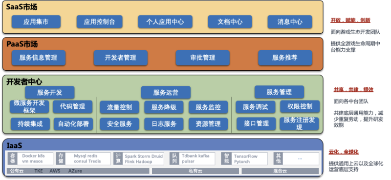
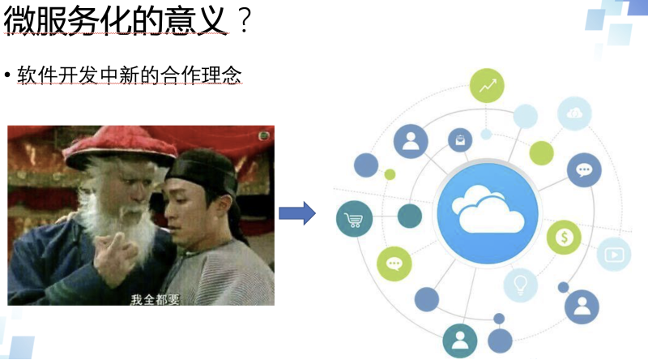
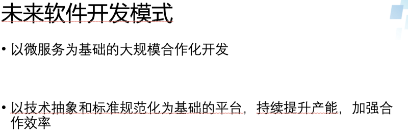

## 引子

这是一个内部分享会上的一个小分享，整个分享只有6分钟，整理了一下分享出来。这是一个内部分享会上的一个小分享，整个分享只有6分钟，整理了一下分享出来。目标是挑战一下自己能否在短时间内把这些内容介绍清楚。现在看来还是要继续努力的。

## 关于微服务开发平台的思考
大家好，我是helight，今天给大家带来的分享是关于我这两年在做的微服务平台的思考，这两年一路走来经过各种各样的坑，我们还在持续努力做这个微服务平台。

那为什么我们还在这么执着的建设这个微服务平台，这两年来我们是怎么想的？我认为这也是一种旅行，技术旅行，而且我们也还在路上。

这是我分享的3个方面：技术的执念，和其中2个模块建设的意义。

首先是技术的执念，无论是之前的数据服务平台还是现在在做的微服务开发平台，我们都是有一个技术人的执念在哪里，希望能够有一个平台，方便的提供服务建设和服务组装。希望能够屏蔽底层技术的复杂性，让开发者更关注业务和业务能力的创新。能提供一个有规模化生产服务能力的平台。

所以这里就衍生出来2个关键思路：1.微服务，2.平台化。

这几年我一直也在思考我们使用技术的目的和意义是什么？我不知道大家有没有思考过？我们问什么要用这个技术？是因为很这个技术火热？这个技术能解决我的问题？还是其它的原因呢？

这里我也想说一下，我对我们在微服务开发平台上使用2个技术思路的思考。
首先是微服务化的意义是什么？

这是一张典型的微服务架构，前端，后端，后端分不同的模块进行建设。每个模块可以由不同的人来负责开发。
大家看到微服务就仅此而已吗？拆分一下就好了？不同的人来开发就好了？微服务这么简单？

我对微服务的思考是这样的：是一种软件开发新的合作模式，是软件开发中体系化的分工协作模式。

通过微服务的建设，让更多的人可以更低成本的加入到你的系统建设中来。让新来的同学不需要了解整个系统的所有代码，只需要熟悉掌握自己要做的模块，和其它模块对接的标准就可以了。系统的复杂性大大减低的同时，让其他人更容易进行协作贡献自己的力量。

现代软件越来越大越来越复杂，而微服务就恰恰能从人类分工协作的角度切入，减低系统复杂性，减低研发难度，提升研发效率。

以往的做法是一个开发要掌握整个系统，我全都要，张小龙同学一个人可以完成foxmail的研发，现在已然是不再可能的事情了。而现在希望是大家能以标准化的方式接入云化的一个系统，可以只贡献自己专注的能力即可。让自己成为云上服务的某种能力的提供者。
再是平台化的意义是什么？

俗话说：没有约束的自由不是真自由。这里也是一样，微服务的模式是解决了大家在软件开发上的分工协作问题，但是这是一种思想。我们要让这种思想落地的时候，就必须要对他进行抽象化和标准化。抽象化的标准的目的是为了能够找出解决一类问题的方法，可以让大家在解决这类问题的时候可以有同样的解决方案，提升复用性。

通过这两种方式的结合形成平台，要产出规模效应。现代生产最强调的一个就是如何进行规模化工业化的生产，软件开发在一定程度上也要向这个方向发展，尤其是软件研发的基础服务。

最后我想基于上面的思考畅想一下未来的软件开发模式：

我认为主要也是有2点：
1. 以微服务为基础的大规模软件开发模式持续流行，多大规模呢？全球合作一定是少不了的。
2. 以技术抽象和标准化规范化为基础的开发平台模式，以持续提升产能，加强合作效率

我们的征程是星辰大海，在技术的路上，我们还需要不断的努力，不断的探索。

看完本文有收获？请分享给更多人

关注「黑光技术」，关注大数据+微服务

