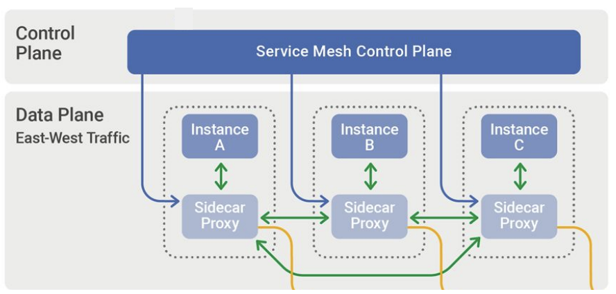
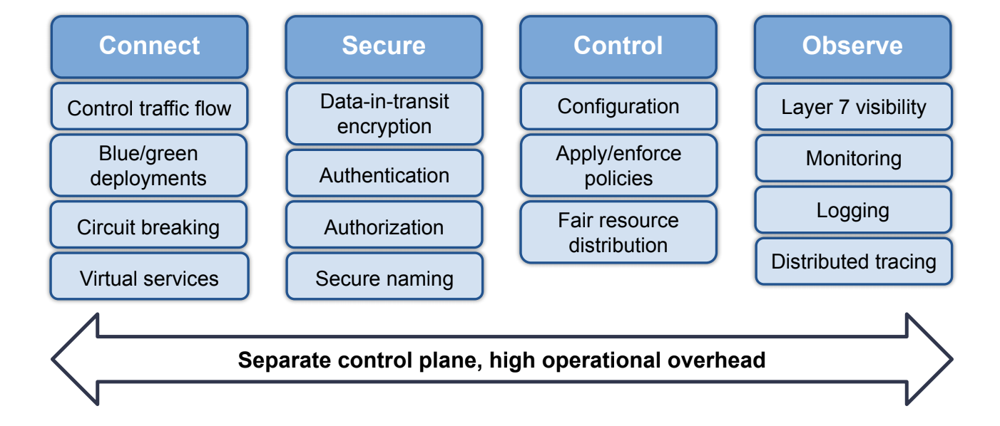

译者注：本文作者是 Tigera 产品总监 Phil DiCorpo ，[原文地址在这里][1]。作者介绍服务网格的价值和架构设计，并且分析了目前服务网格在落地上挑战点，这些都是非常有价值的。并且在后面介绍了他们在他们的产品 Calico 上的一些实践和解决思路。

目前看服务网格在实施落地上确实是有非常大的挑战，根据具体的使用场景需求不一样，但是大多数的场景下使用服务网格还是有点太重了。所以目前大家的方向还是 2 个方面进行探索：
1. **如何降低目前边车架构下的部署运营成本，让使用团队可以低成本的使用这项技术。**
2. **对于架构的优化，把传统的边车思路上进行突破，采用其它的架构从而减低运营成本。**

本文的分析和介绍也是有一定的借鉴意义，我也坚信服务网格技术是服务治理的未来，而这项技术也在这几年的发展中不断发展壮大，但是还没有到很成熟的时候，**服务网格技术是一个基础设施技术，一定要不断下沉，不断向上抽象。下沉到更高效的内核或者基础网络上，向上抽象到配置管理成本更低。**

首先任何事情要想明白为什么要用这项技术，国内这两年随着云原生技术的兴起而且不断的也把服务网格技术拉热了，**但是应用场景和运营成本依然是我们要重点考虑的核心点，不是说为用而用。**

## 正文
部署和管理微服务所面临的挑战导致了服务网格的出现，服务网格是一种用于在应用层添加可观察性、安全性和流量管理功能的工具和技术。虽然服务网格目的在帮助开发人员和 SRE 处理在 Kubernetes 集群内的服务对服务通信相关的场景，但服务网格还增加了操作复杂性，并引入了一个额外的控制平面，供安全团队管理。

## 什么是服务网格？
服务网格是一个软件基础设施层，用于控制和监控微服务应用内服务到服务流量。

服务网格提供了一些中间件和一些组件，它们支持服务到服务的通信，例如动态发现。它提供了服务发现、跨服务流量负载平衡、加密和身份验证相关的安全功能、可观察性跟踪等功能。服务网格架构利用设计模式实现服务之间的通信，而无需微服务重写应用程序。

## 服务网格架构
服务网格工作的一个关键方式是它利用了 sidecar 设计模式。服务通过代理进行通信和处理请求，代理被动态地注入到每个 pod 中。Envoy 因其性能、可扩展性和 API 功能而成为在服务网格中使用最流行的代理之一。

虽然 sidecar 代理的这种设计模式构成了服务网格的数据平面，但大多数服务网格还引入了一个额外的控制平面来配置和操作数据平面。

### 控制平面 vs 数据平面
数据平面是作为代理实现的，如 Envoy，部署为 sidecar。这意味着每个 pod 中都包含该代理的一个实例，用于调解和控制微服务之间的通信，以及观察、收集和报告服务网格流量遥测数据。所有应用层通信都是通过数据平面进行路由的。

控制平面管理和配置代理，以进行流量路由，收集和整合数据平面遥测数据。虽然 Kubernetes 有自己的控制平面，并且用于调度 pod 和处理部署的自动伸缩，但服务网格引入了另一个控制平面来管理这些代理正在执行的操作，以实现管理服务到服务间的通信。

服务网格架构

## 服务网格特性

服务网格提供了一组功能强大但复杂的功能。最流行的开源服务网格之一 istio 将这些特性分解为了四大块：**连接、安全、控制和观察特性。**

在连接特性（也称为流量管理）中，如果正在对微服务进行版本控制，并且需要能够处理各种故障场景，那么你会在这个特性中获得一些可能需要的高级功能。

接下来的两个特性，安全和控制。是服务网格提供的通过相互 TLS 身份验证来保护流量的设施，并对在服务间通信的流量实施管理策略。

最后，观测性特性涵盖了可观察性功能，包括 sidecar 代理，它能够收集有关网格内服务间如何相互通信的遥测和日志数据。

这四个特性代表了一个非常强大的功能集；然而，这种能力是有代价的。服务网格引入了一个额外的控制平面，这会增加部署复杂性和显著的操作开销。

## 服务网格的挑战点
服务网格带来的两个主要挑战是**复杂性和性能**。

就复杂性而言，服务网格比较难安装部署和管理。它需要专业技能，包括大多数用户不需要的功能。

因为服务网格引入了延迟，所以它也会产生性能问题。

与服务网格相关的许多挑战都源于这样一个事实问题：**需要配置的内容太多**（上面提到的大多数功能都需要某种形式的配置）。

虽然有许多服务网格实现，但在满足不同组织的需求时，并没有一站式的解决方案。很可能是安全团队需要花费大量的时间来确定哪个服务网格适用于他们的应用程序。

因此，最终选择使用哪个服务网格就需要了解开发领域知识和专业技能。所以这在除了已经在使用的 Kubernetes 之外，这又增加了一层复杂性。

## 采用服务网格的主要原因
通过与 DevOps 团队、平台和服务所有者的沟通，我们发现有三个主要场景是采用服务网格因素：
1. 安全/加密
2. 服务级别可观察性
3. 服务级别控制。

安全/加密——群集中数据传输的安全性。有时候这是由行业特定的监管问题导致的，如 PCI 合规性或 HIPAA。在其他情况下，它由内部数据安全需求驱动。当面向 internet 的应用程序的安全性成为组织品牌和声誉的核心时，安全性就变得极其重要。

服务级别可观察性——了解工作负载和服务在应用程序层的通信方式。根据设计，Kubernetes 是一个多租户环境。随着部署了更多的工作负载和服务，了解所有服务和工作负载是如何协同工作将会变得越来越困难，特别是当一个组织采用基于微服务的架构时。服务团队很希望了解服务的上游和下游依赖关系是什么。

服务级别控制——控制哪些服务可以相互通信。这包括围绕零信任模型而实施最佳实践以确保安全性的能力。

虽然这些是采用的主要驱动因素，但通过使用服务网格实现这些目标所涉及的复杂性可能会对许多组织和团队造成阻碍。

## 可操作的简化实现
平台所有者、DevOps 团队和 SRE 的资源是有限的，因此由于配置和操作所需的资源成本，成为了采用服务网格是一项大工程。

Calico 支持单窗格统一控制，以一种操作上更简单的方法来解决三个最流行的服务网格使用场景——安全性、可观察性和控制，同时避免了与部署独立服务网格相关的复杂工作。让我们看看这种方法的好处，以及如何轻松实现全栈可观察性和安全性，部署高性能加密，以及如何与防火墙等现有安全基础设施紧密集成。

### 安全
Calico 使用开源的 WireGuard，利用最新的加密技术为传输中的数据提供加密。因此，Calico 的加密性能很高，同时仍然允许查看所有流量。

引入相当多复杂性操作的其中一个领域就是与大多数服务网格中使用的 mTLS 相关联的证书管理。WireGuard 提供了一种高性能的替代方案，它是零配置的，甚至在协议中内置了密钥轮转等方面的能力。

### 可观测性
Calico 以一种节省资源和成本的方式提供对服务间通信的可视性。它把它收集的所有数据以动态服务图的形式提供了 Kubernetes 原生可视化。该图允许用户可视化的跨服务和团队空间的通信流，以便于故障排除。这对平台运营商、服务所有者和开发团队都是有益的。

通过 Calico，Envoy 被集成到数据平面中，提供操作简单性。无论使用的是哪种数据平面（标准 Linux iptables、Windows 或 eBPF），Calico 都通过在集群的每个节点上部署一个单一的 Envoy 实例作为守护进程集来提供可观察性、流量管理和控制。这种做法不是让每个 pod 中有一个 Envoy 容器作为 sidecar，而是每个节点有一个 Envoy 容器。这提供了性能优势，因为它有更好的资源效率和成本效益。

这种可视性也可以轻松地扩展到集群之外的工作负载上。

### 实现控制
多年来，Calico 都以其在实施控制方面的能力而闻名。现在，我们已经将这些功能扩展到了全栈，从网络层一直到应用层。可以使用服务网格获得应用程序层的控制能力，但可以将这些能力与你可能希望在网络或传输层实现的能力相结合。可以通过将已定义的策略分配给有顺序执行能力的层来实现这些策略，并且这些层中的每一层都可以绑定到基于角色的访问控制（RBAC）。

例如，如果你想让一个安全团队管理可能面向 PCI 合规性的某些层，或者监视出口流量并将其与已知的攻击源进行比较，你可以很容易地做到这一点。更重要的是，您可以将这些策略落实到位，而不会干扰你的应用程序和开发团队为东西向流量和服务间通信（服务网格通常会处理这些通信）所做的工作。

Calico 还提供了一些与出口访问控制相关的强大功能。这些功能使你可以轻松地与防火墙或其他类型的控件集成，你可能希望了解出口流量的来源，并围绕此实现某些控件。如果你使用的是 SIEM 或其他日志管理系统或监视工具，那么这对识别出口流量的来源非常有帮助，这样你就可以看到集群外部出口流量来自的特定应用程序或命名空间。

Kubernetes 本身带来了很多挑战，通过启动和运行 Kubernetes，安全团队会非常忙碌。Calico 能够解决一些最流行的服务网格使用场景，而无需引入额外的控制平面。这使得操作上更容易处理，尤其是当您的团队资源有限时。

## 总结
那么。。。我们真的需要服务网格吗？在我看来，如果安全性和可观察性是你的主要驱动因素，那么答案是否定的。Calico 不仅在应用程序层，而且在全栈中提供了细粒度的可观察性和安全性，同时避免了部署服务网格时经常出现的操作复杂性和开销。

## 引用链接
[1]: https://www.tigera.io/blog/do-you-really-need-a-service-mesh/

看完本文有收获？请分享给更多人

关注「黑光技术」，关注大数据+微服务

