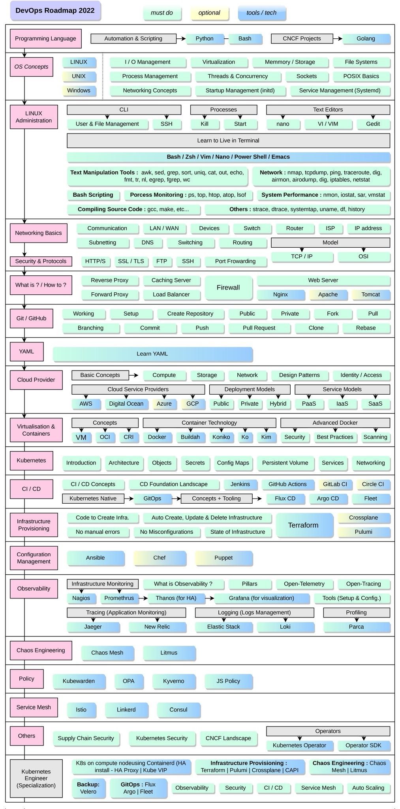

## 前言

一个互联网技术玩家，一个爱聊技术的家伙。在工作和学习中不断思考，把这些思考总结出来，并分享，和大家一起交流进步。

合理化的图文组织，让大家可以更容易学习一个技术。

今天分享的是 一个外国小哥整理的 DevOps Roadmap，原地址在[这里](https://github.com/Vrashabh-Sontakke/Complete_DevOps_Roadmap_2022)。

## 说说
这个图垒起来了非常全面的技术和技术组件，从内容介绍上来说非常全面，而且也做了较为明确的分层。对于要全面学习的同学来说这个就非常合适了，可以从较为高的一个视角去看DevOps所涉及的技术和技术组件。

但是，也有一些缺点，对于初学者非常不友好，无处下手，不知道该从里开始。但是学习到后面还是需要有全面的了解。

另外好像也是一种梳理知识体系的方法，大家可以学习一下，把自己在某个领域的知识以这种层级方式不断梳理细化，成为自己的领域知识地图。

看完本文有收获？请分享给更多人

关注「黑光技术」，关注大数据+微服务

