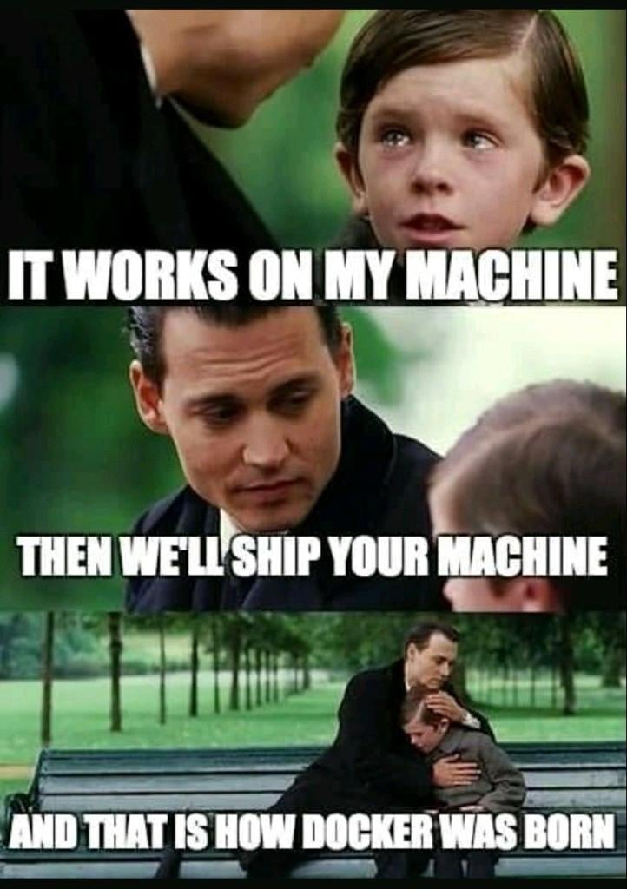

## 前言

一个互联网技术玩家，一个爱聊技术的家伙。在工作和学习中不断思考，把这些思考总结出来，并分享，和大家一起交流进步。

合理化的图文组织，让大家可以更容易学习一个技术。

今天分享的是在 facebook 上看到的一个对 sre 学习的图，感觉不错，比较清晰的指出 sre 应该怎么做。

## 说说
有意思的一张图片，感觉就是这样的，哈哈哈。

在你机器上跑的好好的，那就把你的机器拿过来吧，让他在我这里跑。

让程序所有的运行环境都不发生变化的情况下运行。docker 就是这么做的。

感受到痛之后才能改变。

看完本文有收获？请分享给更多人

关注「黑光技术」，关注大数据+微服务

