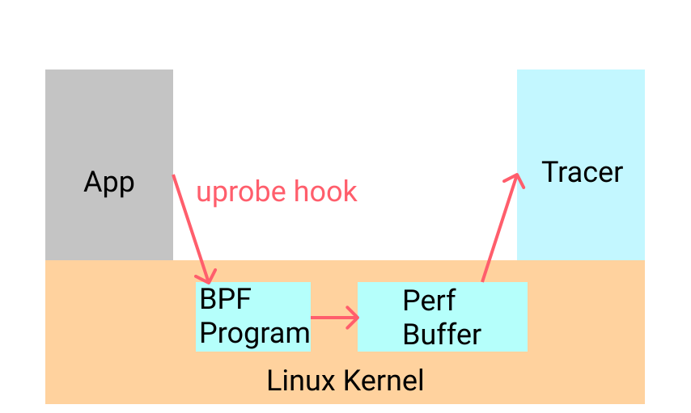
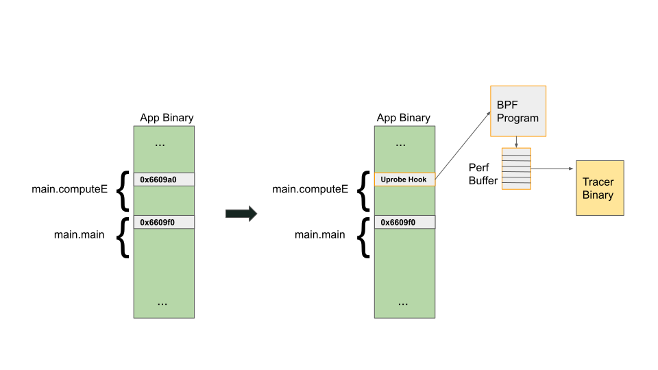
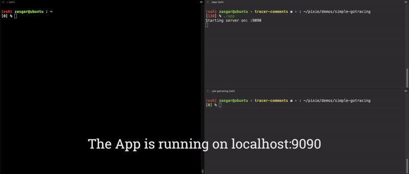

原文地址：https://blog.px.dev/ebpf-function-tracing/

## 前言
这是一系列文章中的第一篇，这个系列的文字是分析记录我们如何在生产环境中使用 eBPF 调试应用程序，而不需要重新编译/重新部署。这篇文章描述了如何使用 [gobpf](https://github.com/iovisor/gobpf) 和 uprobes 为 Go 应用程序构建函数参数跟踪器。该技术也可扩展到其他编译语言，如 C++、Rust 等。本系列的下一篇文章将讨论使用 eBPF 跟踪 HTTP/gRPC 数据、SSL等。

在调试时，我们通常对捕获程序的状态比较感兴趣。这可以让我们检查应用程序正在做什么，并确定 bug 在代码中的位置。观察状态的一种简单方法是使用调试器捕获函数参数。对于 Go 应用程序，我们通常使用 Delve 或 gdb。

Delve 和 gdb 可以很好地用于开发环境中的调试，但它们不经常用于生产环境中。使这些调试器强大的特性也会使它们不适合在生产系统中使用。调试器可能对程序造成严重的中断，甚至允许状态突变，从而可能导致生产软件的意外故障。

## eBPF

为了更清晰地捕获函数参数，我们将探索使用增强的 BPF ([eBPF](https://ebpf.io/))，它可以在在 Linux 4 以上的内核系统中可用，以及探索使用更高级别的 Go 库 [gobpf](https://github.com/iovisor/gobpf)。

扩展 BPF (eBPF)是 Linux 4.x+ 中出现的一项内核技术。你可以将它看作是一个轻量级的沙盒 VM，它运行在 Linux 内核内部，可以在经过验证的的前提下提供对内核内存的访问。

如下面的概述所示，eBPF 允许内核运行 BPF 字节码。虽然使用的前端语言可能不同，但它通常是 C 语言的受限子集。通常，C 代码首先使用Clang 编译为 BPF 字节码，然后对字节码进行验证，以确保它可以安全执行。这些严格的验证保证了机器代码不会有意或无意地破坏 Linux 内核，并且在每次触发 BPF 探测时，它将在有限数量的指令中执行。这些保证使 eBPF 能够用于性能关键的工作负载，如包过滤、网络监视等。

从功能上讲，eBPF 允许你在某些事件触发下运行受限制的C代码（比如：定时器、网络事件或函数调用)。当在函数调用中被触发时，我们将这些函数称为探针，它们可以用于运行内核中的函数调用（kprobes），或者运行用户空间程序中的函数调用（uprobe）。这篇文章的重点是使用uprobes 来进行动态函数参数的跟踪。

## Uprobes

Uprobe 允许你通过插入一个触发软中断的调试指令（x86上是 `int3`）来拦截用户空间程序。这也是 [调试器的工作原理](https://eli.thegreenplace.net/2011/01/27/how-debuggers-work-part-2-breakpoints)。uprobe 的执行流程本质上与任何其他 BPF 程序相同，并在下面的图表中进行了总结。编译和验证的 BPF 程序作为 uprobe 的一部分被执行，结果可以被写入缓冲区。

")

BPF  (来自 Brendan Gregg)

我们看看 uprobe 实际上是怎么工作的。为了部署 uprobe 并捕获函数参数，我们将使用[这个](https://github.com/pixie-io/pixie-demos/blob/main/simple-gotracing/app/app.go)简单的演示应用程序。这个 Go 程序的相关部分如下所示。

`main()` 是一个简单的 HTTP 服务器，它在 _/e_ 上公开一个 _GET_ 端点，它使用迭代逼近计算欧拉数(**e**)。`computeE` 接受单个查询参数（_iters_），该参数指定为近似运算而运行的迭代次数。迭代次数越多，以计算周期为代价的结果近似就越准确。理解函数背后的数学原理并不重要。我们只对跟踪`computeE` 的任何调用的参数感兴趣。
``` go
// computeE 通过一个指定的运行数值来计算 e 的近似值
func computeE(iterations int64) float64 {
  res := 2.0
  fact := 1.0

  for i := int64(2); i < iterations; i++ {
    fact *= float64(i)
    res += 1 / fact
  }
  return res
}

func main() {
  http.HandleFunc("/e", func(w http.ResponseWriter, r *http.Request) {
    // 从 get 请求的参数重解析初 iters 参数，如果没有则使用默认值。
    // ... 代码暂时删除 ...
    w.Write([]byte(fmt.Sprintf("e = %0.4f\n", computeE(iters))))
  })
  // 启动服务...
}
```

为了理解 uprobe 是如何工作的，让我们看看如何在二进制文件中跟踪符号。因为 uprobe 是通过插入调试陷阱指令来工作的，所以我们需要获取函数所在的地址。Linux 上的 Go 二进制文件使用 ELF 存储调试信息。此信息是可以用的，即使在优化的二进制文件中也是可以读取使用，除非已经剥离了调试数据（如使用 strip 命令）。我们可以使用 `objdump` 命令来检查二进制文件中的符号:

``` sh
[0] % objdump --syms app|grep computeE
00000000006609a0 g     F .text    000000000000004b              main.computeE

```

从输出中，我们知道函数 `computeE`  位于地址 `0x6609a0`。为了查看它周围的指令，我们可以使用 `objdump` 将其分解为二进制文件(通过添加 `-d` 来完成)。解析后的代码如下：

``` sh
[0] % objdump -d app | less
00000000006609a0 <main.computeE>:
  6609a0:       48 8b 44 24 08          mov    0x8(%rsp),%rax
  6609a5:       b9 02 00 00 00          mov    $0x2,%ecx
  6609aa:       f2 0f 10 05 16 a6 0f    movsd  0xfa616(%rip),%xmm0
  6609b1:       00
  6609b2:       f2 0f 10 0d 36 a6 0f    movsd  0xfa636(%rip),%xmm1

```

从这里我们可以看到 `computeE` 被调用时会发生什么。第一条指令是 `mov 0x8(%rsp)，%rax`。这 从 `rsp` 寄存器偏移 `0x8` 再移动到 `rax` 寄存器。这实际上是上面的输入参数 `iterations`；Go 的参数在堆栈上传递。

有了这些信息，我们现在可以深入研究并编写代码来跟踪 `computeE` 的参数。

为了捕获事件，我们需要注册一个 uprobe 函数，并写一个可以读取输出的用户空间函数。如下图所示。我们将编写一个名为 `tracer` 的二进制程序，它负责注册 BPF 代码并读取 BPF 代码的结果。如图，uprobe 将简单地写入 perf buffer，这是用于 perf 事件的 linux 内核数据结构。




显示 Tracer 二进制程序跟踪从应用程序生成的 perf 事件

现在我们了解了所涉及的部分，让我们看看添加 uprobe 时发生的详细情况。下图显示了 Linux 内核如何使用 uprobe 修改二进制文件。软中断指令(`int3`)作为 `main.computeE` 中的第一个指令插入。这会导致一个软中断，允许 Linux 内核执行我们的 BPF 函数。然后将参数写入 perf-buffer 缓冲区，再由跟踪程序 `tracer` 异步读取。


如何使用调试陷阱指令调用 BPF 程序的详细信息

这种 BPF 函数相对简单；C 代码如下所示。我们注册这个函数，以便每次 `main.computee` 被调用时它都会被调用。一旦调用了它，我们只需读取函数参数并将其写入 perf buffer 缓冲区。设置缓冲区需要许多的配置信息，可以参考这个[完整示例](https://github.com/pixie-io/pixie-demos/blob/main/simple-gotracing/trace_example/trace.go)。

``` c
#include <uapi/linux/ptrace.h>

BPF_PERF_OUTPUT(trace);

inline int computeECalled(struct pt_regs *ctx) {
  // 输入参数存储在 ax 中
  long val = ctx->ax;
  trace.perf_submit(ctx, &val, sizeof(val));
  return 0;
}

```

现在我们有了一个功能完备的 `main.computeE` 函数的端到端参数跟踪器！结果如下面的视频剪辑所示。



示例

其中很酷的一件事情是，我们实际上可以使用 GDB 查看对二进制文件所做的修改。在运行跟踪程序二进制之前，我们解析初在 `0x6609a0 `地址的指令。

``` sh
(gdb) display /4i 0x6609a0
10: x/4i 0x6609a0
   0x6609a0 <main.computeE>:    mov    0x8(%rsp),%rax
   0x6609a5 <main.computeE+5>:  mov    $0x2,%ecx
   0x6609aa <main.computeE+10>: movsd  0xfa616(%rip),%xmm0
   0x6609b2 <main.computeE+18>: movsd  0xfa636(%rip),%xmm1

```

下面是运行 tracer 二进制跟踪程序后的结果。我们可以清楚地看到，第一条指令现在是 `int3 `。

``` sh
(gdb) display /4i 0x6609a0
7: x/4i 0x6609a0
   0x6609a0 <main.computeE>:    int3
   0x6609a1 <main.computeE+1>:  mov    0x8(%rsp),%eax
   0x6609a5 <main.computeE+5>:  mov    $0x2,%ecx
   0x6609aa <main.computeE+10>: movsd  0xfa616(%rip),%xmm0

```

尽管我们为这个特定的示例硬编码了跟踪程序 tracer，但也是可以让这个过程通用化的。Go 的许多方面，如嵌套指针、接口、通道等，使这个过程很有挑战性，但是，要解决这些问题，需要另一种现有系统中无法使用的检测模式。此外，由于这个过程在二进制级别上工作，它可以用于其他语言(C++、Rust等)的本机编译二进制文件。我们只需要考虑它们各自 ABI 的差异。

使用 uprobe 跟踪 BPF 有它自己的优点和缺点。当我们要对二进制状态进行可观察时，BPF 是不错的选择，即使是在附加调试器会有问题或有害的环境中运行(例如生产二进制)。最大的缺点是即使是要观察很小的应用程序状态也需要代码。虽然 BPF 代码相对容易访问，但编写和维护起来比较复杂。如果没有大量的高级工具，就不太可能将其用于通用的调试中。

我们在 Pixie 目前就在做跟踪 Go 动态日志记录的事情。可以查看[这个项目](https://docs.px.dev/tutorials/simple-go-tracing/)来查看 Pixie 如何跟踪在 K8s 集群上运行的 Go 应用程序。

## 参考文献

-   [iovisor/gobpf](https://github.com/iovisor/gobpf)
-   [iovisor/bcc](https://github.com/iovisor/bcc)