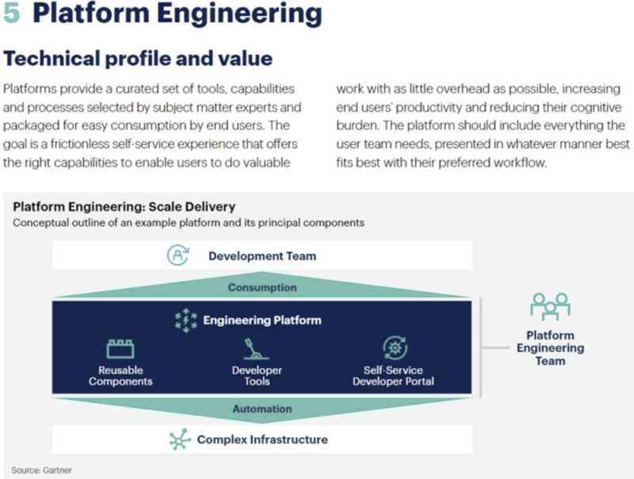
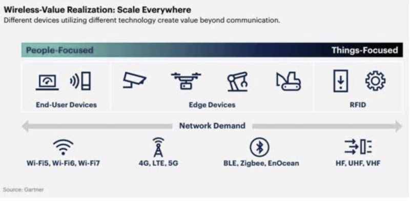
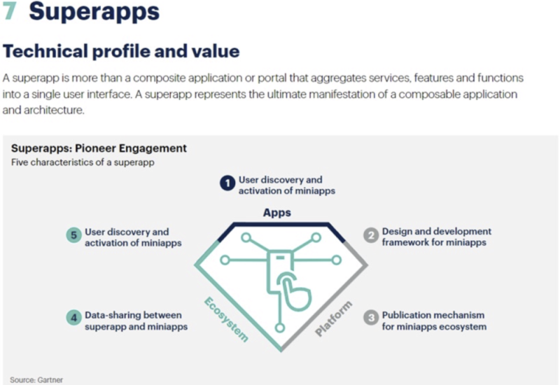
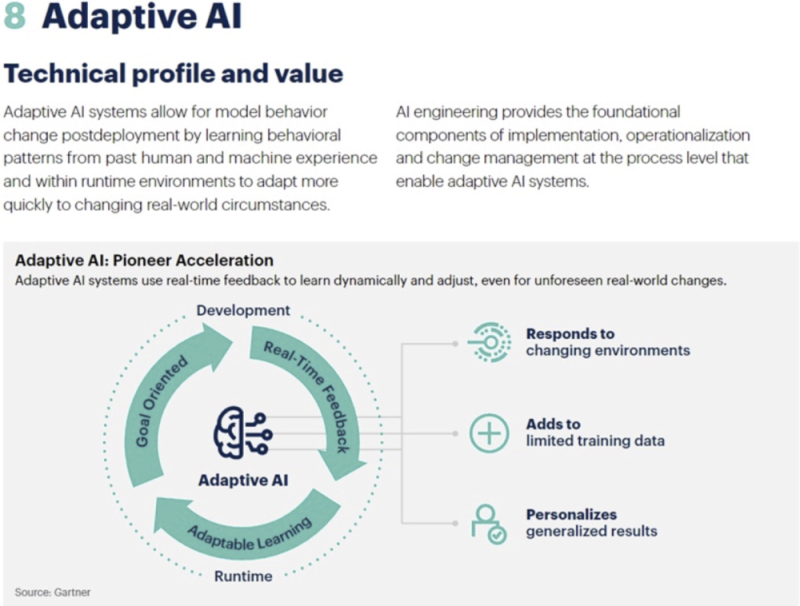
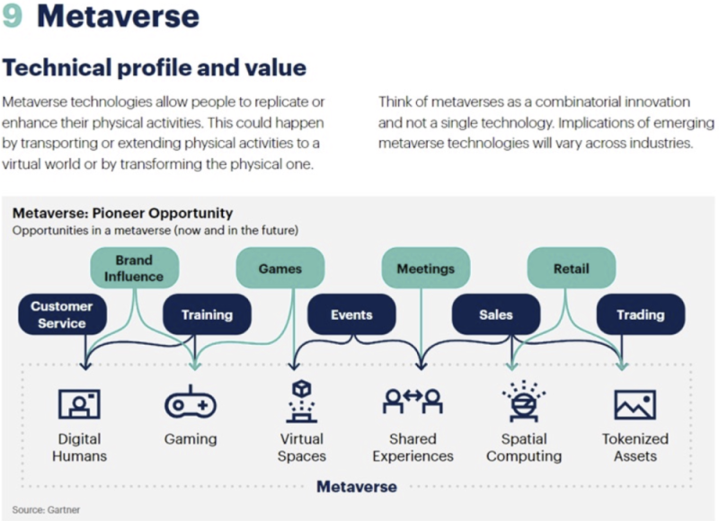
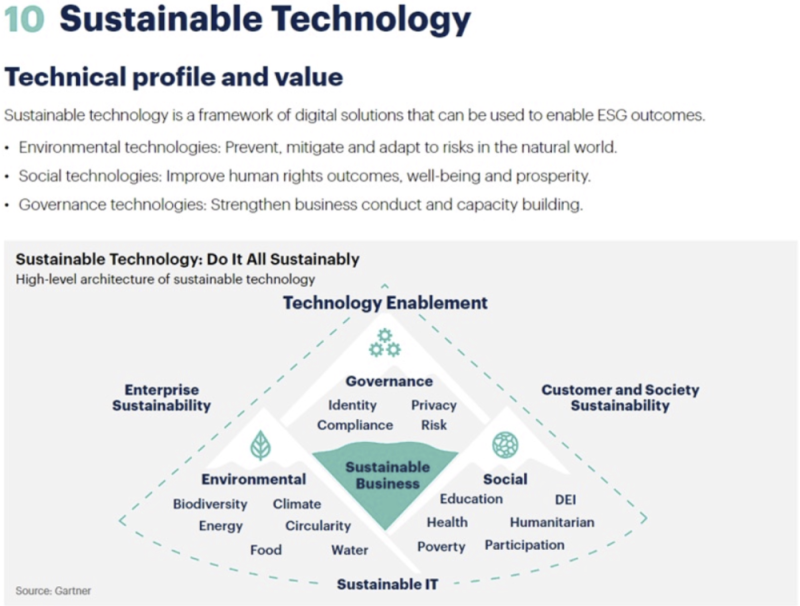

## 回顾 2022

这张图是 Gartner 在 2022 年的技术趋势预测。

## 前言
Gartner发布了《2023年十大战略技 术趋势》报告。该报告可以帮助组织领导者、技术人员等，在未来 36 个月掌握最新技术的发展趋势。技术趋势 划分为优化、开拓、扩展三大主题: 
1. Ø 优化 
	1. ① 数字免疫系统
	2. ② 应用可观测性
	3. ③ AI信任,风险和安全管理 
2. Ø 扩展 
	1. ④ 行业云平台
	2. ⑤ 平台工程 
	3. ⑥ 无线价值实现 
3. Ø 开拓 
	1. ⑦ 超级应用 
	2. ⑧ 自适应AI 
	3. ⑨ 元宇宙 
	4. ⑩ 可持续技术

## 数字免疫系统(Digital Immune System)
数字免疫系统 (DIS) 结合了可观测性、人工智能 (AI) 增强测试、混沌工程、自动修复、站点可靠性(SRE)和供应链安全等实践和技术，以提高产品、服务和系统的弹性。
### • 实践案例 
美国航空公司使用站点可靠性工程、混沌工 程实践和“测试优先”方法来更好地处理系 统复杂性并解决未知的漏洞和弱点。 Gartner 表示，这增加了其系统知识并揭示 了一个巨大的弹性漏洞。
### • Gartner预测 
到 2025 年，投资建设数字免疫系统的企业机构将能够减少多达 80% 的系统宕机时间，所减少的损失将直接转化为更高的收入。

## 应用可观测性(Applied Observability)
应用可观测性是在跨业务功能、应用程序、基础设施、运营 (I&O) 团队高度协调和集成可观测数据的方法，实现从行动到反馈、主动规划业务决策的最短延迟。
### • 实践案例1 
特斯拉是一个使用应用可观测性的典型案例。
该技术通过实时观察特斯拉车主的驾驶行为，在美国几个州为他们提供车辆保险。特斯拉 汽车使用传感器和 Autopilot 软件“观察” 和测量驾驶行为，以生成每月安全评分。特斯拉表示，那些通过安全评分的司机可以节省 20% 到 40% 的保费，而那些安全分数最高 的司机可以节省 40% 到 60% 费用。

### • Gartner预测 
到 2026 年，70% 成功应用可观测性的组织将实现更短 的决策延迟，从而为业务目标或IT流程带来竞争优势。

## 人工智能信任、风险和安全管理(AI Trust, Risk and Security Management，简称AI TRiSM)
人工智能需要传统控制无法提供的新形式的信任、风险和安全管理。新的AI TRiSM功能可确保模型的可靠性、可信度、安全性和隐私性，并在AI应用、实现业务目标和用户接受度方面取得了更好的成果。
### • 实践案例  
丹麦商业管理局 (DBA) 开发了一种将高级道德原则应用于其 AI 模型的方法。DBA 将其 道德原则与具体行动联系起来，根据公平测试、检查模型、预测并建立模型监控框架。 DBA 的方法帮助其快速部署和管理 16 个 AI 模 型，用于监控价值数十亿欧元的金融交易。
### • Gartner预测  
到 2026 年，实施人工智能信任、风险和安全管理的组织，将看到他们的AI 模型在采用、业务目标和用户接 受度方面实现 50% 的结果改进。

## 行业云平台(Industry Cloud Platforms)
行业云平台通过组合 SaaS、平台即服务(PaaS)和基础设施即服务(IaaS)提供支持行业应用 场景的行业模块化能力。企业可以将行业云平台的打包功能作为基础模块，组合成独特、差异化的数字业务项目，在提高敏捷性、推动创新和缩短产品上市时间的同时避免单一厂商锁定。
### • 实践案例
杭州是中国人口最多的城市之一，通过与阿 里巴巴的技术合作建立了“智慧城市大脑” 平台，来管理拥堵并简化日常城市运营。该平台结合了数字化基础设施、中央数据平台和海量应用。实施后，该市的拥堵排名大幅下降，从中国第五大拥堵城市跌至前 50 名。
### • Gartner预测
到 2027 年，超过 50% 的企业将使用行业云平台来加速 他们的业务项目。

## 平台工程(Platform Engineering)
平台工程是一套用来构建和运营支持软件交付和生命周期管理的自助式内部开发者平台的机制和架构。平台工程的目标是优化开发者体验并加快产品团队为客户创造价值的速度。
### • 实践案例 
耐克建立了“可组合平台”，将战略相关的全球业务能力结合起来，这些能力由通过 API 公开的模块化和可组合技术实现。耐克发现 该平台使其能够更快地响应变化，加快产品上市时间，提高可扩展性并降低运营成本。
### • Gartner预测 
到 2026 年，80% 的软件工程组织将建立平台团队，其中 75% 将包含开发者自助服务门户。

## 无线价值实现(Wireless Value Realization)
无线价值实现了从传统终端用户计算，到支持边缘设备再到数字标签解决方案的方方面面。所有这些都需要连接才能运行，并且需要一系列无线解决方案来满足所有环境的需求。
### • 实践案例  
以色列零售商 Shufersal 正在使用来自网 络的电力来为商品贴上低能耗物联网芯片的标签。它使用这些直接跟踪从农场到商 店货架的蔬菜，提供供应链可见性、库存 管理和来源信息。
### • Gartner预测 
到 2025 年，50% 的企业无线端点将使用网络服务，提供通信以外的其他功能，而这一比例低于 15%。

## 超级应用(Superapps)
超级应用是为最终用户(例如，客户、合作伙伴或员工)提供一组核心功能，以及访问独立创建小应用(mini apps)的应用。超级应用程序被构建为一个平台，可提供一致和个性化的应用程序体验。
### • 实践案例 
PayPay 是一家日本支付提供商，拥有近 5000 万用户。其增长战略的一个关键部分是将第三方产品和服务的购买，整合到其超级应用程序中，它已经提供了用于购 买电影票、订购外卖和自行车共享的第三方小应用程序，以及自己的财务管理应用 程序服务和零售购物等。
### • Gartner预测 
到 2027 年，全球超过 50% 的人口将成为多个超级应用的日活跃用户。

## 自适应人工智能(Adaptive AI)
自适应人工智能系统不断地重新训练模型并根据新数据在运行时和开发环境中学习，以快速适应初始 开发期间未预见或不可用的环境变化。
### • 实践案例 
美国化学和材料制造商陶氏公司部署了自适应人工智能系统，利用对使用模式和业务价值优化的反馈来增强企业分析。它使分析平台产生的价值增加了 320%。
### • Gartner预测 
到 2026年，采用AI工程实践来构建和管理自适应 AI 系统的企业，将在AI模型的可操作性方面优于同行至少 25%。

## 元宇宙(Metaverse)
元宇宙是定义为一个集体虚拟 3D 共享空间，由虚拟增强的物理和数字现实的融合创建，是持久的， 提供增强的沉浸式体验。
### • 实践案例 
印度虚拟现实初创公司 OneRare 正在为美 食爱好者打造身临其境的游戏化体验，让食品品牌进入全球市场，通过提供食品吸引游戏玩家，并在虚拟和实体商店中使用。
### • Gartner预测 
到 2027 年，全球超过 40% 的大型企业机构将在基于元 宇宙的项目中使用Web3、增强现实(AR)云和数字 孪生的组合来增加收入。

## 可持续技术(Sustainability)
可持续技术是一种解决方案框架，可提高 IT服务的能源和效率;通过可追溯性、分析、可再生能源等技术实现企业可持续发展;并通过应用程序、软件、市场等帮助客户变得更具可持续性。

### • 实践案例  
迪拜电力和水务局 (DEWA) 等公用事业部门，使用物联网和数字孪生创建智能建筑 管理解决方案，用水量减少 50%。
### • Gartner预测  
到 2025 年，50% 的 CIO 将拥有与 IT 组织的可持续性相 关的绩效指标。

完整报告地址： https://www.gartner.com/en/articles/gartner-top-10-strategic-technology-trends-for-2023

看完本文有收获？请分享给更多人

关注「黑光技术」，关注大数据+微服务

