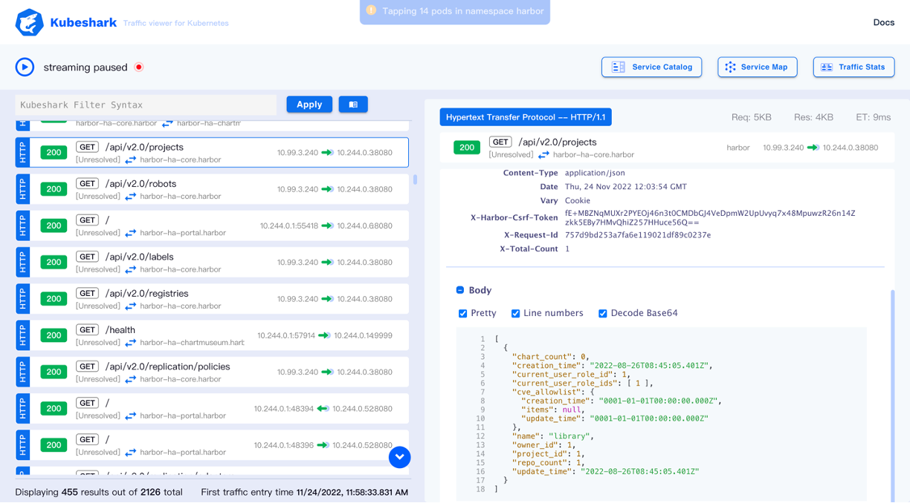

## 前言
上周公司同事在内部分享了 Kubeshark 这个组件，感觉还是挺有意思，所以这里整理了他收集的一些资料，再结合网上的其他资料，总结了解了一下这个组件。

## 一、Kubeshark 是什么？

Kubeshark 由 2021 年 UP9 公司开源的 K8s API 流量查看器 Mizu 发展而来，试图成为一款 K8s 全过程流量监控工具。

Kubeshark 被叫做 kubernetes 的 API 流量查看器，它提供对进出 Kubernetes 集群内容器和 pod 的所有 API 流量和负载的深度可见性和监控。 类似于针对 Kubernetes 而重新发明的 TCPDump 和 Wireshark。
地址：[https://github.com/kubeshark/kubeshark](https://github.com/kubeshark/kubeshark)


 


Kubeshark 也被叫做 Kubernetes 的可观测性工具，可以对微服务进行动态分析，检测异常并在运行时出现某些模式时触发功能。
1. 可以将 Kubeshark 视为 Wireshark、BPF 编译器集合 (BCC) 工具等的 Kubernetes 感知组合。
2. Kubeshark 可以嗅探集群中的部分或所有 TCP 流量，将其记录到 PCAP 文件中并剖析。
3. Kubeshark 使用 eBPF 来跟踪内核空间和用户空间中的函数调用。



## 二、Kubeshark 架构

Kubeshark 由三个不同的软件组成，它们可以协同工作：CLI、Hub 和 Worker。

1. CLI，它是客户端的 二进制文件，通过 K8s API 与集群通信。
2. Hub，它协调 worker 部署，接收来自每个 worker 的嗅探和剖析，并收集到一个中心位置。它还提供一个Web界面，用于在浏览器上显示收集到的流量。
3. Work，作为 DaemonSet 部署到集群中，以确保集群中的每个节点都被 Kubeshark 覆盖。


## 三、Kubeshark 功能
### 1）Kubeshark 功能 - 网络嗅探

Kubeshark 可以使用 Linux 内核中内置的各种方法和 API 嗅探集群中的加密和未加密流量。

1. 直接抓包，直接使用 libpcap、AF_PACKET 和 PF_RING 嗅探集群中的 TCP 流量，并将其记录到 PCAP 文件中。例如在使用服务网格的场景中，Kubeshark 会自动检测任何 Envoy Proxy并将其包含到其 TCP 数据包捕获源列表中。
2. 基于 eBPF 抓包，基于 eBPF 的数据包捕获使用 eBPF 嗅探集群中的加密流量 (TLS)，而无需实际进行解密。事实上，它挂钩到 OpenSSL 库和 Go 的 crypto/tls 包中某些函数的入口点和出口点。

###  2）Kubeshark 功能 – 查询

### 3）Kubeshark 功能 – 内核跟踪
Kubeshark 使用 🐝 eBPF（扩展伯克利数据包过滤器）提供跟踪内核空间和用户空间功能。
``` sh
# 捕获加密的 TLS 流量

kubeshark tap --tls -n harbor
```


### 3）Kubeshark 功能 – 流量校验
Kubeshark 具有流量验证功能，可与网络嗅探器功能结合使用。
``` yaml
rules:
    - name: Catalogue-Latency-SLO #catalogue's service "/catalogue" response time < 300
      type: latency
      path: /catalogue
      latency: 300
      service: "catalogue.*"
    - name: FECatalogue-Latency-SLO #front-end's service "/catalogue" response time < 600m
      type: latency
      path: /catalogue
      latency: 600
      service: "front-end.*"
```

### 4）Kubeshark 功能 – 服务地图

部署完成后，Kubeshark CLI 将在 http://localhost:8899 打开 UI 单击右上角名为 Service Map 的按钮打开服务依赖关系图。该图根据网络流量显示 Pod 以及它们之间的关系。


### 5）Kubeshark 功能 – 数据脱敏
Kubeshark 捕获的流量包含敏感信息。用户可以配置 Kubeshark 以隐藏某些关键字或数据片段将在 UI 中显示为 [REDACTED]。

默认的脱敏字段
"token", "authorization", "authentication", "cookie", "userid", "password", "username",

"user", "key", "passcode", "pass", "auth", "authtoken", "jwt", "bearer", "clientid",

"clientsecret", "redirecturi", "phonenumber", "zip", "zipcode", "address", "country",

"firstname", "lastname", "middlename", "fname", "lname", "birthdate"

## 四、一些使用场景和用法

可以直接在其 github 站点上看到这些基本使用场景。

### 1）监控指定的 Pod

``` sh
kubeshark tap catalogue-b87b45784-sxc8q
```


### 2）使用正则表达式监控一组 Pod 

``` sh
kubeshark tap "(catalo*|front-end*)"
```


### 3）指定监控的 Namespace

默认情况下，Kubeshark 部署在 `default` namespace 中，也是监听这个 namespace，可以使用下面的命令指定到一个不同的 namespace 中

```
kubeshark tap -n sock-shop
```

### 4）指定所有 Namespaces

``` sh
kubeshark tap -A
```

## 五、总结
该工具底层基于 ePBF、Linux 内核网络 API，并且解决了流量数据加解密问题，整体上看是一款能够满足对 K8s 全过程流量监控与管理的工具。

但目前的实现还只是一个功能原型，在数据存储、网络访问、单机瓶颈等方面仍然存在问题，也不具备模拟流量仿真能力。优势在于提供了流量查询语言 KFL 和微服务流量关联的知识图谱展示。


<center>
看完本文有收获？请分享给更多人

关注「黑光技术」，关注大数据+微服务


</center>