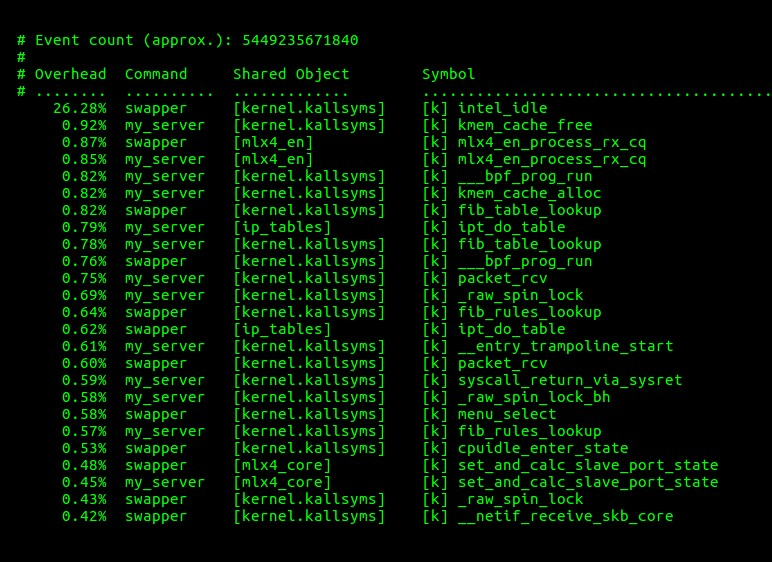

原文地址：[https://blog.flipkart.tech/linux-tcp-so-reuseport-usage-and-implementation-6bfbf642885a](https://blog.flipkart.tech/linux-tcp-so-reuseport-usage-and-implementation-6bfbf642885a)

## 前言

Linux 网络栈中有一个相对较新的特性——SO_REUSEPORT 套接字选项，可以使用它来提升你的服务性能。


**图 1: 上面的服务是使用并行监听器来避免请求连接瓶颈，而下面的服务只使用一个监听器来接收连接**

**概要**

HAProxy 和 NGINX 是少数几个使用 Linux 网络栈中 TCP 的 SO_REUSEPORT 套接字选项[1]的应用程序。这个选项最初是在 4.4 BSD 中引入的，帮助在现在大型多核系统中实现高性能服务。本文的前几节将解释 TCP/IP 套接字的一些基本概念，其余部分将使用这些知识描述 SO_REUSEPORT 套接字选项的基本原理、用法和实现。

**问题陈述**

当运行在多核系统上时，高性能服务采用的传统方法是使用单个监听器进程接受连接，并将这些连接传递给工作进程进行处理。但在高连接负载下，监听过程成为瓶颈。服务经常使用的另一种方法是打开一个监听套接字，然后分多个进程，每个进程调用 accept() 来处理套接字上的接入的连接，同时自己执行工作。这种方法的问题是，开始拾取连接的过程往往会获得高度倾斜的连接。在本文中，我们将讨论第三种替代方法——打开多个监听套接字，使用SO_REUSEPORT 处理传入的连接，这既解决了单个进程瓶颈问题，也解决了进程之间的连接倾斜问题。

**TCP 连接基础**

一个 TCP 连接是由唯一的一个 5 元组来定义描述 **[2]**:
> **_[ Protocol, Source IP address, Source Port, Destination IP address, Destination Port ]_**

客户端和服务端以不同的方式指定各个元组内元素。下面一起来了解应用程序是如何初始化每个元组元素的。

**客户端应用**

- **Protocol**：该字段在根据应用程序提供的参数在创建套接字时初始化。在本文中，协议始终是 TCP。例如,
	socket(AF_INET SOCK_STREAM 0); /* 创建TCP套接字 */
- **源 IP 地址和端口**：这些通常在应用程序调用 connect() 时由内核设置，而无需事先调用 bind()。内核为会选择一个合适的IP地址与目标服务通信，并从临时端口范围 (_sysctl net.ipv4.ip_local_port_range_) 中选择一个源端口。
- **目的 IP 地址和端口**：由应用程序通过调用 connect() 设置。例如:

``` c
server.sin_family = AF_INET;
server.sin_port = htons(SERVER_PORT);
bcopy(server_ent->h_addr, &server.sin_addr.s_addr, server_ent->h_length);

/* Connect to server, and set the socket's destination IP address and port#
* based on above parameters. Also, request the kernel to automatically set
* the Source IP and port# if the application did not call bind() prior to connect().
*/
connect(fd, (struct sockaddr *)&server, sizeof server);
```

**服务端应用**

- **协议**：初始化方式与客户端应用相同。
- **源 IP 地址和端口**：由应用程序调用 bind() 时设置，例如:

``` c
srv_addr.sin_family = AF_INET;
srv_addr.sin_addr.s_addr = INADDR_ANY;
srv_addr.sin_port = htons(SERVER_PORT);
bind(fd, &srv_addr, sizeof srv_addr);
```

**目的 IP 地址及端口**：客户端通过 TCP 三次握手连接服务端[3]。服务端的 TCP/IP 协议栈创建一个新的套接字来跟踪管理客户端连接，并从传入的客户端连接参数设置它的源 IP:port 和目的 IP:port。新的套接字的状态被转换为 ESTABLISHED 状态，而服务端的 LISTEN 套接字则保持不变。此时，服务端应用程序对 LISTEN 套接字上的 _accept()_ 的调用返回对新建立的套接字的引用。有关客户端和服务端应用程序的示例实现，请参阅本文末尾的源代码清单。

**TIME-WAIT 套接字**

一个 TIME-WAIT [4]套接字是在应用程序首先关闭它的 TCP 连接时创建的。这导致 TCP 4 次握手的启动，在此过程中，套接字状态从 ESTABLISHED 变为 FIN-WAIT1、FIN-WAIT2 到 TIME-WAIT，然后套接字被关闭。由于协议原因，TIME-WAIT 状态是一种延迟状态。应用程序可以通过发送 TCP RST 包来指示 TCP/IP 栈不让连接延迟。这样一来，连接就会立即终止，而不需要经过TCP 4 次握手。下面的代码片段通过指定套接字逗留时间为 0 秒来实现连接的重置：

``` c
const struct linger opt = { .l_onoff = 1, .l_linger = 0 };

setsockopt(fd, SOL_SOCKET, SO_LINGER, &opt, sizeof opt);

close(fd);
```

**理解服务器套接字的不同状态**

服务端通常在启动时执行以下系统调用：

``` c
1. Create a socket:
server_fd = socket(...);

2. Bind to a well known IP address and port#:
ret = bind(server_fd, ...);

3. Mark the socket as passive by changing it's state to LISTEN:
ret = listen(server_fd, ...);

4. Wait for a client to connect, and get a reference file descriptor:
client_fd = accept(server_fd, ...);
```

任何通过 _socket()_ 或 _accept()_ 系统调用创建的新套接字，都会在内核中使用 `struct sock` 结构[5]进行跟踪管理。在上面的代码片段中，在步骤 1 中创建了一个套接字，并在步骤 2 中绑定了一个明确的地址。这个套接字在步骤 3 中被转换为 LISTEN 状态。步骤 4 中调用 _accept()_，阻塞直到有客户端连接到这个 _IP:port_。客户端完成TCP 3 次握手后，内核创建一个套接字，并返回对该套接字的引用。新套接字的状态设置为 ESTABLISHED，而 _server_fd_ 套接字保持 LISTEN 状态。

**SO_REUSEADDR 套接字选项**

TCP 套接字的 SO_REUSEADDR 选项可以从以下两个用例中更好地理解:

**案例 #1.** 服务端应用程序重新启动分为两个步骤—退出之后再启动。在退出期间，服务端的 LISTEN 套接字立即关闭。让我们看看因为服务端的存在连接而可能出现的两种情况。
1. 所有已建立的连接都被这个濒死的服务端进程关闭，并且那些套接字转换到 TIME-WAIT 状态。
2. 所有已建立连接将被移交给子进程，并继续保持 ESTABLISHED 状态。

当服务端随后启动时，它尝试使用 EADDRINUSE 参数绑定到它监听端口时会失败，因为系统上的一些套接字已经绑定到这个 _IP:port_ 组合(例如，处于 TIME-WAIT 或 ESTABLISHED 状态的套接字)。这个问题的演示如下:

``` sh
# Server is listening on port #45000
$ ss -tan | grep :45000
LISTEN 0 1 10.20.1.1:45000 *:*
# A client connects to the server using it's source port 54762. A new
# socket is created and is seen in ESTABLISHED state, along with the
# earlier LISTEN socket.

$ ss -tan | grep :45000
LISTEN 0 1 10.20.1.1:45000 *:*
ESTAB 0 0 10.20.1.1:45000 10.20.1.100:54762

# Kill the server application.
$ pkill -9 my_server

# Restart the server application.
$ ./my_server 45000
bind: Address already in use

# Find out why
$ ss -tan | grep :45000
TIME-WAIT 0 0 10.20.1.1:45000 10.20.1.100:54762
```

此清单显示前面已经是 ESTABLISHED 状态的套接字与现在在 TIME-WAIT 状态下的套接字相同。由于这个绑定到本地地址- 10.20.1.1:45000 的套接字的存在，阻止了接下来服务为它的 LISTEN 套接字 _bind()_ 到相同的 _IP:port_ 组合。

**用例 # 2** 如果两个进程试图 _bind()_ 到相同的 _IP:port_ 组合，先执行 _bind()_ 的进程会成功，而后执行 _bind()_ 的进程会由于EADDRINUSE 而失败。此用例的另一个实例涉及到一个绑定到特定 _IP:port_ (例如，192.168.100.1:80)的应用程序，以及另一个试图绑定到具有相同端口号的通配符 IP 地址的应用程序(例如，0.0.0.0:80)；同样，后一个 _bind()_ 调用失败，因为它试图绑定到使用与第一个进程使用的相同端口号的所有地址。如果两个进程都在它们的套接字上设置了 SO_REUSEADDR 选项，那么两个套接字都可以成功绑定。但是，请注意一点——如果第一个进程调用了 _bind()_ 和 _listen()_ ，第二个进程仍然无法成功执行 _bind()_ ，因为第一个套接字处于 LISTEN 状态。因此，这个用例的实现通常用于那些想在连接到不同服务之前绑定到特定 IP:port 的客户端。

SO_REUSEADDR 如何帮助解决这个问题的呢？当服务重新启动并在设置了 SO_REUSEADDR 的套接字上调用 _bind()_ 时，内核忽略所有绑定到相同 _IP:port_ 组合的非 LISTEN 套接字。Richard Stevens 在他的**《Unix网络编程[6]》** 一书 中这样描述这个特性：“ SO_REUSEADDR 允许监听服务启动并绑定它的已知端口，即使创建的这个链接之前已经把这个端口作为它的本地端口”。

但是，我们需要 SO_REUSEPORT 选项来让两个或多个进程成功地在同一个端口上调用 _listen()_ 。这个选项将在后面的部分中进行更详细的说明。

**SO_REUSEPORT 套接字选项**

当现有的套接字在 ESTABLISHED 或 TIME-WAIT 状态时，SO_REUSEADDR 选项允许套接字 _bind()_ 到相同的 _IP:port_ 组合，而当现有的套接字在 LISTEN 状态时 SO_REUSEPORT 选项允许绑定到相同的 _IP:port_ 。当应用程序在启用SO_REUSEPORT 的套接字上调用 _bind()_ 或 _listen()_ 时，内核会忽略所有套接字，包括处于 LISTEN 状态的套接字。这允许多次调用服务进程，允许多个进程监听连接。下一节我们来研究一下内核怎么实现 SO_REUSEPORT 的。

**如何在多个监听器之间分配连接?**

当多个套接字处于 LISTEN 状态时，内核如何决定哪个套接字——以及哪个应用程序进程——接收传入连接？还是使用了轮训、最少连接、随机或者其他方法决定的？我们来更深入地研究一下 TCP/IP 代码，以理解套接字选择是如何执行的。

**注意:**

1. 为了清晰起见，本节中的数据结构和代码片段进行了大量简化——删除了一些结构体元素、函数参数、变量和不必要的代码——但又不失正确性。为了更好地理解，清单的某些部分是伪代码。
2. **sk** 表示 “_struct sock_” 类型的内核套接字数据结构。
3. **skb**，即套接字缓冲区，表示 “_struct sk_buff_” 类型的网络包。
4. _src_addr、src_port_ 和 _dst_addr, dst_port_ 分别表示：源IP:端口和目的IP:端口。
5. 如果需要，读者可以将代码片段与实际内核源代码[5]关联起来一起看。


当传入网络数据包 **skb** 在提交到 TCP/IP 协议栈中时，IP 子系统就会调用 TCP 的数据包接收处理函数 _tcp_v4_rcv()_，并提供 **skb** 作为参数。_tcp_v4_rcv()_ 会尝试寻找与此 skb 相关的套接字:

``` c
_sk = __inet_lookup_skb(&tcp_hashinfo, skb, src_port, dst_port);_
```

_tcp_hashinfo_ 是一个类型为 “_struct inet_hashinfo_” 的全局变量，其中包含了 ESTABLISHED 和 LISTEN 套接字的两个哈希表。LISTEN 哈希表的大小为 32 个桶，如下所示:

``` c
#define LHTABLE_SIZE 32 /* Yes, really, this is all you need */

struct inet_hashinfo {
	/* Hash table for fully established sockets 已经建立好的套接字 */
	struct inet_ehash_bucket *ehash;
	
	/* Hash table for LISTEN sockets 处在 LISTEN 状态的套接字 */
	struct inet_listen_hashbucket listening_hash[LHTABLE_SIZE];

};

struct inet_hashinfo tcp_hashinfo;
```

\_\_inet_lookup_skb() 从传入的 **skb** 中提取**源和目的 IP 地址**，并将这些地址与源和目的端口一起传递给\_\_inet_lookup() 以查找相关的 ESTABLISHED 或 LISTEN 状态的套接字，如下所示:

``` c
struct sock *__inet_lookup_skb(tcp_hashinfo, skb, src_port, dst_port)
{
	/* Get the IPv4 header to know the source and destination IP's */
	const struct iphdr *iph = ip_hdr(skb);
	
	/*
	* Look up the incoming skb in tcp_hashinfo using the
	* [ Source-IP:Port, Destination-IP:Port ] tuple.
	*/
	return __inet_lookup(tcp_hashinfo, skb, iph->saddr, src_port, iph->daddr, dst_port);
}
```

\_\_inet_lookup()_ looks in _tcp_hashinfo->ehash_ hash-table for an already established socket matching the client 4-tuple parameters. In the absence of an established socket, it looks in _tcp_hashinfo->listening_hash_ hash-table for a LISTEN socket.
\_\_inet_lookup() 在 _tcp_hashinfo->ehash_ 哈希表中查找已经建立成功的套接字，匹配客户端4元组参数。如果没有找到，它将在 _tcp_hashinfo->listening_hash_ 哈希表中查找 LISTEN 套接字。

``` c
struct sock *__inet_lookup(tcp_hashinfo, skb, src_addr, src_port, dst_addr, dst_port)
{

	/* Convert dest_port# from network to host byte order */
	u16 hnum = ntohs(dst_port);
	
	/* First look for an established socket ... */
	sk = __inet_lookup_established(tcp_hashinfo, src_addr, src_port, dst_addr, hnum);
	
	if (sk)
		return sk;

	/* failing which, look for a LISTEN socket */
	return __inet_lookup_listener(tcp_hashinfo, skb, src_addr, src_port, dst_addr, hnum);
}
```

\_\_inet_lookup_listener() 函数进行已经存在的 LISTEN 套接字的选择：

``` c
struct sock *__inet_lookup_listener(tcp_hashinfo, skb, src_addr, src_port, dst_addr, dst_port)
{
	/*
	* Use the destination port# to calculate a hash table slot# of the listen socket.
	* inet_lhashfn() returns a number between 0 and INET_LHTABLE_SIZE-1 (both
	* inclusive).
	*/
	unsigned int hash = inet_lhashfn(dst_port);
	
	/* Use this hash slot# to index the global LISTEN hash table */
	struct inet_listen_hashbucket *ilb = tcp_hashinfo->listening_hash[hash];
	
	/* Keep track of the best matching LISTEN socket thus far, and it’s “score” */
	struct sock *result = NULL, *sk;
	
	int hi_score = 0;
	for each socket, ‘sk’, in the selected hash bucket, ‘ilb’ {
	
		/*
		* Calculate the “score” of this LISTEN socket (sk) against the incoming skb.
		* Score is computed on some parameters, such as, exact destination port#,
		* destination IP address closest match (as against matching INADDR_ANY,
		* for example), with each criteria getting a different weight.
		*/
		score = compute_score(sk, dst_port, dst_addr);
		
		if (score > hi_score) 
		/* Highest score - best matched socket till now */
			if (sk->sk_reuseport) {
			/*
			* sk has SO_REUSEPORT feature enabled. Call inet_ehashfn()
			* with dest_addr, dest_port, src_addr and src_port to compute a
			* 2nd hash - phash.
			*/
			phash = inet_ehashfn(dst_addr, dst_port, src_addr, src_port);
			
			/* Select socket from sk’s SO_REUSEPORT group using phash.*/
			result = reuseport_select_sock(sk, phash);
			
			if (result)
				return result;
			}
			/* Update new best socket and it’s score */
			result = sk;
			hi_score = score;
		}
	}
	
	return result;
}
```

由 _reuseport_select_sock()_ 负责从 SO_REUSEPORT 组中选择套接字：

``` c
struct sock *reuseport_select_sock(struct sock *sk, unsigned int phash)
{
	/* Get control block of sockets in this SO_REUSEPORT group */
	struct sock_reuseport *reuse = sk->sk_reuseport_cb;
	
	/* Get count of sockets in the group */
	int num_socks = reuse->num_socks;
	
	/* Calculate value between 0 and 'num_socks-1' (both inclusive) */
	unsigned int index = reciprocal_scale(phash, num_socks);
	
	/* Index into the SO_REUSEPORT group using this index, and return that socket */
	return reuse->socks[index];
}
```

我们需要退一步来理解这是如何实现的。当第一个进程在启用了 SO_REUSEPORT 的套接字上调用 _listen()_ 时，会分配它的 “_struct sock_” 结构中的指针- _sk_reuseport_cb_。该结构定义为:

``` c
struct sock_reuseport {
	u16 max_socks; /* Allocated size of socks[] array */
	u16 num_socks; /* #Elements in socks[] */
	struct sock *socks[0]; /* All sockets added to this group */
};
```

该结构的最后一个元素是“灵活数组成员”[7]。整个结构是这样分配的：_socks[]_ 数组有128个类型为“_struct sock *_”的元素。注意，当监听器的数量超过 128 时，这个结构会被重新分配，这个 _socks[]_ 数组的大小就会翻倍。

调用 _listen()_ 的第一个套接字 sk1 会被缓存在它自己的 _socks[]_ 数组的第一个槽位中，例如： _sk1->sk_reuseport_cb->socks[0] = sk1;_

当随后在绑定到相同 _IP:port_ 的其他套接字(sk2，…)上调用 _listen()_ 时，会执行两个操作:

1. 新套接字(sk2，…)的地址被附加到第一个套接字(sk1)的 _sk_reuseport_cb->socks[]_ 。
2. 新套接字的 _sk_reuseport_cb_ 指针指向第一个套接字的 _sk_reuseport_cb_ 指针。这确保同一组的所有 LISTEN 套接字引用相同的 _sk_reuseport_cb_ 指针。

这两个步骤的执行如下图所示


**图 2: LISTEN 套接字的 SO_REUSEPORT组**

在此图中，sk1 是第一个 LISTEN 套接字，而 sk2 和sk3 是随后调用 _listen()_ 的套接字。上面描述的两个步骤在下面的代码片段中执行，并通过 _listen()_ 调用链执行:

``` c
static int inet_reuseport_add_sock(struct sock *new_sk)
{
	/* First check if another identical LISTEN socket, prev_sk,
	
	* exists. ... Then do the following:
	
	*/
	
	if (prev_sk) {
		/*
		
		* Not the first listener - do the following:
		* - Grow prev_sk->sk_reuseport_cb structure if required.
		* - Save new_sk socket pointer in prev_sk's socks[].
		* - prev_sk->sk_reuseport_cb->socks[num_socks] = new_sk;
		* - prev_sk->sk_reuseport_cb->num_socks++;
		* - Pointer assignment of the control block:
		* new_sk->sk_reuseport_cb = prev_sk->sk_reuseport_cb;
		*/
		
		return reuseport_add_sock(new_sk, prev_sk);
	}

	/*
	* First listener - do the following:
	* - allocate new_sk->sk_reuseport_cb to contain 128 socks[]
	* - new_sk->sk_reuseport_cb->max_socks = 128;
	* - new_sk->sk_reuseport_cb->socks[0] = new_sk;
	* - new_sk->sk_reuseport_cb->numsocks = 1;
	*/
	
	return reuseport_alloc(new_sk);
}
```

现在让我们了解 _reuseport_select_sock()_ 如何选择 LISTEN 套接字。_reuseport_select_sock()_ 通过调用_reciprocal_scale()_ 简单地索引到 ' _socks[]_ ' 数组中，如下所示：

``` c
unsigned int index = reciprocal_scale(phash, num_socks);

return reuse->socks[index];
```

_reciprocal_scale()_ [8] 是一个优化的函数，它使用乘法和移位操作实现伪模运算

如前面所看到的， _‘phash’_ 是在 \_\_inet_lookup_listener() 函数中计算,
```c
phash = inet_ehashfn(dst_addr, dst_port, src_addr, src_port);_
```

_' num_socks '_ 是 socks[] 数组中的套接字个数。函数 _reciprocal_scale(phash, num_socks)_ 计算一个索引，索引>= 0，但是 < num_socks。该索引用于从 SO_REUSEPOR T套接字组中获取套接字。因此，我们看到内核通过对客户 _IP:port_ 和服务 _IP:port_ 计算哈希值来选择套接字。该方法对不同的 LISTEN 套接字上的连接可以做到较好的分配。

**来看如何实际使用 SO_REUSEPORT 选项**

让我们通过两个测试来看看 SO_REUSEPORT 的影响

1. 一个应用程序打开一个套接字用于监听，并创建两个进程。应用程序代码路径： _socket(); bind (); listen(); fork ()_；
2. 一个应用程序创建两个进程，每个进程在设置 SO_REUSEPORT 后创建一个 LISTEN 套接字。应用程序代码路径:_fork();socket();setsockopt (SO_REUSEPORT);bind ();listen()_；

先看看没有 SO_REUSEPORT 的套接字状态：

``` sh
$ ss -tlnpe | grep :45000LISTEN 0 128 *:45000 *:* users:(("my_server",pid=3020,fd=3),("my_server",pid=3019,fd=3)) ino:3854904087 sk:37d5a0
```

字符串 “_ino:3854904087 sk:37d5a0_” 就描述一个内核套接字。

再来看看有 SO_REUSEPORT 的套接字状态：
``` sh
$ ss -tlnpe | grep :45000

LISTEN 0 128 *:45000 *:* users:(("my_server",pid=1975,fd=3)) ino:3854935788 sk:37d59c

LISTEN 0 128 *:45000 *:* users:(("my_server",pid=1974,fd=3)) ino:3854935786 sk:37d59d
```

现在我们看到了两个不同的内核套接字——注意不同的 inode 号。

使用多个进程接受单个 LISTEN 套接字上的连接的应用程序可能会遇到严重的性能问题，因为每个进程在 _accept()_ 中争夺相同的套接字锁，如下面的简化伪代码所示:

``` c
struct sock *inet_csk_accept(struct sock *sk)
{
	struct sock *newsk = NULL; /* client socket */
	
	/* Make sure that this socket is listening, and that it has something pending. */
	lock_sock(sk);
	if (sk->sk_state == TCP_LISTEN)
		if ("there are completed connections waiting to be accepted")
			newsk = get_first_connection(sk);
	release_sock(sk);
	return newsk;
}
```

_lock_sock()_ 和 _release_sock()_ 都在内部获取并释放嵌入在' sk '中的自旋锁。参见本文后面的**图4**观察自旋锁竞争用造成的开销。

**Benchmarking SO_REUSEPORT**

以下设置用于测量 SO_REUSEPORT 性能：

1. 内核版本：4.17.13。
2. 客户端和服务端系统都有 48 个超线程核心，并通过交换机使用一个 40g NIC 相互连接。
3. 服务端有以下两种启动方式：
4. 创建一个 LISTEN 套接字和 fork 48 次;或
5. Fork 48 次，每个子进程在启用 SO_REUSEPORT 后创建一个 LISTEN 套接字。
6. 客户端创建 48 个进程。每个进程依次连接和断开与服务器的连接 100 万次。
7. 客户端和服务端应用程序的源代码在本文的末尾。

``` sh
With fork of the LISTEN socket
server-system-$ ./my_server 45000 48 0 # 0 indicates fork() of a LISTEN socket
client-system-$ time ./my_client <server-ip> 45000 48 1000000
real 4m45.471s
With SO_REUSEPORT
server-system-$ ./my_server 45000 48 1 # 1 indicates SO_REUSEPORT
client-system-$ time ./my_client <server-ip> 45000 48 1000000
real 1m36.766s
```


**SO_REUSEPORT 的性能分析**

让我们使用 **perf** [9] 工具查看以上两个测试的性能数据。图 3 和图 4 显示了在不使用 SO_REUSEPORT 的情况下进行上述测试的硬件性能统计和内核性能。


**图 3. 没有设置 SO_REUSEPORT 时硬件性能统计**


**图 4. 没有设置 SO_REUSEPORT 时 top 25 个函数的性能数据**

图 5 和图 6 显示了使用 SO_REUSEPORT 进行上述测试的硬件性能统计和内核性能。


**图 5. 设置了  SO_REUSEPORT 时硬件性能统计**



**图 6. 设置了 SO_REUSEPORT 时的 top 25 函数性能**

**客户端和服务端应用程序的源代码：**

下面实现了一个用于 SO_REUSEPORT 性能测试的服务端和客户端应用程序。

服务端程序:
``` c
#include <stdio.h>
#include <stdlib.h>
#include <unistd.h>
#include <sys/wait.h>
#include <netdb.h>

void create_children(int nprocs, int parent_pid)
{
	while (nprocs-- > 0) {
		if (getpid() == parent_pid && fork() < 0)
			exit(1);
	}
}

int main(int argc, char *argv[])
{
	int reuse_port, fd, cfd, nprocs, opt = 1, parent_pid = getpid();
	struct sockaddr_in server;
	
	if (argc != 4) {
		fprintf(stderr, "Port# #Procs {0->fork, or 1->SO_REUSEPORT}\n");
		return 1;
	}

	nprocs = atoi(argv[2]);
	reuse_port = atoi(argv[3]);
	
	if (reuse_port) /* proper SO_REUSEPORT */
		create_children(nprocs, parent_pid);
	
	if ((fd = socket(AF_INET, SOCK_STREAM, 0)) < 0) {
		perror("socket");
		return 1;
	}

	if (reuse_port)
		setsockopt(fd, SOL_SOCKET, SO_REUSEPORT, (char *)&opt, sizeof opt);
	
	server.sin_family = AF_INET;
	server.sin_addr.s_addr = INADDR_ANY;
	server.sin_port = htons(atoi(argv[1]));
	
	if (bind(fd, (struct sockaddr *)&server, sizeof server) < 0) {
		perror("bind");
		return 1;
	}
	
	if (!reuse_port) /* simple fork instead of SO_REUSEPORT */
		create_children(nprocs, parent_pid);
		
	if (parent_pid == getpid()) {
		while (wait(NULL) != -1); /* wait for all children */
	} else {
		listen(fd, SOMAXCONN);
		while (1) {
			if ((cfd = accept(fd, NULL, NULL)) < 0) {
				perror("accept");
				return 1;
			}
		close(cfd);
		}
	}
	
	return 0;
}
```

客户端程序
``` c
#include <stdio.h>
#include <stdlib.h>
#include <unistd.h>
#include <strings.h>
#include <sys/wait.h>
#include <netdb.h>

void create_children(int nprocs, int parent_pid)
{
	while (nprocs-- > 0) {
		if (getpid() == parent_pid && fork() < 0)
			exit(1);
	}
}

int main(int argc, char *argv[])
{
	int fd, count, nprocs, parent_pid = getpid();
	struct sockaddr_in server;
	struct hostent *server_ent;
	const struct linger nolinger = { .l_onoff = 1, .l_linger = 0 };
	
	if (argc != 5) {
		fprintf(stderr, "Server-IP Port# #Processes #Conns_per_Proc\n");
		return 1;
	}
	
	nprocs = atoi(argv[3]);
	count = atoi(argv[4]);
	
	if ((server_ent = gethostbyname(argv[1])) == NULL) {
		perror("gethostbyname");
		return 1;
	}
	
	bzero((char *)&server, sizeof server);
	server.sin_family = AF_INET;
	server.sin_port = htons(atoi(argv[2]));
	bcopy((char *)server_ent->h_addr, (char *)&server.sin_addr.s_addr, server_ent->h_length);
	
	create_children(nprocs, parent_pid);
	
	if (getpid() == parent_pid) {
		/* Parent does nothing other than wait for children */
		while (wait(NULL) != -1);
	} else {
		/* while the children connect() ‘count’ times to the server */
		while (count-- > 0) {
			if ((fd = socket(AF_INET, SOCK_STREAM, 0)) < 0) {
				perror("socket");
				return 1;
			}
			
			if (connect(fd, (struct sockaddr *)&server, sizeof server) < 0) {
				perror("connect");
				return 1;
			}
			
			/* Reset connection to avoid TIME-WAIT state */
			setsockopt(fd, SOL_SOCKET, SO_LINGER, &nolinger, sizeof nolinger);
			close(fd);
		}
	}
	
	return 0;
}
```

**引用**

[1] [https://lwn.net/Articles/542629/](https://lwn.net/Articles/542629/)  
[2] [https://en.wikipedia.org/wiki/Network_socket](https://en.wikipedia.org/wiki/Network_socket)  
[3] [https://en.wikipedia.org/wiki/Transmission_Control_Protocol](https://en.wikipedia.org/wiki/Transmission_Control_Protocol)  
[4] TCP State Transition diagram: [https://en.wikipedia.org/wiki/File:Tcp_state_diagram.png](https://en.wikipedia.org/wiki/File:Tcp_state_diagram.png)  
[5] Kernel source code: [https://elixir.bootlin.com/linux/v4.17.13/source](https://elixir.bootlin.com/linux/v4.17.13/source)  
[6] [https://www.amazon.com/Unix-Network-Programming-Sockets-Networking/dp/0131411551/](https://www.amazon.com/Unix-Network-Programming-Sockets-Networking/dp/0131411551/)  
[7] [https://gcc.gnu.org/onlinedocs/gcc/Zero-Length.html](https://gcc.gnu.org/onlinedocs/gcc/Zero-Length.html)  
[8] [http://homepage.cs.uiowa.edu/~jones/bcd/divide.html](http://homepage.cs.uiowa.edu/~jones/bcd/divide.html)  
[9] https://perf.wiki.kernel.org/index.php/Tutorial