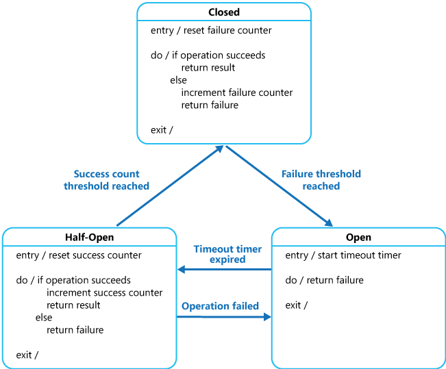

之前在推上看到一张图片，感觉总结的挺好，在我也展开总结了之后发现了这张图的原文，所以整体翻译了一遍。还是非常有价值的，值得学习。

原文地址：https://dzone.com/articles/microservice-architecture-and-design-patterns-for?fromrel=true

强烈推荐。

## 前言

**微服务在企业中可以带来积极的影响。 因此，知道如何处理微服务架构（MSA）和一些微服务设计模式以及微服务架构中的常见目标或原则是很有必要的。 下面是微服务架构实现中要考虑的四个目标。**

1.  降低成本 — MSA 可以在设计，实现和维护 IT 服务等方面降低整体成本。
2.  提升发布速度 — MSA 可以提升项目从构想到部署上线的速度
3.  提升弹性 — MSA 可以提升我们服务网络的弹性
4.  有可见性 — MSA 能在服务和网上提供更好的可见性。

下面是你需要理解的微服务架构要考虑的哪些基本原则：
1.  可扩展性
2.  可用性
3.  弹性扩展
4.  灵活性
5.  独立性，自治能力
6.  去中心化治理
7.  故障隔离
8.  自动配置更新管理
9.  通过 DevOps 的持续交付

**在推动解决方案或系统时，坚持这些原则会带来一些挑战和问题。这些问题在许多解决方案中都很常见。可以通过使用正确的设计模式来克服这些问题。微服务有多种设计模式，但是可以分为五类模式。每一类都包含许多子模式。具体如下图所示：**

_微服务设计模式_

## **微服务拆解模式 (Decomposition Patterns)**

### **按业务能力解耦**

通过单一职责原则，微服务总是会把服务之间的耦合降低，微服务通过业务能力解耦，而且根据对应的业务能力来定义服务。业务能力这个概念来自于业务架构模型 [2]，业务的确是生产价值的，业务能力经常是对应于一个业务实体对象。例如：

-   订单管理对应于订单
-   客户管理对应于客户

### **按子领域拆解（Decompose by Subdomain）**

按照业务能力拆解一个应用应该是一个好的开始，但是你可能会遇到所谓的“神类”(God Classes)，就是哪些不容易解耦的类，而且这些类在多个服务之间很常见。领域驱动设计(DDD) 把应用问题的空间–业务–做为一个域(domain)。一个域有多个子域，而每一个子域对应于业务的不同的部分。

子领域可以分为以下几类：

-   核心子领域(Core) — 区分业务的关键和应用中最有价值的部分
-   支撑子领域(Supporting ) — 与业务相关，但不是关键部分，可以内部实现，也可以外包实现
-   通用子领域(Generic ) — 不针对特定的业务，理想情况下使用现成的软件实现

比如订单管理的子域包括：

-   产品目录服务
-   库存管理服务
-   订单管理服务
-   交付管理服务

### 按事务拆解/两阶段提交（2PC）模式（Decompose by Transactions/Two-Phase Commit (2PC) Pattern）**

可以通过事务拆解服务，然后系统中将会有多个事务。 分布式事务处理中事务处理协调器[3]是非常重要的部分。分布式事务包括两个步骤：

-   准备阶段 — 在此阶段中，事务中的所有参与者都准备提交并通知协调器他们已准备好完成事务了。
-   提交或者回滚阶段 — 在此阶段中，事务协调器向所有参与者发出提交或回滚命令。

2PC 的问题是相对于单个微服务的执行时间来说他的耗时更长。即使所有的微服务在相同的网段中，协调微服务之间的事务依旧会拖慢整个系统。因此这个解决方案一般在高负载的场景中不使用的。

#### **扼杀模式（Strangler Pattern）**

以上的三种设计模式用在对未开发的应用(greenfield apps)的拆解，但是 80% 的工作都是针对庞大的要从新开发的单体应用（遗留代码库）。扼杀模式（Strangler Pattern）就是为了解决这个问题而来的。在相同的 URI 空间中创建两个独立共存的应用，随着时间的推移，重构过的新应用将”扼杀“或者替代原来的应用，直到最终把庞大的单体应用关闭掉。扼杀应用（Strangler Application）的步骤分为转换，共存和消灭三步[4]：

-   转换（Transform ） —  用新方式创建一个新的平行的站点。
-   共存（Coexist ）—  保持老站点，将老站点重定向到新的站点，新站点逐步实现老站点的功能。
-   消灭（Eliminate ） —  移除老站点的旧功能。

#### **隔板模式（Bulkhead Pattern）**

将应用程序的功能隔离并且运行多副本，以便如果其中一个挂了，其他程序可以继续运行并提供服务，这个设计模式称为隔板模式（Bulkhead）， 因为他类似于船体中一个个被隔离的分区。根据使用者负载和可用性要求，这些分区服务实例被分割到不同的组里面。这种设计模式有助于隔离故障（isolate failures）， 并允许即使在故障期间仍可为某些使用者提供服务功能。

#### **边车模式（Sidecar Pattern）**

将应用程序的组件部署到单独的容器中来提供资源隔离和功能封装，这个模式允许应用程序可以由多种的组件和技术组合而成，[这种模式称为边车（Sidecar）](https://dzone.com/articles/distributed-systems-sidecar-pattern)， 因为类似摩托车旁边挂的边车。在这个模式中，边车挂载在父应用上，并为应用提供功能。边车和父应用拥有相同的生命周期，随着父应用创建而创建，销毁而销毁。边车模式有时称为“边踢模式（sidekick pattern）”。

## **微服务的集成模式 （Integration Patterns for Microservices）**

### **API网关模式（API Gateway Pattern）**

当把一个应用拆解为多个小的微服务时，有一些问题就需要我们考虑并处理了：

-   对不同的微服务在不同的通道上有多次的调用。
-   需要处理不同类型的协议。
-   不同的消费者可能需要不同的响应格式。

API 网关可以帮助解决由于使用微服务而带来的问题，包括但不限于上面提到的问题。
- 对于任何微服务调用 API 网关是唯一入口。
- 可以作为一个代理服务来路由请求到相关的微服务。
- 可以聚合后端的请求结果再发送给请求者。
- 这个解决方案可以为每个指定类型的客户创建细粒度的 API。
- 还可以在请求和响应间做协议转换。
- 还可以把授权/认证功能从微服务中迁移到 API 网关上。

### **聚合模式(Aggregator Pattern)**

在将业务功能分解为几个较小的逻辑代码段时，就要考虑如何对每个服务返回的数据进行协同，消费者不负责处理这个事情。

聚合模式有助于解决此问题，它讨论了我们如何聚合来自不同服务的数据，然后将最终响应发送给消费者。 这可以通过两种方法来完成[6]：

1.  由一个组合微服务将调用所有需要的微服务，组合数据，转换数据，然后返回给调用者。
2.  API 网关也可以分发请求到多个微服务上，再聚合数据，然后发送消费者。

如果要对任何业务逻辑进行处理，建议选择组合微服务。否则，API 网关就是既定的解决方案。

### **代理模式(Proxy Pattern)**

通过 API 网关只是暴露了微服务。 代理模式允许获取 API 的特征，例如安全和 GW 中 API 的分类。 如下面这个例子中，API 网关具有三个 API 模块：

-   移动 API – 为FTGO移动客户端实现API
-   浏览器 API-为浏览器中运行的 JavaScript 应用程序实现的 API
-   公用 API-为第三方开发人员实现 API

### **网关路由模式（Gateway Routing Pattern）**

API 网关负责执行请求路由。 API 网关通过将请求路由到相应的服务来实现一些 API 的操作。 当 API 网关接收到请求时，它会查询路由映射表，该路由映射表指定了将哪个请求路由到哪个服务。 比如路由映射表可以将 HTTP 方法和路径映射到服务的 HTTP 的 URL 上。 这个功能与 Web 服务器（如 NGINX）提供的反向代理功能相同。

### **Chained Microservice Pattern**

There will be multiple dependencies of for single services or microservice eg: Sale microservice has dependency products microservice and order microservice. Chained microservice design patterns will help you to provide the consolidated outcome to your request. The request received by a microservice-1, which is then communicating with microservice-2 and it may be communicating with microservice-3. All these services are synchronous calls.
### **微服务链模式 (Chained Microservice Pattern)**

单个服务或微服务将可能会有多个依赖关系， 例如：销售微服务依赖产品微服务和订单微服务。微服务链模式将根据你的请求提供合并的结果。microservice-1 接收请求，然后和microservice-2通信，并且可能和microservice-3通信。 所有的这些服务都是同步调用。

### **分支模式（Branch Pattern）**

微服务可能需要从包括其他微服务在内的多个来源获取数据，分支微服务模式是聚合器和链设计模式的混合，它允许同时处理来自两个或多个微服务的请求/响应。调用的微服务可以是微服务链。根据业务需求，分支模式还可用于调用不同的微服务链或单个链。

### **客户端UI组合模式(Client-Side UI Composition Pattern)**

当通过拆解业务功能/子域来开发服务时，负责用户体验的服务必须从多个微服务中获取数据。在单体服务世界中，从 UI 到后端服务只需要一次调用来查询数据并且刷新/提交 UI 页面。不过，现在不一样了。 在微服务中，UI 必须设计为屏幕/页面上具有多个部分/区域的框架。每个部分都将调用单独的后端微服务以获取数据。像 AngularJS 和 ReactJS 之类的框架可以轻松地做到这一点，这些屏幕称为单页应用程序（SPA）。每个团队都开发一个客户端 UI 组件，例如 AngularJS 指令，该组件实现针对该页面/屏幕区域的微服务调用。一个 UI 团队负责实现页面的框架，这个框架通过组合多个指定的服务 UI （service-specific UI）组件来构建页面/屏幕。

## **数据库模式(Database Patterns)**

为微服务定义数据库架构时，我们需要考虑以下几点：

-   服务之间必须是松耦合的, 它们可以独立开发，部署和扩容缩容。
-   业务事务在跨越多个微服务的时候保证不变。
-   一些业务的事务跨越多个微服务来查询数据。
-   有时数据库必须可以复制，并且可以弹性共享。
-   不同的服务有不同的数据存储要求。

### **每一个服务对应一个数据库(Database per Service)**

为了解决上述问题，必须为每个微服务设计一个数据库。该数据库只能是该服务私有的，并且只能通过微服务的 API 访问，不能被其他的微服务直接访问。例如，对关系型数据库，我们可以用以下方式：每个微服务有私有化的表(private-tables-per-service)，每个微服务有自己的 schema (schema-per-service), 或者每个微服务服务有私有的数据库服务器（database-server-per-service）。

### **每一个服务共享数据库 (Shared Database per Service)**

我们已经讨论了每个服务设一个数据库是微服务的理想选择，但它是微服务的反模式(anti-pattern)。如果一个单体应用要把它拆分为微服务，那么数据库的反范式化（denormalization ）就不那么容易。将每个微服务共享数据库不是理想的情况，但是是可行的解决方案。大多数人认为这是微服务的反模式，但对于要重构的应用，这是将应用程序分解成较小逻辑的一个很好机会。但是对于全新开发的应用不太适用。

### **命令查询的责任分离 (Command Query Responsibility Segregation，CQRS)**

一旦我们实现了每个服务对应一个数据库，就需要将从多个微服务查询返回的数据合并起来。显然这是不可能的。CQRS 建议将应用分为两个部分 — 命令端 （command side）和查询端 （query side）：

-   命令端处理创建，更新和删除请求。
-   查询端通过使用物化视图来处理查询部分。

通常事件溯源模式(event sourcing pattern)和它一起用来为任何数据更改创建事件。通过订阅事件流，可以使物化视图保持不断的更新。

### **事件溯源模式(event sourcing pattern)**

大多数应用程序都使用数据，一个典型的途径就是应用保持当前的状态。例如，传统的创建，读取，更新和删除（CRUD）中，典型的数据处理是从存储中读取数据，它包含经常使用事务锁定数据的限制。

事件溯源模式定义了一系列事件驱动的数据的处理操作，每一个事件处理操作都会记录在仅追加存储中（append-only store）。应用程序代码发送一系列命令式的描述了数据上发生的动作的事件到事件持久化存储的地方。每个事件代表一组数据更改（例如，AddedItemToOrder）

这些事件持久化存储在充当系统记录系统的事件存储中。事件存储系统中事件发布的典型应用场景是：在应用中保持实体的物化视图和事件的动作一样来改变他们，以及集成的外部系统。例如系统可以维护一个针对所有用户的物化视图，用来填充UI部分的数据。当应用程序添加新订单，添加或删除订单上的项目以及添加运输信息时，这些事件描述了这些数据变化可以被处理并且可以更新到物化视图上。下面是这个模式的纵览：

Event Sourcing pattern[8]

### **Saga模式(Saga Pattern)**

当每一个微服务都有自己的数据库，并且一个业务事务跨越多个微服务的时候，我们是如何确保各个服务之间的数据一致性？每个请求都有一个补偿请求，该请求将在请求失败时执行。 它可以通过两种方式实现：

-   编排（Choreography）指导  — 如果没有中央服务协调，则每个服务都会产生并侦听另一个服务的事件，并决定是否应采取措施。编排是指定两个或两个以上参与者的方式。 每一个参与者都无法控制对方的流程，或者任意可见的流程，这些可见的流程可以协调他们的活动和流程以共享信息和数值。当需要跨控制/可见性域进行协调时，请使用 Choreography 编排指导 。你可以在简单的情况下将编排视为网络协议，它规定了各参与者之间可接受的请求和响应模式。

  

  

Saga pattern — Choreography

- Orchestration —  一个Orchestration （对象）负责 Saga 的决策和业务逻辑顺序。当你已经控制流程中的所有参与者时，当它们全部处于一个控制范围内时，你可以控制活动的流程。当然，通常情况下，当你制定一个组织内的业务流程时，你已经控制了它。

Sage pattern — Orchestration  

## **观察者模式(Observability Patterns)**

### **日志聚合**

考虑这样一种情况：一个应用包含多个微服务实例，每个请求经常在横跨多个微服务实例，那么每一个微服务实例都产生一个表转化格式的日志文件。 因此我们需要一个中心化的日志服务来将每个服务实例的日志收集起来。用户可以搜索分析并分析日志，并且配置一些当日志中出现特定信息的报警规则。例如：PCF 确实有一个日志聚合器 (Log aggregator),，用来收集 PCF 平台上各个应用组件（router, controller, Diego, 等等…）的日志。AWS Cloud Watch 也是这样做的。

### **性能指标 Performance Metrics**

因为采用了微服务架构而导致服务的数量增加，密切注意事务变得十分关键，以便监控微服务模式并且在问题发生的时候发出告警。

指标服务用来收集每个单独操作的统计信息。它应该聚合一个应用服务的所有指标，以便提供报告和告警。 聚合指标包含两个模式：

-   推送 — 服务推送指标给指标服务 例如：NewRelic, AppDynamics
-   拉取 — 指标服务可以从每个服务中拉取指标 例如：Prometheus

### **分布式跟踪 Distributed Tracing**

**在微服务架构中，请求通常跨越多个微服务。 每个服务通过跨多个服务执行一个或多个操作来处理一个请求。 在进行故障排除时，需要有一个跟踪 ID，这样我们可以端对端的跟踪请求。**

可以使用以下方法来引入一个事务 ID：
-   为每个外部请求分配唯一的外部请求 ID。
-   将外部请求 ID 传递给所有服务。
-   在所有日志消息中包含外部请求 ID。

### **健康检查 Health Check**

实施微服务架构后，有一种可能是：服务可能会启动但无法处理事务。每个服务都需要具有一个端点用来检查应用的健康度，例如health。这个 API 应该检查主机的状态，与其他服务/基础设施的连接以及其他任意特定的逻辑。

## **交叉关注模式（Cross-Cutting Concern Patterns）**

### **外部配置（External Configuration）**

一个服务通常还会调用其他服务和数据库，对于每一个环境，例如 dev, QA, UAT, prod，这些环境的端点 URL 或某些配置属性可能不同，这些属性中的任何一项更改都可能需要重新构建或重新部署服务。

为了避免代码修改，可以使用配置，将所有的配置信息都外部化，包括端点 URL 和认证信息。应用程序应该在启动时或运行时加载这些配置。这些配置可以在应用启动的时候访问到，或者这些配置在不需要重启服务的情况下就可以更新。

### **服务发现模式（Service Discovery Pattern）**

当遇见如图所示的微服务架构时，在微服务调用上我们要关注这样一些问题。

因为使用了容器技术，IP 地址会动态分配给每个微服务实例， 每次地址更改时，消费服务的调用都会中断，需要手动更改才能恢复。

消费者必须记住每个服务 URL，并使其紧密耦合。

因此需要有注册服务，该注册服务将保存每个生产型服务的元数据和每个服务的使用规范。服务实例在启动时应注册到注册中心，而在实例关闭时应注销。服务发现有两种类型：

-   客户端，例如：Netflix Eureka
-   服务端：例如： AWS ALB

服务发现 [9]

### **断路器模式（Circuit Breaker Pattern）**

一个服务通常会调用其他服务来查询数据，有一种可能性是下游的服务会关闭，这将会带来两个问题：1）上游服务继续请求关闭的服务，直到耗尽网络资源，并且降低系统性能。2）用户体验将会很糟糕且不可预测的。

消费者应通过代理来调用远程服务，该代理的行为类似于电路中的断路器。当连续的请求失败的次数超过阈值时，断路器将跳闸一段时间，并且在跳闸的这段时间内，所有远程服务调用的尝试都将立即失败。当超过了断路器跳闸时间之后，断路器将允许有限数量的测试请求通过。如果这些请求成功，则断路器将恢复正常操作。否则，如果有一个请求失败，则断路器再次跳闸。对于一个应用试图尝试调用另一个远程服务或者获取共享资源，并且该操作很容易的失败的情况来说， 这个模式非常适用。

 断路器模式Circuit Breaker Pattern [10]  

### **蓝绿发布模式（Blue-Green Deployment Pattern）**

在微服务架构中，一个应用程序可以有许多个微服务。 如果我们在停止所有服务之后然后部署增强版本，则停机时间将是巨大的，并且可能影响业务。同样，回滚将是一场噩梦。蓝绿发布模式可以避免这种情况。

蓝绿发布模式可以减少或消除停机时间，它的做法是通过运行切换两个相同的生产环境：Blue 和 Green。这里我们假设 Green 是已存在的工作实例，Blue 是该应用程序的新版本。在任何时候，只有一个环境处于服务状态，该服务环境为所有生产流量提供服务。 所有云平台均提供了用于实施蓝绿色部署的选项。

蓝绿发布模式Blue-Green Deployment Pattern

**References**  
[1] “Microservice Architecture: Aligning Principles, Practices, and Culture” Book by Irakli Nadareishvili, Matt McLarty, and Michael Amundsen

[2] [https://microservices.io/patterns/decomposition/decompose-by-business-capability.html](https://microservices.io/patterns/decomposition/decompose-by-business-capability.html)

[3] [https://www.baeldung.com/transactions-across-microservices](https://www.baeldung.com/transactions-across-microservices)

[4] [https://developer.ibm.com/articles/cl-strangler-application-pattern-microservices-apps-trs/](https://developer.ibm.com/articles/cl-strangler-application-pattern-microservices-apps-trs/)

[5] [https://docs.microsoft.com/en-us/azure/architecture/patterns/bulkhead](https://docs.microsoft.com/en-us/azure/architecture/patterns/bulkhead)

[6] [https://dzone.com/articles/design-patterns-for-microservices](https://dzone.com/articles/design-patterns-for-microservices)

[7] [https://docs.microsoft.com/en-us/azure/architecture/patterns/cqrs#event-sourcing-and-cqrs](https://docs.microsoft.com/en-us/azure/architecture/patterns/cqrs#event-sourcing-and-cqrs)

[8] [https://docs.microsoft.com/en-us/azure/architecture/patterns/event-sourcing](https://docs.microsoft.com/en-us/azure/architecture/patterns/event-sourcing)

[9] [https://www.dineshonjava.com/microservices-with-spring-boot/](https://www.dineshonjava.com/microservices-with-spring-boot/)

[10] [https://docs.microsoft.com/en-us/azure/architecture/patterns/circuit-breaker](https://docs.microsoft.com/en-us/azure/architecture/patterns/circuit-breaker)