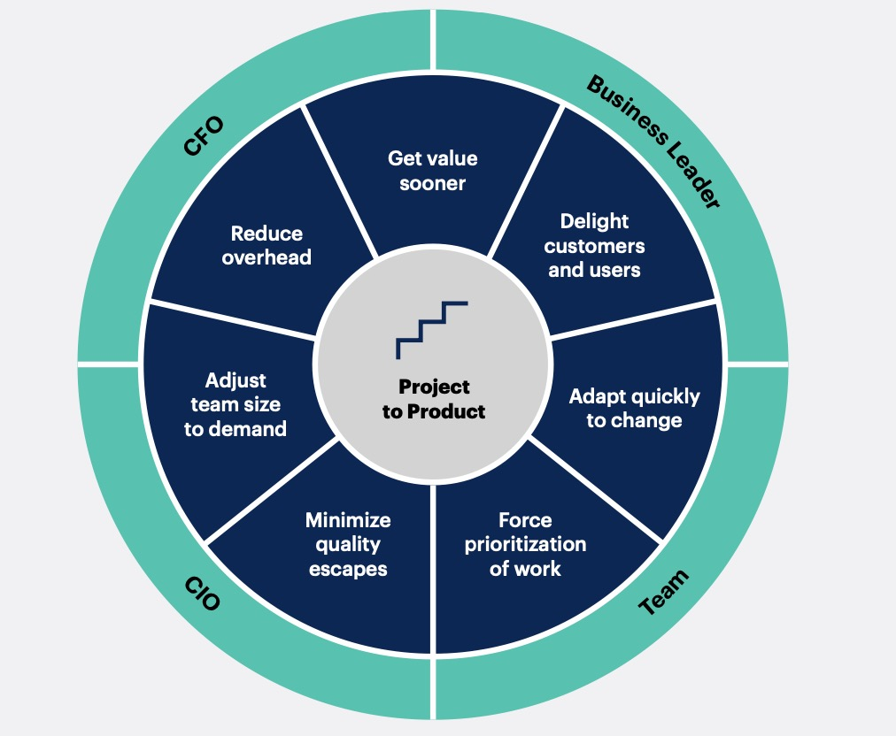
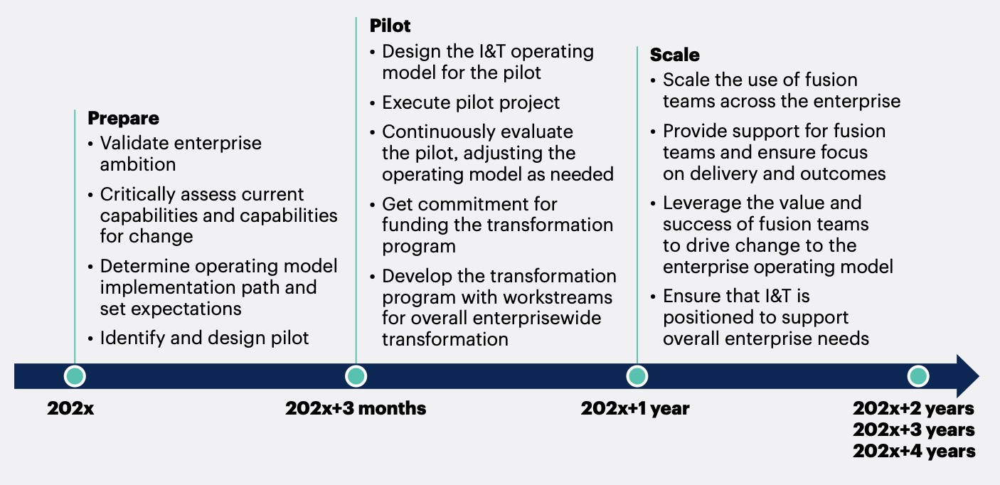
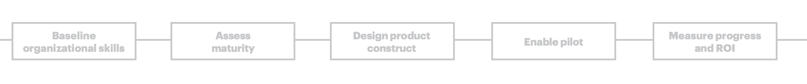

## 前言
前几天看到了一篇 Gartner 的报告，感觉非常有意思，这里梳理记录一下我的一下思考。给团队的同学我也分享了一下我的思考。

这篇文章的题目是《How to shift from Project to Product》，看情况这是一个系列文章，这篇是一个开头或者是大纲，后面应该还有更详细的内容。

但是就从我的角度来说这篇大纲给我的触动也是挺大的，我认为这是一个技术人的必修课。

## 大家理解的 Project 是什么
以前对这个词的理解也就那样，没有多想和 Product 的区别。比如大学的时候老师留的大作业一般我们都叫做 Project，那时候我们做的项目都是叫做 Project，甚至工作了一段时间我们还是在做 leader 交给我们的 Project。还有我们程序员在 IDE 中创建的也叫做 Project。

所以在一段时间内我们认为程序员就是做 Project 的，而且做 Project 就是正业、就是理所应当和很厉害的了。不知道大家有没有这样的感觉？

我理解的 Project 是什么？
1. 完成特定功能的一个工程或者小系统。
2. 有一定的核心技术，而且重点在技术。
3. 在一定程度上只要重视技术就可以了完成这个 Project。
4. 所以主要是技术人员，关注技术研发和项目管理。
5. 有很多 Project 的目的并不是为了使用，而是验证、研究、测试。
6. 大多数的 Project 是一次交付的，缺乏后期的运营管理迭代提升。

这是我的理解，如果你有其他的想法也希望能发给我。

虽然我在团队内一直也是前调我们是做平台的、或是一个完整系统的。不断在推动团队成员再往更深或者叫做更高的方向思考。

我一直是在思考技术价值，怎么把技术的价值才能体现出来，所以在团队内我以我笨拙的语言给大家说：核心技术一定要有，但是核心技术并不能可靠的提供服务，核心技术一定要配合很多外围配套的设施才能提供可靠稳定高效的服务。

大家也能看到这里的不完整性和不确定性，大家似乎理解了，但是可能还是不知道还要做哪些事情。

## 大家理解的 Product 是什么
Product 是什么？中文翻译是产品，就是说啥是产品？怎么做一个产品？

我对 Product 的理解：
1. 目标是解决一个或者一系列使用问题而创造的一个东西。
2. 可以给到很多人方便的使用（当然也有使用体验差的产品）。
3. 除了核心技术外还有一系列的外围支持。

因为我是做技术的，那么我认为我们研发的一定是技术产品（系统，平台或者小工具）。

根据上面的大概描述，我想应该是可以分清楚这两个词的区别了。

## 在技术公司如何选择？Project or Product

当然这里面没有优劣之分，这里论述并不是说 Product 一定是比 Project 好的，只是他们的目标和方向以及实用场景不同。

在一个技术公司两者也不可缺失，但是作为公司来说一定是通过产品来做到价值体现的。

但是在产品的研发过程中都是要通过各个小的 Project 来逐步把产品形成的。

我想作为一个技术人员，首先对于 Project 是一定要比较拿手的，在系统的架构设计，研发项目管理上，大家在工作的前几年中都要学习掌握扎实。
尤其在在核心技术的钻研和突破上也要总结出适合自己的一些方法论。

其次，作为公司能够产生长远或者说是核心价值的一定是产品，所以在有了核心技术自后就要考虑如何产品化，通过做好一个好的产品结合好的产品营销运营来让技术和人的价值放大。

那么产品化就是公司非常重要的一环，我这几年在公司一直在做平台类的产品，也是一直在想各种方法和思路让团队做出的平台让更多的人能更好的来使用，并且我们自己还要负责推广运营后勤。所以看到这个报告有一种情切感。思路上更加印证了这几年在积累的一些思路和方法。尤其今年上半年我搞的技术人员的服务经理制，就是在想办法让自己团队的技术 Project 经过转型升级为真正的 Product。当然我们都还在路上。

## 从 Project 到 Product 需要什么？
做了上面这么多的铺垫其实也就是下面这些思考了，就是如果做到一个 Project 转化为 Product。

首先这份报告给出了一个技术 Project 到 技术 Product 需要的能力项，或者是需要做的事情。

其次这份报告给出了一个产品在研发和到市场运营的大致过程，包括了没个过程中需要关注的内容。

### 技术 Project 到 技术 Product 需要的能力项

先看看报告中这张图，这里介绍的是如果要做到产品化，就需要有一个产品化的组织架构，通过这个组织架构对产品进行不同角度的思考，最终才能做出一个有可能成功的产品。
从角色上来看有
1. CIO： 解决技术层的问题，从研发管理，数据分析、优化和项目管理。
2. CFO：从成本的角度来考虑产品化的阶段和投入，还有价值利润的获取。
3. Business Leader：产品交付，价值利润的实现。
4. Team：从整体来考虑各个角度和优化和对变化的快速响应。

### 技术 Project 到 技术 Product 的路线图
这张图也是这个报告的核心，主要是路线节点，以及各个节点需要的大致准备时间。这个时间作为一般互联网产品研发和运营周期，我认为是比较合理的。

可以看出来，一般是分三步走：
1. 准备：大概需要3个月左右
   1. 组建团队
   2. 验证核心逻辑是不是ok
   3. 对未来的运营模型预测设计
2. 起飞：大概1年时间
   1. 设计实现初步可用版本
   2. 做基本交付实用和实际验证
3. 扩张：2年左右
   1. 扩张用户
   2. 根据用户规模进行团队调整
   3. 价值实现和利润实现

### 技术 Project 到 技术 Product 的关键阶段
这里其实从另外一个角度，对操作阶段进行了划分。
1. 基本的团队组建阶段：这个阶段首先是有一个大致的点子，要做去，开始考虑团队的组建，一些验证工作
2. 成熟度评估：评估产品竞争能力，评估市场，根据产品进行团队优化
3. 产品研发：根据市场需求进行产品研发和优化
4. 起飞阶段：作为产品试飞阶段，要分析产品的各项线上运营数据，不断优化产品
5. 产品到成熟期并进行RIO的考核

## 总结
整体报告不是很详细，只是把大致思路梳理了出来，其实我感觉这就够了，因为不同的产品，团队和公司内外的环境也会对真实的实现过程产生严重的影响的。有思路但是真正具体实践还是要我们自己根据实际情况来走。

看完本文有收获？请分享给更多人

关注「黑光技术」，关注大数据+微服务

