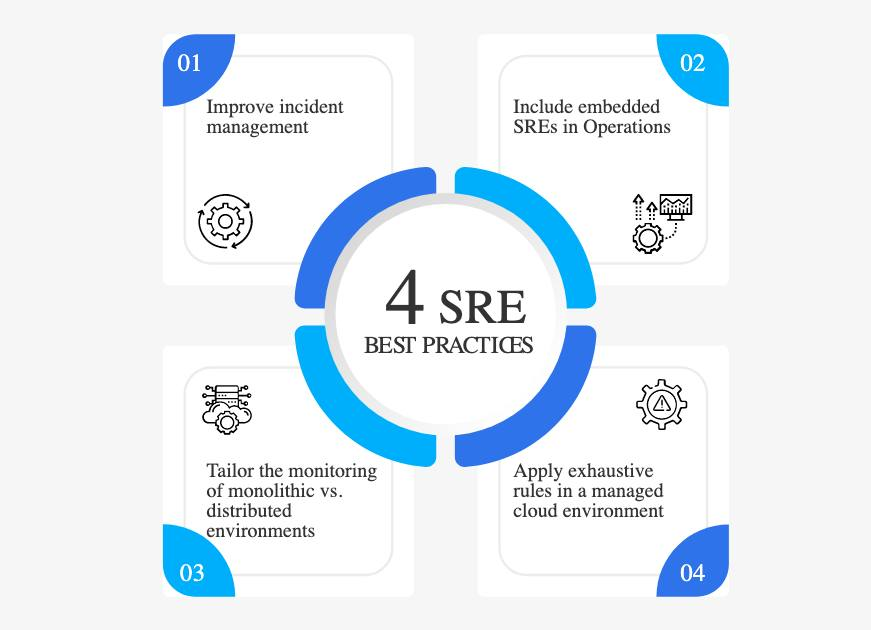

## 前言

一个互联网技术玩家，一个爱聊技术的家伙。在工作和学习中不断思考，把这些思考总结出来，并分享，和大家一起交流进步。

合理化的图文组织，让大家可以更容易学习一个技术。

今天分享的是在 facebook 上看到的一个对 sre 学习的图，感觉不错，比较清晰的指出 sre 应该怎么做。

## 解说
1. 改进事件管理：为了预防或快速解决事件，企业必须建立适当的 SRE 事件管理流程。这将帮助SRE 团队根据紧急程度和影响对事件进行识别、记录和分类，然后相应地确定事件的优先级。一旦事件得到解决，团队就可以关闭它并更新状态。在理想情况下，SRE 团队还将对事件进行事后分析，以确定需要改进的地方，并帮助确保系统的弹性和有效的事件管理。  
2. 在运营中纳入嵌入式 SRE：有时，日常工单的数量非常多，以至于运营任务占用了他们的大部分时间，从而减缓了进度。将 SRE 嵌入到运营中可以解决这个问题。SRE 将观察团队的日常任务，并推荐改进过程和结果的解决方案，并提供工程最佳实践，以在整个项目生命周期中保持可靠性和可扩展性。  
3. 定制单体环境与分布式环境的监控：监控单体环境的可靠性不同于监控分布式环境。例如，单体式应用程序将所有日志和指标存储在单个日志文件中，而分布式应用程序具有不同的数据源。但是，分布式应用程序的风险较小；例如，重新部署分布式应用程序比整体式应用程序更容易、更快。为使其有效，SRE 团队应相应地调整其监控方法。  
4. 在托管云环境中应用详尽的规则：随着越来越多的关键应用程序迁移到云，企业必须确保系统具有弹性。要使 SRE 团队能够高效地管理云环境，需要大量的规则。这些规则应该能够在事故发生期间提醒团队，并识别出未检测到的情况是否是紧急的和可操作的。通过提供即将发生的故障的清晰画面，SRE 团队将能够几乎实时地采取适当的行动。

看完本文有收获？请分享给更多人

关注「黑光技术」，关注大数据+微服务

