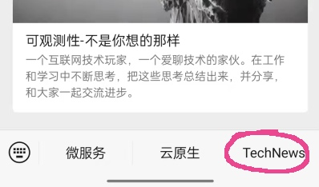
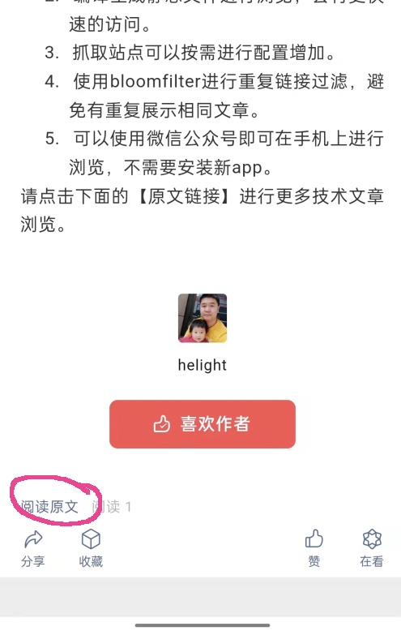
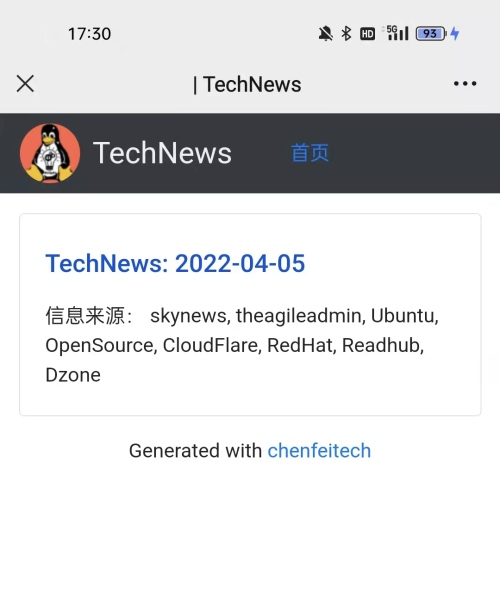
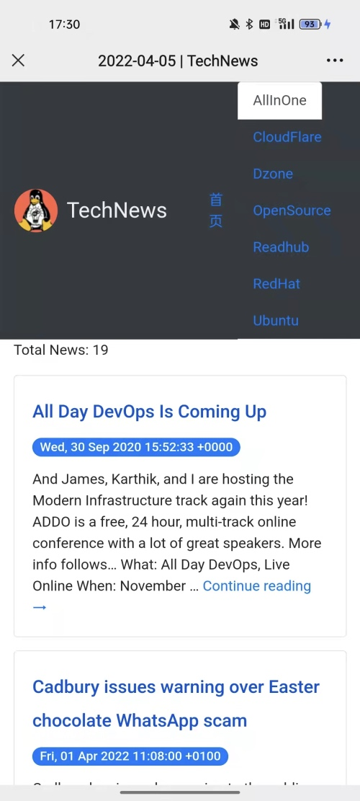
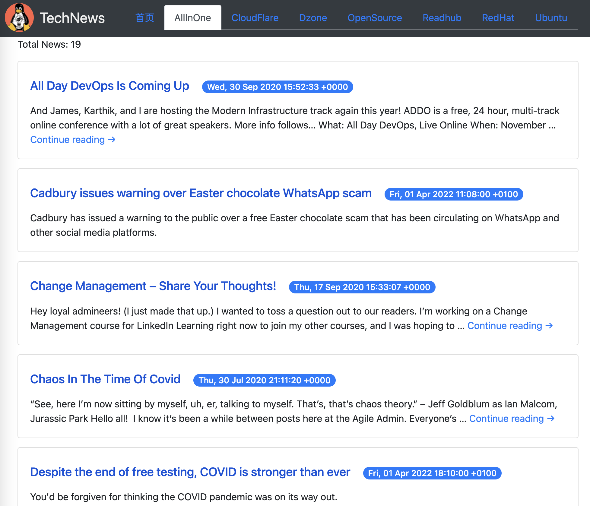

## TechNews 为什么会出现？
这几年学习技术基本上都是从国外一些网站找资料，直接看或者翻译一下。找这些资料其实还是比较繁琐。

所以一直在想有一个合适的收集工具可以把多个地方的东西收集起来，再以一种较为方便的方式可以浏览学习，看到好的可以就记录下来翻译深入学习。

本来想可以使用 rss 订阅，但是一是手机上没有特别好的 rss 订阅工具；另外现在软件设计必然要考虑商业化，必然会有很多我不用的功能，不够纯粹；还有就是不想安装这么多软件。

所以这几天用 golang 开发了这个小程序，可以定时拉取配置列表中站点上的文章。拉取之后从新组织输出为静态网页，直接在手机中就可以浏览了。

目前还做了一个信息网站 API 的直接抓取，还是挺有意思的，目前大多数的网站是允许以摘要的形式被抓取的。因为要阅读详细内容，还是要转到他们的网站。

其实想的是可以直接从微信中看，因为目前这个号没有认证，只能从已经发布的一篇文章中点击原文链接过去。

## 目前的使用过程
1. 在公众号的这里点击访问介绍 TechNews 的文章。

2. 点击阅读原文，在这里直接转到 TechNews 首页

3. 首页是这样的，会有一个列表，每次抓取生成一条

4. 点击其中一条之后进入这里，就可以看文章了，目前主要是文章标题时间和摘要。

5. 在电脑上看是这样的

## 目前 TechNews 的主要功能：

1. 每周定时抓取指定网站的技术相关文章到这个页面，可以直接快速浏览文章信息。
2. 编译生成静态文件进行浏览，会有更快速的访问。
3. 抓取站点可以按需进行配置增加。
4. 使用bloomfilter进行重复链接过滤，避免有重复展示相同文章。
5. 可以使用微信公众号即可在手机上进行浏览，不需要安装新app。

## TechNews 使用的主要技术

1. 项目主要开发语言： golang
2. rss 抓取使用：github.com/zhshch2002/goreq 这个库使用相对简单，比较好用
3. rss 解析使用：github.com/mmcdole/gofeed
4. 内容过滤使用了 2 个库
   1. bloomfilter：github.com/tylertreat/BoomFilters 做 url 去重
   2. Damerau-Levenshtein： github.com/lmas/Damerau-Levenshtein  计算标题的编辑距离，做标题去重
5. 配置文件加载：github.com/BurntSushi/toml
6. 信息存储使用了：sqlite
7. dborm 使用：gorm.io/gorm
8. 页面渲染到静态文件：html/template
9. 另外还有一些页面解析使用了：github.com/PuerkitoBio/goquery

## 目前已经订阅的站点
### 独立 tab 展示的
1. Ubuntu = "https://ubuntu.com/blog/feed"
1. OpenSource = "https://opensource.com/feed"
1. CloudFlare = "https://blog.cloudflare.com/rss/"
1. RedHat = "https://www.redhat.com/en/rss/blog/channel/red-hat-summit"

### 在 AllInOne 这个 tab
这些内容大多可以是 blog 等这类更新低频的站点，一般一周估计没有太多更新，所以把多个站点的内容都放到这里统一抓取。
1. theagileadmin = "https://theagileadmin.com/feed"
1. skynews = "https://feeds.skynews.com/feeds/rss/technology.xml"

## 后记
技术就是这样，可以自己折腾玩，还是比较有意思的。这个项目基本上也就 2 天时间搞定，后面再看有什么想做的可以继续加入。

另外这里推到公众号上也是希望有更多的人可以给我提点意见，或者有人可以一起来玩。

看完本文有收获？请分享给更多人

关注「黑光技术」，关注大数据+微服务

