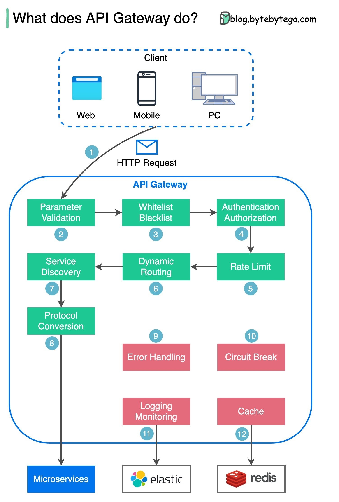
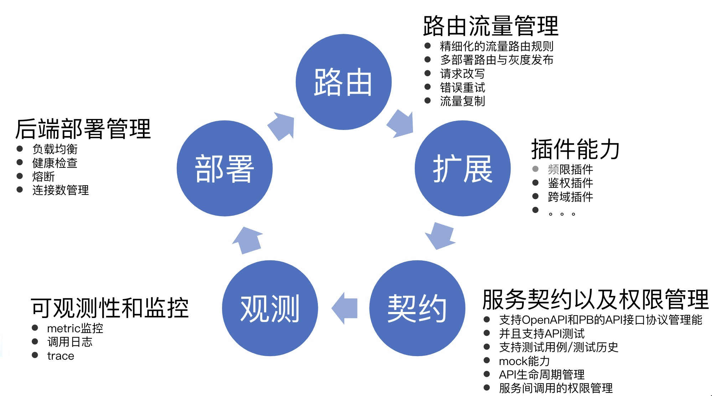

## 前言

一个互联网技术玩家，一个爱聊技术的家伙。在工作和学习中不断思考，把这些思考总结出来，并分享，和大家一起交流进步。

合理化的图文组织，让大家可以更容易学习一个技术。

今天分享的是在 推 上看到的一个对 API Gateway 解析的图，感觉不错，比较清晰的指出 API Gateway 一般会做哪些事情。

## 解说
这图还是比较清晰的说明了 API Gateway 在一个服务中到底会做哪些事情。我在公司内也在建设内部的一个 API Gateway。一个常见的 API Gateway 就应该这么建设和这么使用。

下面看看我在做的 API Gateway 的一个思路，大同小异，但是我是希望这个东西能能系统化，系统化的解决 API 的问题。

我们在做的这个 API Gateway 有这样一些特点。
1.  基于开源项目 Envoy 研发，随时可以更新开源社区的新功能。
2.  业务插件和能力扩展：已经积累了 30 多种业务插件，接管或者卸载一部分业务服务要做的通用能力到 Gateway，让业务更加轻松方便使用。
3.  完善的内网外部接入能力：外网支持北极星，CLB的完整接入，内网支持北极星，service，ip，域名等多种方式。
4.  可观测性和监控：基于 K8S 的容器后监控能力，cpu 负载，内存等等；还有访问日志监控体系，还有可以轻松检索你的每一条请求，并且可以基于状态码和关键字进行告警。
5.  强大的路由管理能力：支持header头，url等多种匹配和多种路由算法。
6.  服务契约管理：具有配套的API契约管理能力，基于PB和OpenAPI轻松管理你服务的API。结合 PB 生成 swager 的 API 管理文档，并且结合 OpenAPI 也可以很好的管理，还有导出导出文档。在线简单测试，测试用例管理，测试历史以及 API 的 mock 能力都有。

看完本文有收获？请分享给更多人

关注「黑光技术」，关注大数据+微服务

