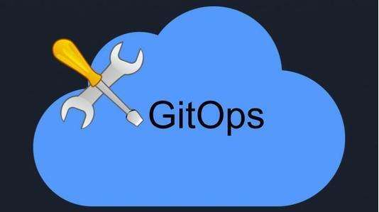

本文译自 [What is GitOps](https://www.redhat.com/en/topics/devops/what-is-gitops)。

译者：[helight](http://helight.cn/)。

原文地址：https://www.redhat.com/en/topics/devops/what-is-gitops

## 什么是 GitOps？
定义：GitOps 使用 Git 来管理基础设施和应用配置的一种开发运营实践，Git 是一个开源的版本控制系统。GitOps 的工作原理是使用 Git 作为声明基础设施和应用的单一可信源。

GitOps 使用 Git pull 请求来自动的管理基础设施的提供和部署。Git 仓库中包含了系统的的整体状态，所以系统状态的变化过程是可见、可审计的。

GitOps 是围绕开发者体验来构建的，并且帮助团队使用和他们进行软件开发同样的工具和过程来管理基础设施。不同于 Git，GitOps 让你有选择你使用工具的能力。

目前认为是 Weaveworks 创造了 GitOps 这个词。

## 如何开始使用 GitOps 

要开始使用 GitOps，你需要可以声明管理的基础设施。因为这个原因，GitOps 通常是作为 Kubernetes 和原生应用开发的一种操作模型，并且可以在 Kubernetes 上做持续部署。
 
但是使用 Kubernetes 并不是 GitOps 的一个硬性要求。GitOps 是一项技术，他可以应用在其他的基础设施和部署流水线上。

像 Kubernetes，Ansible 是一个期望状态流转引擎，他可以声明管理传统的 IT 系统，也是可以用在 GitOps 上的。Ansible 用户可以管理 Kubernetes 上的应用，可以管理已经存在的 IT 设施上应用，或者使用 Ansible 模块统一进行管理。

GitOps 可以用于构建开发流水线，代码应用，管理配置，提供 Kubernetes 集群，并且部署到 Kubernetes 上或者容器注册中心上。

## 什么是 GitOps 工作流？

GitOps 可以被认为是一种基础设施即代码（IaC）的演进，它使用 Git 作为基础设施配置的版本控制系统。IaC 通常通过采用声明式方式来达到基础设施管理：设置预期的系统状态，并跟踪系统的真实状态。

通过使用 IaC，GitOps 要求你声明你期望的系统状态。通过使用描述工具，所有你的配置文件和源代码都可以使用 Git 来进行版本控制。

CI/CD 流水线通常是被外部的一个事件来触发的，比如提交代码到代码仓库。在一个 GitOps 工作流中，变化流程是由修改修改 Git 仓库状态的 pull 请求触发的。
 
要使用 GitOps 工作流发布新版本，使用 Git 来发起 pull 请求，这样可以变更集群状态的声明。处在 GitOps 流水线和编排系统之间的 GitOps 操作器会接收到 commit 请求，并且从 Git 中拉取新的状态声明。

改变被通过和合并之后，就会被自动的应用到实时的基础设施上。开发者可以持续的使用他们的标准工作流并且进行持续集成和持续交付。

当在 Kubernetes 上使用 GitOps 的时候，操作器一般就是一个 Kubernetes Operator。

操作器比较仓库的期望状态和部署在基础设施上的实际状态。操作器在感知到实际状态和仓库期望状态的不同的时候就会更新基础设施。操作器也会监视容器镜像仓库，并且通过同样的方式来部署新镜像。

GitOps 中还有一个重要概念——可观测性，指可观测的任何系统状态。GitOps 中的可观测性让你确保观测到的状态（或实际状态）与期望的状态一致。 

使用 pull 请求和像 Git 一样的版本控制系统，让开发过程中清晰明了。这可以让你看到和跟踪系统的任何改变，提供了一个审查跟踪，让你可以有能力在出现问题的时候进行回滚。

GitOps 工作流可以提高生产效率和加快开发和部署速度，以此来提高系统的稳定性和可靠性。

## GitOps 与 DevOps 之间有何区别？
GitOps 和 DevOps 确实在一些原则和目标是一样的。但是 DevOps 是关注在文化转变和提供一种在开发团队和运维团队之间协作的方式。

GitOps 给你工具和框架让你实践 DevOps，比如协作，CI/CD和版本控制，还有自动的应用到基础设施上和应用部署。

开发者能在他们已知的代码仓库上，运维同学则可以将其他必要组件落实到位。

## 后记
内容比较短，看了之后感觉还是挺清晰的，所以简单翻译了一下，网站也有中文翻译，我还是学习翻译了一遍。有些产品介绍相关的内容就没有翻译了。

作为了解什么 GitOps，以及其核心原理，还是比较有指导性的。

看完本文有收获？请分享给更多人

关注「黑光技术」，关注大数据+微服务

