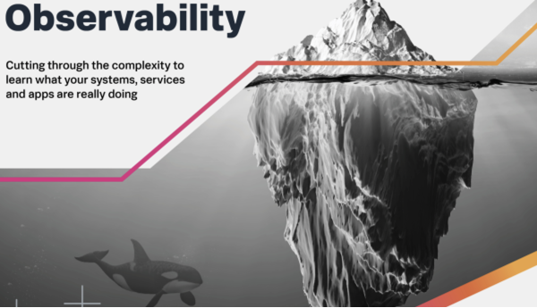

本文译自 [可观测性:不是你想的那样](https://www.splunk.com/en_us/blog/devops/observability-it-s-not-what-you-think.html)。

译者：[helight](http://helight.cn/)。

原文地址：https://www.splunk.com/en_us/blog/devops/observability-it-s-not-what-you-think.html

## 前言
可观测性很多人估计会有一种疑惑：啥是可观测性，和我们之前的监控系统有啥区别，怎么老搞一些新名词出来，学不动了呀。。。。

所以这篇文章从理论的角度出发，为可观测性进行“强行”正名，更重要的是我也想看看整这些名词的外国人是怎么想的。

## 可观测性是什么？

可观测性是一种思维方式，通过收集和分析你整个业务的数据让你可以知道你业务的任何问题。如果你问其他人，可观测性就是“通过查看系统的输出来监视系统的内部状态”的干巴巴的控制理论定义，或者是“度量指标、跟踪和日志”的非常专业名词。虽然这些说法也是对的，但是可观测性不仅仅是一个你要实现的东西，然后可以自豪的说“现在这个系统有了可观测性了”。将可观测性构建到你的业务中，可以让你看清楚有关业务的问题。

## 有什么样的问题？

当然，“当错误数上升时我们的应用中发生了什么”这样的基础问题就可以用可观测性工具来回答，但这仅仅触及了可观测性的表面。

可观测性思想能让你能够做的是找出为什么错误数会飙升。如果你非常熟悉你的应用程序及其所有依赖项，那么你可能会从监控系统中就看出问题所在了，但随着现代应用程序变得越来越复杂，你自己可以根据监控系统中的信息就可以分析出来问题所在会变的越来越困难。

业务需求、特性发布、A/B 测试、重构成为微服务。。。。。。诸如此类的事情结合在一起创造了不断增加的熵，因此在没有帮助的情况下了解系统的一切变得越来越困难。

可观测性还允许你探究错误是如何(或者是否!)影响用户体验的。你可以查看 RUM 数据、购买量、一般业务指标、营销活动、客户支持票据、社交媒体情绪，等等——这些数据将可观测性系统从只有少数人使用的东西，变成了整个公司都能从中探究业务的东西。这些数据不仅能让你回答“是什么”，还能让你回答“为什么”和“如何”。一个真正的可观测性套件可以让你回答所有这些问题：

“是什么导致了这一突破?”
“这个广告有多有效?”
“这个新的前端设计推动了购买吗?”
“这次服务中断让我们的用户生气了吗?”

## 你为什么应该关心可观测性？

将这种类型的数据集成到你的系统中，你就可以发现你给最好的客户发送的营销活动中，有一个错误的动作 URL，该 URL 指向了一个 404 页面。如果没有将数据完全集成到你的可观测性解决方案中，你当然可以看到 4xx 的速率增加了。但是，你不知道为什么 4xx 的比率上升了，只知道 4xx 的比率上升了。

想象一下，如果除了“前端服务 4xx 高于阈值”之外，你还看到了同时发生的“营销活动失效开始”的事件，那么你可以多快地解决一个问题。你不仅会知道哪里出了问题，还会很好地猜测出问题的原因，你还会有一个很好的跳板来调查这个错误给你带来的收入影响，或负面影响。

## 为什么说这不是监控？

正如我所说的，监控会告诉你某些地方出了问题，但它不会告诉你为什么会出问题。监控设置也只能监控你认为可能有问题的东西（你的”已知“）。如果你没有想到预先对相关组件进行检测，则无法对其进行监控。更糟糕的是，如果出现问题并决定给它添加监视，你是仍然没有关于组件执行的历史数据。

此外，在你知道可能发生什么问题之前，监视需要特别的关注点——你必须专门检测指定的东西，并针对它们设置特定的告警。这需要时间来做并且容易出错。

而且，无论你的监控解决方案有多好，它仍然不足以探测你的业务。传统的监控系统不可能查看“未知的事情”，因为数据根本不存在，无法进行评估。

在传统的监控中，通常不支持添加业务指标，或者支持得很差。实时用户数据几乎从未包含在监控系统中，这是荒谬的，因为我们在 web 应用程序中所做的一切都是为了传递用户体验!

## 可观测性“三大支柱”如何协同工作？

度量指标、跟踪和日志是可观测性的“三大支柱”，它们是必要的，但不足以真正理解什么是可观测性，并深入了解你的应用程序和业务。

度量指标可以用来告诉你哪里出了问题。

跟踪可以告诉你是怎么错的——例如，哪些特定的调用不起作用。

日志告诉你为什么它是错误的，让你深入到一个特定的度量指标/跟踪，以找出它为什么以你看到的方式运行。

收集这些数据是形成可观测性思维的开始，但这仅仅是个开始。

## 为什么你需要每一块数据？

从简单的角度来看，可观测性的一个大问题是需要收集和保留太多的数据。“实际上，你不可能将现代服务产生的输出量存储在一个地方。

”大多数供应商提出的解决方案叫所谓的抽样，但我更喜欢称之为“丢弃数据”。被丢弃的数据可能是你最关键的客户的交易。这可能是一个特殊的用例，它会导致一些奇怪的错误，并使你的数据库服务崩溃。

更糟糕的是，许多供应商会宣传这是一种“为你省钱”的功能。我将在另一篇博文中更详细地介绍抽样的隐性成本。

在一个经典的控制理论世界中，你有一堆仪表来监控关键的基础设施，你会因为“30% 就足够了”而抛弃 70% 的观察结果吗？当然，你不会这么做，但这正是许多供应商建议你必须对可观测性做的事情，因为问题数据的性质。事实并非如此。成熟的平台可以处理与你的业务有关的所有数据，不会丢弃任何数据。

## 可观测性不是一种实际操作，而是一种观念

虽然本文讨论了一些关于可观测性的实现细节，但可观测性真正的含义并不是“收集和存储度量指标、跟踪和日志”。

这是一种“我们应该收集什么样的数据，才能有助于解决我们想要了解的业务问题”的思维。

可观测性不仅仅是应用程序性能监控或基础设施监控(尽管这些是它的一部分)。

它是关于理解摄取一切信息的需要。真实用户体验指标。营销活动。流量的季节性变化。你仓库的人请病假了。

可观测性是一种思维模式，它要求所有人(开发者、运营人员、产品、首席执行官等)使用的关于你的业务和应用程序的数据都必须有一个真实的单一来源。

数以百万计的数据点组成了你的业务，而可观测性是在一个系统中捕获所有的数据，然后使用这些数据来回答问题，而不仅仅是你的业务运行的技术应用程序。

要充分利用可观测性，你需要一个专门构建的流架构，它可以任意伸缩，并让你持续收到你的更改如何影响用户和业务的相关反馈。你需要一个将许多工具集成为一个共同的真理来源的系统，并从这些工具中提供见解。

## 后记
整个文章说的还是比较玄乎的，反正我在真实的业务场景中是无法做到收集那么多信息。虽然本文一再说可观测性是一种思维，整个我不否认，确实感觉应该是一个全面的分析认识。但是到底如何实施，收集哪些必要的信息，如何全面的收集到一起都是有很大挑战难度的。

在我看来还是那种思维：大数据小做。无论再大的山也是要一点点干到的。除非存储和算力有非常大的提升，但是我在想提升算力的同时，需要观测的数据也会更多，因为我们要解决的问题也会越来越大呀。

翻译完了之后，感觉还是有点收获的，不是一点都没有。

看完本文有收获？请分享给更多人

关注「黑光技术」，关注大数据+微服务

