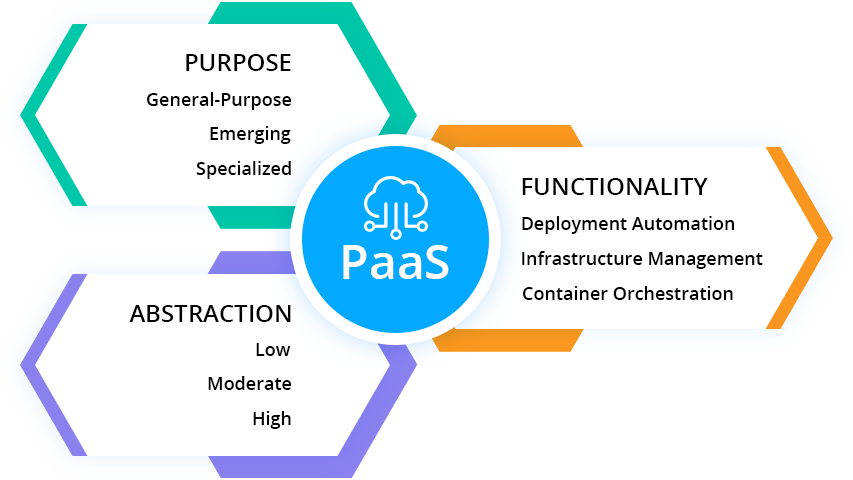

本文译自 [什么是 PaaS？ PaaS 类型介绍](https://jelastic.com/blog/what-is-paas-platform-as-a-service-types-explained/)。

译者：[helight](http://helight.cn/)。

原文地址：https://jelastic.com/blog/what-is-paas-platform-as-a-service-types-explained/

## 前言
这篇文章是对 PaaS 的划分介绍，没有从基础介绍开始，这里默认大家就是知道什么是 PaaS，PaaS 要解决什么问题的。

这里的分层对具体的 PaaS 建设我认为有比较好的指导意义，至少明白没有万能的 PaaS，只有适合业务场景的 PaaS。

那么大概有哪些类别的 PaaS？你的业务场景需要建设怎样的 PaaS 才能对业务有帮助？抽象到那一层是比较合适的？

一起来看看。

## 介绍

没有说一个 PaaS 可以适合所有人的。现在甚至云计算服务模型的定义也是相当模糊的。 一般情况下，它被描述为一种云托管平台，这个平台上具有一组部署服务并能自动扩展，有应用程序管理和 DevOps 工具，可以在共享基础设施或内部设施。同时，PaaS 屏蔽了构建和维护基础设施的复杂性。 让我们看看 PaaS 在其用例和支持的技术方面有何不同，以及如何确定哪种将满足特定的需求。

让我们从多个角度进一步研究和分析 PaaS 解决方案：
1. PaaS 的目标
2. PaaS 抽象能力
3. PaaS 功能

## 目标驱动的 PaaS 分类

今天的 PaaS 供应商通过提供专门为特定服务构建的各种工具，在云上为应用程序开发及其托管提供了创新实现。考虑到 PaaS 解决方案中托管的用例，我们可以将 PaaS 产品分为三大类：
1. 通用型 PaaS
2. 新兴 PaaS
3. 专用 PaaS
  
**通用**的平台被广泛选择用于传统的有状态 Web 和分层应用程序，从而为迁移现有工作负载提供了“提升和转变”的方法。 此外，这种 PaaS 类型会随着现代技术而及时扩展，以满足无状态云原生应用程序和微服务的需求，并有助于开发新的可扩展和容错服务。

**新兴的 PaaS** 为市场带来了新的实现。它们通常使用在开发基于新兴技术（例如无服务器，分布式事件处理，机器学习框架等等）的独立服务。

**专业平台**专注于较小的一些应用场景，但市场需求很高。实时证明此类产品在不同方向领域上都非常有价值，包括电子商务，大数据处理和商业应用等场景。 通常，这些平台会转变为 PaaS 的子类别，例如 CMSaaS，电子商务即服务，DBaaS，BPaS等等。

## PaaS 的抽象级别
PaaS 解决方案越来越关注于应用程序部署和交付过程的全周期自动化。这有助于开发人员将更多的精力放在应用程序设计及其实现上，而不是耗时的例行任务或复杂的任务，例如服务器和存储配置，应用程序和基础设施的安全性，自动扩展，负载平衡等等。

PaaS 的抽象级别可以分为 3 中：低，中和高。

**低抽象级别的平台**，尤其是容器即服务（CaaS）解决方案，为 DevOps 团队提供了对基础设施配置的底层访问，以及对容器和各种平台服务的精细控制（例如服务发现，日志记录，安全性和负载平衡）。

**中间抽象**的主要目的是使开发人员编码时无需担心基础设施的配置和管理。这些平台让开发人员可以访问从 CaaS 和 IaaS 部署属性中完全抽象出来的各种可集成和优化过的开发框架，中间件软件堆栈，API 和服务。此类 PaaS 解决方案通常提供开箱即用的自动扩展 ，负载平衡，高可用性，备份，灾难恢复，CI/CD 和其他应用程序生命周期管理功能。

**高度抽象**的解决方案目标是对甚至编码过程进行抽象，以提高应用程序交付速度并降低创新成本。在这种情况下，开发人员可以获得整个技术堆栈，但具有应用程序，平台和基础设施级别的完整抽象。它有助于提高团队成员的绩效并降低其技术技能的要求。

## 集成到 PaaS 的功能和服务

为了使应用程序生命周期管理过程自动化，PaaS 代表了一系列配置工具，持续集成和交付服务，流行的 IDE 的连接器和插件。
我们可以重点介绍这一类别中的三种主要方法：

### 部署自动化

PaaS 专注于为自动化部署提供工具和服务，提供 “一键式” 或 “git-push” 的功能，以及用于代码构建，持续集成和项目管理工具的预配置环境。

### 基础设施管理

云平台聚焦于基础设施配置，健康和可用性监视，安全和性能检查，成本优化，以及提供与升级和维护相关的自动化和服务。

### 容器编排

容器管理平台提供的功能可以解决容器化过程的挑战，以及对现有或新应用程序进行云原生化的挑战。 现在，许多 PaaS 供应商都将 CaaS 作为其产品的组成部分，从而进一步增强了 PaaS 作为各种 DevOps 工具集合的观点。

## 如何选择 PaaS

在为公司选择 PaaS 之前，要考虑几个要点。

1. 最重要的是要分析所选的 PaaS 是否支持目前开发团队使用或计划在未来使用的技术，中间件堆栈和编程语言。

2. 接下来要考虑的是供应商和数据绑定。 尽管有一些 PaaS 提供了好处，但是由于平台上的工具和服务的专有设计，对应用程序本身和使用的中间件堆栈的访问可能非常有限。这会影响应用程序的可移植性。因此，迁移到任何其他云或实现多云互操作性方法成为一个非常大的挑战。同样的问题也适用于存储的数据。 确保 PaaS 提供者允许轻松导入/导出数据，没有任何绑定。

没有适用于所有项目的“一刀切”的技术，但是在现代云世界中，所有可用的集成和互连功能使特定产品之间的界限变得模糊。当涉及到云服务，DevOps 工具和容器管理系统时，Jelastic 多云 PaaS 提供了所需的选择自由。尝试以最小的投资来极大地提高开发生产力和应用程序交付过程。

## 后记
Jelastic 这家公司是专门做 PaaS，SaaS 解决方案的，看了官网还是很专业的，但是没有体验具体产品。这篇文章是他们 PaaS 产品总监的总结，整体方向上是 OK 的。

我更关注的是他提到的 PaaS 抽象级别的划分和应用场景划分。这部分总结的还是挺好，就目前我的认识上来说，对我目前架构内部的 PaaS 平台是有指导意义的。

看完本文有收获？请分享给更多人

关注「黑光技术」，关注大数据+微服务

