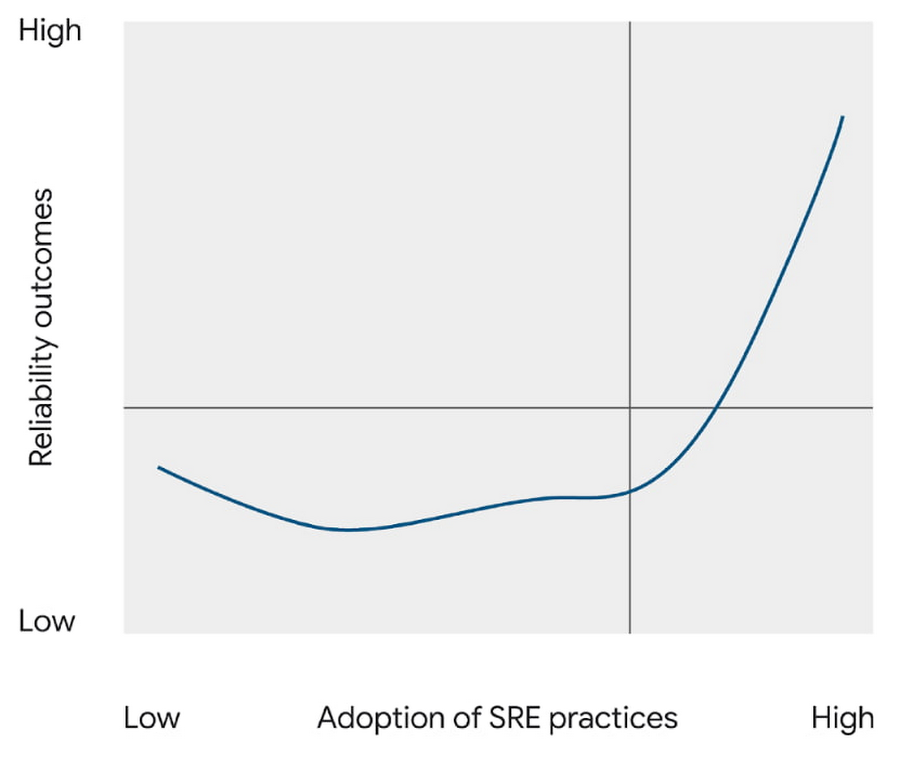

## Reliability and SRE in the 2022 State of DevOps Report

在设计、编码、测试、打包和测试之后，当一个软件变更为被部署状态时，旅程就结束了。与此同时，一个新的旅程开始了：您的客户与您的服务的关系。正是在运营领域，发布进度拖延等抽象风险让位给了收入损失、信任下降和声誉受损等有形风险。只有当软件对用户可用时，它才能有助于(或威胁)组织的成功。因此，在过去的几年中，DevOps 研究与评估([DORA](https://www.devops-research.com/research.html))项目逐步深化了我们对服务可靠性的研究，包括从部署到持续运行的可靠性。

可靠性是一个广义的术语，指的是团队满足用户期望的能力——对于软件服务来说，它可能包括可用性、延迟、正确性或其他影响用户体验的一致性和质量的特性。谷歌的[站点可靠性工程](http://sre.google/) (SRE)实践已经被全球可靠性工程实践者社区所接受和扩展，它是一种优先考虑以用户为导向的测量、共同责任和协作、无指责学习的运维方法。从[2021年加速DevOps现状报告](https://services.google.com/fh/files/misc/state-of-devops-2021.pdf)开始，我们开始询问受访者关于组织中的可靠性工程的详细问题。2022 年，我们继续扩大了调查范围，发现了现代可靠性工程广泛存在的进一步证据：大多数受访者报告称，他们采用 SRE 风格的实践。有了这些丰富的数据，今年我们进一步深入分析了可靠性的影响，以及它与技术对组织成功影响模型中其他动态因素的相互作用。

### 可靠性很重要

#### 当可靠性较差时，对软件交付的改进对组织的结果没有任何影响，甚至是负面影响。

可靠性不仅仅是有一点好处的：它是必不可少的。在之前的研究中，我们发现软件交付性能（通过变更前置时间、部署频率、变更失败率和故障恢复时间的“[四个关键指标](https://cloud.google.com/blog/products/devops-sre/using-the-four-keys-to-measure-your-devops-performance)”测量）是组织性能的预测。然而，今年的分析揭示了一个以前未见过的细微差别：软件交付对组织绩效的影响是以可靠性为基础的。当可靠性高时，高性能软件交付可以为组织预测更好的结果。但是当可靠性很差时，对软件交付的改进对组织的成果没有任何影响——甚至是负面影响。这肯定了可靠性工程师长期以来的一个信念：“[可靠性是任何系统最重要的特征](https://sre.google/workbook/reaching-beyond/)。”如果一项服务或产品不能满足用户的可靠性期望，那么快速发布华丽的新功能只会适得其反，因为用户无法正确地体验它们。软件交付依赖于可靠性的基础来创造价值。

### 可靠性是一个旅程

任何有经验的领导者都会告诉你，进步很少是线性的：即使是像 SRE 这样的学科，经过广泛实践并有明显的好处，通往成功的道路也不太可能是直线的。DORA 描述了组织转型的“[j曲线](https://cloud.google.com/architecture/devops/devops-tech-continuous-delivery#common_pitfalls_of_implementing_continuous_delivery)”，这是一种只有在经历挫折和吸取教训后才能持久成功的现象。今年，我们将团队的可靠性工程实践深度与其对服务的影响进行了比较：投资 SRE 是否会带来更高的可靠性？答案是肯定的，但有一个重要的警告：一开始不是。通过比较一系列 SRE 采用水平的可靠性结果，j曲线很明显。一个不认真实践SRE 的团队——也许在他们的 SRE 之旅的开始——可能不仅不会受益，而且会在用户体验的可靠性方面倒退。然而，在这些实践更深入地渗透之后，就会达到一个拐点，我们看到持续增长的可靠性工程能力会给可靠性带来巨大的好处。

意识到采用 SRE 的好处可能需要时间，所以尽早、尽可能广泛地启动这一过程可能很有吸引力。但我们在此提出警告：组织范围内的文化转型举措通常会因过度扩张而失败。我们对此进行了研究，并在[之前的报告](https://services.google.com/fh/files/misc/state-of-devops-2019.pdf#page=69)中报告了研究结果。而且，即使您成功地克服了困难，在多个团队中同时完全采用 SRE，成本也可能是不可接受的：您可能在早期经历的可靠性挫折，在整个组织中一下子放大，可能会产生灾难性的后果。因此，[渐变](https://sre.google/workbook/how-sre-relates/)的 SRE 原则也应适用于 SRE 本身的采用。

### 可靠性与人有关

回顾了十多年的 SRE 实践和理论，[企业SRE路线图](https://sre.google/resources/practices-and-processes/enterprise-roadmap-to-sre/)强调了文化的重要性，表明网站可靠性工程实际上是由文化产生的。工具和框架很重要；语言是必不可少的。但只有信任的、心理安全的文化才能支持持续学习的环境，这使 SRE 能够管理当今复杂的、动态的技术环境。DORA 在 2022 年的研究证明了文化和可靠性之间的相互作用：我们发现，[Westrum模型](https://cloud.google.com/architecture/devops/devops-culture-westrum-organizational-culture)定义的“生成”文化可以预测更高的可靠性结果。可靠性不仅对系统的用户有好处，对系统的制造商也有好处：服务高可靠性的团队工作倦怠的可能性要低1.6倍。