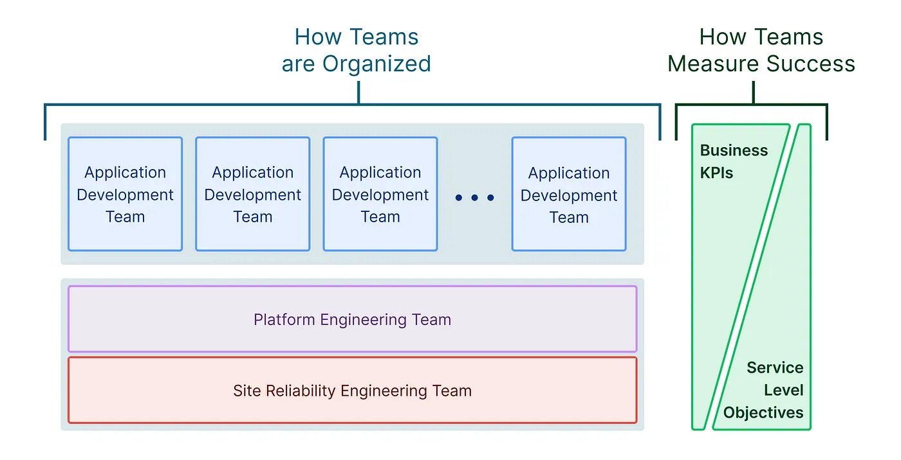

## DevOps、GitOps 和云原生工程组织的兴起

在过去的十年中，工程和技术组织已经汇集了一组用于构建和部署云原生应用程序的通用最佳实践。这些最佳实践包括持续交付、容器化和构建可观察系统。

与此同时，云原生组织已经从根本上改变了他们的组织方式，从大型部门(开发、QA、运维、发布)转移到较小的独立开发团队。这些应用开发团队有两个新功能支持：站点可靠性工程和平台工程。SRE 和平台工程是传统运维团队的精神继承者，将软件工程的学科引入了运维的各个方面。

## SRE 和平台工程

平台工程团队用软件工程原则来**加速软件交付**。平台工程师确保应用程序开发团队在软件交付生命周期的所有方面都是高效的。

SRE团队用软件工程原则来**提高可靠性**。站点可靠性工程师将影响云应用整体可靠性的故障频率和影响降到最低。

这两个团队经常混淆，这两个术语有时可以互换使用。事实上，一些组织将 SRE 和平台工程合并到相同的功能中。之所以会出现这种情况，是因为这两个角色都使用一套共同的原则：

- 平台即产品。这些团队应该花时间了解他们的内部客户，制定路线图，制定发布节奏计划，编写文档，以及完成软件产品中的所有事情。
- 自助平台。这些团队构建自己的平台供内部使用。在这些平台中，最佳实践被代码化了，因此这些平台的用户不需要担心——他们只需要按下按钮。在[Puppet Labs 2020 年 DevOps 状况报告](https://puppet.com/resources/report/2020-state-of-devops-report/)中，Puppet Labs 发现，高度化的 DevOps 组织比低度 DevOps 组织拥有更多的自助服务基础设施。
- 持续关注[消除杂活](https://sre.google/sre-book/eliminating-toil/)。正如谷歌 SRE 书中定义的那样，杂活是手动的、重复的、自动化的、战术的工作。最好的 SRE 和平台团队能够识别并消除辛劳。

## 平台工程

平台工程师不断地检查从源代码到生产的整个软件开发生命周期。通过这个自查的过程，他们构建了一个工作流，使应用程序开发人员能够快速编写和发布软件。基本的工作流通常包括与持续集成系统相连接的源代码控制系统，以及将工件部署到生产环境中的方法。

随着使用工作流的应用程序开发人员数量的增长，平台的需求也在变化。不同的应用程序开发团队需要类似但不同的工作流，因此自助服务基础设施变得很重要。自助服务的常见平台工程目标包括CI/CD、警报和部署工作流。

除了自助服务，教育和协作也成为挑战。平台工程师发现，他们花越来越多的时间培训应用程序开发人员，让他们了解最佳实践和如何最好地使用平台。应用程序开发人员还发现他们依赖于其他应用程序开发人员团队，并期望平台工程团队为他们提供与不同团队高效协作的工具。

## 站点可靠性工程

站点可靠性工程师创建和改进系统，以自动可靠地运行应用程序。站点可靠性工程的概念起源于谷歌，详细记录在[谷歌 SRE 手册](https://sre.google/sre-book/introduction/)中。谷歌公司负责技术运维的高级副总裁 Ben Treynor Sloss 将 SRE 描述为“当你要求软件工程师设计运维团队时发生的事情”。

SRE 定义服务水平目标（SLO），并构建系统来帮助服务实现这些目标。这些系统发展成为一个平台和工作流程，包括监控、事件管理、消除单点故障、故障缓解等。

SRE 文化的一个关键部分是将每一个故障视为可靠性系统中的一个故障。严格的事后分析对于识别故障的根本原因至关重要，并将纠正措施引入自动化系统以继续提高可靠性。

##  New Relic 公司的 SRE 和 平台工程

我们中的一个人(Bjorn Freeman-Benson)一直管理着 New Relic 的工程组织，直到2015年，它从少数客户发展到成千上万的客户，所有客户每秒都向云端发送数百万个请求。New Relic 有独立的 SRE和平台工程团队，他们遵循上述一般原则。

这些团队被分开建立的原因之一是，在这些角色中取得成功的人是不同的。虽然 SRE 和平台工程师除了需要经典的编程技能外，还需要强大的系统工程技能，但这些角色决定了非常不同的性格类型。SRE 倾向于享受危机管理，并在排除故障时获得肾上腺素飙升。SRE 经理能在巨大的压力下茁壮成长，擅长招募和管理想法相似的人。而平台工程师是更典型的软件工程师，他们更喜欢不间断地工作在大而复杂的问题上。平台工程经理更喜欢按照一致的节奏进行操作。

## DevOps 和 GitOps

在过去的十年中，DevOps 已经成为描述这些实践的一个流行术语。最近，GitOps 也成为了一个流行术语。然而 DevOps 和 GitOps 与平台和 SRE 团队有什么关系呢?

DevOps 和 GitOps 都是一套关于如何管理基础设施不同方面的松散编码原则。这两种方式的核心原则——自动化、基础设施即代码、软件工程的应用——还是非常相似的。

DevOps 是一场广泛的运动，它专注于消除开发和运维之间的传统隔阂。随着时间的推移，基础设施自动化和考虑运维的工程应用等策略已经被广泛接受，这些成为更好地构建高可靠性应用程序的方法。

GitOps 是一种应用程序交付方法。在 GitOps 中，声明性配置用于在任何时刻都以编码的方式来定义应用程序的所需的状态。这个配置编码在版本化的源代码控制系统中作为唯一的真实数据源进行管理。这确保了可审计性、可再现性和配置的一致性。

> 简而言之: DevOps 是 SRE 的一套指导原则，而 GitOps 是平台工程的一套指导原则。

## 提升应用开发效率

站点可靠性工程和平台工程是优化用于构建云原生应用的工程组织的两个关键功能。SRE 团队致力于为高可靠的应用程序交付基础架构，而平台工程团队致力于为快速的应用程序开发交付基础架构。这两个团队共同提高了应用程序开发团队的生产力。