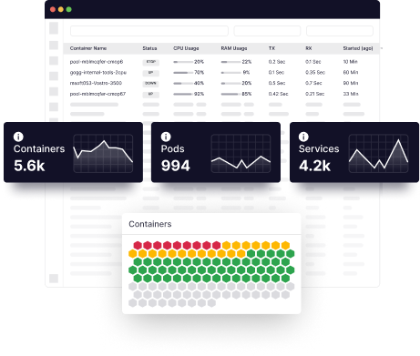
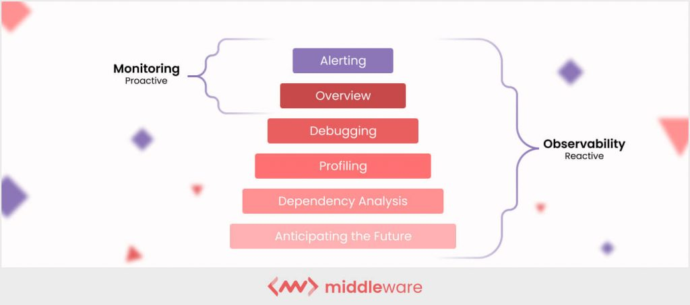
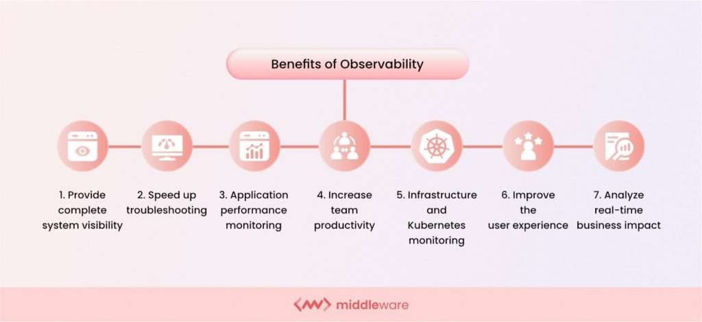
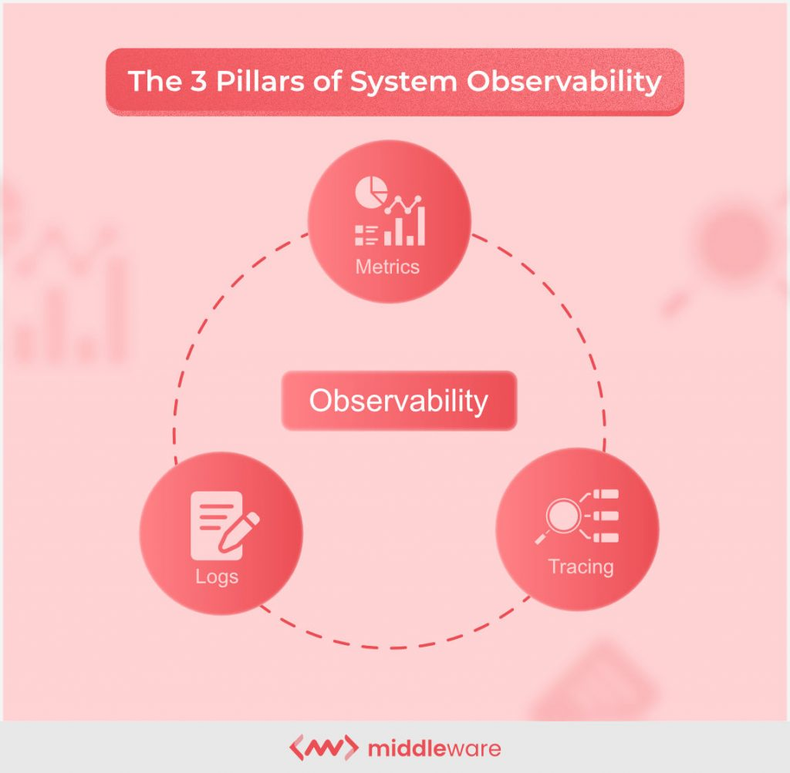
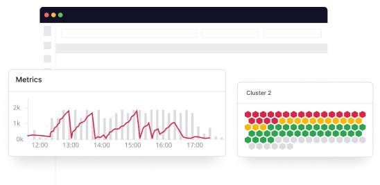

究竟什么是可观测性？可观测性提供了对分布式系统完整的可见性，因此你可以快速识别和修复问题。本指南涵盖了可观测性从基础知识到更高级概念的所有内容，并向你展示了它的详细工作原理。

在越来越多的公司采用 AWS 等云原生基础设施服务（包括微服务、无服务器和容器技术）之后，可观测性成为了近年来的流行语。在这些分布式系统追踪事件需要经过数千个进程。 

研发团队发现在分布式架构中，上线中和上线后的监控、跟踪和故障排除更加困难。可观测性为团队提供了一个有用的解决方案，可以深入了解这些多样化和复杂系统的每个组件。

它使用三种类型的数据（日志、指标和链路数据）来让对分布式系统有深入的可见性，并允许他们找到许多问题的根本原因并提高系统的性能。

> 根据最近的数据，78% 的技术专业人士表示，可观测性是实现核心业务目标的关键推动力。 
> 
> NewRelic 研究报告

因此，让我们深入了解可观测性到底是什么。它是如何工作的？它的挑战是什么？最重要的是，为什么它对你的组织很重要？我将讨论并解决所有这些问题以及更多其它的问题。

目录

1.  [什么是可观测性？](#what-is-observability?)
2.  [可观测性与监控有何不同？](#how-is-observability-different-from-monitoring?) 
3.  [为什么我们需要可观测性？了解一些好处](#why-do-we-need-observability?-learn-some-benefits)
4.  [可观测性的好处](#benefits-of-observability)
5.  [可观测性如何运作？](#how-does-observability-work?) 
6.  [可观测性最佳实践和挑战](#observability-best-practices-and-challenges) 
7.  [微服务和容器的可观测性是什么样的？](#what-does-observability-look-like-for-microservices-and-containers?)
8.  [在可观测性工具中寻找什么](#what-to-look-for-in-an-observability-tool)
9.  [排名前 5 的可观测性平台](#top-5-observability-platforms)
10.  [关于可观测性的最终想法](#final-thoughts-on-observability)
11.  [常见问题](#faqs)

## **什么是可观测性？**

**可观测性是** **根据系统生成的数据来衡量系统当前状态的能力**。它通过检查你可以使用的所有输入来提供对分布式系统的深入理解。

_可观测性_ 一词源于控制理论，即工程师如何从系统的外部输出推断系统的内部状态。这就是为什么可观测性和监控虽然相关，但却是两个不同的概念。 

可观测性允许团队：

-   更有效地监控现代 IT 系统
-   识别并连接复杂链条中的影响，使它们能够追溯到它们的原因。
-   使系统管理员、IT 运营分析师和开发人员能够了解整个架构。

Read more about [Observability v/s. Monitoring](https://middleware.io/blog/observability-vs-monitoring/)

## 可观测性与监控有何不同？ 

大多数[云监控解决方案](https://middleware.io/blog/cloud-monitoring-tools/)使用仪表板来显示性能指标，以便 IT 团队可以发现并解决问题。但是，由于这些仪表板是内部生成的，因此它们仅指示性能异常或你的团队预期的问题。 

因此，监控平台无法有效监控复杂的云原生应用程序和容器化环境，其中安全威胁是多方面的且不可预测的。

另一方面，可观测性使用从整个基础设施收集的[日志](https://middleware.io/product/log-monitoring/)、[链路](https://middleware.io/product/distributed-tracing/)和[指标。](https://middleware.io/product/infrastructure-monitoring/)可观测性平台提供对系统健康状况的可操作见解，在出现错误的第一个迹象时识别缺陷或弱攻击向量。在大多数情况下，可观测性工具可以在潜在问题出现之前提醒[DevOps 工程师。](https://middleware.io/blog/devops-roadmap/)

你可以通过可观测性访问系统速度、连接性、停机时间、瓶颈等信息。这使你的团队能够减少响应时间并保持系统的长期健康。 

阅读更多：[可观测性 v/s 监控](https://middleware.io/blog/observability-vs-monitoring/)

## **Why do we need observability?** Learn some benefits

Now that you have an idea of what observability is, next, let’s understand how does it help your organization? In a sentence, **observability gives you more control over complex systems.** 

Because they have fewer moving parts, simple systems are easier to handle. Monitoring CPU, memory, databases, and network conditions are enough to understand simple systems and apply the right solution to a problem.

Distributed and complex systems, on the other hand, have so many interconnected parts that the number and type of errors are much more significant. In addition, distributed systems update regularly, and each change can introduce a new type of bug. Complex systems create more “unknown unknowns.”
## **为什么我们需要可观测性？**了解一些好处

现在你已经了解什么是可观测性，接下来，让我们了解它如何帮助你的组织？简而言之，**可观测性使你可以更好地控制复杂系统。** 

因为它们的移动部件较少，所以简单的系统更容易处理。监控 CPU、内存、数据库和网络状况足以理解简单的系统并对问题应用正确的解决方案。

另一方面，分布式和复杂的系统具有如此多的相互关联的部分，以至于错误的数量和类型要严重得多。此外，分布式系统定期更新，每次更改都可能引入一种新型错误。复杂的系统会产生更多“未知的未知数”。

## Benefits of Observability

Observability is key to identifying these “unknown unknowns.” When you do, here are some **key benefits** that will arise. 
## 可观测性的好处

可观测性是识别这些“未知的未知数”的关键。当你这样做时，将会出现 以下一些**主要好处。**

### 1. Provide complete system visibility 

Observability gives engineering teams a complete view of their [cloud infrastructure architecture](https://middleware.io/blog/cloud-infrastructure-guide/). This makes it easier for teams to understand data in a complex system, from third-party apps and APIs to distributed services.

### 2. Speed up troubleshooting

Observability [empowers IT teams](https://middleware.io/blog/data-driven-approach-engineering/) to spot hard-to-detect issues, which improves troubleshooting time and reduces Mean Time to Identify (MTTI), Mean Time to Acknowledge (MTTA) and Mean Time to Restore (MTTR)—all key objectives for the modern SRE.

### 3. Application performance monitoring

A full stack observability helps organizations quickly identify and resolve performance issues, including those from cloud-native and microservices environments. An advanced observability solution can also increase efficiency and innovation for Ops and Apps teams through automation.

### 4. Increase team productivity

By quickly and accurately identifying errors, observability enables developers to spend more time-solving problems than finding them. It also reduces alert fatigue, one of the biggest productivity killers. 

### 5. Infrastructure and Kubernetes monitoring 

An observability solution provides teams valuable context to enhance application uptime and performance, reduce issue resolution time, identify cloud latency problems, optimize cloud resource usage, and streamline the administration of Kubernetes environments and modern cloud architectures.

### 6. Improve the user experience

With improved error detection and speeding up the troubleshooting process, observability systems achieve high system availability and reduce downtime. This provides an excellent user experience and builds customer confidence and loyalty. 

### 7. Analyze real-time business impact

By combining context with full-stack application analytics and performance, businesses can see applications’ direct impact on key business metrics and verify that all teams abide by internal and external SLAs. Additionally, it shortens the product’s time to market.

### 1.提供完整的系统可见性 

可观测性使工程团队能够全面了解其[云基础架构架构](https://middleware.io/blog/cloud-infrastructure-guide/)。这使团队更容易理解复杂系统中的数据，从第三方应用程序和 API 到分布式服务。

### 2.加快故障排除

可观测性[使 IT 团队](https://middleware.io/blog/data-driven-approach-engineering/)能够发现难以检测的问题，从而缩短故障排除时间并减少平均识别时间 (MTTI)、平均确认时间 (MTTA) 和平均恢复时间 (MTTR)——所有这些都是现代 SRE 的关键目标.

### 3. 应用性能监控

全栈可观测性可帮助组织快速识别和解决性能问题，包括来自云原生和微服务环境的性能问题。先进的可观测性解决方案还可以通过自动化提高 Ops 和 Apps 团队的效率和创新。

### 4. 提高团队生产力

通过快速准确地识别错误，可观测性使开发人员能够将更多时间花在解决问题上而不是发现问题上。它还可以减少警报疲劳，这是最大的生产力杀手之一。 

### 5.基础设施和Kubernetes监控 

可观测性解决方案为团队提供了宝贵的上下文，以提高应用程序的正常运行时间和性能，减少问题解决时间，识别云延迟问题，优化云资源使用，并简化 Kubernetes 环境和现代云架构的管理。

### 6.改善用户体验

通过改进错误检测并加快故障排除过程，可观测性系统实现了高系统可用性并减少了停机时间。这提供了出色的用户体验，并建立了客户的信心和忠诚度。 

### 7.分析实时业务影响

通过将上下文与全栈应用程序分析和性能相结合，企业可以看到应用程序对关键业务指标的直接影响，并验证所有团队是否遵守内部和外部 SLA。此外，它还缩短了产品上市时间。

## How does observability work? 

Observability works on three pillars: logs, metrics, and traces. By continuously identifying and gathering these three types of data, observability platforms can correlate them in real-time to give your entire organization—from [DevOps](https://middleware.io/blog/what-is-devops/) to SRE to IT and more—comprehensive, contextual information. 

In short, observability platforms turn the _what_ into a _why_. Armed with this information, your teams can identify and fix problems in real-time. 

Different observability platforms will do this in different ways. Some search for new telemetry sources that may be present in the system (such as a recent API call to another software application). Others also feature AIOps (artificial intelligence for operations) capabilities that separate the signals—indicators of real problems—from noise because they deal with much more data than a traditional [APM solution](https://middleware.io/product/apm/).

However, observability centers around these three pillars, regardless of your platform.
## 可观测性如何运作？ 

可观测性基于三个支柱：日志、指标和跟踪。通过持续识别和收集这三种类型的数据，可观测性平台可以实时关联它们，为你的整个组织（从[DevOps](https://middleware.io/blog/what-is-devops/)到 SRE 再到 IT 等）提供全面的上下文信息。 

简而言之，可观测性平台将“_什么”_变成“_为什么”_。有了这些信息，你的团队就可以实时识别和解决问题。 

不同的可观测性平台将以不同的方式做到这一点。有些搜索系统中可能存在的新遥测源（例如最近对另一个软件应用程序的 API 调用）。[其他解决方案还具有 AIOps（运营人工智能）功能，可以将信号（实际问题的指标）与噪音分开，因为它们处理的数据比传统的APM 解决方案](https://middleware.io/product/apm/)多得多。

然而，可观测性以这三个支柱为中心，与你的平台无关。

### Logs

[Logs](https://middleware.io/product/log-monitoring/) are immutable, timestamped records of discrete events that happened over a set time frame within an application. Developers can use logs to uncover emergent and unpredictable behaviors within each component in a [microservices architecture](https://middleware.io/blog/microservices-architecture/). 

There are three types of logs:

-   **Plain text**: A log record can be free text. This is also the most popular log format.
-   **Structured**: This type sends logs in JSON format.
-   **Binary**: Protobuf logs, MySQL BinLogs for replication and point-in-time recovery, Systemd journal logs, and the PFLOG format used by the BSD firewall pf are frequently used as a backup system.

Every component of a cloud-native application emits one of these log types. This can lead to a lot of noise. Observability takes these data and converts them into actionable information. 
### 日志

[日志](https://middleware.io/product/log-monitoring/)是应用程序内在设定时间范围内发生的离散事件的不可变的、带时间戳的记录。开发人员可以使用日志来发现[微服务架构](https://middleware.io/blog/microservices-architecture/)中每个组件内的紧急和不可预测的行为。 

日志分为三种类型：

-   **纯文本**：日志记录可以是自由文本。这也是最流行的日志格式。
-   **结构化**：此类型以 JSON 格式发送日志。
-   **Binary**：Protobuf 日志、用于复制和时间点恢复的 MySQL BinLogs、Systemd 日志日志以及 BSD 防火墙 pf 使用的 PFLOG 格式经常用作备份系统。

云原生应用程序的每个组件都会发出这些日志类型之一。这会导致很多噪音。可观测性获取这些数据并将它们转换为可操作的信息。

### Metrics

Metrics are the numerical values that represent and describe the overall behavior of a service or component measured over time. Examples include **timestamps**, **names**, and **values**. Because they are structured by default, they’re easy to query and optimize for storage. 

Metrics save time because they can easily [correlate across infrastructure components](https://middleware.io/product/infrastructure-monitoring/) to provide a comprehensive picture of system health and performance. They also enable quicker data search and advanced data preservation. 

However, metrics do have limits. When triggered, they can indicate when maximum or minimum thresholds are reached, not why the issue occurred or what the user experiences on the front end. Those insights require additional pillars of observability. 
### 指标

指标是代表和描述随时间测量的服务或组件的整体行为的数值。示例包括**时间戳**、**名称**和**值**。因为它们是默认结构化的，所以它们很容易查询和优化存储。 

指标可以节省时间，因为它们可以轻松地[跨基础设施组件关联起来](https://middleware.io/product/infrastructure-monitoring/)，以全面了解系统的健康状况和性能。它们还支持更快的数据搜索和高级数据保存。 

但是，指标确实有局限性。触发时，它们可以指示何时达到最大或最小阈值，而不是问题发生的原因或用户在前端的体验。这些见解需要额外的可观测性支柱。
### Traces

While logs and metrics evaluate individual system behavior and performance, they’re rarely useful in determining a request’s lifecycle in a distributed system. [Tracing](https://middleware.io/product/distributed-tracing/) provides an additional method to this context.

Suppose metrics tell you that an issue is occurring. In that case, traces help you investigate the precise service causing the issue, enabling developers and engineers to quickly identify and fix the root cause. 

Through traces, engineers can analyze request flow and understand the entire request lifecycle in a distributed application. Each operation is encoded with critical data related to the microservices performing that operation. 

Traces can help you assess overall system health, identify bottlenecks, spot and fix problems faster, and select valuable areas for tweaks and improvements.
### 痕迹

虽然日志和指标评估单个系统的行为和性能，但它们很少用于确定分布式系统中请求的生命周期。[跟踪](https://middleware.io/product/distributed-tracing/)为这种情况提供了一种额外的方法。

假设指标告诉你出现了问题。在这种情况下，跟踪可以帮助你调查导致问题的精确服务，使开发人员和工程师能够快速识别并修复根本原因。 

通过跟踪，工程师可以分析请求流并了解分布式应用程序中的整个请求生命周期。每个操作都使用与执行该操作的微服务相关的关键数据进行编码。 

跟踪可以帮助你评估整体系统健康状况、识别瓶颈、更快地发现和修复问题，以及选择有价值的区域进行调整和改进。

### Combining the three pillars into a unified view 

### Achieve complete system observability with Middleware

[Try now](https://app.middleware.io/auth/register/)

Businesses use different tools for each function which does not ensure observability. Instead, integrating logs, metrics, and traces into a unified solution is the key to achieving successful observability.

By doing so, you gain an understanding of when problems occur and an ability to quickly shift focus to understanding the underlying causes of those issues.
### 将三大支柱结合成一个统一的观点 

### 使用中间件实现完整的系统可观测性

[现在试试](https://app.middleware.io/auth/register/)

企业为每个不能确保可观测性的功能使用不同的工具。相反，将日志、指标和跟踪集成到一个统一的解决方案中是实现成功可观测性的关键。

通过这样做，你可以了解问题何时发生，并能够快速将注意力转移到了解这些问题的根本原因上。

## Observability best practices and challenges 

Given the importance of Observability in today’s complex systems, having a set of Observability best practices becomes critical.

By following best practices, organizations can achieve a high degree of observability and proactively address system issues before they become critical problems.

-   **Using a unified observability solution:** Integrate logs, metrics, and traces into a single platform for a comprehensive view of system performance.
-   **Defining relevant metrics:** Determine the most important metrics to your organization’s goals and track them consistently.
-   **Setting up alerts:** Establish alert thresholds for critical metrics and automate alert notifications to ensure timely issue resolution.
-   **Leveraging machine learning:** Use machine learning algorithms to identify anomalies and proactively identify potential issues.
-   **Collaborating across teams:** Foster collaboration between development, operations, and business teams to ensure everyone has visibility into system performance.
-   **Continuously refining observability:** Regularly review and refine your observability strategy to ensure it aligns with changing business needs and emerging technologies.

Read more about [observability best practices](https://middleware.io/blog/observability-best-practices/)

## 可观测性最佳实践和挑战 

鉴于可观测性在当今复杂系统中的重要性，拥有一套可观测性最佳实践变得至关重要。

通过遵循最佳实践，组织可以实现高度的可观测性，并在系统问题成为关键问题之前主动解决它们。

-   **使用统一的可观测性解决方案：**将日志、指标和跟踪集成到一个平台中，以全面了解系统性能。
-   **定义相关指标：**确定对你组织的目标最重要的指标并持续跟踪它们。
-   **设置警报：**为关键指标建立警报阈值并自动发出警报通知，以确保及时解决问题。
-   **利用机器学习：**使用机器学习算法来识别异常并主动识别潜在问题。
-   **跨团队协作：**促进开发、运营和业务团队之间的协作，以确保每个人都能了解系统性能。
-   **不断改进可观测性：**定期审查和改进你的可观测性策略，以确保它符合不断变化的业务需求和新兴技术。

阅读有关[可观测性最佳实践的更多信息](https://middleware.io/blog/observability-best-practices/)

### Challenges of observability

While observability is a powerful tool for modern, cloud-native architecture, it’s not without its limitations. Some of these include:

-   Dynamic, multi-cloud environments are increasingly complex, and many legacy observability platforms have a hard time keeping up
-   Data and alert volume, velocity, and variety can mean that signals get lost among the noise, as well as create alert fatigue
-   Siloed infra, dev, ops, and business teams cause many key insights to become lost or come to the surface too late
-   Connecting correlation to causations, realizing which actions, features, apps, and experiences actually drive business impact

It’s important to understand the challenges that [modern observability platforms](https://middleware.io/) face that way, you have clear expectations of what to expect going in.
### 可观测性的挑战

虽然可观测性是现代云原生架构的强大工具，但它并非没有局限性。其中一些包括：

-   动态的多云环境越来越复杂，许多遗留的可观测性平台很难跟上
-   数据和警报量、速度和多样性可能意味着信号在噪音中丢失，并造成警报疲劳
-   孤立的基础设施、开发、运营和业务团队导致许多关键见解丢失或浮出水面太晚
-   将相关性与因果关系联系起来，了解哪些行为、功能、应用程序和体验真正推动了业务影响

了解[现代可观测性平台](https://middleware.io/)所面临的挑战很重要，你对进入的内容有明确的期望。

## What does observability look like for microservices and containers?

As organizations rapidly adopt microservices-based architecture for their applications, observability platforms and processes must adapt their approaches to keep up. Two major forces have contributed to this next evolution in observability: 

1.  **Cloud computing.** As serverless and Lambda functions increase in popularity, organizations can scale faster than ever.
2.  **Containerization.** Docker, Kubernetes, and other container technologies make it easy to spin up new services and scale them on demand. 

So what does observability mean for distributed systems and applications based on microservices? That’s where the challenge arises.

Because it’s impossible to predict all states of a system, identifying root causes becomes a bigger challenge. It requires massive data and the systems necessary to turn said data into actionable information to gain the full picture. 

In **microservices observability**, tracing plays a much more prominent role. With distributed tracing, you can ask the following questions: 

-   How much time did the request take to traverse each microservice?
-   What is the sequence of calls that were made during a user request?
-   What did each microservice do to complete a request?
-   Which component was the performance bottleneck?
-   What was the deviation from the normal behavior of the system?
## 微服务和容器的可观测性是什么样的？

随着组织迅速为其应用程序采用基于微服务的架构，可观测性平台和流程必须调整其方法以跟上步伐。两大力量促成了可观测性的下一次演变： 

1.  **云计算。**随着无服务器和 Lambda 函数越来越受欢迎，组织可以比以往更快地扩展。
2.  **容器化。**Docker、Kubernetes 和其他容器技术可以轻松启动新服务并按需扩展它们。 

那么对于基于微服务的分布式系统和应用来说，可观测性意味着什么呢？这就是挑战出现的地方。

因为不可能预测系统的所有状态，所以识别根本原因成为一个更大的挑战。它需要海量数据和将所述数据转化为可操作信息以获取全貌所需的系统。 

在**微服务可观测性**中，跟踪起着更为突出的作用。使用分布式跟踪，你可以提出以下问题： 

-   请求遍历每个微服务用了多少时间？
-   在用户请求期间进行的调用顺序是什么？
-   每个微服务做了什么来完成一个请求？
-   哪个组件是性能瓶颈？
-   与系统正常行为的偏差是什么？

[Distributed tracing](https://middleware.io/product/distributed-tracing/) reconstructs the whole execution path of a user request, passing a context object along said path. As context propagates, the system can correlate events into a sequential flow that depicts causal relationships. 

Two data points are critical for this to work:

1.  Time is taken by a user request to traverse each component of the microservices application
2.  The sequential flow of the request from start to end

These data make it possible to identify bottlenecks and trace issues back to their root causes. 

But how exactly is **distributed tracing** different from logging? A key way to remember is this: logging focuses on what happens within an individual application, while tracing works to connect the dots among various microservices applications. 

An engineer can use distributed tracing to pinpoint the source of an error. Then, once they’ve identified that source, they can use logs to diving into what happened and how to fix it. 

Together, distributed tracing and logs result in faster resolution and reduced downtime—even among microservices-based applications. 
[分布式跟踪](https://middleware.io/product/distributed-tracing/)重建用户请求的整个执行路径，沿着所述路径传递上下文对象。随着上下文的传播，系统可以将事件关联到描述因果关系的顺序流中。 

两个数据点对于此工作至关重要：

1.  用户请求遍历微服务应用程序的每个组件所花费的时间
2.  请求从开始到结束的顺序流程

这些数据使识别瓶颈和追溯问题的根本原因成为可能。 

**但是分布式跟踪**与日志记录究竟有何不同？要记住的一个关键方法是：日志记录专注于单个应用程序中发生的事情，而跟踪则用于连接各种微服务应用程序之间的点。 

工程师可以使用分布式跟踪来查明错误的来源。然后，一旦他们确定了该来源，他们就可以使用日志来深入了解发生了什么以及如何修复它。 

分布式跟踪和日志一起可以加快解决问题并减少停机时间——即使在基于微服务的应用程序中也是如此。

## What to look for in an observability tool

When choosing an [observability platform](https://middleware.io/), several factors go into play: capabilities, data volume, degree of transparency, and corporate goals. 
## 在可观测性工具中寻找什么

在选择[可观测性平台](https://middleware.io/)时，有几个因素会发挥作用：功能、数据量、透明度和企业目标。

### Real-time cloud-native observability platform at scale.

[Get started for free](https://app.middleware.io/auth/register/)

Neither the most expensive nor the cheapest option is the best one. It’s all about finding the best fit for your organizational needs. 
最昂贵或最便宜的选择都不是最好的选择。这一切都是为了找到最适合你组织需求的方案。

### 1. User-friendly interface

Dashboards provide a clear picture of system health and errors in an easy-to-digest way.  at different levels in a system. Since your solution will affect many people in the company, it should be user-friendly and easy to implement. Otherwise, it won’t fit into your established procedures, and key stakeholders will quickly lose interest.

### 2. Real-time data

Gathering real-time data is critical, as stale data complicates determining the best course of action. Therefore, you should use current event-handling techniques and APIs to collect real-time data and put everything in perspective. You won’t know about the data if you don’t have it.

### 3. Open-source compatibility

When choosing an observability tool, it’s important to consider how it retrieves and processes data about your environment.

Using an observability tool that uses open-source agents to fetch and process data in two ways is advisable. These reduce your system’s CPU and memory consumption and offer appropriate security and easier configuration than agents developed internally. 

### 4. Easy to implement

It’s not enough to purchase observability software. You also have to put it to use. Finding a platform that’s easy to implement—ideally with a support team and knowledgebase—is key to maximizing its value. 

### 5. Integrations

Equally important is finding an observability platform that works with your current stack. Ensure that the platform supports your environment’s frameworks and languages, container platform, messaging platform, and other important software.

### 6. Clear business value

Some observability platforms are better than others at certain tasks. Benchmark your observability tool against key business performance indicators (KPIs) like deployment time, system stability, and customer satisfaction.
### 1. 用户友好的界面

仪表板以易于理解的方式提供系统运行状况和错误的清晰画面。在一个系统的不同层次。由于你的解决方案会影响公司中的许多人，因此它应该是用户友好且易于实施的。否则，它将不适合你既定的程序，关键利益相关者将很快失去兴趣。

### 2、实时数据

收集实时数据至关重要，因为过时的数据会使确定最佳行动方案变得复杂。因此，你应该使用当前的事件处理技术和 API 来收集实时数据并正确看待所有事情。如果你没有数据，你将不会知道这些数据。

### 3.开源兼容性

选择可观测性工具时，重要的是要考虑它如何检索和处理有关你的环境的数据。

建议使用使用开源代理以两种方式获取和处理数据的可观测性工具。这些减少了系统的 CPU 和内存消耗，并提供了适当的安全性和比内部开发的代理更容易的配置。 

### 4.易于实施

仅仅购买可观测性软件是不够的。你还必须使用它。找到一个易于实施的平台（最好有支持团队和知识库）是实现其价值最大化的关键。 

### 5.整合

同样重要的是找到一个适用于你当前堆栈的可观测性平台。确保平台支持你环境的框架和语言、容器平台、消息传递平台和其他重要软件。

### 6.明确的商业价值

一些可观测性平台在某些任务上比其他平台更好。根据部署时间、系统稳定性和客户满意度等关键业务绩效指标 (KPI) 对你的可观测性工具进行基准测试。

## Top 5 observability platforms

Once you have a clear idea of your organizational observability goals, you can compare various observability platforms against those goals. Here are the top five to consider. 

### 1. Middleware

Middleware is a cloud-native observability platform that will help you un-silo your data and insights from all your containers. Our platform empowers you to identify root causes, solve issues in real-time, and get the best value for money. 

Bring all your metrics, logs, and traces into a single timeline, and empower your developers and DevOps to debug and fix the issue faster—reducing downtime and improving the user experience. The tool also has a unified dashboard that displays all core and essential services in one place.

### 2. Splunk

Splunk is a sophisticated analytics system that correlates and applies machine learning to data to enable predictive, real-time performance monitoring and a fully integrated IT management solution. It allows teams to detect, respond to, and resolve events in one place.

### 3. Datadog

Datadog is a cloud monitoring tool for IT, development, and operations teams that want to transform the massive amounts of data created by their applications, tools, and services into actionable intelligence. Companies of all sizes use Datadog across a variety of industries.

### 4. Dynatrace

Dynatrace is a cloud-based, on-premises, hybrid application and SaaS monitoring platform. It provides continuous APM self-learning and predictive alerts for proactive issue resolution using AI-assisted algorithms. Dynatrace offers an easy-to-use interface with a wide range of products to generate detailed monthly reports on app performance and SLAs.

### 5. Observe, Inc.

Observe is a SaaS Observability tool. It provides a dashboard showing your applications’ top issues and the system’s overall health. Since it’s a cloud-based platform, it’s fully elastic. Observe uses open-source agents to collect and process data, so the setup process is relatively quick and easy.
## 排名前 5 的可观测性平台

一旦你对组织的可观测性目标有了清晰的认识，你就可以将各种可观测性平台与这些目标进行比较。以下是要考虑的前五名。 

### 1.中间件

中间件是一个云原生可观测性平台，可帮助你从所有容器中消除数据和见解的孤岛。我们的平台使你能够找出根本原因，实时解决问题，并获得最大的性价比。 

将你的所有指标、日志和跟踪记录纳入一个时间线，并使你的开发人员和 DevOps 能够更快地调试和修复问题——减少停机时间并改善用户体验。该工具还有一个统一的仪表板，可以在一个地方显示所有核心和基本服务。

### 2. 斯普伦克

Splunk 是一个复杂的分析系统，它将机器学习与数据相关联并将其应用到数据中，以实现预测性、实时性能监控和完全集成的 IT 管理解决方案。它允许团队在一处检测、响应和解决事件。

### 3.数据狗

Datadog 是一种云监控工具，适用于希望将其应用程序、工具和服务创建的大量数据转换为可操作情报的 IT、开发和运营团队。各种规模的公司都在各个行业使用 Datadog。

### 4.动态追踪

Dynatrace 是一个基于云的本地混合应用程序和 SaaS 监控平台。它提供连续的 APM 自学习和预测警报，以使用 AI 辅助算法主动解决问题。Dynatrace 提供易于使用的界面和广泛的产品，以生成有关应用程序性能和 SLA 的详细月度报告。

### 5.观察公司

Observe 是一个 SaaS 可观测性工具。它提供了一个仪表板，显示你的应用程序的主要问题和系统的整体健康状况。由于它是一个基于云的平台，因此具有完全的弹性。Observe 使用开源代理来收集和处理数据，因此设置过程相对快速和简单。

## Final thoughts on observability

The value of observability comes from its organizational impact. When engineers and developers can spot issues in real-time, trace them to the root cause, and fix them quickly, the results are less downtime, better experiences, and happier users and customers. 

As systems become exponentially more complex, it’s important to have an observability platform to keep up: managing cloud-native environments, dynamic microservices and [containers](https://middleware.io/product/container-monitoring/), and distributed systems. Modern observability takes an otherwise complex and often cryptic infrastructure and makes it accessible to engineers and all interested stakeholders. 

Middleware observability platform offers all these capabilities in one place, enabling your organization to manage modern cloud complexity and accelerate transformation. Comprehensive observability is now more essential than ever for every cloud migration.

_To learn more about Middleware,_ [_sign up here_](https://app.middleware.io/auth/register/)_._
## 关于可观测性的最终想法

可观测性的价值来自其对组织的影响。当工程师和开发人员可以实时发现问题、追踪问题的根本原因并快速修复它们时，结果就是停机时间更少、体验更好、用户和客户更满意。 

随着系统变得越来越复杂，重要的是要有一个可观测性平台来跟上：管理云原生环境、动态微服务和[容器](https://middleware.io/product/container-monitoring/)，以及分布式系统。现代可观测性采用原本复杂且通常神秘的基础架构，并使工程师和所有感兴趣的利益相关者都可以访问它。 

中间件可观测性平台在一处提供所有这些功能，使你的组织能够管理现代云的复杂性并加速转型。对于每次云迁移，全面的可观测性现在比以往任何时候都更加重要。

_要了解有关中间件的更多信息，_[_请在此处注册_](https://app.middleware.io/auth/register/)_。

## FAQs

### What is observability?

Observability is the ability to monitor a system’s current state based on the data it produces, such as logs, metrics, and traces. Or in other words, observability refers to its ability to discern internal states by looking at the output over a finite period. It uses telemetry data from instrumenting endpoints and services in your distributed systems.
## 常见问题

### 什么是可观测性？

可观测性是根据系统生成的数据（例如日志、指标和跟踪）监视系统当前状态的能力。或者换句话说，可观测性是指它通过查看有限时期内的输出来辨别内部状态的能力。它使用来自分布式系统中检测端点和服务的遥测数据。
### Why is observability important?
Observability is important because it gives you greater control and complete visibility over complex distributed systems. Simple systems have fewer moving parts, making them easier to manage. But in complex distributed systems, you need to monitor CPU, logs, traces, memory, databases and networking conditions to understand these systems and apply the appropriate fix to a problem.
### 为什么可观测性很重要？

可观测性很重要，因为它可以让你更好地控制复杂的分布式系统并获得完整的可见性。简单系统的活动部件较少，因此更易于管理。但在复杂的分布式系统中，你需要监控 CPU、日志、跟踪、内存、数据库和网络状况，以了解这些系统并对问题应用适当的修复。

### What are the three pillars of observability?
The 3 pillars of observability: **Logs, metrics and traces.**  
  
**Logs:** These give you the necessary insights into raw system information to determine what happens to your database. An event log is a time-stamped, immutable record of discrete events over a period.  
  
**Metrics:** Metrics are numerical representations of data that can identify the overall behavior of a service or component over time. Metrics comprise properties such as name, value, label, and timestamp that convey data about SLAs, SLOs, and SLIs.  
  
**Traces:** A trace shows the complete path of a request or action through a distributed system’s nodes. Traces help you profile and monitor systems, especially containerized applications, serverless, and microservices architectures.
### 可观测性的三大支柱是什么？

可观测性的 3 大支柱：**日志、指标和跟踪。**  
  
**日志：**这些使你对原始系统信息有必要的了解，以确定数据库发生了什么。事件日志是一段时间内离散事件的带有时间戳的不可变记录。  
  
**指标：**指标是数据的数字表示，可以识别服务或组件随时间的整体行为。指标包括名称、值、标签和时间戳等属性，它们传达有关 SLA、SLO 和 SLI 的数据。  
  
**跟踪：**跟踪显示请求或操作通过分布式系统节点的完整路径。跟踪可帮助你分析和监控系统，尤其是容器化应用程序、无服务器和微服务架构。
### How do I implement observability?
Your systems and apps need proper tooling to collect the appropriate telemetry data to achieve observability. You use open-source software or a commercial observability solution to make an observable system by building your own tools. Typically, four components are involved in implementing observability: logs, traces, metrics and events.
### 如何实现可观测性？

你的系统和应用程序需要适当的工具来收集适当的遥测数据以实现可观测性。你使用开源软件或商业可观测性解决方案，通过构建你自己的工具来制作可观察系统。通常，实现可观测性涉及四个组件：日志、跟踪、指标和事件。

原文：https://middleware.io/blog/observability/