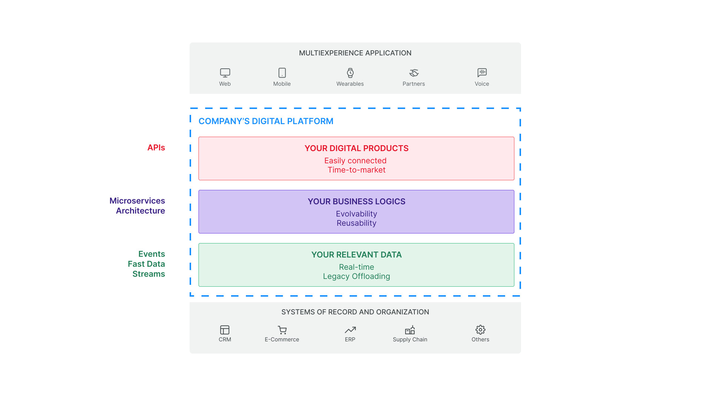

## 平台工程: 入门所需的所有知识

数字平台正在形成一种提供服务和吸引用户的新方式。多亏了他们，才有可能为客户提供全渠道的体验，达到他们与公司互动的所有接入点。因此，组织可以利用这些机会来创建新的业务模型。

鉴于它们的广泛使用，在本文中，我们希望提供一个指南，以理解围绕数字平台而创建和发展的整个生态系统的基本原理。特别地，我们将解释开始使用云平台时需要了解的**基本概念**，并提供最重要的术语表。

## 数字平台：理解什么是成功的原因

当然，首先要了解的概念是**数字平台**，它是数字转型背后的工具。数字平台在用户与组织交互的外部渠道和组织的内部系统(例如CRM、电子商务、管理系统等)之间**架起了数字鸿沟的桥梁**。此外，该平台帮助**系统减负**，增加了所提供服务的可扩展性和灵活性，并缩短了上市时间。

一个结构良好的平台通常使用现代云原生技术开发，并分为三个层次:

- -数据管理层：数据从组织系统中解耦，聚合在一个视图中，最终近乎[实时](https://blog.mia-platform.eu/en/fast-data-evolve-your-users-experience-with-real-time-information)可用。
- 一个专用于业务逻辑的层：这里运行了一个[微服务](https://blog.mia-platform.eu/en/microservices-the-architectural-style-for-modern-applications)架构，它包含了与公司核心业务相关的所有功能。
- 数字产品层，也就是一套 api，可以方便地连接外部渠道并缩短上市时间。

## 平台工程：构建基础平台

当讨论数字平台时，首先要考虑的概念之一是**平台工程**，根据[Gartner的定义](https://www.gartner.com/en/articles/what-s-new-in-the-2022-gartner-hype-cycle-for-emerging-technologies)， **这是构建和运营用于软件交付和生命周期管理的内部自助开发者平台(IDPs)的学科**。这个术语指的是平台的初始设计阶段，这当然是必要的，也可能很耗时，尤其是从头开始的时候。但是平台工程还包括设计之后的实现阶段，以及最重要的维护阶段，这是**持续改进、扩展和更新**平台功能的工作。

云平台一直在发展。每天都在开发新的工具，包括开源软件和专有软件，可以通过集成来促进或扩展某些操作。除此之外，[**平台工程师**](https://mia-platform.eu/solutions/platform-engineer-devops/)及其团队(也称为平台团队，我们将在后面看到)的日常工作重点是根据组织的需求**创建工作流和自动化逻辑**。

平台工程正蓬勃发展，它被认为是一个非常具有颠覆性的趋势，以至于许多人认为它可以取代 DevOps 和 SRE。阅读这篇[博客文章](https://blog.mia-platform.eu/en/is-platform-engineering-putting-an-end-to-devops-and-sre)以了解更多!

## 平台经济：寻找平台的价值

数字平台，特别是云平台的现象现在非常普遍，它创造了一个完整的经济，称为**平台经济**。有趣的是，云平台提供的模块化和灵活性使即使是小公司也能**与更结构化的竞争对手竞争**。事实上，引领平台经济的创新科技公司，如 Uber、Spotify 和 Airbnb，是在市场上支持自己的最成功的公司。

要进一步探索，请阅读我们博客上的这篇文章：[平台经济:为什么你需要模块化IT架构](https://blog.mia-platform.eu/en/platform-economy-why-you-need-a-modular-it-architecture)。

## 平台公司：基于平台组织公司

上面提到的平台经济的主要参与者是**平台公司**，它们是围绕数字平台构建商业模式的公司。采用这种方法最初需要大量的组织和运营工作，但是从长远来看，它提供了灵活性、敏捷性以及在出现业务机会时演化和抓住业务机会的能力。

平台公司**专注于客户**，客户是所有战略决策的中心。这意味着与技术实现或业务流程相关的复杂性不应该从外部感知；最重要的是，**内部复杂性不应该影响最终用户及其体验**。

想了解更多关于这个主题的信息，请下载我们的免费白皮书[为什么以及如何发展成一个平台公司](https://resources.mia-platform.eu/en/white-paper-why-and-how-to-evolve-into-a-platform-company)。

## 平台团队：每天都在改进平台

一旦平台在公司内部创建和实现，就有必要**每天都在它上面工作**，以优化和扩展它的功能。这项工作通常由一个专门的团队完成，称为**平台团队**，由具有不同技能和经验的成员组成，尽可能跨职能。

平台团队的客户是公司的开发人员。平台团队的目的是确保其他团队在使用平台时尽可能获得无障碍和自助的体验：因此，平台团队必须专注于软件生命周期的所有方面。

## 开发者平台：改善开发体验

**The IDP aims to serve the entire IT department of the organization**. Specifically, this tool allows to:
**开发者平台**(也称为开发者门户)旨在简化开发团队的工作并改善[开发者体验](https://blog.mia-platform.eu/en/how-a-frictionless-developer-experience-improves-software-development)。为了更简单和更高效，创建两个开发人员平台可能是有用的，专用于具有不同需求的不同团队:一个[内部开发人员平台](https://blog.mia-platform.eu/en/5-tips-for-implementing-internal-developer-portal-in-your-company) (IDP)用于组织的内部开发人员，一个[外部开发人员平台](https://mia-platform.eu/solutions/external-developer-portal/) (EDP)用于外部开发人员。

**IDP旨在服务于组织的整个 IT 部门**。具体来说，这个工具允许:
- 在一个受管制的环境中管理所有项目;
- 实现整个 DevOps 周期的工业化和自动化，以提高生产力;
- 避免组织瓶颈;
- 自助式开发者，开发者拥有他们所需的所有技术;
- 以统一的视角解决多/混合云的复杂性;
- 增强发布软件的可解释性和可靠性。

相反，**EDP 负责改善与组织外部开发人员的合作**，通常来自合作公司或客户，通过提供公共 api 和文档的自助生态系统。EDP 允许 **API 转化为货币化资源**，将它们视为实际产品([API即产品](https://blog.mia-platform.eu/en/api-as-a-product-why-apis-are-at-the-heart-of-digital-business) - AaaP)，以及发布服务和提供软件试用版本的安全访问。

## 平台即服务 (PaaS)：免费享用所有的好处

正如它所提到的，数字平台提供了许多好处，特别如果它是为使用它的组织定制的。然而，有几种情况**从头开始构建自己的平台是不可能的，也是不划算的**：在从头开始构建期间，以及平台启动和运行后的日常维护期间，所需的时间、资源和人力都是相当大的。

在这种情况下，有一种方法可以从平台的所有优势中受益，而无需投入精力来构建和维护它：这种服务被称为**平台即服务(PaaS)**。通过 PaaS，公司可以**专注于开发自己的软件代码**，更好地为客户服务，因为他们不用担心系统和基础设施管理。

## 结论

在本文中，我们收集了与云平台生态系统相关的一些关键概念，重点关注平台工程的世界。我们的目标是提供一个介绍性的概述，只涵盖一个非常丰富、巨大和不断发展的生态系统的一小部分。我们通过创建一个**指南，提供你进入云平台世界的必要工具**来做到这一点，云平台是一个快节奏和不断增长的世界，每天都有新的工具和机会出现。