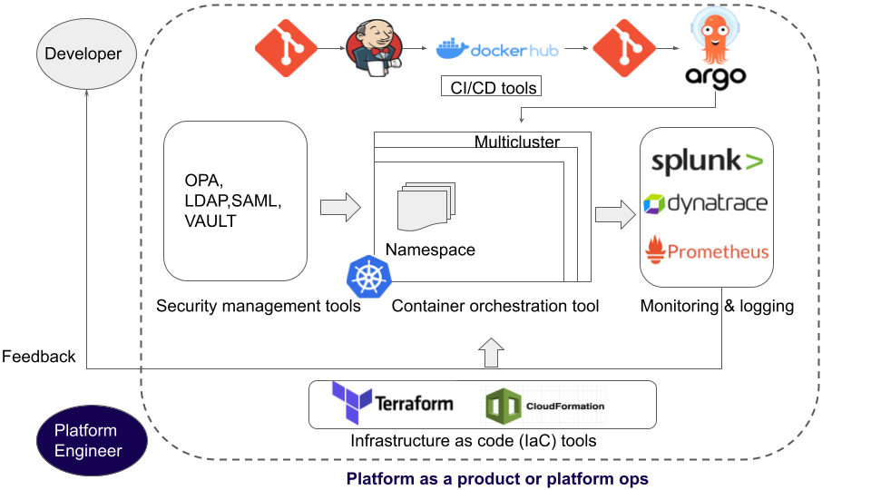

## 译者说
上周刚和一帮大佬讨论了这个话题，今天看到这篇文章，感觉和我的思考非常一致。赶紧 chatgpt 翻译了一下，当然感觉 chatgpt 翻译还是不够，还需要再对照英文审核修改一下，但是对于学习来说非常够用了。

如果大家正在做平台工程相关的事情，本文我认为非常值得推荐。

原文地址：[https://dzone.com/articles/what-is-platform-engineering-how-to-get-started](https://dzone.com/articles/what-is-platform-engineering-how-to-get-started)

## 引子
本指南探讨了平台工程、DevOps和SRE，探讨了平台工程的角色和职责，并讲授了实现的步骤。

平台工程是构建和维护为开发人员提供自助服务平台的一个学科。该平台提供一组云原生工具和服务，以帮助开发人员快速高效地交付应用程序。平台工程的目标是通过标准化和自动化软件交付生命周期（SDLC）中的大部分任务来改善开发人员体验（DX）。开发人员可以专注于使用自动化平台编写和交付业务逻辑，而不是像基础设施的供应、安全管理和学习曲线等方面进行上下文切换。

平台工程具有内向的视角，因为它专注于优化组织中的开发人员，以提高生产力。组织从开发人员以最佳水平工作中受益，因为这会导致更快的发布周期。平台通过提供让开发人员需要将其代码投入生产所需的一切能力，因此他们不必等待其他 IT 团队提供基础设施和工具。使开发人员日常活动更轻松和自主的自助服务平台称为内部开发人员平台（IDP）。

## 什么是内部开发平台 (IDP)?

IDP 是一个平台，包括自助式的云原生工具和技术，开发人员可以使用这些工具来构建、测试、部署、监控或几乎任何与应用程序开发和交付相关的事情，尽可能少地增加开销。平台工程师或平台团队在咨询开发人员并了解他们独特的挑战和工作流程后构建它。

在为许多大型高科技企业讨论和实施了 [Kubernetes CI/CD 流水线](https://dzone.com/articles/what-is-a-kubernetes-cicd-pipeline) 和 [GitOps 解决方案](https://docs.devtron.ai/usage/integrations/argocd) 之后，我们意识到一个典型的 IDP 应该包括一下 5 个特点：

1.  要有一个 CI/CD 平台可以自动化部署 ([Jenkins](https://www.jenkins.io/), [Docker Hub](https://hub.docker.com/), [Argo CD](https://argo-cd.readthedocs.io/en/stable/), [Devtron](https://devtron.ai/), [Spinnaker](https://spinnaker.io/))
2.  管理容器需要有容器编排平台 ([Kubernetes](https://kubernetes.io/), [Nomad](https://www.nomadproject.io/), [Docker Swarm](https://docs.docker.com/engine/swarm/))
3.  要有用于身份验证、授权和秘密管理的安全管理工具([HashiCorp Vault](https://www.vaultproject.io/), [AWS Secrets Manager](https://aws.amazon.com/secrets-manager/), [Okta Identity Cloud](https://www.okta.com/products/))
4.  要有基础设施即代码(IaC)工具，用于自动化基础设施配置([Terraform](https://www.terraform.io/), [Ansible](https://www.ansible.com/), [Chef](https://www.chef.io/), [AWS CloudFormation](https://aws.amazon.com/cloudformation/))
5.  要有所有集群的工作负载和应用可视化的可观察能力 ([Devtron Kubernetes dashboard](https://devtron.ai/kubernetes-dashboard.html), [Prometheus](https://prometheus.io/), [Grafana](https://grafana.com/), [ELK stack](https://www.elastic.co/what-is/elk-stack))

平台团队以一种易于开发人员使用且学习曲线最小的方式设计了 IDP。IDP 可以帮助减少开发人员的认知负荷，通过自动化重复的任务，减少维护开销，并消除对无休止的脚本的需要来提高 DX。IDP通过提供一个自助平台，使开发团队能够独立地管理资源、基础设施需求、部署和回滚。这增加了开发人员的自主权和责任感，减少了依赖性，并简化了开发周期。

## **为什么平台很重要?**

平台工程可以帮助组织获得一些内部（开发人员）和外部（最终用户）的好处点：

Kubernetes Dashboard 是一个基于 Kubernetes 架构开发的外部服务。在底层，仪表板使用 api 将所有集群范围内的信息读取到单个窗格中。它还使用 api 将资源和应用程序部署到集群中。CLI 和Kubernetes 仪表板都依赖于 kube-API-server 来处理请求。要开始使用 CLI，运维团队必须在同一个集群中部署 Kubernetes 仪表板（类似于 Kubectl 部署）。

1. **改善开发者体验(DX):** 过多的云原生工具增加了开发者的认知负荷，因为需要花费大量时间来决定为他们的特定用例使用哪种工具并掌握它。平台工程通过提供一组简化的、标准化的工具和服务来解决这个问题并改进 DX，这些工具和服务适合开发人员独特的工作流程。

2. **提高生产力:** IDP 提供了开发人员以自助方式测试和部署代码所需的一切。这减少了 SDLC 不同阶段的延迟，例如等待某人提供要部署的基础设施。平台工程通过帮助开发人员专注于核心开发工作来确保他们的生产力。

3. **通过设计实现标准化:** 在一个典型的软件组织中，IT 团队使用各种各样的工具，每个团队都不一样。在这种情况下，维护和跟踪事情变得复杂。平台工程通过标准化工具和服务解决了这个问题，并且更容易解决任何瓶颈，因为平台对于每个开发人员都是相同的。

4. **更快的发布:** 平台团队通过提供易于使用、可重用和可配置的工具链来确保开发人员致力于交付业务逻辑。因此，开发人员的生产力非常高，它可以可靠而安全地加快功能和创新的上市时间。

在组织中建立一个成功的平台团队并利用上述好处需要遵循一些共同的原则。将平台视为一种产品就是其中之一。

## 平台即产品

平台工程的**核心原则之一**是将平台产品化。平台团队需要采用产品管理的思维来设计和维护一个不仅用户友好而且满足客户(应用开发人员)期望和需求的平台。它从围绕开发人员存在的问题收集数据点开始，并确定需要改进的领域。这可以提高部署频率，降低变更失败率，提高可靠性和安全性，改善 DX 等。

需要注意的是，构建平台就是构建一个解决大多数团队面临的**常见挑战问题** 的核心产品。**这不是解决单个团队的问题，而是为多个团队提供产品来解决同一组问题**。例如，如果多个团队需要相同的基础设施，那么平台团队在共享的基础设施上工作并分发它是有意义的。重用平台和可重复性的想法至关重要，因为它允许应用程序交付的标准化、一致性和可伸缩性。

与产品管理一样，平台团队拥有产品，选择特定的指标，并持续获取客户反馈以改善用户体验。平台的产品路线图根据反馈进行演进，并适应客户不断变化的需求和愿望。

## **平台工程师的角色和职责**

平台工程师的主要角色是设计和维护自助服务平台(IDP)，并为开发人员提供平台服务。它从与开发人员接触并了解他们的痛点开始：

### 倾听用户的意见

直面开发人员和不同的 IT 团队，以了解他们的工程环境和挑战，并知道他们在优化什么。他们可能试图建立一个有效的 CI/CD 流水线或实施更好的访问控制，以及围绕软件交付的许多其他挑战。

### 优先级

确定大多数团队共享的共同挑战，并将解决它们的优先级置于单个团队面临的问题之上。例如，如果大多数团队发现难以安全地存储和获取机密信息，那么最好的做法是优先为他们解决这个问题。

### 平台设计

为用户设计可以解决问题的 IDP 工具，并提供文档，使开发人员能够自助获取资源和基础设施。
采用秘密管理工具可以解决上述情况下关于安全管理秘密的挑战。平台设计的一部分还包括编写脚本来自动化常规开发任务，例如启动新环境和配置基础设施，以减少开发流程中的错误和阻力。

### Metrics 指标

围绕目标选择特定的指标来衡量平台的有效性。例如，如果目标是提高 DX，则指标包括参与度分数、团队反馈等。类似地，如果目标是降低变更失败率或增加部署频率，则度量指标将发生变化。

### 收集反馈并维护平台

继续倾听客户的意见并观察指标。收集用户反馈，为平台添加新工具，优化更好的用户体验。这还包括了解 DevOps 和云基础设施领域的最新工具和技术，并在必要时采用它们。

DevOps 工程师或 SRE 的角色很容易与平台工程师的角色混淆，因为他们都管理底层基础设施并支持软件开发团队。虽然所有这些角色之间有某些重叠的职责，但每个角色都有其独特的侧重点。

## 平台工程 vs. DevOps

DevOps 是一种哲学，它为 SDLC 带来了一种文化转变，以提高软件交付速度和质量。DevOps 促进了开发团队和运维团队之间的协作和沟通，并加速了自动化，简化了部署。平台工程——是一种实践而不是一种哲学——也可以被认为是 DevOps 的下一个迭代，因为它与 DevOps 的一些核心原则是相同的：协作（与运维）、持续改进和自动化。

平台团队和 DevOps 的日常任务在某些方面存在差异。DevOps 使用某些工具和自动化来简化代码的生产、管理，并使用日志和监控工具来观察代码。他们主要致力于[建立有效的CI/CD管道](https://devtron.ai/blog/kubernetes-ci-cd-under-3-minutes/)。平台工程师将 DevOps 使用的所有工具集成到一个共享平台中，不同的 IT 团队可以以企业级的水平使用该平台。这消除了团队对自己配置和管理基础设施和工具的需要，并节省了大量的时间、精力和资源。平台工程师还创建文档并优化平台，以便开发人员可以在他们的工作流程中自助服务工具和基础设施。

平台团队只有在成熟的公司中才需要，公司中有许多使用复杂工具和基础架构的各种 IT 团队。自然，在这样的工程环境中，一个专门的平台团队来管理复杂性将是必要的。平台团队构建和管理基础设施，帮助 DevOps 加速持续交付。然而，DevOps 团队在初创公司中执行平台工程任务（例如配置Terraform）是很常见的。

## 平台工程 vs. SRE

SRE (Site reliability engineers)专注于确保应用的可靠性、安全性和始终可用。他们与开发人员和运维团队合作，创建支持交付高可靠应用程序的系统或基础设施。SRE 还执行容量规划和基础设施扩展，并管理和响应事件，以使平台满足所需的服务水平目标（slo）。另一方面，平台工程管理复杂的基础设施，并为开发人员构建高效的平台来优化 SDLC。虽然他们的工作平台和角色听起来很相似，但他们的目标不同。

平台工程和 SRE 之间的主要区别在于他们面对的是谁并迎合他们的服务。SRE 面向最终用户，确保应用服务对他们来说是可靠和可用的。平台工程师面对内部开发人员，专注于改善他们的开发人员体验。两个团队的日常任务在这些目标方面有所不同。平台工程为快速交付应用程序提供了底层基础设施，而 SRE 也为交付高可靠性和可用性的应用程序提供了基础设施。SRE 更多地致力于故障排除和事件响应，平台工程师专注于复杂的基础设施和实现开发者自助服务。

为了实现各自的目标，SRE 和平台团队在他们的工作流程中都使用不同的工具。SRE 主要使用如Prometheus 或 Grafana 等监控和日志工具来实时检测异常并设置自动警报。平台团队使用跨越软件交付过程不同阶段的各种工具集进行工作，例如容器编排工具、CI/CD 管道工具和 IaC 工具。总而言之，SRE 和平台团队致力于构建可靠且可扩展的基础设施，他们的目标不同，但使用的工具之间存在一些重叠。

## 如何在组织中实施平台工程

在只有几个工程师的初创公司中，平台团队不是立即需要的。一旦组织发展到多个 IT 团队，并开始处理复杂的工具和基础设施，理想情况是有平台工程师来管理这种复杂性。

### 创建角色（工程主管/工程副总裁）

当开发人员花更多时间配置工具和基础设施而不是交付业务逻辑时，像副总裁或工程主管这样的顶级工程师通常会创建平台工程师的角色。他们会发现，大多数IT团队都在解决同样的问题，比如创建新环境，这导致交付过程滞后。因此，工程主管将定义平台工程的范围，确定责任领域，并创建平台工程师/团队的角色。

### 创建一个内部开发人员平台（平台工程师/团队）

平台工程师首先构建组织中已经使用的基础设施和工具的日志。然后他们会调研开发人员，了解他们面临的挑战，并使用解决企业层面问题的工具和服务构建内部开发人员平台。他们将以一种灵活的方式构建平台，并帮助不同的架构和部署风格。平台工程师还创建文档并进行培训，以帮助开发人员自助服务平台。对于平台工程师来说，拥有开发人员背景是理想的，这样他们就知道成为开发人员是什么样子，并更好地理解挑战。

###  培养用户(应用程序开发人员)

一旦平台准备好了，平台工程师就会邀请应用程序开发人员。这需要内部营销，并让团队了解这个平台以及它可以解决什么问题。吸引用户的最好方法是把他们拉到平台上，而不是把平台扔给他们。这可以从一个小团队开始，并帮助他们克服挑战。例如，帮助一个小团队优化 CI/CD 流程，并在这个过程中提供最好的体验。早期采用者的口口相传将在整个组织中产生积极的涟漪效应，这将帮助平台吸引更多用户。

平台工程不会止步于引导用户。这是一个持续的过程，平台要适应新出现的工具和技术以及用户不断变化的需求和要求。

## 结论：使用开源工具进行平台工程

选择一个开源平台是很重要的，它是可以让平台工程师使用标准化的工具链来帮助开发人员加速软件交付。Devtron 就是这样一个平台，它通过自动化 CI/CD 平台、安全性和端到端 SDLC 的可观察性来帮助开发人员。