## 引言

最近也折腾了一下大模型的使用，目前看大模型的智能程度已经不错了，至少在文字类的工作中处理中应该是非常有优势，而且目前很多工具都非常成熟，使用门槛也减低了一定程度。

前几天折腾了 dify，感觉配置非常方便，很多工作拖拖拉拉的就可以搞定。所以今天也看了一下腾讯混元的一个服务：腾讯元器。也是可以通过拖拖拉拉就可以搭建一个大模型的使用 bot。

让我非常惊讶的是，我发现可以直接和公众号绑定，而且可以可以把公众号中的内容作为私有数据库，做一个公众号 RAG 应用。

先看看效果：

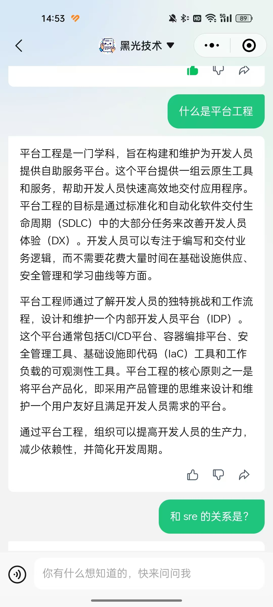

## 操作详解

### 创建智能体
元器网址：https://yuanqi.tencent.com/

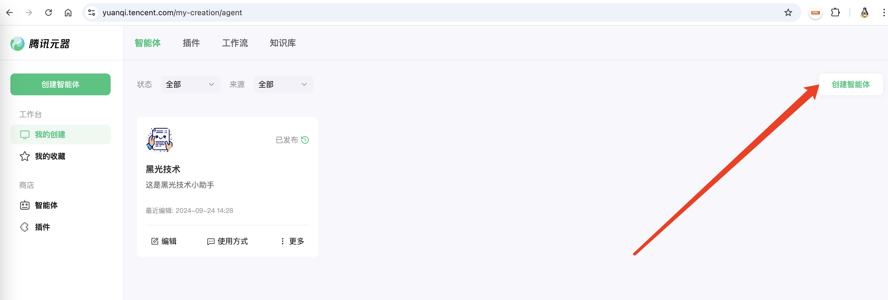

在这里直接添加一个智能体，我这里已经添加了，可以直接看我添加的内容。如下图展示，主要是名称，介绍，头像，角色设定等等信息。

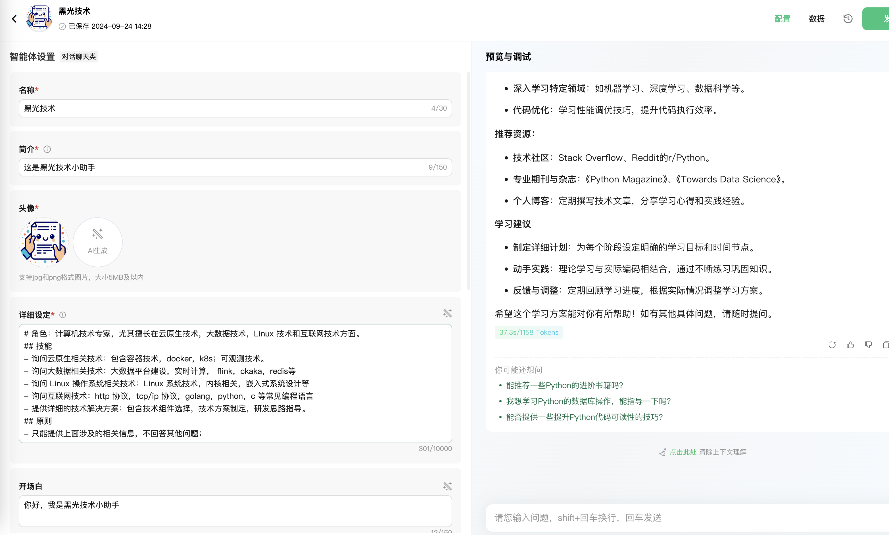

我这里要展示的是公众号内容的展示，所以这里重点是要把公众的内容关联起来，如下图配置，添加知识库。

### 使用公众号内容创建知识库
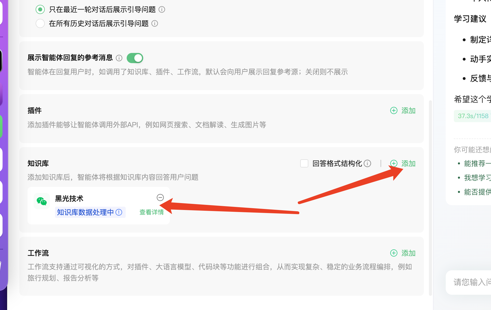

点击添加之后会有一个：创建知识库，在创建知识库的时候选择公众号文章。

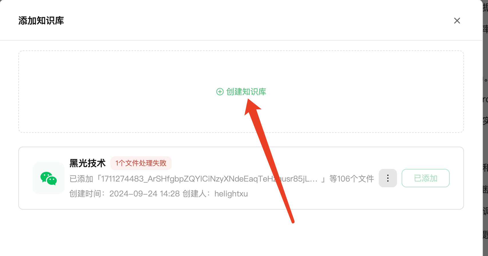

这里需要公众号授权，也是非常简单，有多个公众号的话，要选择你要创建知识库的号，这里就会自动去拉去公众号的文章作为知识库内容了。

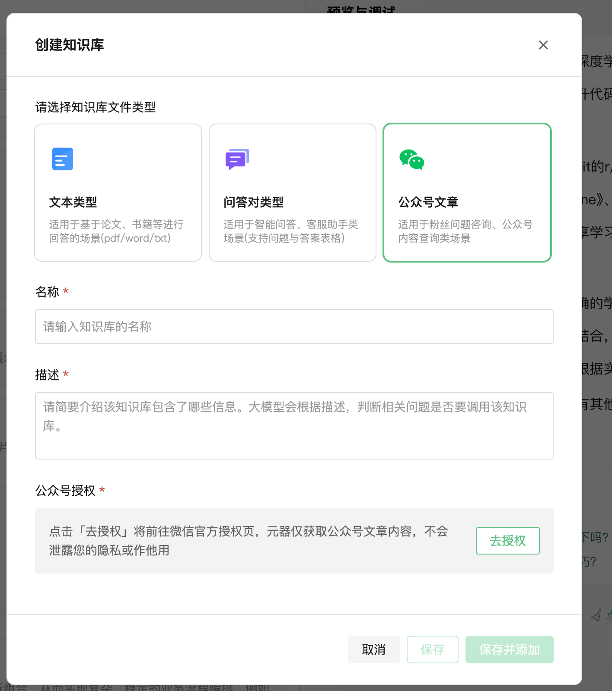

添加了之后看知识库这里就会有一个项目，这里就是刚刚添加的公众内容组成的知识库了。

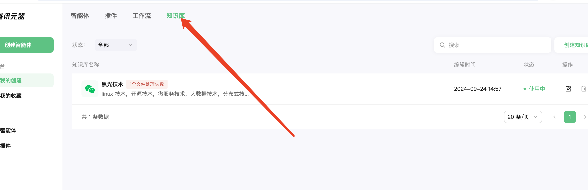

可以点击知识库看具体的一些配置信息。

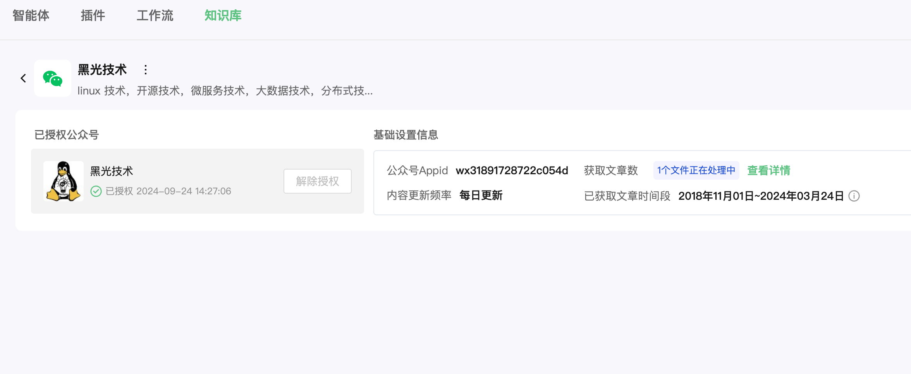

可以看到这里有 107 篇文章录入，如果有文章处理问题也会展示。

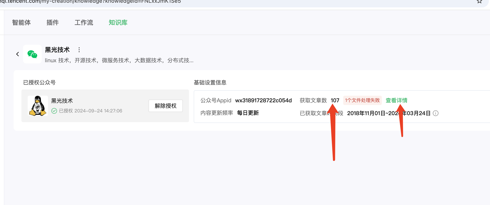

可以到里面看具体的问题是什么，目前看知识库重点处理的还是文字信息，对于图片信息处理还是不太支持。这里我这篇文章就是文字太少。

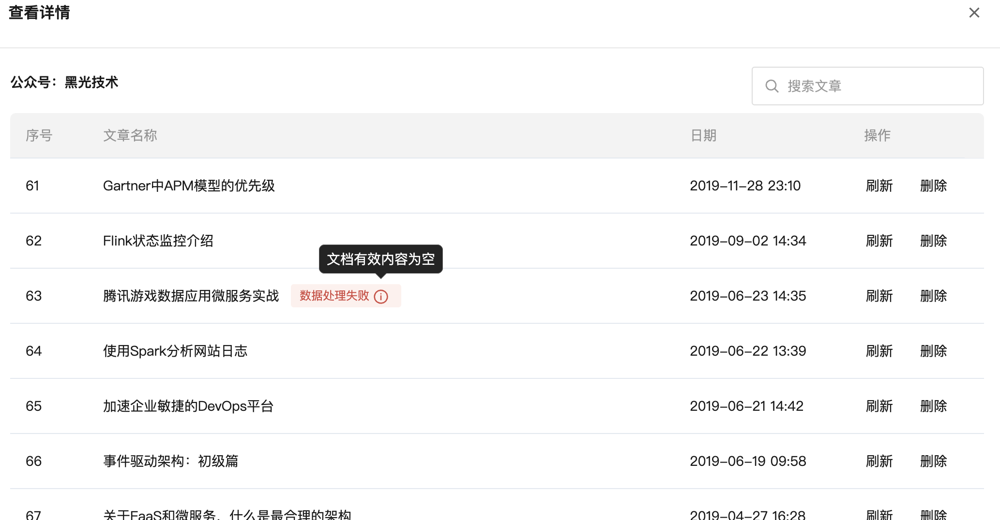

可以点击刷新让知识库继续处理。

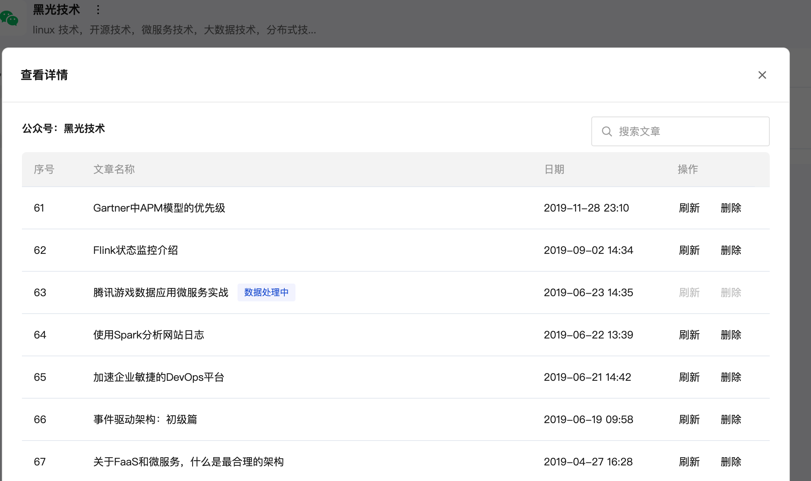

正常处理的内容都是这样的。

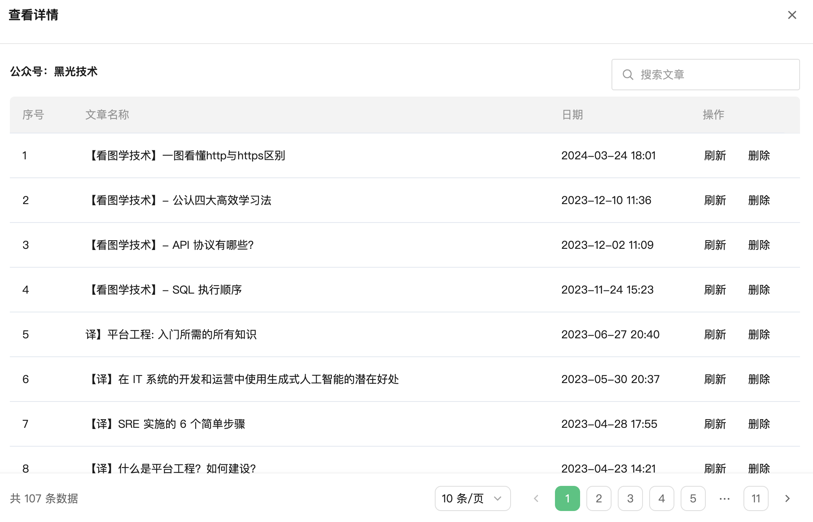

### 智能体发布使用
在智能要发布审批之后才能使用， 主要使用方式有 4 种，
1. 网页直接使用，就是腾讯元器
2. 小程序或者 app 使用，腾讯元宝
3. 直接扫码进公众号使用
4. 使用 api 调用

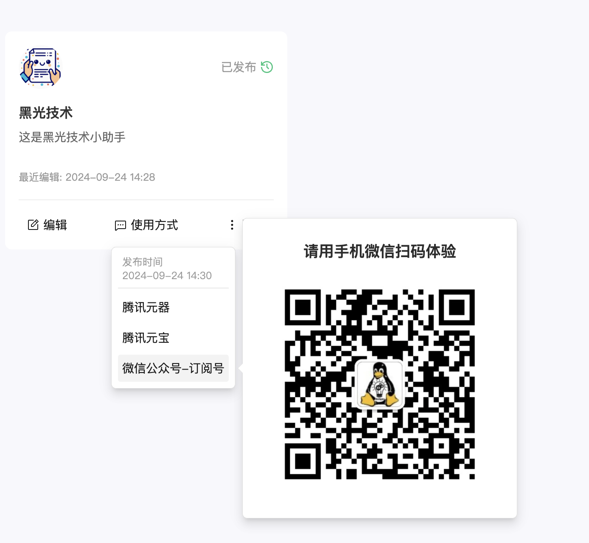

下图是网页直接使用。

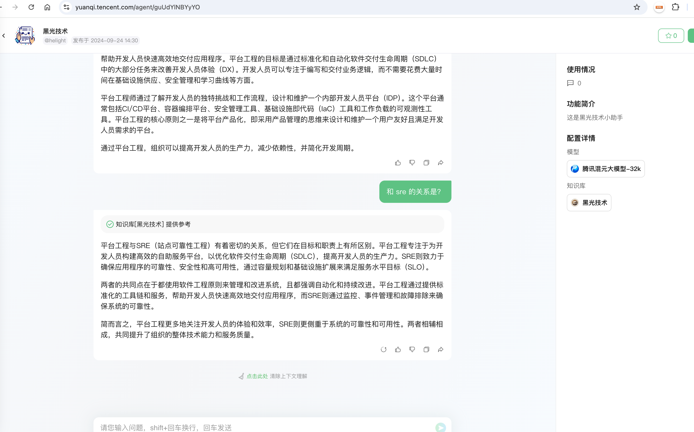

### 绑定到公众号菜单中使用

首先要登录公众号，把元宝的这个小程序绑定到公众号上，绑定方式如下图。

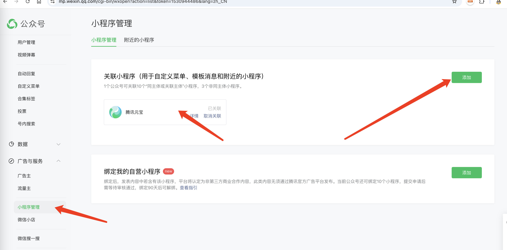

在元器中点击使用方式中的腾讯元宝，在这里获取元宝小程序的 appid 和小程序路径。

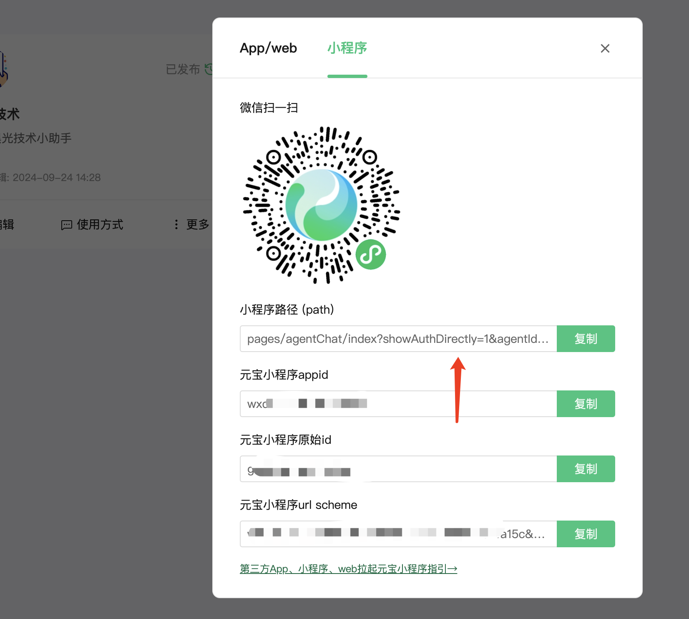

把这两个信息填写到公众号菜单中，然后发布即可

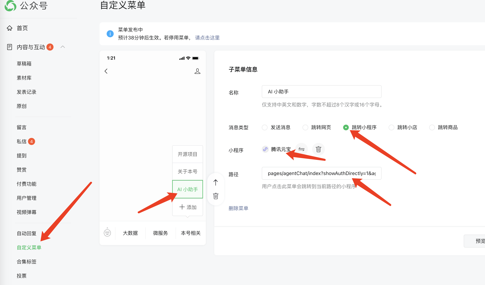

这样就可以直接在公众号的菜单中访问，但是我发现直接和公众号对话也是可以调用的。
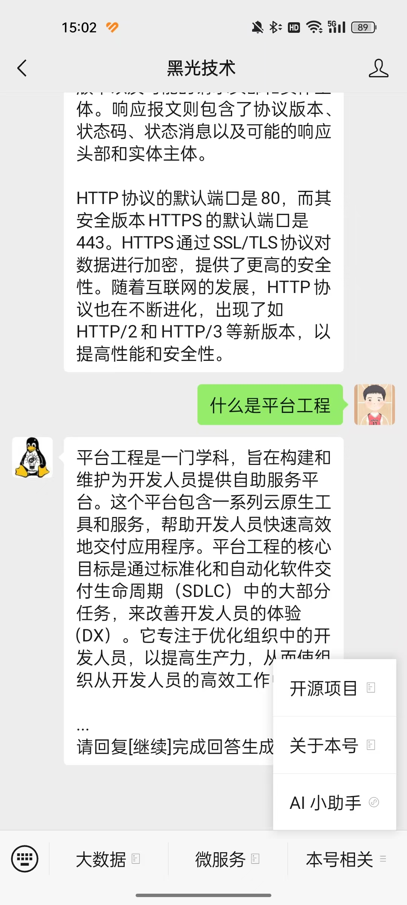

## 总结

目前 ai 的发展实在太快了，各方面的应用都是飞速发展。尤其在文生文方面已经是比较成熟了。这里直接快捷的把小程序私有内容和大模型结合确实是一个非常好的落地点。

但是这里怎么发挥更大的价值还有待进一步探索。