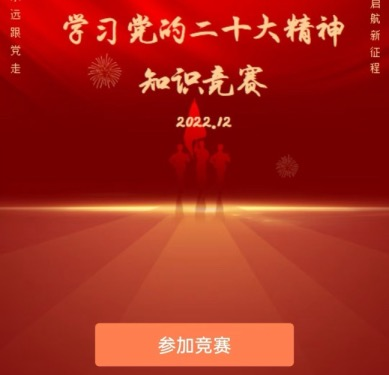
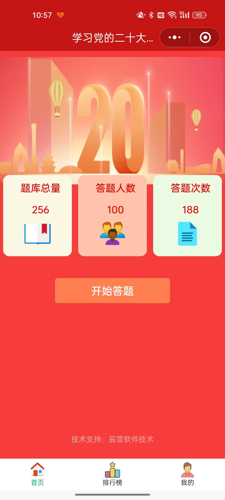
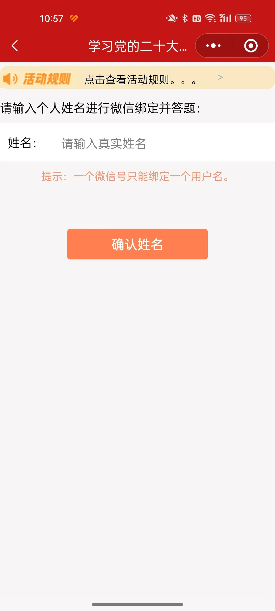
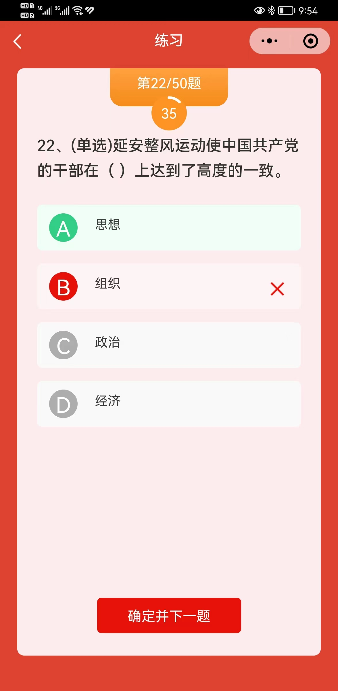
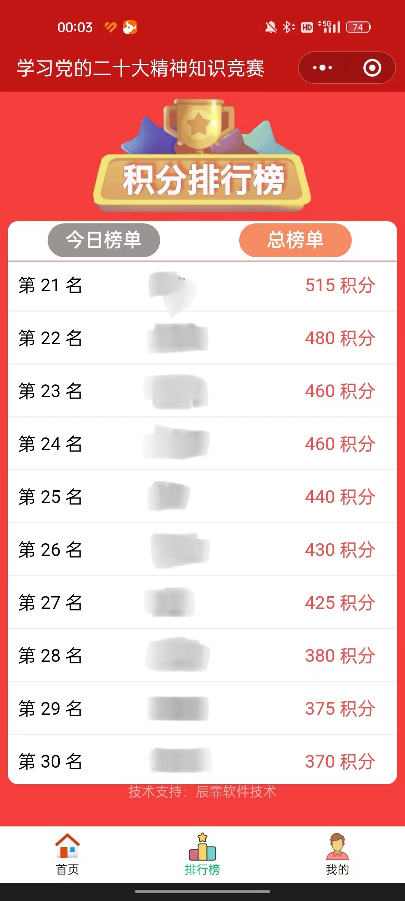

## 一、微信小程序答题系统介绍

去年接到一个需求，要做一个微信小程序的答题系统，作为一个内部单位的答题竞赛使用。有以下一些要求：

1. 独立微信小程序
2. 题库要能够自定义
3. 支持多选题和单选题
4. 支持排行榜
5. 支持多轮竞赛
6. 支持限定名单用户参与

## 界面

### 引导页

### 引导页

#### 用户绑定和白名单控制

### 答题页

### 排行榜

