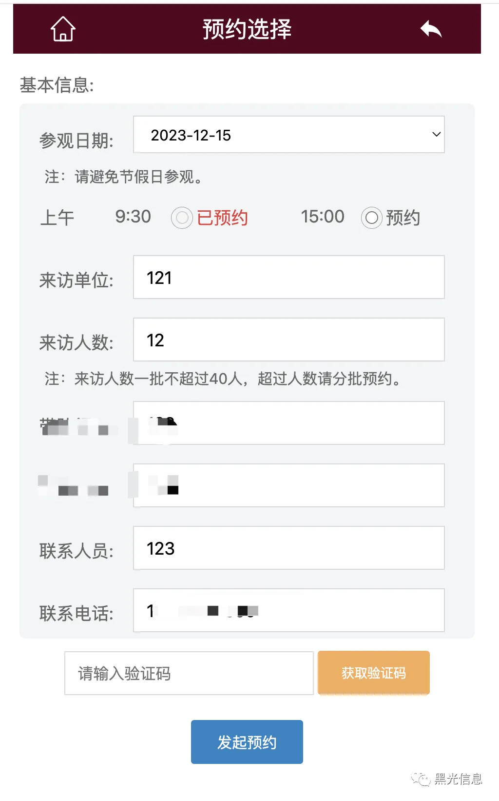
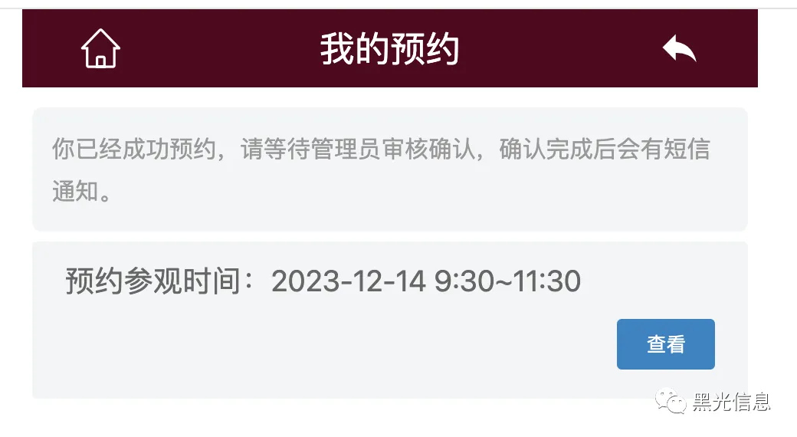
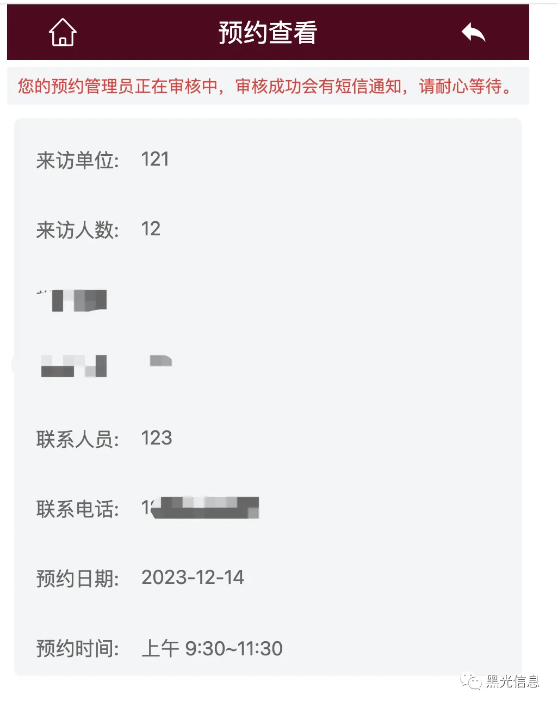
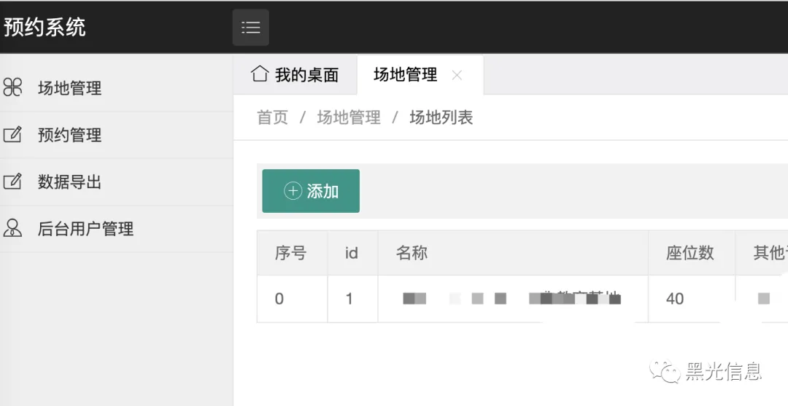
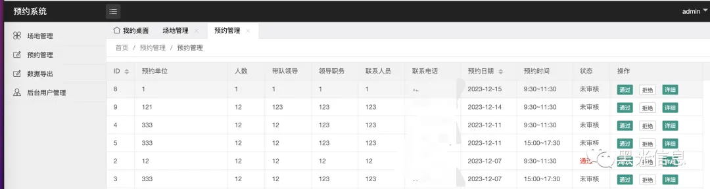
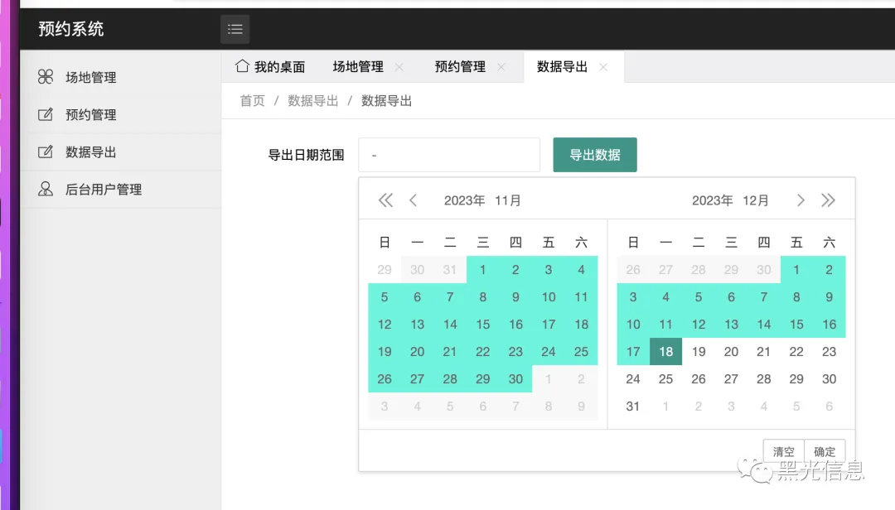
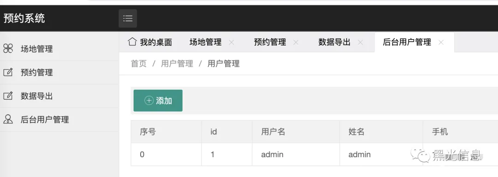

## 一、预约系统功能介绍

主体功能：对一个地方的使用时间进行预约管理，比如有一间会议室，它上午时间段和下午时间段的预约使用。

所以这里分为 2 部分主要能力：1） 客户预约前端；2）管理员使用的管理端。

### 1 、客户预约前端主要功能：  

- 基本信息浏览，预约地方介绍信息
- 预约地方可预约时间段浏览
- 预约信息填写
- 为避免乱预约，进行短信验证
- 对预约信息查看

### 2 、管理员使用管理端主要功能：

- 预约地方信息管理，基本的增删改查
- 预约信息的查看管理，审核，可以通过和拒绝
- 预约短信通知能力：有人预约的时候短信告知管理员，管理通过和拒绝的时候通知预约者
- 预约数据的导出，可以导出预约数据进行离线分析管理
- 管理员信息管理

## 二、预约系统界面展示

### 1 、客户预约前端

### 2 、管理员使用管理端

以上就是所有功能。