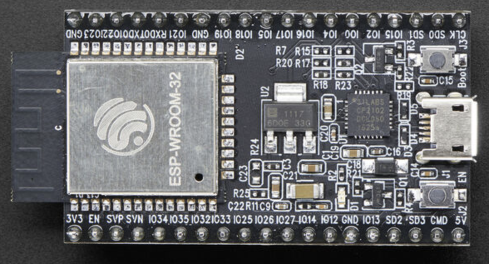
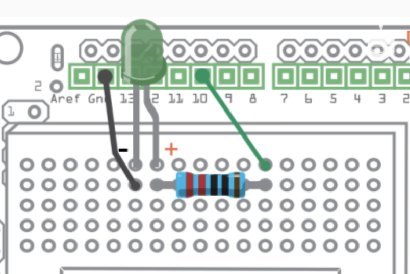

## 一、Esp32

一时兴起买了一个 esp32 的小板子，想玩玩，此前主要使用Arduino进行开发，但受限于其缺乏原生蓝牙和WiFi模块，所以感觉还是不够好玩。现在 esp32 的板子便宜的 10 多块钱一个，基本都有集成的蓝牙和 wifi。我买的是这个板子。



昨晚到了之后直接拿一个数据线连接了 mac，使用 thonny 来测试连接，一切都很舒畅，在macOS系统上可便捷完成开发环境配置，而且可以使用 python 来开发。感觉也可以给小朋友来玩了。

今天先试试一个简单的例子：通过一个 http 接口的返回结果来控制一个 led 灯的明灭。

## 二、硬件准备与电路连接：  

电路连接如下图所示，比较简单，采用一个电阻与LED灯串联电路设计（电阻用于限流保护LED）。led 要注意正负极。




## 三、LED基础控制实现：

使用 python 写非常简单，代码如下，基本流程：
1. 引入 GPIO 控制库
2. 初始化引脚，设置为输出模式
3. 对引脚进行 on() 函数和 off() 函数调用控制
4. 这里另外加了一个 time 控制延时

``` python
from machine import Pin
import time

def test_led():
    p5 = Pin(5, Pin.OUT)
    
    while True:
        p5.on()
        print("led on")
        time.sleep(1)
        p5.off()
        print("led off")
        time.sleep(1)
```
## 四、网络连接配置
这里的代码是网上直接找的，现成的，几乎没啥改动。
``` python
import network
import time

def connect():
    ssid = 'xxx'
    password = 'xxxx'
    wlan = network.WLAN(network.STA_IF)
    wlan.active(True)
    wlan.connect(ssid, password)
    while wlan.isconnected() == False:
        print('Waiting for connection...')
        time.sleep(1)
    print('Connected on {ip}'.format(ip = wlan.ifconfig()[0]))
```

## 五、服务端API设计

编写一个简单的 api，设计随机响应逻辑：当随机值>50时返回成功状态码，否则返回错误状态。我是在我自己的服务中增加了一个 api：/api/test/led。我是属于 golang 的 gin 框架开发，也是非常简单，基本代码如下：

``` golang
// 根据随机数返回结果
func CtrlLed(c *gin.Context) {
	clientIP := c.ClientIP()
	headers := c.Request.Header
	funlog.SLoger.Info("led ctrl ip clientIP ", clientIP)
	funlog.SLoger.Info("led ctrl headers ", headers)
	tdata := rand.Intn(100)
	if tdata > 50 {
		funlog.SLoger.Info("led ctrl ok ", tdata)
		response.OkWithMessage(clientIP+" ok", c)
	} else {
		funlog.SLoger.Info("led ctrl error ", tdata)
		response.FailWithMessageCode(500, clientIP+" error", c)
	}
}
```
## 五、客户端请求实现

``` python
import urequests
def check_ledAPI():
    ret = urequests.get("http://192.168.2.26/api/test/led")
    parsed = ret.json()
    print(parsed)
    print(type(parsed))
    if 0 == parsed["code"]:
        print("ret ok: " + parsed["msg"])
        return True
    else:
        print("ret error try again")
        return False
```

## 六、系统联调测试

``` python
def ctrl_led():
    p5 = Pin(5, Pin.OUT)
    
    while True:
        islight = check_ledAPI()
        if islight:
            p5.on()
            print("led on")
        else:
            p5.off()
            print("led off") 
        time.sleep(1)
        
if __name__ == "__main__":
    connect()
    ctrl_led()
```

测试日志如下:

``` log
MPY: soft reboot
Connected on 192.168.2.247
{'code': 0, 'data': {}, 'msg': '192.168.2.247 ok'}
<class 'dict'>
ret ok: 192.168.2.247 ok
led on
{'code': 500, 'data': {}, 'msg': '192.168.2.247 error'}
<class 'dict'>
ret error try again
led off
{'code': 500, 'data': {}, 'msg': '192.168.2.247 error'}
<class 'dict'>
ret error try again
led off
{'code': 0, 'data': {}, 'msg': '192.168.2.247 ok'}
<class 'dict'>
ret ok: 192.168.2.247 ok
led on
```

## 七、总结
整体效果还是挺好的，开发过程基本没啥卡点，使用 python 开发也非常方便丝滑，确实现在玩这类板子还是非常方便有趣的。该方案兼具趣味性和教学价值，适合作为青少年编程教育的实践案例。