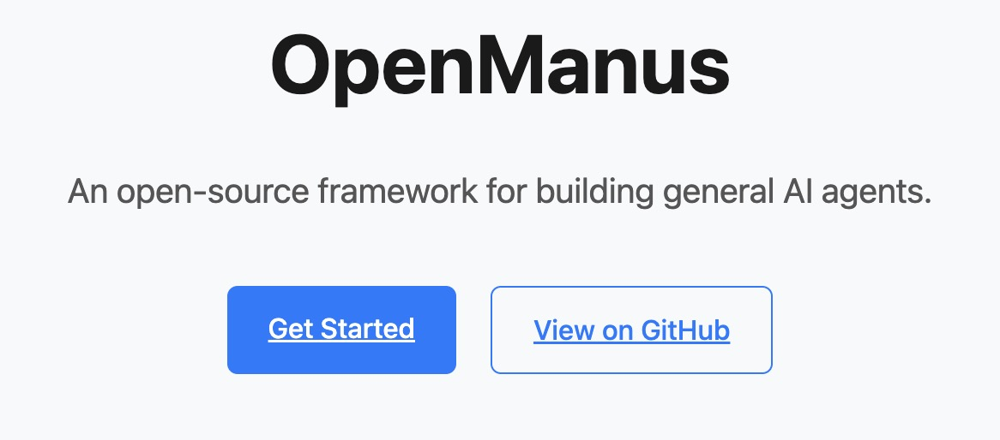

## 一、Open-Manus 产品技术解析

Manus 在火爆之后，也看了它的视频，感觉是非常厉害，程序员又要把程序干掉了，所以也想体验一把，但是没有邀请码，在看到 Open-Manus 之后也想试用一把，体验一下那种动动嘴让机器干冒烟就可以把活干好的感觉。



Open-Manus 是由 MetaGPT 团队的五名开发者在短时间内开发的开源 AI 工具项目。它旨在复刻或替代近期火爆的 AI 产品 Manus，提供一个透明、可本地运行的 AI 工具，能够执行类似 Manus 的任务，如自动化生成报告、处理复杂工作流等。具体含义和相关信息如下：

1. 开发背景：OpenManus 是在 Manus 爆火之后，由 MetaGPT团队开发的开源项目。该项目旨在提供一个免费且易用的替代方案，挑战 Manus 的“稀缺性”和“高门槛”。
2. 技术实现：OpenManus 是一个基于 Python 开发的智能代理系统，采用模块化设计，主要包含 agent、flow、tool 等核心模块。它使用 pydantic 进行数据验证，支持异步操作，提高系统性能。

3. 核心功能：
    1. 智能代理：实现了多种类型的代理，如 Manus（ReAct）、Planning 等。
    2. 工具集成：内置多个实用工具，包括 PythonExecute（执行Python代码）、GoogleSearch（网络搜索）、BrowserUseTool（浏览器操作）、FileSaver（文件保存）等。
    3. 配置灵活性：OpenManus 支持多种LLM模型配置（如 OpenAI、Azure 等），并允许用户自定义系统提示词和工具集。
    4. 使用简便性：提供 main.py 和 run_flow.py 两种启动方式，以及交互式命令行界面，方便用户上手。

5. 开源地址：OpenManus 的官方 GitHub 地址为 https://github.com/mannaandpoem/OpenManus，自发布以来，该项目获得了大量关注，短时间内star数已接近34K。

与 Manus 相比，OpenManus 提供了免费、无需邀请码的使用体验，以及更加透明的代码基础。尽管可能在某些功能上不如Manus 全面，但它作为一个开源项目，为开发者和用户提供了一个研究和实验的平台。

技术架构


|模块|	技术实现	|关键特性|
| --- | --- | --- |
|智能体核心|	Python 3.12 + Pydantic	|异步任务队列/数据校验|
|工具集成层	|LangChain + AutoGen	|插件式扩展架构|
|流程引擎	|DAG工作流设计|	可视化流程编排|
|模型接口|	OpenAI兼容API规范|	多模态模型支持|

项目在GitHub开源仅两周即获得34K Star，位列Trending榜单TOP 3。

## 二、环境部署指南
部署这里比较简单，根据在 github 上的介绍就可以很容易的安装起来，它介绍了几种安装部署方式，这里使用了 conda 本地安装方式，具体操作如下：

1. 创建一个 conda 环境:
``` sh
conda create -n open_manus python=3.12
conda activate open_manus
```
1. 克隆代码到本地
``` sh
git clone https://github.com/mannaandpoem/OpenManus.git
cd OpenManus
```
1. 安装 python依赖
```sh
pip install -r requirements.txt
```

## 三、模型配置实践
OpenManus 本身是不提供大模型的，需要在它的配置文件中配置本地或者远程模型地址。

1. 首先生成一个配置文件，可以直接复制它样例配置文件，再来修改：
```sh
cp config/config.example.toml config/config.toml
```
编辑 config/config.toml 添加相关配置，具体如下，我测试 2 种方式：
    1. 是本地模型方式，我使用了 "qwen2.5:14b"。但是这种需要本地机器比较强悍，不然容易出现访问模型超时。
    2. 使用 "claude-3-5-sonnet"，这个是直接使用外部接口地址。
``` conf
[llm]
# model = "claude-3-5-sonnet"
# base_url = "https://api.openai.com/v1"
# api_key = "sk-xxxxxx"
model = "qwen2.5:14b"
base_url = "http://localhost:11434/v1"
api_key = "ollama"

# Optional configuration for specific LLM models
[llm.vision]
# model = "gpt-4o"
# base_url = "https://api.openai.com/v1"
# api_key = "sk-..."  # Replace with your actual API key
model = "qwen2.5:14b"
base_url = "http://localhost:11434/v1"
api_key = "ollama"
```

## 四、核心功能实测
最后直接在命令行中执行下面的命令就可以启动了。后面就可以直接在命令行中交流。
```sh
python main.py
```
另外自动化报告生成

bash
python run_flow.py --task "分析2024 Q2区块链行业趋势" --output report.md

## 五、总结
整体体验效果感觉还凑和，我根据网上的例子测试抓取新闻并总结，按理来说是一个非常好实现的，但是最终生成的内容非常一般，感觉没法使用，但是流程确实是跑动起来了。

|维度	|Open-Manus	|Manus商业版|
|-|-|-|
|推理延迟|	200-800ms（依赖配置）|	150ms（专用集群）|
|最大上下文	|128K tokens	|256K tokens|
|工具扩展性	|自定义Python插件	|官方市场审核制|
|安全审计	|代码透明可审查	|闭源黑盒|
|成本效益	|支持本地量化部署	|$0.5/千次请求|

但是感觉这种模式应该是 AI 应用的趋势，不做大模型，而是做大模型、内容信息和工具之间的一种胶水层，是一种思考模式的实现。而且最近 MCP 也是非常火爆，感觉未来大厂的这些工具都会向这个方向发展。在特定的领域之内，结合大模型、具体场景信息和相关工具，思考组织执行方式和流程，最终完成一个自动化大规模计算的复杂任务。